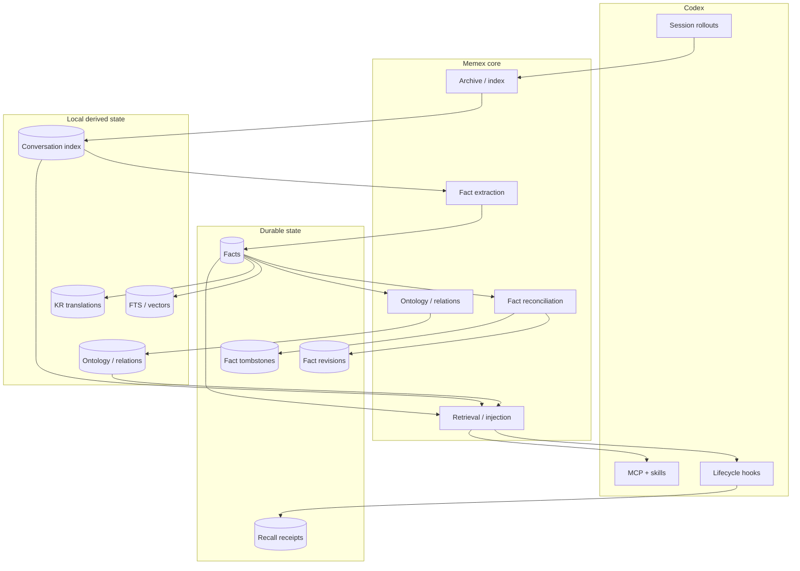

# Memex

[](CHANGELOG.md)
[](https://developers.openai.com/codex/)
[](package.json)
[](LICENSE)

> Codex를 위한 로컬 우선 장기 기억 계층입니다. 대화를 모으고, 재사용할 지식을 증류하고, 서로 연결한 뒤, 필요한 순간에 다시 꺼내 씁니다.

Memex는 로컬 Codex 세션 이력을 검색 가능한 대화 아카이브, 장기 fact, 범위가 분리된 지식 그래프, 그리고 이후 작업에 다시 주입할 수 있는 제한된 컨텍스트로 바꿉니다.

Memex는 **두 번째 에이전트가 아니라 기억 시스템**입니다. 실제 작업은 Codex가 계속 수행하고, Memex는 그 주변에서 장기 기억과 검색 계층을 제공합니다.

[English README](README.md) · [문서](docs/README.md) · [운영 가이드](docs/GUIDE.md) · [아키텍처](docs/ARCHITECTURE.md) · [검증](docs/VERIFICATION.md)

---

## Memex가 하는 일

Memex는 로컬 Codex 대화 기록에서 다음 계층을 만듭니다.

- **대화 아카이브** — 원본 Codex rollout은 수정하지 않고, 검색 가능한 스냅샷을 보존합니다.
- **하이브리드 검색** — semantic vector search와 FTS5/BM25 텍스트 검색을 함께 제공합니다.
- **장기 fact** — 이후 작업에서 재사용할 가치가 있는 decision, preference, pattern, knowledge, constraint를 추출합니다.
- **fact 진화 관리** — duplicate 통합, contradiction, revision, deactivate, restore, provenance를 추적합니다.
- **지식 그래프** — fact를 domain/category에 분류하고 typed relation을 생성합니다.
- **컨텍스트 recall** — 관련도와 예산을 통과한 작은 기억 블록만 이후 Codex prompt에 주입합니다.
- **MCP 도구와 skills** — 대화, fact, graph traversal, provenance, 전체 이력 분석을 Codex에서 직접 사용할 수 있게 합니다.
- **로컬 Web UI** — 대화 탐색, fact 관리, pipeline 상태, WebGL 지식 지도를 loopback 워크스페이스로 제공합니다.
- **멀티디바이스 durable sync** — local derived overlay는 동기화하지 않고, 장기 상태만 기기 간 수렴시킵니다.

Memex는 **local-first**를 기본 전제로 합니다. 원본 Codex rollout은 항상 read-only이고, DB·검색 인덱스·지식 그래프·운영 로그는 로컬 Memex data root 아래에 저장됩니다.

---

## 아키텍처



### Fact 상태 모델

sync protocol v4는 fact 상태를 서로 독립적인 축으로 나눕니다.

| 축 | 예시 | 병합 규칙 |
| --- | --- | --- |
| **Semantic** | fact text, category, scope | semantic event clock + deterministic tie-break |
| **Lifecycle** | active / inactive | lifecycle event clock; 완전 동률이면 inactive 승리 |
| **Lineage** | source exchange IDs, consolidated count | monotonic union / max |
| **Derived overlay** | KR text, ontology, relations, vectors | local-only, 재생성 가능 |

이 분리가 중요한 이유는 fact의 의미를 편집하는 것과 비활성화하는 것이 서로 다른 사건이기 때문입니다. 더 최신 semantic edit가 더 최신 deactivate를 되돌려서는 안 되고, 오래된 peer snapshot 때문에 provenance가 사라져서도 안 됩니다.

멀티디바이스 sync는 따라서 durable state만 전송합니다.

```text
facts
fact revisions
fact tombstones
recall events
```

KR 번역, ontology category, relation, vector index는 각 기기에서 로컬로 다시 만듭니다.

자세한 내용은 [아키텍처](docs/ARCHITECTURE.md), [Fact lifecycle](docs/FACT-LIFECYCLE.md), [Conversation lifecycle](docs/CONVERSATION-LIFECYCLE.md)을 참고하세요.

---

## 요구 사항

- **Node.js 22.15 이상**
- 인증이 완료된 **Codex CLI**
- 현재 hook / Unix socket runtime 기준 **macOS 또는 Linux**

Memex는 native SQLite, vector, embedding 의존성을 사용합니다. 설치 절차가 이를 plugin 옆에 materialize하고 launcher는 그 설치 artifact를 우선 실행합니다. isolated npm cache는 MCP server와, 아직 materialize되지 않은 plugin registration이 쓰는 `npx` fallback에만 적용됩니다. 어느 경로도 일반 사용 시 사용자 프로젝트에 dependency를 설치하거나 source checkout을 요구하지 않습니다.

---

## 설치

권장 public 설치 방식:

```bash
codex plugin marketplace add BongSuCHOI/memex
codex plugin add memex@memex
```

설치 후에는 새 hook, skills, MCP server가 로드되도록 **Codex를 재시작**하세요.

터미널에서도 `memex` 명령을 직접 사용하고 싶다면 CLI shim을 한 번 설치합니다.

```bash
npx --yes --package=github:BongSuCHOI/memex#main memex setup --install-cli
```

이 명령은 `~/.local/bin/memex`를 만듭니다. global npm install은 하지 않습니다.

local marketplace 개발이나 source 기반 검증은 [운영 가이드](docs/GUIDE.md)를 참고하세요.

---

## 최초 설정

기존 Codex 대화 이력을 준비합니다.

```bash
memex setup
memex sync
memex backfill all
memex status
```

각 단계는 다음 역할을 합니다.

1. **`memex setup`** — Codex built-in Memory와의 충돌 가능성을 점검합니다. 사용자 승인 없이 비활성화하지 않습니다.
2. **`memex sync`** — `$CODEX_HOME/sessions`를 읽고 eligible rollout을 archive/index합니다.
3. **`memex backfill all`** — durable fact 추출, ontology 분류, 누락 semantic embedding을 순서대로 처리합니다.
4. **`memex status`** — conversation/fact/graph readiness와 남은 backlog를 보여줍니다.

backfill 단계는 idempotent하게 다시 실행할 수 있습니다.

foreground backfill은 처리 가능하거나 실행 중이거나 해결되지 않은 작업이 없을 때만
exit code `0`을 반환합니다. 유계 실행 뒤 재시도 가능한 backlog가 남으면
`completed with deferred work`와 선택한 단계별 실행 후 건수를 출력하고 `2`를
반환합니다. active claim과 terminal extraction failure도 outstanding work와 `2`로
보고합니다. worker 실패는 우선하여 이후 단계를 중단하고 `1`을 반환합니다.

### 선택적 한국어 fact 번역

`fact_kr`은 local derived state입니다. 일반 lifecycle hook마다 자동 번역하지 않고, sync payload에도 포함하지 않습니다. 이는 세션마다 번역 LLM 비용이 발생하는 것을 피하기 위한 의도된 정책입니다.

source checkout에서는 필요할 때 수동으로 실행할 수 있습니다.

```bash
node scripts/translate-facts.mjs
```

스크립트는 번역 요청 시작 이후 fact 의미가 바뀌지 않은 경우에만 결과를 기록합니다. KR vector는 이후 일반 re-embedding maintenance 경로에서 생성됩니다.

---

## 일상 사용

```bash
memex search "왜 SQLite를 선택했지?"
memex search --both "인증 마이그레이션"
memex facts list
memex stats
memex analyze --top 30 --out ~/memex-report.md
memex status
```

주요 명령:

| 명령 | 역할 |
| --- | --- |
| `memex sync` | 새 Codex rollout archive/index |
| `memex search` | semantic / text / hybrid conversation search |
| `memex show` | archive conversation 읽기 |
| `memex stats` | corpus/index 통계 |
| `memex analyze` | deterministic 전체 이력 보고서 생성 |
| `memex facts` | durable fact 조회·관리 |
| `memex backfill` | extraction / ontology / embedding backlog 처리 |
| `memex model-work status` | 모델 시도·관측 사용량·대기 작업 확인; [예산 재개](docs/GUIDE.md#17-모델-작업-예산과-대기-진단) |
| `memex status` | pipeline readiness 확인 |
| `memex doctor` | runtime/plugin/MCP/lifecycle 진단 |
| `memex update` | data를 보존하면서 marketplace/plugin 갱신 |

Fact 관리에는 edit, deactivate, restore, history, guarded hard delete가 포함됩니다. semantic edit는 fact ID와 revision history를 유지하면서 이전 의미에서 파생된 상태를 무효화합니다.

전체 CLI 및 lifecycle 계약은 [GUIDE.md](docs/GUIDE.md)를 참고하세요.

---

## 자동 lifecycle

Memex는 Codex의 전체 continuity lifecycle과 연결됩니다.

| 이벤트 | Memex 동작 |
| --- | --- |
| **SessionStart(startup/resume)** | session state 복원과 durable queue recovery 후 background sync/import/maintenance |
| **SessionStart(clear/compact)** | `context_epoch` 전환; compact는 bounded Capsule/current-fact bundle을 즉시 반환 |
| **UserPromptSubmit** | scoped retrieval·bounded context injection, 별도 비동기 유지보수 재개 검사 |
| **Stop** | 새 complete transcript bytes만 append하고 closed-turn fence commit |
| **Interrupt** | delta append와 interrupted/open fence 보존 |
| **PreCompact** | journal fsync, carry freeze, checkpoint + outbox atomic commit |
| **PostCompact** | optional telemetry 전용; correctness 비의존 |
| **SessionEnd** | final delta + final fence + durable job만 수행; foreground model/embedding/extraction/export 없음 |

자동 ontology는 기본 활성화이며 `MEMEX_AUTO_ONTOLOGY=0`으로 끕니다. 자동 유지보수는 대기 시간과 공통 호출 한도가 허용하는 다음 SessionStart 또는 메시지 제출 때 미완료 작업을 재개합니다. 수동 `memex backfill ontology`, 기존 파생 데이터와 core embedding은 유지합니다. [유지보수 한도](docs/GUIDE.md#17-모델-작업-예산과-대기-진단)를 참고하세요.

Capture hook은 bounded local I/O만 수행합니다. Durable queue는 capture indexing, Work Capsule, fact/derived 순으로 처리합니다. SessionStart background 작업은 eventual consistency이며 각 writer가 자체 transaction/CAS 안전성을 책임집니다.

---

## MCP 도구와 Skills

Memex는 9개의 MCP 도구를 제공합니다.

```text
search
read
search_facts
search_ontology
ask_avatar
trace_fact
explore_graph
cross_project_insights
graph_stats
```

project-sensitive 도구는 다음 중 하나가 필요합니다.

- stable project/workspace/workstream/session ID 또는 legacy canonical absolute project path
- `scope: global`
- `scope: all`

MCP server는 자신의 process cwd를 project identity로 추측하지 않습니다.

Bundled Codex skill은 다음 워크플로를 담당합니다.

- 과거 대화 기억
- 전체 대화 분석
- Memex dashboard 열기

자세한 내용은 [MCP와 Skills](docs/MCP-AND-SKILLS.md)를 참고하세요.

---

## Web UI

로컬 UI 실행:

```bash
npx --yes --package=github:BongSuCHOI/memex#main memex-ui
```

접속:

```text
http://127.0.0.1:3847
```

포트는 `PORT`로 바꿉니다. 별도의 프런트엔드 빌드나 추가 npm 패키지가 없습니다.

7개 화면:

- `/` 개요 — 파이프라인 준비 상태, 최근 기억 변화, 활동 요약
- `/conversations` 대화 원장 — 세션, 대화 턴, 원문
- `/facts` 기억 — fact, revision, 직접 근거와 해석 맥락, 확인 후 수정·비활성화·복원·삭제
- `/taxonomy` 분류 — ontology domain과 category
- `/graph` 지식 지도 — WebGL 2D/3D 관계 그래프, Canvas2D fallback
- `/activity` 활동·추적 — Chronicle, 처리 작업, 모델 시도, 컨텍스트 제공, 로그, 관리 실행
- `/settings` 관리 — 런타임, 관리 명령, 화면 설정, 진단

모든 화면은 프로젝트 / 공통 기억 / 전체 범위를 명시적으로 선택합니다. 서버는
127.0.0.1에만 bind하고 Host/Origin을 검사하며 변경 요청에는 CSRF 토큰을 요구합니다.
Fact mutation은 CLI와 동일한 transactional service를 사용합니다.

자세한 내용은 [Web UI](docs/WEBUI-WORKSPACE.md)를 참고하세요.

---

## Scope와 Provenance

Memex는 canonical absolute `session_meta.cwd`에서 로컬 workspace를 식별하고, stable `project_id`로 논리적 프로젝트를 구분합니다.

지원하는 scope:

- **project** — project-wide truth와 필요한 global fact
- **workspace/workstream/session** — 명시한 작업 범위와 허용된 상위 truth
- **global** — global fact만
- **all** — 사용자가 명시적으로 요청한 cross-project 접근

읽기 범위와 통합 권한은 분리됩니다. 통합기는 다른 workstream이나 승격 상태의 fact를 흡수하지 않고, 검증된 새 문장만 채택합니다. 불명확한 legacy identity는 검토 대상으로 보존합니다. 검색·관련 사실·추적·graph의 모든 hop은 같은 scope를 적용합니다. 기존 DB의 [감사·백업·선별 복구](docs/GUIDE.md#16-기억-정합성-감사와-선별-복구)는 전체 fact 재추출 없이 수행할 수 있습니다.

Fact provenance는 두 경로를 분리합니다. `source_exchange_ids`에는 정확한 authoritative human 또는 trusted local-tool exchange만 들어가고 sync에서 단조 union하며, `consolidated_count`는 max로 수렴합니다. Local `fact_context_dependencies`는 fact 해석에 사용된 persisted long-range non-authoritative context dependency만 기록하며 immediate local context 사용은 저장하지 않습니다. Persisted set은 semantic verifier 사용 결과에서 canonicalize하고, authority로 승격하거나 protocol v4로 sync하지 않습니다.

---

## Recall이 자기 자신을 다시 학습하지 않도록

과거 기억을 다시 꺼낸 뒤 Codex가 그 내용을 반복했다고 해서, 그 반복 문장이 새로운 사실의 근거가 되어서는 안 됩니다.

Memex는 evidence source를 구분합니다.

- human assertion
- 신뢰 가능한 local repository / Git / test 관측
- external 또는 검증 불가능한 tool output
- Memex recall
- assistant-generated synthesis

Memex recall과 assistant synthesis는 검색에는 남지만 새로운 durable fact evidence로 사용하지 않습니다.

따라서 다음과 같은 증폭 루프를 막습니다.

```text
기존 fact
→ prompt에 recall
→ assistant가 반복
→ 반복 문장을 새 fact로 추출
```

Context를 실제로 내보내기 전에는 durable recall receipt를 먼저 기록합니다.

자세한 내용은 [검색과 컨텍스트](docs/RETRIEVAL-AND-CONTEXT.md)와 [Fact lifecycle](docs/FACT-LIFECYCLE.md)을 참고하세요.

---

## 개인정보와 Conversation 제외

user-role message의 `DO NOT INDEX` marker는 해당 conversation 전체를 Memex knowledge corpus에서 제외합니다.

Privacy purge는 다음 상태를 제거하거나 무효화합니다.

- exchange와 tool-call index state
- FTS/vector rows
- extraction/recall processing state
- 제외된 conversation에 authoritative evidence 또는 persisted interpretive context로 의존한 fact
- 해당 fact에서 파생된 revision/relation/vector
- 기존 corpus에서 파생된 local taxonomy

conversation exclusion으로 제거된 fact에는 terminal privacy tombstone을 남기므로 오래된 다른 기기의 sync snapshot이 fact를 다시 살릴 수 없습니다.

taxonomy는 local derived state입니다. privacy purge 후 전면 invalidate되고, 남은 공개 fact만을 기준으로 다시 분류됩니다.

---

## 데이터 위치

기본 data root:

```text
~/.config/memex/
```

해석 우선순위:

1. `MEMEX_HOME`
2. `$XDG_CONFIG_HOME/memex`
3. `~/.config/memex`

일반적인 구조:

```text
~/.config/memex/
├── conversation-archive/
├── conversation-index/
│   ├── db.sqlite
│   ├── sync/
│   └── logs/
├── ui/
│   └── operations.json
└── logs/
    └── ui-audit.jsonl
```

`ui/operations.json`은 Web UI가 실행한 관리 명령의 메타데이터, `logs/ui-audit.jsonl`은 Web UI 감사 기록입니다. 둘 다 대화 원문·기억 원문·실행 출력이 아니라 메타데이터만 남깁니다.

원본 `$CODEX_HOME/sessions` rollout은 항상 read-only input으로 취급합니다.

삭제나 이동 전에는 다음 명령으로 exact path를 확인하세요.

```bash
memex home
memex home --json
```

---

## 멀티디바이스 Sync

protocol v4는 기기별로 하나의 committed generation을 export합니다.

각 generation은 다음 파일을 포함합니다.

```text
facts.jsonl
fact-revisions.jsonl
fact-tombstones.jsonl
recall-events.jsonl
meta.json
```

`meta.json`에는 protocol version, device/generation identity, payload row count, SHA-256 integrity가 기록됩니다.

Importer는 SQLite를 변경하기 전에 generation 전체를 pin하고 검증합니다. 필수 파일 누락, hash 불일치, JSON 오류, row schema 오류가 하나라도 있으면 해당 device generation 전체를 reject합니다.

같은 local device의 exporter는 SQLite `BEGIN IMMEDIATE` transaction으로 직렬화됩니다. 따라서 늦게 끝난 오래된 export가 `CURRENT`를 되돌릴 수 없고, cloud-sync되는 lockfile도 필요하지 않습니다.

---

## 검증

Repository의 release gate는 구현 commit과 증거 receipt를 분리해서 관리합니다.

현재 검증된 code baseline은 다음 파일에 기록됩니다.

```text
docs/verification/merge-gate.json
```

Receipt에는 committed candidate SHA, environment, exact gate 결과, hard-safety 결과와 retained note가 기록됩니다. Owner document에 복제된 숫자로 현재 검증 상태를 추정하지 않습니다.

전체 acceptance model과 machine receipt 정책은 [Verification](docs/VERIFICATION.md)을 참고하세요.

---

## 문서

문서는 하나의 거대한 manual 대신 책임 영역별로 나눠 관리합니다.

| 문서 | 내용 |
| --- | --- |
| [GUIDE.md](docs/GUIDE.md) | 설치, onboarding, CLI, lifecycle, 제거 |
| [ARCHITECTURE.md](docs/ARCHITECTURE.md) | 시스템 경계와 전체 데이터 흐름 |
| [CONVERSATION-LIFECYCLE.md](docs/CONVERSATION-LIFECYCLE.md) | rollout parsing, archive/index, sync protocol |
| [FACT-LIFECYCLE.md](docs/FACT-LIFECYCLE.md) | extraction, consolidation, semantic/lifecycle state |
| [KNOWLEDGE-GRAPH.md](docs/KNOWLEDGE-GRAPH.md) | ontology, relation, traversal |
| [RETRIEVAL-AND-CONTEXT.md](docs/RETRIEVAL-AND-CONTEXT.md) | search, RAG, context injection |
| [SCHEMA.md](docs/SCHEMA.md) | SQLite schema와 transaction invariant |
| [MCP-AND-SKILLS.md](docs/MCP-AND-SKILLS.md) | MCP 도구와 bundled skills |
| [WEBUI-WORKSPACE.md](docs/WEBUI-WORKSPACE.md) | 로컬 Web UI 화면, 범위 모델, 지식 지도 |
| [VERIFICATION.md](docs/VERIFICATION.md) | tests, E2E gate, release evidence |
| [LINEAGE.md](docs/LINEAGE.md) | upstream attribution과 project lineage |

문서 전체 지도는 [docs/README.md](docs/README.md)를 참고하세요.

---

## 기여

개발용 checkout:

```bash
git clone https://github.com/BongSuCHOI/memex.git
cd memex
npm install
npm run build
npm test
```

behavior를 변경하기 전 [AGENTS.md](AGENTS.md)를 읽어주세요. repository invariant, verification rule, documentation ownership이 정리되어 있습니다.

public command, persisted field, lifecycle rule, MCP schema, release contract가 바뀌면 해당 owner document도 같은 변경에서 갱신해야 합니다.

---

## 프로젝트 계보

Memex는 다음 MIT 라이선스 프로젝트에서 이어진 Codex-native 독립 프로젝트입니다.

1. [`obra/episodic-memory`](https://github.com/obra/episodic-memory)
2. [`jung-wan-kim/memory-bank`](https://github.com/jung-wan-kim/memory-bank)

기존 knowledge-system 아이디어는 유지하되, host adapter는 Codex-native rollout, hook, plugin, MCP, model-execution 계약으로 교체했습니다.

자세한 내용은 [LINEAGE.md](docs/LINEAGE.md)와 [THIRD_PARTY_NOTICES.md](THIRD_PARTY_NOTICES.md)를 참고하세요.

---

## 라이선스

MIT. [LICENSE](LICENSE)를 참고하세요.
