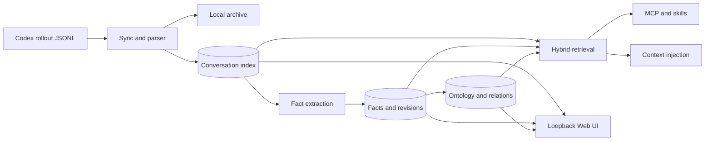

# Memex

[](CHANGELOG.md)
[](https://developers.openai.com/codex/)
[](LICENSE)

> 흩어진 Codex 대화를 모으고, 지식을 증류하고, 연결하고, 인덱싱해서
> 필요한 순간 다시 꺼내 쓰는 로컬 우선 개인 지식 시스템.

Memex는 Codex rollout을 검색 가능한 대화 archive, durable fact, ontology 기반
knowledge graph, 다음 작업에 재사용할 bounded context로 바꿉니다.

[English](README.md) · [문서 지도](docs/README.md) ·
[설치와 운영](docs/GUIDE.md) · [아키텍처](docs/ARCHITECTURE.md) ·
[스키마](docs/SCHEMA.md)

이 프로젝트는 MIT 라이선스의
[`jung-wan-kim/memory-bank`](https://github.com/jung-wan-kim/memory-bank)와
그 upstream인
[`obra/episodic-memory`](https://github.com/obra/episodic-memory)에서 파생된
독립 Codex-native 프로젝트입니다. Claude Code 호환 계층은 포함하지 않습니다.

## 왜 0.1.0인가

기능 수가 적어서가 아니라 독립 공개 저장소의 첫 릴리스이기 때문입니다. Marketplace,
Codex host adapter, 설치 계약이 안정화됐다고 선언하는 시점을 `1.0.0`으로 남겨두고,
현재 완성된 기능은 `0.1.0`부터 실제 사용자 검증을 받습니다.

## 주요 기능

- vector, FTS5/BM25, hybrid conversation search
- LLM 호출 없는 deterministic full-history analysis
- incremental fact extraction, consolidation, revision, provenance
- domain/category ontology와 typed knowledge graph
- project/global/explicit all-project scope isolation
- bounded RAG context injection과 session deduplication
- compressed `.jsonl.zst` archive
- 9개 MCP tools와 3개 Codex skills
- Facts, Pipeline, 3D Knowledge Galaxy를 포함한 loopback Web UI
- Codex-native SessionStart/UserPromptSubmit/SessionEnd hooks

## 구조



원본 rollout은 read-only입니다. 자세한 데이터 흐름은
[ARCHITECTURE.md](docs/ARCHITECTURE.md), fact/graph 동작은
[FACT-LIFECYCLE.md](docs/FACT-LIFECYCLE.md)와
[KNOWLEDGE-GRAPH.md](docs/KNOWLEDGE-GRAPH.md)를 참조하세요.

## 권장 설치

요구 사항: Node.js 22.15+, 인증된 Codex CLI, macOS 또는 Linux.

```bash
codex plugin marketplace add BongSuCHOI/memex
codex plugin add memex@memex
```

이 두 명령이 일반 사용자의 전체 설치입니다. manifest, MCP, 3 skills, lifecycle
hooks, CLI/UI launcher가 함께 설치됩니다. 첫 실행에는 Node의 `npx`가 최신
`BongSuCHOI/memex#main` runtime과 native dependency를 격리 cache에 준비하므로 조금
더 걸릴 수 있습니다. clone/build는 필요하지 않습니다.

## 설치 후 1회 onboarding

설치가 끝나면 **Codex를 재시작**합니다. 이 시점부터 Codex 세션 내부 기능(대화 검색,
fact 추출·주입, MCP 도구)은 별도 설정 없이 동작합니다. 터미널에서 `memex` CLI를 직접
쓰려면 플러그인 등록만으로는 PATH에 실행 파일이 생기지 않으므로, 다음 명령을 **한 번만**
실행해 영구 shim을 만듭니다(전역 설치 아님; PATH 누락 시 안내 출력):

```bash
npx --yes --package=github:BongSuCHOI/memex#main memex setup --install-cli
```

`~/.local/bin/memex`가 생기고, 기존 session history를 conversation → fact → ontology/vector
순서로 준비합니다:

```bash
memex setup
memex sync
memex backfill all
memex status
```

제거는 `memex setup --uninstall-cli`(본 명령이 만든 파일만 삭제)입니다.

`memex setup`은 Codex의 실제 `memories` feature 상태를 확인합니다. built-in Memory가
켜져 있으면 double-memory/conflicting-memory 위험과 OFF 권장을 보여주며, 대화형
terminal에서는 동의를 묻습니다. 비대화형 실행은 절대 자동으로 끄지 않고 명시적 승인인
`memex setup --disable-codex-memory`가 있을 때만 Codex 자체
`codex features disable memories`를 호출한 뒤 OFF 상태를 재검증합니다.

대화량과 local model extraction에 따라 수분 이상 걸릴 수 있습니다. 기본 실행은
완료를 직접 확인할 수 있는 foreground이며, `backfill all`은 각 단계를 순서대로
실행하고 실패한 단계에서 멈춥니다(재실행해도 안전). `--background`의 started
메시지는 완료가 아니므로 `memex status`의 pending count를 확인해야 합니다.
`sync`는 idempotent하므로 다시 실행해도 안전합니다.

Memex hook/MCP가 꺼낸 기억은 event별 `memex_recall` provenance로 기록됩니다. 경계는
turn 전체가 아니라 evidence별입니다. 같은 turn에서도 human assertion과 allowlist를
통과한 local repo/file, Git history, test execution 결과는 학습 가능하지만 Memex 결과,
외부/unknown tool output, assistant-generated synthesis는 학습하지 않습니다. 전체
exchange는 conversation search에 남으므로 self-ingestion loop를 차단하면서 repo
evidence에 근거한 fact evolution은 계속됩니다.

## 사용

```bash
memex search "SQLite를 선택한 이유"
memex search --both "인증 마이그레이션"
memex stats
memex analyze --top 30 --out ~/memex-report.md
memex status
```

MCP tools:

```text
search, read, search_facts, search_ontology, ask_avatar,
trace_fact, explore_graph, cross_project_insights, graph_stats
```

Web UI:

```bash
npx --yes --package=github:BongSuCHOI/memex#main memex-ui
# http://localhost:3847
```

`/` conversations, `/facts` fact management, `/graph` 3D graph,
`/pipeline` readiness를 제공합니다.

## 업데이트

```bash
memex update --dry-run
memex update
```

Git marketplace snapshot을 갱신하고 plugin을 최신 상태로 재설치합니다. Runtime은
항상 최신 main을 대상으로 하며, update는 skills/hooks/MCP metadata까지 맞춥니다.
완료 후 Codex를 재시작합니다. 기존 Memex data는 보존됩니다.

## 데이터 위치

기본 derived data root는 `~/.config/memex`입니다. 우선순위는
`MEMEX_HOME` → `$XDG_CONFIG_HOME/memex` → `~/.config/memex`입니다.
Memex는 이 표준 저장소 네임스페이스만 사용하며 Codex rollout 원본은
항상 read-only로 유지합니다.
자세한 내용은 [SCHEMA](docs/SCHEMA.md)를 참조하세요.

## 해제

Marketplace plugin hooks는 plugin 제거와 함께 사라집니다. 과거/manual
`setup-hooks`를 썼다면 fingerprinted entry만 먼저 제거합니다.

```bash
npx --yes --package=github:BongSuCHOI/memex#main memex remove-hooks --dry-run
npx --yes --package=github:BongSuCHOI/memex#main memex remove-hooks
codex plugin remove memex@memex --json
codex plugin marketplace remove memex --json
```

해제는 Codex rollout과 Memex derived data를 보존합니다. Memex 데이터를 완전히
삭제하려면 `memex home`으로 exact data root를 확인한 뒤 해당 디렉터리만 삭제하고,
`$CODEX_HOME/sessions`는 절대 건드리지 않습니다. 부분 초기화 옵션을 포함한 전체
삭제 절차는 [운영 가이드](docs/GUIDE.md#uninstall-and-data-retention)를 참조하세요.

## 검증과 기여

```bash
npm run typecheck
npm run build
npm test
npm run test:marketplace
npm run test:package
node --test test/codex-slice.test.mjs
node --test test/*slice.test.mjs
node scripts/validate-plugin.mjs
```

clone, `npm ci`, build는 일반 설치가 아니라 개발/기여 시에만 사용합니다.

변경 전 [AGENTS.md](AGENTS.md)의 invariant와
[문서 책임 지도](docs/README.md)를 확인하세요. 최신 검증 경계는
[VERIFICATION.md](docs/VERIFICATION.md)에 있습니다.

## 라이선스

MIT. 계보와 third-party attribution은 [LINEAGE.md](docs/LINEAGE.md)와
[THIRD_PARTY_NOTICES.md](THIRD_PARTY_NOTICES.md)에 있습니다.
