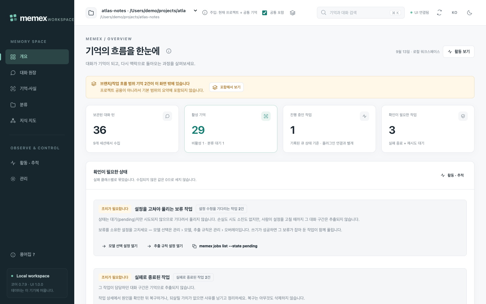
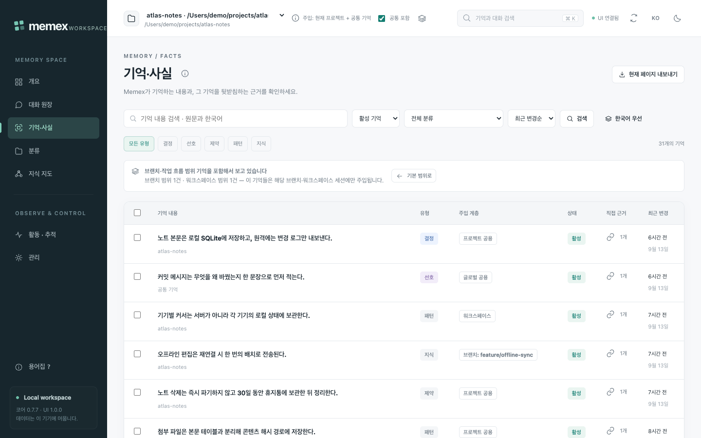
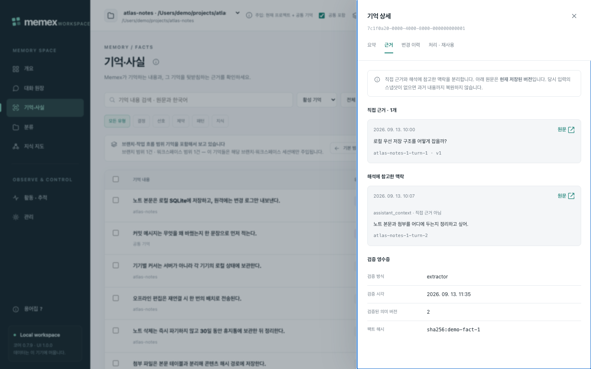
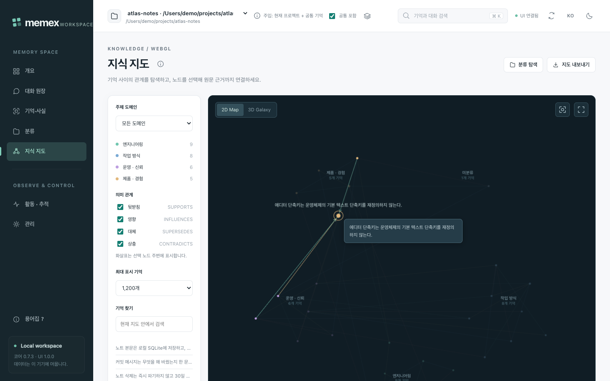
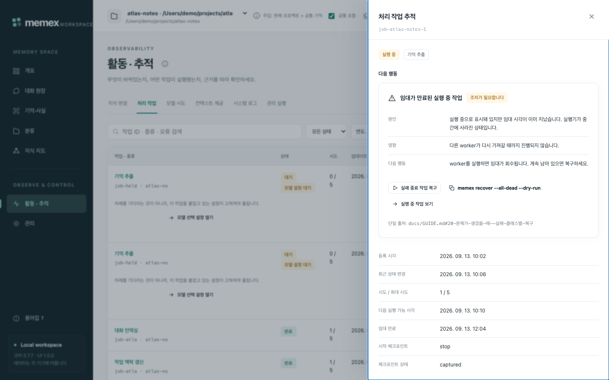
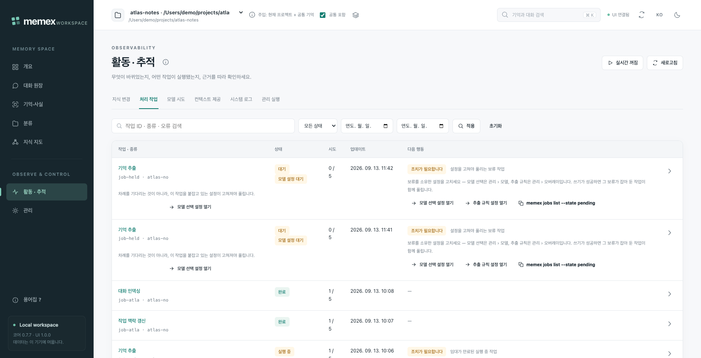
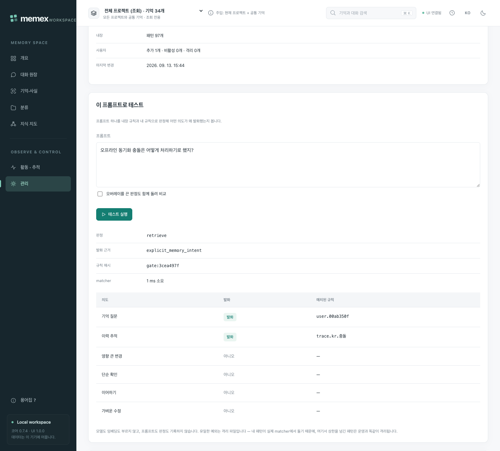
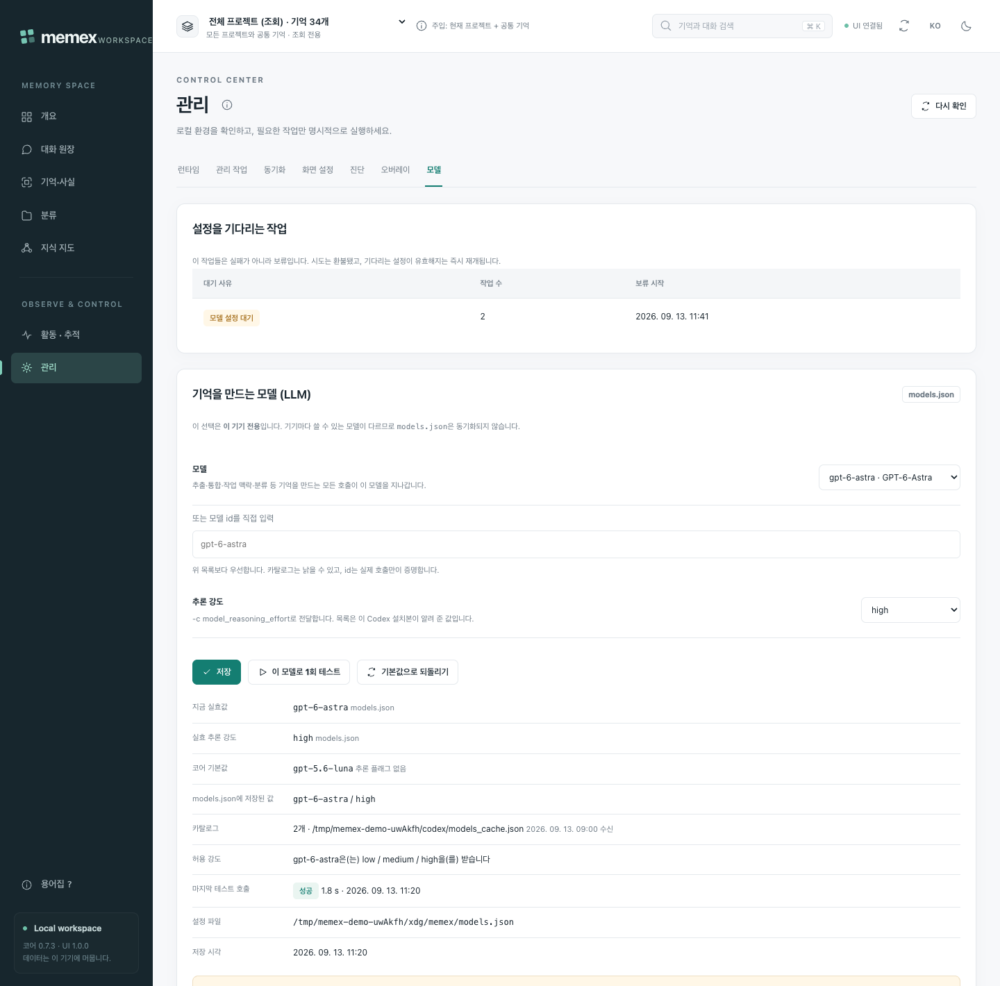
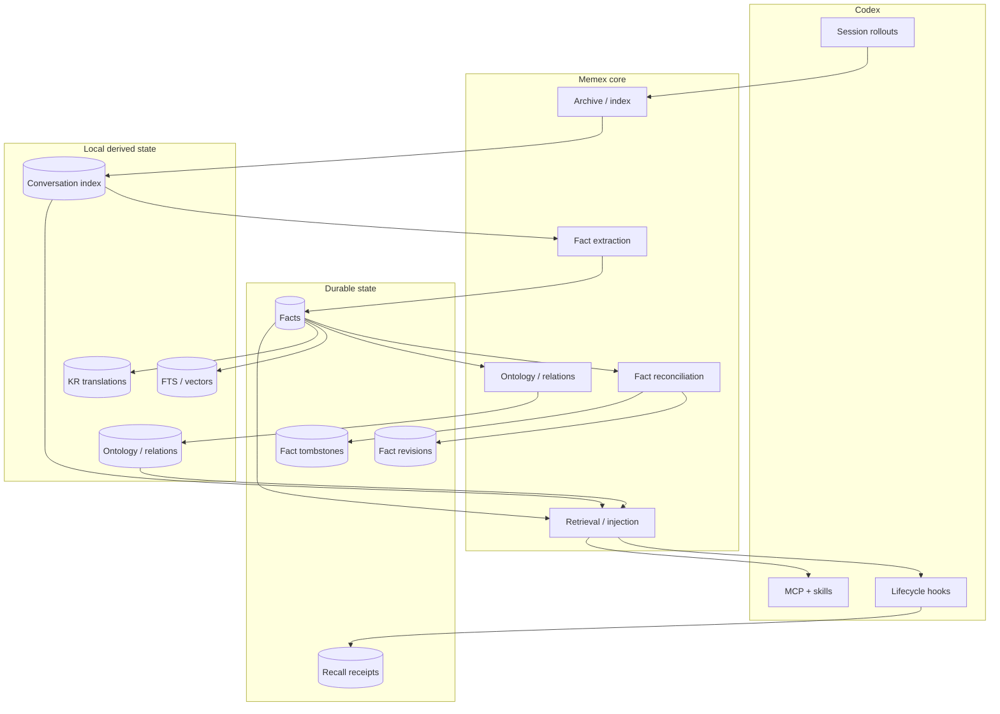

# Memex

**Codex를 위한 로컬 우선 장기 기억 계층입니다.** 대화를 모으고, 남길 가치가 있는 결정을 증류하고, 각 기억을 그것을 증명한 대화 턴에 묶어, 필요한 순간에 다시 꺼내 씁니다.

[](CHANGELOG.md)
[](https://developers.openai.com/codex/)
[](package.json)
[](LICENSE)

<picture>
  <source media="(prefers-color-scheme: dark)" srcset="assets/readme/ko/overview-dark.png">
  
</picture>

[English README](README.md) · [문서](docs/README.md) · [운영 가이드](docs/GUIDE.md) · [아키텍처](docs/ARCHITECTURE.md) · [검증](docs/VERIFICATION.md)

---

## 왜 Memex인가

Codex는 잊습니다. 세션은 매번 빈 방에서 시작하므로 같은 결정을 다시 논의하고, 같은 제약을 다시 발견하며, 지난달 선택의 이유는 아무도 다시 열지 않을 rollout 파일 안에만 남습니다. Memex는 그것을 보관하는 계층입니다. 이미 나눈 대화를 아카이브하고, 장기 기억으로 증류하고, 범위가 분리된 그래프로 연결한 뒤, 관련도 게이트를 통과한 작은 조각만 이후 프롬프트에 다시 주입합니다. Memex는 **두 번째 에이전트가 아니라 기억 시스템**이고, 실제 작업은 Codex가 계속 수행합니다.

**로컬 우선.** 원본 Codex rollout은 항상 read-only입니다. DB·검색 인덱스·파생 그래프·운영 로그는 로컬 Memex data root 아래에 있고, 크로스디바이스 동기화는 켜기 전까지 꺼져 있습니다 — 켜기 전에는 다른 기기로 아무것도 동기화되지 않습니다. 다만 모델 작업은 예외이고, 로컬이 아닙니다: 기억 추출과 온톨로지 분류는 증류할 대화 본문을 Codex CLI에 설정된 모델 provider로 보내며, `memex models test`는 같은 provider에 고정된 한 줄 probe를 보냅니다. 추출은 동기화 여부와 무관하게 백그라운드에서 돕니다. 그 트래픽이 허용되지 않는 환경이라면 Codex가 로컬 provider를 쓰게 하거나 추출을 끄십시오.

**근거에 묶인 기억.** 기억은 대화 요약이 아닙니다. `source_exchange_ids`에는 정확한 authoritative human 또는 trusted local-tool exchange만 들어가고, 기억을 *해석*하는 데 필요한 long-range 맥락은 별도의 `fact_context_dependencies`에 남으며 authority로 승격되지 않습니다. 워크스페이스와 `trace_fact`는 이 두 경로를 항상 분리해 보여주고, 수집되지 않은 값은 `0`으로 환산하지 않고 미수집으로 표시합니다.

**규칙은 사용자의 것.** 내 정규식과 단어가 회수 게이트 위에 얹히고, 추출에 대한 내 제한은 프롬프트의 권고가 아니라 저장 경계에서 집행되며, Memex가 자기 작업에 쓸 모델과 추론 강도도 직접 고릅니다. 화면을 여는 것만으로는 모델 작업이 시작되지 않고, provider가 거절한 설정은 작업을 실패시키는 대신 **대기**시킵니다.

---

## 빠른 시작

**요구 사항** — Node.js 22.15 이상, 인증이 완료된 Codex CLI, 그리고 현재 hook / Unix socket runtime 기준 macOS 또는 Linux.

```bash
# 1 · 플러그인 설치 후 Codex를 재시작해 hook·skills·MCP server를 로드합니다
codex plugin marketplace add BongSuCHOI/memex
codex plugin add memex@memex

# 2 · 터미널에서도 memex 명령 사용 (~/.local/bin/memex 생성,
#     global npm install은 하지 않음)
npx --yes --package=github:BongSuCHOI/memex#main memex setup --install-cli

# 3 · 기존 Codex 대화 이력 준비
memex setup          # Codex built-in Memory와의 충돌 점검
memex sync           # $CODEX_HOME/sessions의 eligible rollout을 archive/index
memex backfill all   # durable 기억 추출, ontology 분류, 누락 embedding
memex status         # readiness와 남은 backlog 확인

# 4 · 이미 했던 작업을 Codex에 물어보기. bundled skill이 Memex MCP 도구를 쓰고,
#     같은 조회를 셸에서 하면 다음과 같습니다
memex search "왜 SQLite를 선택했지?"

# 5 · 로컬 워크스페이스 열기
npx --yes --package=github:BongSuCHOI/memex#main memex-ui   # http://127.0.0.1:3847
```

1·2·5단계는 1분이면 끝납니다. 3단계 소요 시간은 이력의 양에 달려 있고, backfill 단계는 모두 idempotent하므로 중단했다가 다시 실행해도 안전합니다. `memex setup`은 사용자 승인 없이 Codex built-in Memory를 비활성화하지 않습니다. 이후 갱신은 `memex update`가 데이터를 보존하면서 marketplace와 plugin을 새로 고칩니다.

제대로 동작했는지 확인하려면 `memex doctor`가 의존성·빌드·hook·주입 출력·recall provenance를 한 번에 점검하고, 워크스페이스의 **활동 › 컨텍스트 제공** 탭에서 회수 1건마다 남은 영수증을 볼 수 있습니다.

Memex는 native SQLite, vector, embedding 의존성을 사용합니다. 설치 절차가 이를 plugin 옆에 materialize하고 launcher는 그 설치 artifact를 우선 실행합니다. isolated npm cache는 MCP server와, 아직 materialize되지 않은 plugin registration이 쓰는 `npx` fallback에만 적용됩니다. 어느 경로도 일반 사용 시 사용자 프로젝트에 dependency를 설치하거나 source checkout을 요구하지 않습니다. local marketplace 개발과 source 기반 검증은 [운영 가이드](docs/GUIDE.md)를 참고하세요.

---

## 워크스페이스

`memex-ui`는 `http://127.0.0.1:3847`에 loopback 워크스페이스를 띄웁니다. 서버 측 CommonJS와 브라우저로 보내는 ES module뿐이라 별도의 프런트엔드 빌드도, 추가 npm 패키지도 없습니다. `127.0.0.1`에만 bind하고 `Host`/`Origin`을 검사하며 변경 요청에는 CSRF 토큰을 요구합니다. 기억 변경은 CLI와 동일한 transactional service를 거칩니다. 인증·TLS·다중 사용자 격리 서비스가 **아니므로** 포트 포워딩이나 공개 배포는 하지 않습니다.

모든 화면은 프로젝트 / 공통 기억 / 전체 프로젝트 범위를 명시적으로 선택합니다. 기본값은 전체 프로젝트이고 이 범위는 **조회 전용**입니다 — 실제 주입 범위는 언제나 현재 프로젝트 + 공통 기억이며, 범위 선택 옆에 그 사실을 상시 표시합니다. 모든 화면에는 도움말도 붙어 있습니다. 제목 옆 ⓘ가 이 릴리스 태그의 문서 절을 가리키고, 컨트롤·배지·표 머리글에는 한 줄 툴팁이, `?`에는 검색 가능한 용어집이 있습니다.

### 개요 — 파이프라인이 하는 일과, 사람이 해야 할 일


- 선택한 범위의 지표 4개, 그리고 대화 수집 · 기억 추출 · 검색 인덱스 · 분류 네 단계의 준비 상태.
- **확인이 필요한 상태**는 남은 작업을 개수가 아니라 실패 클래스로 묶습니다. 보류된 작업, 실패한 작업, 재시도를 기다리는 작업은 고치는 방법이 서로 다릅니다.
- 수집되지 않은 값은 미수집으로 표시합니다. 이 화면에 추정치는 없습니다.

### 기억 · 사실 — 왼쪽에 계층, 오른쪽에 근거



- 행마다 **주입 계층** 배지가 붙습니다. 글로벌, 프로젝트 공용, 이 워크스페이스, 특정 브랜치. 현재 화면 밖에 있는 브랜치 계층 기억은 배너가 알려주고 한 번의 클릭으로 포함합니다.
- 기억은 `브랜치 ⇄ 프로젝트 공용 ⇄ 글로벌` 사다리를 한 칸씩 오르내리며, 누가 왜 옮겼는지가 함께 기록됩니다.
- 유형·상태·주제·본문으로 거르고, 이 페이지 전체 또는 선택한 행만 내보낼 수 있습니다.



- 상세 패널은 **직접 근거**와 **해석에 참고한 맥락**을 분리합니다 — 그 기억을 증명하는 것과, 그 기억을 읽는 데 필요한 것은 다릅니다.
- 그 아래에 검증 영수증이, 옆에 그 기억 자신의 Chronicle 변경 이력이 있습니다.
- 수정·비활성화·복원은 기억의 ID와 변경 이력 전체를 유지하면서 이전 의미에서 파생된 상태만 무효화합니다 — 비활성화된 기억은 그대로 남아 있고 언제든 복원할 수 있습니다.
- 확인 후 삭제만은 다릅니다. 전체 UUID를 요구하고 영향 범위를 먼저 보여준 뒤, 그 기억과 revision, Chronicle 기록까지 영구히 지웁니다. 남는 것은 sync tombstone — 다른 기기에서 그 행이 되살아나는 것을 막을 뿐, 복원할 수 있는 기록이 아닙니다.

### 지식 지도 — 유사도 구름이 아니라 관계



- 기억 노드와 typed relation(`SUPPORTS`, `INFLUENCES`, `SUPERSEDES`, `CONTRADICTS`)을 브라우저 네이티브 WebGL로 그리고, Canvas2D fallback이 있습니다.
- 2D와 3D는 하나의 엔진과 하나의 선택 상태를 공유하며, 노드를 고르면 기억 목록과 같은 상세 패널이 열립니다.
- 레이아웃은 도메인 그룹만 인코딩합니다. 화면상의 거리는 임베딩 유사도 수치가 **아닙니다**.

### 활동 · 추적 — 작업 하나를 끝까지



- 지식 변경, 처리 작업, 모델 시도, 컨텍스트 제공, 시스템 로그, 실행 이력 — 모두 다른 화면과 같은 범위를 따릅니다.
- 작업 하나를 열면 추출 대상, 처리한 입력 버전, 실제로 소모한 모델 시도까지 펼쳐집니다.
- 조치가 필요한 행에는 [GUIDE §20](docs/GUIDE.md#20-문제가-생겼을-때--실패-클래스별-복구)의 실패 클래스 표에서 파생한 **다음 행동**이 붙습니다. 상태 단어가 아니라 진단입니다.



- provider가 거절한 설정을 기다리는 작업은 실패가 아니라 **보류**입니다. 시도는 환불되고 실패로 기록된 것도 없습니다.
- 보류 배지가 사유를 말하고, 행이 그 사유를 고치는 화면으로 연결합니다.
- 설정을 고치면 보류된 작업은 저절로 재개됩니다. 기다리기만 해서는 풀리지 않는다는 사실도 그 행이 적어 둡니다.

### 관리 › 오버레이 — 내 규칙을, 적용 전에 시험한다



- 내 정규식과 단어는 내장 회수 게이트 **위에** 얹힙니다. 내장 규칙은 지우지 않고 id로 끄며, 읽거나 실행할 수 없는 규칙이 있어도 내장 게이트는 그대로 유효합니다.
- **이 프롬프트로 테스트**는 판정, 발화한 의도, 그리고 매치된 규칙을 내 규칙까지 포함해 그대로 보여 줍니다. 모델을 부르지 않고 어떤 이력에도 쓰지 않으며, 화면이 그 사실을 적어 둡니다.
- 추출 규칙 화면이 나머지 절반입니다. 멀리할 주제와, 저장 경계에서 집행되는 `never_extract` 패턴이 여기 있습니다. 프롬프트에 실제로 덧붙는 절을 미리 보여 주고, 영향 시뮬레이션은 로컬에서 판정할 수 없는 규칙의 숫자를 지어내지 않습니다. 실행 상한을 넘긴 패턴은 조용히 꺼지지 않고 격리 목록에 남습니다. ([GUIDE §22](docs/GUIDE.md#22-사용자-오버레이--회수-게이트와-추출-규칙-070-29-30))

### 관리 › 모델 — Memex가 자기 자신에게 쓰는 모델



- Memex가 자기 작업에 쓸 모델과 추론 강도를 이 Codex 설치본의 카탈로그에서 고르거나, 카탈로그에 아직 없는 id를 직접 입력합니다.
- **이 모델로 1회 테스트**는 실제 호출을 정확히 한 번 합니다. 이 화면에서 비용을 쓰는 유일한 버튼이고, 성공하면 그 설정의 대기를 해제합니다.
- 쓸 수 없는 설정을 기다리는 작업은 사유·건수·보류 시작 시각과 함께 여기에 모이고, 폼 아래 각 행은 무엇이 적용 중인지뿐 아니라 그 값이 어디서 왔는지(환경 변수 · `models.json` · 내장 기본값)까지 함께 적습니다. 임베딩 모델은 0.7.x에서 읽기 전용입니다. ([GUIDE §21](docs/GUIDE.md#21-모델-선택-070-31))

### 영어와 한국어


- 화면 기본 언어는 **영어**이고 한국어로 바꿀 수 있습니다 — 주소의 `?lang=ko`, 상단 `EN`/`KO` 버튼, 관리 › 화면 설정 중 어느 것이든 이 브라우저에 기억됩니다.
- 서버 기본값은 `memex-ui --lang ko`(또는 `MEMEX_UI_LANG=ko`)로 정하며, 알 수 없는 값은 추측하지 않고 기동에 실패합니다.
- `docs/`의 문서는 한국어만 있고, 영어 화면도 같은 한국어 절을 가리킵니다. ([WEBUI-WORKSPACE.md](docs/WEBUI-WORKSPACE.md))

### 동기화 — 기본은 꺼짐, 필요하면 파일 하나

크로스디바이스 동기화는 **기본 off**입니다. 켜기 전에는 기억 상태가 본인 data root 밖 어디에도 쓰이지 않고 다른 기기에 닿지도 않습니다. (이는 기기↔기기 상태에 대한 이야기입니다 — Memex의 모델 작업은 동기화와 무관하게 Codex 모델 provider로 갑니다. 위 *로컬 우선* 참고.) 두 기기가 같은 공유 폴더(본인 계정의 iCloud Drive·Dropbox·Syncthing 등)를 보게 하면 durable 기억 상태가 서로 맞춰집니다.

```bash
memex sync enable --dir ~/Library/Mobile\ Documents/com~apple~CloudDocs/memex-sync
memex sync export      # 이 기기의 첫 세대 내보내기
memex sync status      # 공유 폴더·이 기기·마지막 export·감지된 다른 기기
memex sync alias "집 맥미니"   # 기기 이름 — 세대 manifest에 실려 상대에게도 보입니다
```

공유 폴더가 없으면 세대 하나를 파일로 옮길 수 있습니다. 같은 protocol v5 generation을 zip에 담을 뿐이므로 검증도 똑같습니다.

```bash
memex sync export --archive          # <data root>/sync/exports/<device>-<generation>.zip 생성
memex sync import --archive ~/Downloads/<device>-<generation>.zip --dry-run
memex sync import --archive ~/Downloads/<device>-<generation>.zip
```

관리 › 동기화도 같은 일을 하며 항상 **검증 → 미리보기 → 확인** 순서입니다. 자기 기기가 만든 파일은 되돌려 적용하지 않고 거부합니다. 공유 폴더의 기억은 평문 JSONL이고 암호화는 범위 밖이므로 **본인 계정의** 폴더만 사용하십시오.

---

## 동작 방식



Memex는 polling이 아니라 Codex lifecycle에 붙어 동작합니다. capture hook은 bounded local I/O만 수행하며, 모델·임베딩·추출·export 작업은 hook의 foreground에서 실행되지 않습니다.

| 이벤트 | Memex 동작 |
| --- | --- |
| **SessionStart** (startup/resume) | session state 복원과 durable queue recovery 후 background sync/import/maintenance |
| **SessionStart** (clear/compact) | `context_epoch` 전환. compact는 bounded Capsule/current-fact bundle을 즉시 반환 |
| **UserPromptSubmit** | scoped retrieval·bounded context injection, 그리고 별도의 비동기 유지보수 재개 검사 |
| **Stop** / **Interrupt** | 새 transcript bytes만 append하고 closed-turn fence를 commit (interrupt는 open fence 보존) |
| **PreCompact** / **PostCompact** | journal fsync, carry freeze, checkpoint + outbox atomic commit. post-compact는 telemetry 전용 |
| **SessionEnd** | final delta + final fence + durable job. 같은 이벤트의 **별도 항목**(3초 timeout — Codex가 여기 허용하는 최대)이 동기화가 켜져 있을 때 세대를 내보내고, 꺼져 있으면 즉시 no-op |

Durable queue는 capture indexing, Work Capsule, fact/derived 순으로 처리합니다. SessionStart background 작업은 eventual consistency이며 각 writer가 자체 transaction/CAS 안전성을 책임집니다.

더 깊은 내용: [CONTINUITY.md](docs/CONTINUITY.md)(lifecycle·journal·outbox·worker·Capsule·Chronicle) · [FACT-LIFECYCLE.md](docs/FACT-LIFECYCLE.md)(추출·통합·semantic/lifecycle 상태) · [RETRIEVAL-AND-CONTEXT.md](docs/RETRIEVAL-AND-CONTEXT.md)(검색·RAG·컨텍스트 주입) · [ARCHITECTURE.md](docs/ARCHITECTURE.md) · [SCHEMA.md](docs/SCHEMA.md)

<details>
<summary><b>범위와 기억 계층</b> — 디렉터리·브랜치·워크트리가 기억에 대응하는 방식</summary>

| 상황 | 동작 |
|---|---|
| **깃 프로젝트** | 디렉터리 = 프로젝트. 기본 브랜치(main/master/`origin/HEAD`) 세션의 기억 → **프로젝트 공용**. 그 외 브랜치/워크트리 세션의 기억 → `(project, branch)`로 키를 잡는 독립 **브랜치 tier**. 브랜치끼리 서로 희석되지 않고, 같은 저장소의 워크트리 두 개가 같은 브랜치를 체크아웃하고 있으면 하나의 tier를 공유합니다. 주입·조회 = 글로벌 + 프로젝트 공용 + 현재 브랜치. |
| **일반(비-git) 프로젝트** | 디렉터리 = 프로젝트, 브랜치 계층 없음. 모든 기억 = 프로젝트 공용 (+ 글로벌). |
| **일반 → 깃 전환** | `workspace_id`·`project_id` 불변, workspace 메타데이터만 갱신 + `WORKSPACE_LOCATION_CHANGED` 이벤트. 기존 프로젝트 공용 기억은 데이터 변경 없이 그대로. 새 common dir/remote가 다른 프로젝트에 이미 묶여 있으면 자동으로 병합하지 않고 `requires_approval = 1`과 `project_identity_audit`의 `suggest` 행으로 남긴 뒤 `approved_remote_mappings` 명시 승인을 기다립니다. |
| **승격/강등** | 사다리 `브랜치 ⇄ 프로젝트 공용 ⇄ 글로벌`, 한 칸씩만. 채널 3개: ① 워크스페이스/CLI 사용자 확언 ② 근거 기반 자동(다른 브랜치 재확인 → 프로젝트, 서로 다른 프로젝트 2곳 이상 확인 → 글로벌, 상위 근거 소실 → 강등) ③ 세션 내 명시 요청(`actor=user-directive`). 모두 Chronicle `PROMOTED`/`DEMOTED`를 남깁니다. |

저장되는 값은 `facts.promotion_state`(`workstream` = 브랜치 tier, `project-current` = 프로젝트 공용, `scope_type = global` = 글로벌)이고, 그 자리에 놓인 근거는 `facts.tier_reason`(`no-branch-signal` | `default-branch` | `branch:<name>`)에 남습니다. 지원하는 scope는 **project**, **workspace/workstream/session**, **global**, **all**(명시적 cross-project 접근)입니다.

읽기 범위와 통합 권한은 분리됩니다. 통합기는 다른 계층이나 승격 상태의 기억을 흡수하지 않고 검증된 새 문장만 채택하며, 불명확한 legacy identity는 검토 대상으로 보존합니다. 기존 DB의 [감사·백업·선별 복구](docs/GUIDE.md#16-기억-정합성-감사와-선별-복구)는 전체 재추출 없이 수행할 수 있습니다. 0.6.0 이전에 추출된 기억은 전부 브랜치 tier에 있고, `memex facts migrate-tiers --dry-run`이 새 규칙상 프로젝트 공용이어야 하는 항목을 나열하며 `--apply`가 실제로 옮깁니다.

</details>

<details>
<summary><b>Fact 상태 모델과 sync protocol</b> — 왜 편집이 비활성화를 되돌리지 못하는가</summary>

sync protocol v5는 fact 상태를 서로 독립적인 축으로 나눕니다.

| 축 | 예시 | 병합 규칙 |
| --- | --- | --- |
| **Semantic** | fact text, category, scope | semantic event clock + deterministic tie-break |
| **Lifecycle** | active / inactive | lifecycle event clock; 완전 동률이면 inactive 승리 |
| **Lineage** | source exchange IDs, consolidated count | monotonic union / max |
| **Derived overlay** | KR text, ontology, relations, vectors | local-only, 재생성 가능 |

이 분리가 중요한 이유는 기억의 의미를 편집하는 것과 비활성화하는 것이 서로 다른 사건이기 때문입니다. 더 최신 semantic edit가 더 최신 deactivate를 되돌려서는 안 되고, 오래된 peer snapshot 때문에 provenance가 사라져서도 안 됩니다. semantic axis가 서로 다른 두 의미 중 하나를 골라야 했다면 그 판정을 조용히 넘기지 않고, 어느 기기의 어느 세대에서 왔고 어느 쪽이 이겼는지를 로컬 `SYNC_IMPORTED` Chronicle 이벤트로 남깁니다. 이 이벤트는 로컬 기록이며 export되지 않습니다.

protocol v5는 기기별로 하나의 committed generation을 export하며, 각 generation은 `facts.jsonl`, `fact-revisions.jsonl`, `fact-tombstones.jsonl`, `recall-events.jsonl`과 protocol version·device/generation identity·row count·payload별 SHA-256을 담은 `meta.json`으로 구성됩니다. Importer는 SQLite를 변경하기 전에 generation 전체를 pin하고 검증하며, 필수 파일 누락·hash 불일치·JSON 오류·row schema 오류가 하나라도 있으면 해당 device generation 전체를 reject합니다. 같은 기기의 exporter는 SQLite `BEGIN IMMEDIATE` transaction으로 직렬화되므로 늦게 끝난 오래된 export가 `CURRENT`를 되돌릴 수 없습니다. KR 번역, ontology category, relation, vector index는 각 기기에서 로컬로 다시 만듭니다.

| 기억 계층 | 전송 | 받는 기기에서 |
| --- | --- | --- |
| 글로벌 | 예 | 어디서나 주입 |
| 프로젝트 공용 (`legacy-project`, `project-current`, `decision`) | 예 | 해당 프로젝트에서 주입 |
| workspace | 예 (`workspace_id` 포함) | 주입되지 않음 — workspace id는 기기 로컬 값 |
| 브랜치 / workstream | 예 (`workstream_id`·`tier_reason`·브랜치 이름 포함) | 같은 프로젝트의 같은 브랜치에 있을 때만 주입 |

모든 promotion state가 전송되므로, 자체 tier를 가질 수 없는 fact tombstone이 export되는 fact와 정확히 같은 모집단을 가리킵니다. 이 버전이 모르는 `promotion_state`는 프로젝트 범위로 뭉개지 않고 malformed row로 보고해 해당 generation을 거부합니다. protocol v4 generation은 계속 import되고, v4 피어는 v5 generation을 잘못 읽는 대신 거부합니다. 첫 export 이후 게시는 자동입니다. SessionEnd 훅과 유지보수 wake가 durable 변경이 있을 때만 세대를 만들고 SessionStart가 다른 기기의 세대를 가져오며, `memex sync disable`이면 이 경로 전부가 한 줄짜리 no-op이 됩니다.

</details>

<details>
<summary><b>Recall이 자기 자신을 다시 학습하지 않도록</b> — 그리고 <code>DO NOT INDEX</code>가 지우는 것</summary>

과거 기억을 다시 꺼낸 뒤 Codex가 그 내용을 반복했다고 해서, 그 반복 문장이 새로운 사실의 근거가 되어서는 안 됩니다. Memex는 human assertion, 신뢰 가능한 local repository / Git / test 관측, external 또는 검증 불가능한 tool output, Memex recall, assistant-generated synthesis를 구분합니다. 뒤의 두 가지는 검색에는 남지만 새로운 durable fact evidence로 사용하지 않으며, 따라서 다음 증폭 루프를 막습니다.

```text
기존 fact → prompt에 recall → assistant가 반복 → 반복 문장을 새 fact로 추출
```

Context를 실제로 내보내기 전에 durable recall receipt를 먼저 기록합니다. "컨텍스트를 제공했다"는 사실만 기록하며, 모델이 답변에 실제로 활용했다는 증거로 쓰지 않습니다.

user-role message의 `DO NOT INDEX` marker는 해당 conversation 전체를 Memex knowledge corpus에서 제외합니다. Privacy purge는 exchange와 tool-call index state, FTS/vector rows, extraction/recall processing state, 제외된 conversation에 authoritative evidence 또는 persisted interpretive context로 의존한 fact, 그 fact에서 파생된 revision/relation/vector, 기존 corpus에서 파생된 local taxonomy를 제거하거나 무효화합니다. 이렇게 제거된 fact에는 terminal privacy tombstone이 남아 오래된 다른 기기의 snapshot이 되살릴 수 없고, 남은 공개 fact는 남아 있는 근거만으로 다시 분류됩니다.

</details>

<details>
<summary><b>데이터 위치</b> — data root 전체</summary>

해석 우선순위는 `MEMEX_HOME`, `$XDG_CONFIG_HOME/memex`, `~/.config/memex` 순입니다.

```text
~/.config/memex/
├── lifecycle-registration.json         # 명시적 fallback hook 등록 기록
├── conversation-archive/
│   └── <project>--<hash>/              # 보관된 rollout(.jsonl)과 요약
├── conversation-index/
│   ├── db.sqlite                       # (+ -wal, -shm)
│   ├── exclude.txt
│   ├── inject-daemon.sock
│   ├── logs/
│   │   └── inject-context.jsonl        # (+ .old, 5 MB에서 회전)
│   ├── state/
│   │   └── inject-ledger/
│   ├── sync/
│   │   ├── export-status.json
│   │   └── devices/<device>/CURRENT, generations/<id>/
│   └── *.lock, *.log                   # backfill / consolidate / reembed 워커
├── sync/
│   ├── config.json                     # 크로스디바이스 동기화 on/off + 공유 폴더 (기본 off)
│   ├── devices.json                    # 기기 id → 사람이 읽는 이름 (로컬, 공유되지 않음)
│   └── exports/<device>-<generation>.zip   # 손으로 옮기는 세대 파일
├── journals/<session>/<epoch>.jsonl    # rolling transcript 저널
├── run-locks/
├── ui/
│   └── operations.json
└── logs/
    ├── hook-events.jsonl
    └── ui-audit.jsonl
```

`ui/operations.json`은 워크스페이스가 실행한 관리 명령의 메타데이터, `logs/ui-audit.jsonl`은 그 감사 기록입니다. 둘 다 대화 원문·기억 원문·실행 출력이 아니라 메타데이터만 남깁니다. `logs/hook-events.jsonl`에는 관측된 lifecycle hook의 이벤트 이름과 시각만 남고, `conversation-index/logs/inject-context.jsonl`에는 retrieval 1건당 상태·건수·소요 시간만 남습니다(프롬프트·기억 원문 없음). 반면 `conversation-archive/`와 `journals/`에는 실제 대화 원문이 들어 있으므로 민감 정보로 취급하세요. 원본 `$CODEX_HOME/sessions` rollout은 항상 read-only input으로 취급합니다. 삭제나 이동 전에는 `memex home`(또는 `memex home --json`)으로 정확한 경로를 확인하세요.

</details>

---

## CLI 치트시트

```bash
memex status                                   # readiness·backlog·확인이 필요한 상태
memex sync                                     # 새 Codex rollout archive/index
memex backfill all                             # 추출·ontology·embedding·영수증
memex search "왜 SQLite를 선택했지?"            # semantic + FTS5/BM25 하이브리드 검색
memex search --text "ERR_MODULE_NOT_FOUND"     # 임베딩 없이 정확한 문자열
memex facts list                               # 기억 조회 (show/edit/history/explain)
memex models set --model <id> --reasoning high # Memex가 자기 작업에 쓸 모델
memex gate test "재시도는 어떻게 처리했지?"      # 내 회수 규칙이 이 프롬프트를 어떻게 볼지
memex jobs list                                # durable queue (`retry`·`dismiss`·`show <id>`)
memex doctor                                   # 의존성·빌드·hook·주입·provenance 진단
```

모든 서브커맨드는 `--help` / `-h`를 인식해 사용법만 출력하고 exit `0`으로 끝나며, 부작용이 있는 명령도 `--help`로는 아무것도 쓰지 않습니다. foreground backfill은 처리 가능하거나 실행 중이거나 해결되지 않은 작업이 없을 때만 `0`을 반환합니다 — 유계 실행 뒤 재시도 가능한 backlog가 남으면 `completed with deferred work`와 함께 `2`를, worker 실패는 이후 단계를 중단하고 `1`을 반환합니다.

<details>
<summary><b>전체 명령</b></summary>

| 명령 | 역할 |
| --- | --- |
| `memex setup` | Codex built-in Memory 충돌 점검. `--install-cli` / `--uninstall-cli`로 `~/.local/bin/memex` shim 관리 |
| `memex install` | 플러그인 등록과 runtime 의존성 materialize (idempotent). `--root`로 설치본 루트 직접 지정 |
| `memex deps materialize` | 해석된 설치 plugin root에 runtime 의존성을 설치하고 embedding model 캐시가 비어 있으면 워밍. `--root`, `--dry-run`, `--force`, `--no-warm`, `--json` |
| `memex deps warm` | embedding model을 안정 캐시(`<data root>/models`)에 미리 내려받아 첫 프롬프트가 129 MB를 내지 않게 합니다. `--force`, `--json` |
| `memex setup-hooks` / `memex remove-hooks` | Memex 소유 lifecycle hook 등록·제거 (명시적 fallback 호스트 전용) |
| `memex update` | data를 보존하면서 marketplace/plugin 갱신. `--marketplace <name>`, `--no-materialize`, `--no-warm` |
| `memex sync` | 새 Codex rollout archive/index. `--background` |
| `memex sync enable\|disable\|status\|export\|import` | 크로스디바이스 동기화 스위치(기본 off)·공유 폴더(`--dir`)·상태·수동 export(`--force`)/import. `--json` |
| `memex sync export --archive [<path.zip>]` | 세대 하나를 zip으로 저장해 손으로 옮기기(동기화가 꺼져 있어도 동작) |
| `memex sync import --archive <path> [--dry-run]` | 받은 세대 파일 적용. `--dry-run`은 검증·미리보기만 |
| `memex sync alias <name\|--clear> [--device <id>]` | 기기 이름. 이 기기의 이름은 모든 세대 manifest에 실려 나갑니다 |
| `memex index` | conversation index 생성·검증·복구·재구축: `--cleanup`, `--session <id>`, `--verify`, `--repair`, `--rebuild`, `--concurrency N`, `--no-summaries` |
| `memex search` | semantic / text / hybrid conversation search |
| `memex show` | archive conversation 읽기 |
| `memex stats` | corpus/index 통계 |
| `memex analyze` | deterministic 전체 이력 보고서 생성 |
| `memex facts` | durable 기억 조회·관리: `list\|show\|edit\|deactivate\|restore\|history\|explain\|delete`. `list --all`은 비활성 기억까지(`--limit`·`--offset`), `edit --source-exchange <id>`는 근거 지정 |
| `memex facts tier\|promote\|demote` | `workstream ⇄ project ⇄ global` 사다리 조회·이동(한 칸씩) |
| `memex facts migrate-tiers` | 0.6.0 기본 tier 규칙 back-fill 목록(`--dry-run`)·적용(`--apply`) |
| `memex backfill` | backlog를 명시적으로 실행: `all\|extract\|ontology\|embeddings\|receipts`. `--background` |
| `memex ontology` | local taxonomy 조회·수리: `list\|merge\|rename` |
| `memex status` | pipeline readiness와 `Needs attention`·격리된 프로젝트·`memory_jobs`의 kind × state 집계. `--json` |
| `memex jobs` | memory job 조회·복구: `list\|show\|retry\|dismiss` |
| `memex recover` | terminal(dead) 작업을 한 트랜잭션에서 되돌리기; `--all-dead`, `--dry-run` |
| `memex model-work` | 모델 작업 예산 확인과 명시적 재개; [예산 재개](docs/GUIDE.md#17-모델-작업-예산과-대기-진단) |
| `memex models` | Memex 자기 모델 작업에 쓸 모델·추론 강도 선택: `show\|set\|reset\|test`. `set --model <id> [--reasoning <level>]`(`unset`은 플래그 제거), `test`는 실제 호출 1회로 그 설정의 대기를 해제 |
| `memex gate` | 내 회수 게이트 규칙: `show\|patterns\|words\|test\|replay\|validate\|history\|quarantine\|reset\|rollback`. 내장 규칙은 지우지 않고 id로 끄며, 쓰기는 `--dry-run`·`--expect-revision <n>`을 받습니다 |
| `memex extract` | 내 추출 제한 — 이 명령은 추출하지 않습니다: `rules show\|validate\|set\|test\|history\|reset\|rollback\|reextract`, 그리고 모델 호출을 쓰는 유일한 동사 `eval` |
| `memex doctor` | 의존성·빌드·hook·주입 출력·recall provenance 진단 |
| `memex home` | 해석된 Memex data root 출력 |
| `memex migrate-projects` | cwd 근거로 project identity 재도출 (CX-02). `--dry-run`은 계획만 출력하고 아무것도 쓰지 않음 |

전체 레퍼런스: [GUIDE §18](docs/GUIDE.md#18-cli-한눈에-보기).

</details>

<details>
<summary><b>MCP 도구와 skills</b></summary>

Memex는 9개의 MCP 도구를 제공합니다.

| 도구 | 용도 |
| --- | --- |
| `search` | 과거 conversation 검색 |
| `read` | archive 원문/line range 읽기 |
| `search_facts` | 증류된 기억 검색 |
| `search_ontology` | domain/category별 기억 탐색 |
| `ask_avatar` | 저장된 evidence를 바탕으로 답변 합성 |
| `trace_fact` | current fact → Chronicle timeline → source evidence 추적 |
| `explore_graph` | 1–3 hop relation 탐색 |
| `cross_project_insights` | 다른 project의 유사 해결책 탐색 |
| `graph_stats` | graph 규모와 health 확인 |

project-sensitive 도구는 stable project/workspace/workstream/session ID 또는 legacy canonical absolute project path, `scope: global`, `scope: all` 중 하나가 필요합니다. 프로젝트를 지목할 수 없는 cwd(`/`, `unknown`, basename이 비어 있는 경로)는 한 곳에 몰아넣지 않고 거절하며, 그런 세션은 글로벌 기억만 읽습니다.

Bundled Codex skill 3개는 과거 대화 기억, 전체 대화 분석, Memex dashboard 열기를 담당합니다. 자세한 내용은 [MCP-AND-SKILLS.md](docs/MCP-AND-SKILLS.md)를 참고하세요.

</details>

<details>
<summary><b>환경 변수</b></summary>

| 변수 | 효과 |
| --- | --- |
| `MEMEX_HOME` | Memex data root. 가장 우선하는 지정 |
| `XDG_CONFIG_HOME` | 대체 경로 `$XDG_CONFIG_HOME/memex` |
| `MEMEX_DB_PATH` | data root와 별개로 index DB 경로를 지정 |
| `CODEX_HOME` | Codex home. `$CODEX_HOME/sessions`가 read-only rollout 원본 |
| `MEMEX_SYNC_DIR` | 크로스디바이스 공유 폴더. `memex sync enable --dir`로 저장한 값보다 우선합니다 |
| `MEMEX_AUTO_ONTOLOGY` | 자동 ontology는 기본 활성화. `1`(또는 빈 값)이 아닌 값을 넣으면 꺼집니다 |
| `MEMEX_STRICT_CAPTURE` | `1`이면 capture gap 대신 hook이 실패 |
| `MEMEX_CAPSULE_MAX_CHARS` | Work Capsule 한 세대의 bounded storage size (기본 `12000`, 하한 `2000`). 초과 patch는 버리지 않고 우선순위대로 절단해 저장하고 기록 |
| `MEMEX_INJECT_BASELINE_MARGIN` | 주입 관련성 게이트가 요구하는 baseline 대비 마진 (기본 `0.045`, 0~1) |
| `MEMEX_CODEX_MODEL` / `MEMEX_CODEX_REASONING` | Memex 자기 모델 작업의 모델과 추론 강도. 둘 다 `<data root>/models.json`보다 우선하고, 그 파일이 내장 기본값(`gpt-5.6-luna`, 추론 강도 플래그 없음)보다 우선합니다 |
| `MEMEX_OVERLAY_DIR` / `MEMEX_DISABLE_OVERLAYS` | 사용자 오버레이 위치(기본 `<data root>/overlays`)와 전면 비활성 스위치(`1`만 인정) |
| `MEMEX_UI_LANG` | 워크스페이스의 서버 기본 언어, `en`(기본) 또는 `ko` |
| `PORT` | 워크스페이스 포트 (기본 `3847`) |

모델 작업은 run 단위로 예산이 정해집니다([GUIDE §17](docs/GUIDE.md#17-모델-작업-예산과-대기-진단)).

| 설정 | 기본값 | 실제 제한 |
| --- | --- | --- |
| `MEMEX_MODEL_BUDGET_MAX_ATTEMPTS` | `64` | 같은 작업 run의 provider 시도 수 |
| `MEMEX_MODEL_BUDGET_DEADLINE_MS` | `900000` | run 전체 deadline |
| `MEMEX_CODEX_EXEC_TIMEOUT_MS` | `180000` | 호출 timeout; 남은 run 시간보다 길게 실행하지 않음 |
| `MEMEX_MODEL_BUDGET_MAX_INPUT_CHARS` | `120000` | 호출 입력 UTF-16 문자 수 |
| `MEMEX_MODEL_BUDGET_MAX_OUTPUT_CHARS` | `16000` | 최종 답변 문자 수; domain schema/필드 검증은 추가 적용 |
| `MEMEX_AUTO_MODEL_MAX_ATTEMPTS` | `256` | 한 데이터 루트의 자동 유지보수 24시간 공통 호출 한도; `0`이면 차단 |

토큰 수는 provider 관측값입니다. 미관측은 `null` / `NOT_PROVEN`, 일부 관측은 `partial`로 읽으며, 누락 usage나 달러 비용을 0으로 추정하지 않습니다. 모델 선택과 사용자 오버레이는 **이 기기에만** 적용되고 sync 세대에 들어가지 않습니다 — 쓸 수 있는 모델과 원하는 규칙이 기기마다 다르기 때문입니다. 기억은 **그 대화의 언어로** 저장됩니다 — 추출 창에서 사용자 메시지의 가중 글자 수 다수결로 결정론적으로 정하고(Hangul 음절 1자 = Latin 2.5자라서 영어 식별자가 잔뜩 섞인 한국어 문장도 한국어로 남습니다), 추출 규칙의 `preferred_language`로 기기별·프로젝트별로 덮어쓸 수 있습니다. 선택적 한국어 기억 번역(`fact_kr`)은 그 이전에 영어로 저장된 기억을 위한 레거시 표시 경로이며 local derived state로 sync에도 포함되지 않고 새 기억에는 생성되지 않습니다. source checkout에서는 `node scripts/translate-facts.mjs`로 채울 수 있으며, 요청 시작 이후 의미가 바뀌지 않은 경우에만 기록합니다. 전체 목록: [GUIDE §19](docs/GUIDE.md#19-환경-변수).

</details>

---

## 검증과 품질

Repository의 release gate는 구현 commit과 증거 receipt를 분리해 관리합니다. 현재 검증된 code baseline은 [`docs/verification/merge-gate.json`](docs/verification/merge-gate.json)에 기록되며, committed candidate SHA·environment·exact gate 결과·hard-safety 결과·retained note를 담습니다. Owner document에 복제된 숫자로 현재 검증 상태를 추정하지 않습니다.

필수 gate는 하나라도 FAIL이면 FAIL입니다. 관측되지 않은 동작을 추론으로 PASS 처리하지 않습니다. 브라우저 gate는 릴리스마다 두 언어로 실행하며, 이 README의 스크린샷도 그 실행의 산출물입니다 — `assets/readme/en/`과 `assets/readme/ko/`는 같은 실행에서 나옵니다. 전체 acceptance 모델과 버전 경계, 보존된 기계 receipt는 [VERIFICATION.md](docs/VERIFICATION.md)를 참고하세요.

---

## 로드맵

0.7.0은 위의 오버레이·모델 선택 화면을 냈습니다. 0.7.x로 이월된 항목은 다음과 같습니다.

| 이슈 | 내용 |
| --- | --- |
| [#118](https://github.com/BongSuCHOI/memex/issues/118) | 임베딩 모델 전환 — DB 승인 식별자, 세대 CAS, 전환 서비스, topic 벡터 무효화 |
| [#119](https://github.com/BongSuCHOI/memex/issues/119) | 오버레이의 기기 간 공유 — 충돌·revision·reset 계약과 v5 선택 파일 |
| [#120](https://github.com/BongSuCHOI/memex/issues/120) | 회수 게이트 임계값(`RecallGateConfig` 8개)의 오버레이 편집 |
| [#121](https://github.com/BongSuCHOI/memex/issues/121) | `custom_fact_kinds` — 내장 5종 외의 기억 유형 |
| [#123](https://github.com/BongSuCHOI/memex/issues/123) | 기억 언어 정책 — 대화 언어를 따라 추출하고 `fact_kr`은 레거시 표시용으로 축소 |
| [#115](https://github.com/BongSuCHOI/memex/issues/115) | `gate` / `extract` CLI 출력 언어를 나머지 CLI(영어)와 통일 |
| [#114](https://github.com/BongSuCHOI/memex/issues/114) | package-runtime E2E가 매 실행마다 임베딩 모델을 새 임시 루트로 다시 받고 원인 오류를 가리는 문제 |

---

## 기여

```bash
git clone https://github.com/BongSuCHOI/memex.git
cd memex
npm install
npm run build          # tsc + esbuild bundle
npm test               # vitest
npm run typecheck
node --test ui/test/*.test.cjs          # 워크스페이스 service/HTTP 계약
node scripts/web-ui-browser-e2e.mjs     # 실제 headless Chrome UI gate
MEMEX_PLUGIN_ROOT="$PWD" node ui/server.cjs   # checkout에서 워크스페이스 실행
```

동작을 바꾸기 전에 [AGENTS.md](AGENTS.md)를 먼저 읽으세요 — repository 불변식, 검증 규칙, 문서 소유권을 정의합니다. 공개 명령·저장 필드·lifecycle 규칙·MCP schema·릴리스 계약이 바뀌면 같은 변경에서 해당 owner document도 함께 갱신합니다.

문서는 하나의 큰 매뉴얼이 아니라 소유권 단위로 나뉘어 있습니다. [docs/README.md](docs/README.md)에서 시작하세요.

| 문서 | 내용 |
| --- | --- |
| [GUIDE.md](docs/GUIDE.md) | 설치, onboarding, CLI, lifecycle, 제거 |
| [ARCHITECTURE.md](docs/ARCHITECTURE.md) | 시스템 경계와 end-to-end 흐름 |
| [CONVERSATION-LIFECYCLE.md](docs/CONVERSATION-LIFECYCLE.md) | rollout 파싱, archive/index, sync protocol |
| [FACT-LIFECYCLE.md](docs/FACT-LIFECYCLE.md) | 추출, 통합, semantic/lifecycle 상태 |
| [KNOWLEDGE-GRAPH.md](docs/KNOWLEDGE-GRAPH.md) | ontology, relation, 탐색 |
| [RETRIEVAL-AND-CONTEXT.md](docs/RETRIEVAL-AND-CONTEXT.md) | 검색, RAG, 컨텍스트 주입 |
| [SCHEMA.md](docs/SCHEMA.md) | SQLite schema와 transaction 불변식 |
| [MCP-AND-SKILLS.md](docs/MCP-AND-SKILLS.md) | MCP 도구와 bundled skill |
| [WEBUI-WORKSPACE.md](docs/WEBUI-WORKSPACE.md) | 로컬 워크스페이스 화면, 범위 모델, 지식 지도 |
| [CONTINUITY.md](docs/CONTINUITY.md) | lifecycle/journal/outbox/worker, Capsule, identity, Chronicle 구현 기준 |
| [VERIFICATION.md](docs/VERIFICATION.md) | 테스트, E2E gate, 릴리스 증거 |
| [LINEAGE.md](docs/LINEAGE.md) | upstream 출처와 프로젝트 계보 |

---

## 계보와 라이선스

Memex는 MIT 라이선스의 [`obra/episodic-memory`](https://github.com/obra/episodic-memory)와 [`jung-wan-kim/memory-bank`](https://github.com/jung-wan-kim/memory-bank)에서 파생된 독립 Codex-native 프로젝트입니다. 지식 시스템 아이디어는 유지하면서 기존 host adapter를 Codex-native rollout·hook·plugin·MCP·모델 실행 계약으로 대체했습니다. [LINEAGE.md](docs/LINEAGE.md)와 [THIRD_PARTY_NOTICES.md](THIRD_PARTY_NOTICES.md)를 참고하세요.

MIT. [LICENSE](LICENSE)를 참고하세요.
