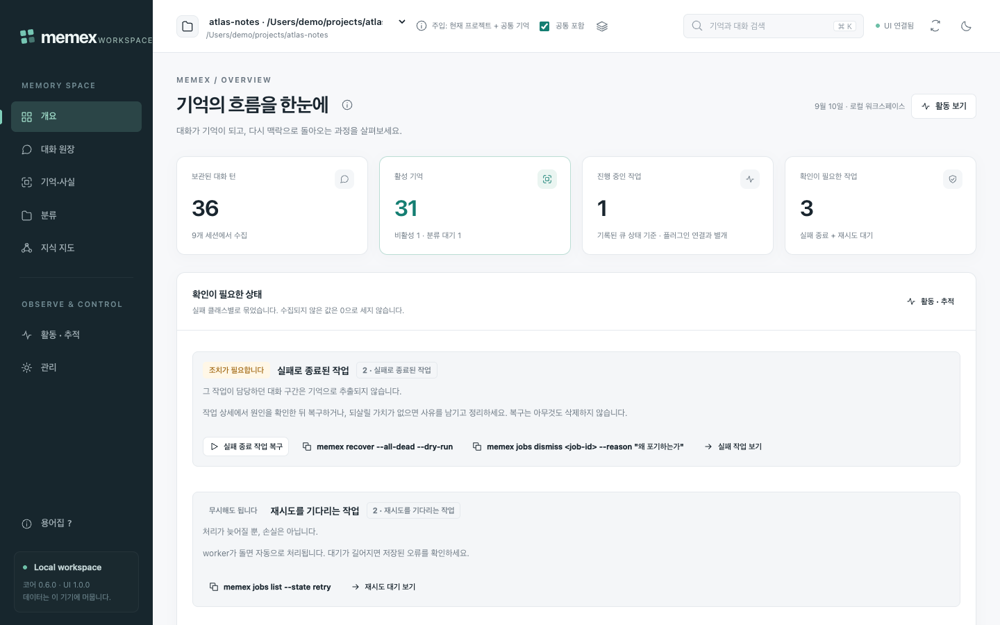
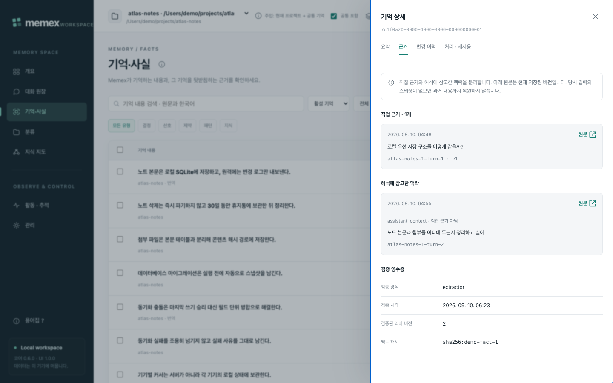
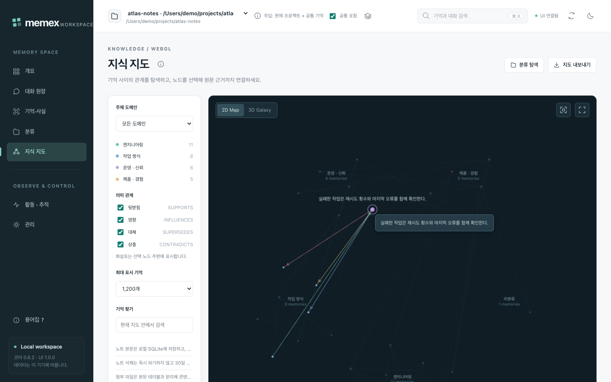
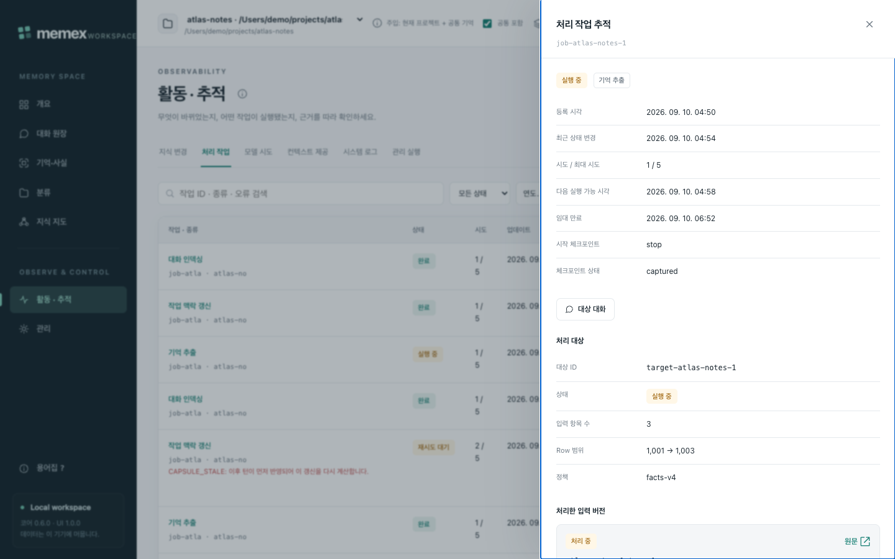
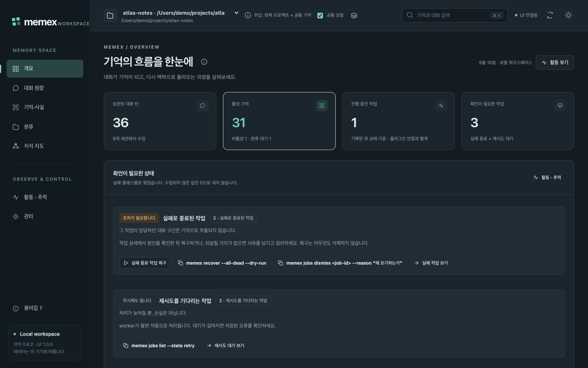
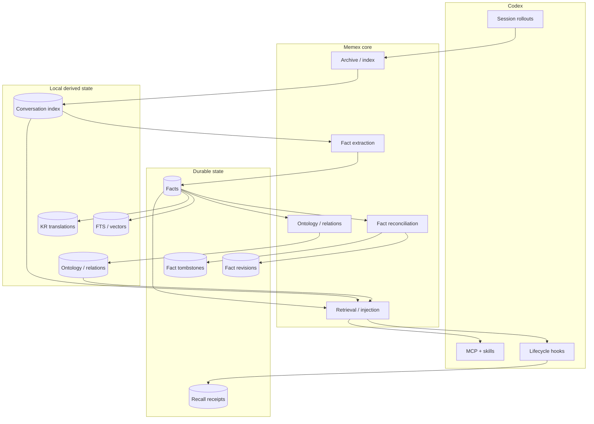

# Memex

[](CHANGELOG.md)
[](https://developers.openai.com/codex/)
[](package.json)
[](LICENSE)

> Codex를 위한 로컬 우선 장기 기억 계층입니다. 대화를 모으고, 재사용할 지식을 증류하고, 서로 연결한 뒤, 필요한 순간에 다시 꺼내 씁니다.



Memex는 로컬 Codex 세션 이력을 검색 가능한 대화 아카이브, 장기 fact, 범위가 분리된 지식 그래프, 그리고 이후 작업에 다시 주입할 수 있는 제한된 컨텍스트로 바꿉니다. Memex는 **두 번째 에이전트가 아니라 기억 시스템**입니다. 실제 작업은 Codex가 계속 수행하고, Memex는 그 주변에서 장기 기억 계층을 제공합니다.

[English README](README.md) · [문서](docs/README.md) · [운영 가이드](docs/GUIDE.md) · [아키텍처](docs/ARCHITECTURE.md) · [검증](docs/VERIFICATION.md)

### Memex가 하는 일

- **대화를 보관합니다** — 원본 Codex rollout은 수정하지 않고 검색 가능한 스냅샷을 남기며, semantic vector search와 FTS5/BM25 검색을 함께 제공합니다.
- **장기 fact를 증류합니다** — 재사용할 가치가 있는 decision, preference, pattern, knowledge, constraint를 추출하고 각 fact를 그것을 증명하는 대화 턴에 묶습니다.
- **fact의 변화를 추적합니다** — duplicate 통합, contradiction, revision, deactivate, restore, provenance를 기록합니다.
- **연결하고 다시 꺼냅니다** — fact를 domain/category로 분류해 typed relation을 만들고, 관련도와 예산을 통과한 작은 기억 블록만 이후 Codex prompt에 주입합니다.
- **근거를 보여줍니다** — loopback Web UI, 9개 MCP 도구, 그리고 fact 상태만 주고받는 멀티디바이스 durable sync를 제공합니다.

---

## 왜 Memex인가

**Local-first.** 원본 Codex rollout은 항상 read-only입니다. DB·검색 인덱스·파생 그래프·운영 로그는 로컬 Memex data root 아래에 있으며, archive와 DB는 언제든 다시 만들 수 있는 로컬 계층입니다.

**근거에 묶인 기억.** fact는 대화 요약이 아닙니다. `source_exchange_ids`에는 정확한 authoritative human 또는 trusted local-tool exchange만 들어가고, fact를 *해석*하는 데 필요한 long-range non-authoritative 맥락은 별도의 로컬 `fact_context_dependencies`에 기록되며 authority로 승격되지 않습니다. Web UI와 `trace_fact`는 이 두 경로를 항상 분리해 보여줍니다.

**정직한 관측.** 수집되지 않은 값은 `0`으로 환산하지 않고 미수집으로 표시합니다. 관측되지 않은 토큰 사용량은 `null` / `NOT_PROVEN`, 일부만 관측되면 `partial`입니다. "컨텍스트를 제공했다"는 사실만 기록하며, 모델이 답변에 실제로 활용했다는 증거로 쓰지 않습니다.

**명시적인 실행 없이는 모델을 부르지 않습니다.** capture hook은 bounded local I/O만 수행합니다. Web UI 화면을 여는 것만으로는 모델 작업이 시작되지 않고, 자동 유지보수는 대기 시간과 공통 호출 한도가 허용할 때만 미완료 작업을 재개합니다.

**프로젝트 격리.** Memex는 canonical absolute `session_meta.cwd`로 로컬 workspace를 식별하고 stable `project_id`로 논리적 프로젝트를 구분합니다. 검색·관련 사실·추적·graph의 모든 hop이 같은 scope를 사용하며, MCP server는 자신의 process cwd를 project identity로 추측하지 않습니다.

자세한 내용은 [ARCHITECTURE.md](docs/ARCHITECTURE.md), [FACT-LIFECYCLE.md](docs/FACT-LIFECYCLE.md), [WEBUI-WORKSPACE.md](docs/WEBUI-WORKSPACE.md)를 참고하세요.

---

## 빠른 시작

**요구 사항** — Node.js 22.15 이상, 인증이 완료된 Codex CLI, 그리고 현재 hook / Unix socket runtime 기준 macOS 또는 Linux.

```bash
# 1. 플러그인 설치 후 Codex를 재시작해 hook·skills·MCP server를 로드합니다
codex plugin marketplace add BongSuCHOI/memex
codex plugin add memex@memex

# 2. 선택: 터미널에서도 memex 명령 사용 (~/.local/bin/memex 생성,
#    global npm install은 하지 않음)
npx --yes --package=github:BongSuCHOI/memex#main memex setup --install-cli

# 3. 기존 Codex 대화 이력 준비
memex setup          # Codex built-in Memory와의 충돌 점검
memex sync           # $CODEX_HOME/sessions의 eligible rollout을 archive/index
memex backfill all   # durable fact 추출, ontology 분류, 누락 embedding
memex status         # readiness와 남은 backlog 확인

# 4. http://127.0.0.1:3847 에서 로컬 워크스페이스 열기
npx --yes --package=github:BongSuCHOI/memex#main memex-ui

# 5. 이미 했던 작업을 물어보기 — Codex에서는 bundled skill이 Memex MCP 도구를
#    사용하며, 같은 조회를 셸에서 하면 다음과 같습니다
memex search "왜 SQLite를 선택했지?"
```

`memex setup`은 사용자 승인 없이 Codex built-in Memory를 비활성화하지 않습니다. backfill 단계는 모두 idempotent하게 다시 실행할 수 있습니다.

Memex는 native SQLite, vector, embedding 의존성을 사용합니다. 설치 절차가 이를 plugin 옆에 materialize하고 launcher는 그 설치 artifact를 우선 실행합니다. isolated npm cache는 MCP server와, 아직 materialize되지 않은 plugin registration이 쓰는 `npx` fallback에만 적용됩니다. 어느 경로도 일반 사용 시 사용자 프로젝트에 dependency를 설치하거나 source checkout을 요구하지 않습니다.

local marketplace 개발과 source 기반 검증은 [운영 가이드](docs/GUIDE.md)를 참고하세요.

---

## Web UI

워크스페이스는 서버 측 CommonJS와 브라우저로 보내는 ES module로만 구성됩니다. 별도의 프런트엔드 빌드도, 추가 npm 패키지도 없습니다. 서버는 `127.0.0.1`에만 bind하고 `Host`/`Origin`을 검사하며 변경 요청에는 CSRF 토큰을 요구합니다. Fact mutation은 CLI와 동일한 transactional service를 사용합니다. 포트는 `PORT`로 바꿉니다.

```bash
npx --yes --package=github:BongSuCHOI/memex#main memex-ui
# http://127.0.0.1:3847
```

| 화면 | 내용 |
| --- | --- |
| `/` 개요 | 파이프라인 준비 상태, 최근 기억 변화, 활동 |
| `/conversations` 대화 원장 | 세션, 대화 턴, 원문 |
| `/facts` 기억 | fact, revision, 직접 근거와 해석 맥락, 확인 후 수정·비활성화·복원·삭제 |
| `/taxonomy` 분류 | ontology domain과 category |
| `/graph` 지식 지도 | WebGL 2D/3D 관계 그래프, Canvas2D fallback |
| `/activity` 활동 · 추적 | Chronicle, 처리 작업, 모델 시도, 컨텍스트 제공, 로그, 관리 실행 |
| `/settings` 관리 | 런타임, 관리 명령, 화면 설정, 진단 |

모든 화면은 프로젝트 / 공통 기억 / 전체 범위를 명시적으로 선택합니다. 화면을 여는 것만으로는 모델 작업이 시작되지 않습니다.



*기억 상세 · 근거 탭 — 직접 근거와 해석에 참고한 맥락을 분리해 보여주고, 그 아래에 검증 영수증을 남깁니다.*



*지식 지도 — fact 노드와 typed relation(`SUPPORTS`, `INFLUENCES`, `SUPERSEDES`, `CONTRADICTS`)을 브라우저 네이티브 WebGL로 그립니다. 레이아웃은 도메인 그룹만 인코딩하며, 화면상의 거리는 임베딩 유사도 수치가 **아닙니다**.*



*활동 · 추적 · 처리 작업 — durable job 하나를 추출 대상, 처리한 입력 버전, 모델 실행 시도까지 펼쳐 확인합니다.*

<details>
<summary>다크 모드</summary>



</details>

Web UI는 인증·TLS·다중 사용자 격리 서비스가 아니므로 포트 포워딩이나 공개 배포를 하지 않습니다. 자세한 내용은 [WEBUI-WORKSPACE.md](docs/WEBUI-WORKSPACE.md)를 참고하세요.

---

## 동작 방식



### Fact 상태 모델

sync protocol v4는 fact 상태를 서로 독립적인 축으로 나눕니다.

| 축 | 예시 | 병합 규칙 |
| --- | --- | --- |
| **Semantic** | fact text, category, scope | semantic event clock + deterministic tie-break |
| **Lifecycle** | active / inactive | lifecycle event clock; 완전 동률이면 inactive 승리 |
| **Lineage** | source exchange IDs, consolidated count | monotonic union / max |
| **Derived overlay** | KR text, ontology, relations, vectors | local-only, 재생성 가능 |

이 분리가 중요한 이유는 fact의 의미를 편집하는 것과 비활성화하는 것이 서로 다른 사건이기 때문입니다. 더 최신 semantic edit가 더 최신 deactivate를 되돌려서는 안 되고, 오래된 peer snapshot 때문에 provenance가 사라져서도 안 됩니다.

### Scope와 통합

지원하는 scope는 **project**(project-wide truth와 필요한 global fact), **workspace/workstream/session**(명시한 작업 범위와 허용된 상위 truth), **global**(global fact만), **all**(사용자가 명시적으로 요청한 cross-project 접근)입니다.

읽기 범위와 통합 권한은 분리됩니다. 통합기는 다른 workstream이나 승격 상태의 fact를 흡수하지 않고 검증된 새 문장만 채택하며, 불명확한 legacy identity는 검토 대상으로 보존합니다. 기존 DB의 [감사·백업·선별 복구](docs/GUIDE.md#16-기억-정합성-감사와-선별-복구)는 전체 fact 재추출 없이 수행할 수 있습니다.

### Recall이 자기 자신을 다시 학습하지 않도록

과거 기억을 다시 꺼낸 뒤 Codex가 그 내용을 반복했다고 해서, 그 반복 문장이 새로운 사실의 근거가 되어서는 안 됩니다. Memex는 human assertion, 신뢰 가능한 local repository / Git / test 관측, external 또는 검증 불가능한 tool output, Memex recall, assistant-generated synthesis를 구분합니다. 뒤의 두 가지는 검색에는 남지만 새로운 durable fact evidence로 사용하지 않으며, 따라서 다음 증폭 루프를 막습니다.

```text
기존 fact → prompt에 recall → assistant가 반복 → 반복 문장을 새 fact로 추출
```

Context를 실제로 내보내기 전에 durable recall receipt를 먼저 기록합니다.

### 개인정보와 conversation 제외

user-role message의 `DO NOT INDEX` marker는 해당 conversation 전체를 Memex knowledge corpus에서 제외합니다. Privacy purge는 exchange와 tool-call index state, FTS/vector rows, extraction/recall processing state, 제외된 conversation에 authoritative evidence 또는 persisted interpretive context로 의존한 fact, 그 fact에서 파생된 revision/relation/vector, 기존 corpus에서 파생된 local taxonomy를 제거하거나 무효화합니다. 이렇게 제거된 fact에는 terminal privacy tombstone이 남아 오래된 다른 기기의 snapshot이 되살릴 수 없고, 남은 공개 fact는 남아 있는 근거만으로 다시 분류됩니다.

### 멀티디바이스 sync

protocol v4는 기기별로 하나의 committed generation을 export하며, 각 generation은 `facts.jsonl`, `fact-revisions.jsonl`, `fact-tombstones.jsonl`, `recall-events.jsonl`과 protocol version·device/generation identity·row count·payload별 SHA-256을 담은 `meta.json`으로 구성됩니다. Importer는 SQLite를 변경하기 전에 generation 전체를 pin하고 검증하며, 필수 파일 누락·hash 불일치·JSON 오류·row schema 오류가 하나라도 있으면 해당 device generation 전체를 reject합니다. 같은 local device의 exporter는 SQLite `BEGIN IMMEDIATE` transaction으로 직렬화되므로 늦게 끝난 오래된 export가 `CURRENT`를 되돌릴 수 없고 cloud-sync되는 lockfile도 필요하지 않습니다. KR 번역, ontology category, relation, vector index는 각 기기에서 로컬로 다시 만듭니다.

더 깊은 내용: [ARCHITECTURE.md](docs/ARCHITECTURE.md) · [CONVERSATION-LIFECYCLE.md](docs/CONVERSATION-LIFECYCLE.md) · [FACT-LIFECYCLE.md](docs/FACT-LIFECYCLE.md) · [RETRIEVAL-AND-CONTEXT.md](docs/RETRIEVAL-AND-CONTEXT.md) · [SCHEMA.md](docs/SCHEMA.md)

---

## 사용법

```bash
memex search "왜 SQLite를 선택했지?"
memex search --both "인증 마이그레이션"
memex facts list
memex stats
memex analyze --top 30 --out ~/memex-report.md
memex status
```

| 명령 | 역할 |
| --- | --- |
| `memex sync` | 새 Codex rollout archive/index |
| `memex search` | semantic / text / hybrid conversation search |
| `memex show` | archive conversation 읽기 |
| `memex stats` | corpus/index 통계 |
| `memex analyze` | deterministic 전체 이력 보고서 생성 |
| `memex facts` | durable fact 조회·관리 |
| `memex facts migrate-tiers` | 0.6.0 기본 tier 규칙 back-fill 목록(`--dry-run`)·적용(`--apply`) |
| `memex backfill` | extraction / ontology / embedding backlog 처리 |
| `memex model-work status` | 모델 시도·관측 사용량·대기 작업 확인; [예산 재개](docs/GUIDE.md#17-모델-작업-예산과-대기-진단) |
| `memex status` | pipeline readiness 확인 |
| `memex jobs` | memory job 조회·복구: `list|show|retry|dismiss` |
| `memex recover` | terminal(dead) 작업을 한 트랜잭션에서 되돌리기; `--all-dead`, `--dry-run` |
| `memex doctor` | runtime/plugin/MCP/lifecycle 진단 |
| `memex update` | data를 보존하면서 marketplace/plugin 갱신 |
| `memex install` | 플러그인 등록과 runtime 의존성 materialize (idempotent) |

Fact 관리에는 edit, deactivate, restore, history, guarded hard delete가 포함됩니다. semantic edit는 fact ID와 revision history를 유지하면서 이전 의미에서 파생된 상태를 무효화합니다.

foreground backfill은 처리 가능하거나 실행 중이거나 해결되지 않은 작업이 없을 때만 exit code `0`을 반환합니다. 유계 실행 뒤 재시도 가능한 backlog가 남으면 `completed with deferred work`와 선택한 단계별 실행 후 건수를 출력하고 `2`를 반환합니다. active claim과 terminal extraction failure도 outstanding work와 `2`로 보고합니다. worker 실패는 우선하여 이후 단계를 중단하고 `1`을 반환합니다.

전체 CLI와 lifecycle 계약은 [GUIDE.md](docs/GUIDE.md)를 참고하세요.

### MCP 도구와 skills

Memex는 9개의 MCP 도구를 제공합니다.

| 도구 | 용도 |
| --- | --- |
| `search` | 과거 conversation 검색 |
| `read` | archive 원문/line range 읽기 |
| `search_facts` | 증류된 fact 검색 |
| `search_ontology` | domain/category별 fact 탐색 |
| `ask_avatar` | 저장된 evidence를 바탕으로 답변 합성 |
| `trace_fact` | current fact → Chronicle timeline → source evidence 추적 |
| `explore_graph` | 1–3 hop relation 탐색 |
| `cross_project_insights` | 다른 project의 유사 해결책 탐색 |
| `graph_stats` | graph 규모와 health 확인 |

project-sensitive 도구는 stable project/workspace/workstream/session ID 또는 legacy canonical absolute project path, `scope: global`, `scope: all` 중 하나가 필요합니다.

Bundled Codex skill 3개는 과거 대화 기억, 전체 대화 분석, Memex dashboard 열기를 담당합니다. 자세한 내용은 [MCP-AND-SKILLS.md](docs/MCP-AND-SKILLS.md)를 참고하세요.

### 자동 lifecycle

| 이벤트 | Memex 동작 |
| --- | --- |
| **SessionStart(startup/resume)** | session state 복원과 durable queue recovery 후 background sync/import/maintenance |
| **SessionStart(clear/compact)** | `context_epoch` 전환; compact는 bounded Capsule/current-fact bundle을 즉시 반환 |
| **UserPromptSubmit** | scoped retrieval·bounded context injection, 별도 비동기 유지보수 재개 검사 |
| **Stop** | 새 complete transcript bytes만 append하고 closed-turn fence commit |
| **Interrupt** | delta append와 interrupted/open fence 보존 |
| **PreCompact** | journal fsync, carry freeze, checkpoint + outbox atomic commit |
| **PostCompact** | optional telemetry 전용; correctness 비의존 |
| **SessionEnd** | final delta + final fence + durable job만 수행; foreground model/embedding/extraction/export 없음 |

Durable queue는 capture indexing, Work Capsule, fact/derived 순으로 처리합니다. SessionStart background 작업은 eventual consistency이며 각 writer가 자체 transaction/CAS 안전성을 책임집니다.

### 데이터 위치

해석 우선순위는 `MEMEX_HOME`, `$XDG_CONFIG_HOME/memex`, `~/.config/memex` 순입니다.

```text
~/.config/memex/
├── conversation-archive/
├── conversation-index/
│   ├── db.sqlite
│   ├── sync/
│   └── logs/
├── ui/
│   └── operations.json
└── logs/
    └── ui-audit.jsonl
```

`ui/operations.json`은 Web UI가 실행한 관리 명령의 메타데이터, `logs/ui-audit.jsonl`은 Web UI 감사 기록입니다. 둘 다 대화 원문·기억 원문·실행 출력이 아니라 메타데이터만 남깁니다. 원본 `$CODEX_HOME/sessions` rollout은 항상 read-only input으로 취급합니다. 삭제나 이동 전에는 `memex home`(또는 `memex home --json`)으로 정확한 경로를 확인하세요.

---

## 설정

| 변수 | 효과 |
| --- | --- |
| `MEMEX_HOME` | Memex data root. 가장 우선하는 지정 |
| `XDG_CONFIG_HOME` | 대체 경로 `$XDG_CONFIG_HOME/memex` |
| `MEMEX_DB_PATH` | data root와 별개로 index DB 경로를 지정 |
| `CODEX_HOME` | Codex home. `$CODEX_HOME/sessions`가 read-only rollout 원본 |
| `MEMEX_AUTO_ONTOLOGY` | 자동 ontology는 기본 활성화이며 `0`이면 끔 |
| `MEMEX_STRICT_CAPTURE` | `1`이면 capture gap 대신 hook이 실패 |
| `MEMEX_CAPSULE_MAX_CHARS` | Work Capsule 한 세대의 bounded storage size (기본 `12000`, 하한 `2000`). 초과 patch는 버리지 않고 우선순위대로 절단해 저장하고 기록 |
| `MEMEX_INJECT_BASELINE_MARGIN` | 주입 관련성 게이트가 요구하는 baseline 대비 마진 (기본 `0.045`, 0~1). 조정 전에 `baseline_margin_gap` 텔레메트리로 측정 |
| `PORT` | Web UI 포트 (기본 `3847`) |

자동 ontology를 꺼도 수동 `memex backfill ontology`와 기존 파생 데이터·core embedding은 그대로 유지됩니다.

모델 작업은 run 단위로 예산이 정해집니다([GUIDE §17](docs/GUIDE.md#17-모델-작업-예산과-대기-진단)).

| 설정 | 기본값 | 실제 제한 |
| --- | --- | --- |
| `MEMEX_MODEL_BUDGET_MAX_ATTEMPTS` | `64` | 같은 작업 run의 provider 시도 수 |
| `MEMEX_MODEL_BUDGET_DEADLINE_MS` | `900000` | run 전체 deadline |
| `MEMEX_CODEX_EXEC_TIMEOUT_MS` | `180000` | 호출 timeout; 남은 run 시간보다 길게 실행하지 않음 |
| `MEMEX_MODEL_BUDGET_MAX_INPUT_CHARS` | `120000` | 호출 입력 UTF-16 문자 수 |
| `MEMEX_MODEL_BUDGET_MAX_OUTPUT_CHARS` | `16000` | 최종 답변 문자 수; domain schema/필드 검증은 추가 적용 |
| `MEMEX_AUTO_MODEL_MAX_ATTEMPTS` | `256` | 한 데이터 루트의 자동 유지보수 24시간 공통 호출 한도; `0`이면 차단 |

토큰 수는 provider 관측값입니다. 미관측은 `null` / `NOT_PROVEN`, 일부 관측은 `partial`로 읽으며, 누락 usage나 달러 비용을 0으로 추정하지 않습니다.

선택적 한국어 fact 번역(`fact_kr`)은 local derived state입니다. 일반 lifecycle hook마다 자동 번역하지 않고 sync payload에도 포함하지 않으므로 세션마다 번역 모델 비용이 발생하지 않습니다. source checkout에서는 `node scripts/translate-facts.mjs`로 수동 실행할 수 있으며, 스크립트는 번역 요청 시작 이후 fact 의미가 바뀌지 않은 경우에만 결과를 기록합니다.

---

## 검증과 릴리스

Repository의 release gate는 구현 commit과 증거 receipt를 분리해 관리합니다. 현재 검증된 code baseline은 [`docs/verification/merge-gate.json`](docs/verification/merge-gate.json)에 기록되며, committed candidate SHA·environment·exact gate 결과·hard-safety 결과·retained note를 담습니다. Owner document에 복제된 숫자로 현재 검증 상태를 추정하지 않습니다.

필수 항목에 FAIL이 하나라도 있으면 merge gate는 FAIL이며, 관측하지 않은 동작을 추정으로 PASS 처리하지 않습니다. 전체 acceptance model과 machine receipt 정책은 [VERIFICATION.md](docs/VERIFICATION.md)를 참고하세요.

---

## 기여

```bash
git clone https://github.com/BongSuCHOI/memex.git
cd memex
npm install
npm run build          # tsc + esbuild bundle
npm test               # vitest
npm run typecheck
node --test ui/test/*.test.cjs          # Web UI 서비스·HTTP 계약
node scripts/web-ui-browser-e2e.mjs     # 실제 headless Chrome UI gate
MEMEX_PLUGIN_ROOT="$PWD" node ui/server.cjs   # checkout에서 Web UI 실행
```

behavior를 변경하기 전 [AGENTS.md](AGENTS.md)를 읽어주세요. repository invariant, verification rule, documentation ownership이 정리되어 있습니다. public command, persisted field, lifecycle rule, MCP schema, release contract가 바뀌면 해당 owner document도 같은 변경에서 갱신해야 합니다.

문서는 하나의 거대한 manual 대신 책임 영역별로 나눠 관리합니다. 전체 지도는 [docs/README.md](docs/README.md)에 있습니다.

| 문서 | 내용 |
| --- | --- |
| [GUIDE.md](docs/GUIDE.md) | 설치, onboarding, CLI, lifecycle, 제거 |
| [ARCHITECTURE.md](docs/ARCHITECTURE.md) | 시스템 경계와 전체 데이터 흐름 |
| [CONVERSATION-LIFECYCLE.md](docs/CONVERSATION-LIFECYCLE.md) | rollout parsing, archive/index, sync protocol |
| [FACT-LIFECYCLE.md](docs/FACT-LIFECYCLE.md) | extraction, consolidation, semantic/lifecycle state |
| [KNOWLEDGE-GRAPH.md](docs/KNOWLEDGE-GRAPH.md) | ontology, relation, traversal |
| [RETRIEVAL-AND-CONTEXT.md](docs/RETRIEVAL-AND-CONTEXT.md) | search, RAG, context injection |
| [SCHEMA.md](docs/SCHEMA.md) | SQLite schema와 transaction invariant |
| [MCP-AND-SKILLS.md](docs/MCP-AND-SKILLS.md) | MCP 도구와 bundled skills |
| [WEBUI-WORKSPACE.md](docs/WEBUI-WORKSPACE.md) | 로컬 Web UI 화면, 범위 모델, 지식 지도 |
| [CONTINUITY.md](docs/CONTINUITY.md) | lifecycle/journal/outbox/worker, Capsule, identity, Chronicle의 as-built |
| [VERIFICATION.md](docs/VERIFICATION.md) | tests, E2E gate, release evidence |
| [LINEAGE.md](docs/LINEAGE.md) | upstream attribution과 project lineage |

---

## 계보와 라이선스

Memex는 MIT 라이선스의 [`obra/episodic-memory`](https://github.com/obra/episodic-memory)와 [`jung-wan-kim/memory-bank`](https://github.com/jung-wan-kim/memory-bank)에서 이어진 Codex-native 독립 프로젝트입니다. 기존 knowledge-system 아이디어는 유지하되, host adapter는 Codex-native rollout, hook, plugin, MCP, model-execution 계약으로 교체했습니다. 자세한 내용은 [LINEAGE.md](docs/LINEAGE.md)와 [THIRD_PARTY_NOTICES.md](THIRD_PARTY_NOTICES.md)를 참고하세요.

MIT. [LICENSE](LICENSE)를 참고하세요.
