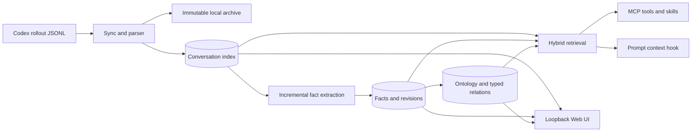

# Memex

[](CHANGELOG.md)
[](https://developers.openai.com/codex/)
[](package.json)
[](LICENSE)

> Collect scattered Codex conversations, distill durable knowledge, connect it,
> index it, and bring the right memory back when it matters.

Memex is a local-first personal knowledge system for Codex. It turns local
rollout sessions into a searchable conversation archive, durable facts, an
ontology-backed knowledge graph, and bounded context that Codex can reuse in
later work.

[한국어 README](README-KR.md) · [Documentation](docs/README.md) ·
[Install and operations](docs/GUIDE.md) · [Architecture](docs/ARCHITECTURE.md) ·
[Schema](docs/SCHEMA.md)

Memex is an independent Codex-native project derived from the MIT-licensed
[`jung-wan-kim/memory-bank`](https://github.com/jung-wan-kim/memory-bank),
which descends from
[`obra/episodic-memory`](https://github.com/obra/episodic-memory). It preserves
the knowledge-system capabilities, not Claude Code compatibility code. See
[lineage](docs/LINEAGE.md).

## Why 0.1.0?

`0.1.0` is the right first public release. The feature set is substantial and
tested, but the repository is newly independent and its Codex marketplace,
host-adapter, and installation contracts may still change before a stable
`1.0.0`. Version `1.0.0` will mean those public contracts are intentionally
stable, not merely that many features exist.

## Features

- Semantic, FTS5/BM25, and hybrid search over Codex conversation history
- Deterministic full-history analysis without an LLM call
- Incremental fact extraction, confidence gates, consolidation, revisions, and provenance
- Domain/category ontology and typed knowledge-graph relations
- Project, global, and explicitly requested all-project scope isolation
- 1–3 hop graph traversal and cross-project insights
- Bounded RAG context injection with relevance and per-session deduplication
- Transparent bounded reads for compressed `.jsonl.zst` archives
- Nine MCP tools for conversations, facts, ontology, graph, and provenance
- Three Codex skills for recall, history analysis, and dashboard workflows
- Loopback-only Web UI with facts, pipeline health, and a 3D Knowledge Galaxy
- Codex-native SessionStart, UserPromptSubmit, and SessionEnd hooks

## Architecture at a glance



Source rollouts are read-only. Archives, SQLite/FTS/vector indexes, facts, and
graph data are derived local state. Model-backed work runs through an isolated,
ephemeral local `codex exec`; there is no Claude fallback or separate API-key
provider.

For the detailed mechanisms, see:

- [System architecture](docs/ARCHITECTURE.md)
- [Conversation lifecycle](docs/CONVERSATION-LIFECYCLE.md)
- [Fact lifecycle](docs/FACT-LIFECYCLE.md)
- [Knowledge graph](docs/KNOWLEDGE-GRAPH.md)
- [Retrieval and context injection](docs/RETRIEVAL-AND-CONTEXT.md)
- [MCP and skills](docs/MCP-AND-SKILLS.md)
- [Web UI and 3D visualization](docs/VISUALIZATION.md)

## Requirements

- Node.js 22.15 or newer
- An authenticated Codex CLI
- macOS or Linux for the current hook and Unix-socket runtime

The plugin uses Node's bundled `npx` launcher to resolve the latest runtime from
`BongSuCHOI/memex#main` into npm's isolated cache. It does not clone or build in
your project, install a global package, or write dependencies into the Codex
plugin cache.

## Recommended installation

Install directly from the public repository:

```bash
codex plugin marketplace add BongSuCHOI/memex
codex plugin add memex@memex
```

That is the complete user installation. It installs the plugin manifest, three
skills, MCP declaration, lifecycle hooks, CLI launcher, and UI launcher. The
first runtime call may take longer while `npx` fills its cache with native
SQLite, vector, and embedding dependencies.

### Existing manual marketplace flow

The external marketplace layout remains supported for development and
air-gapped/local testing:

```text
memex-local-marketplace/
├── .agents/plugins/marketplace.json
└── plugins/memex -> /absolute/path/to/memex
```

Point its entry at `./plugins/memex`, register it with
`codex plugin marketplace add /absolute/path/memex-local-marketplace`, install
`memex@<marketplace-name>`. The source installer remains available for local
development validation. The full JSON and rollback behavior remain in
[the operations guide](docs/GUIDE.md#manual-local-marketplace).

## First-run onboarding

After installation, **restart Codex** so the newly installed MCP server, skills,
and plugin-managed hooks are loaded in a fresh session. In-session features
(conversation search, fact extraction/injection, MCP tools) then work without any
further setup. To use the `memex` CLI directly in your terminal, note that plugin
registration alone does not put a `memex` binary on your PATH — run this once to
install a permanent shim (never a global install; PATH is checked and reported):

```bash
npx --yes --package=github:BongSuCHOI/memex#main memex setup --install-cli
```

That creates `~/.local/bin/memex`, which you use for the one-time corpus setup:

```bash
memex setup
memex sync
memex backfill all
memex status
```

`memex setup` checks the effective Codex `memories` feature. When built-in
Memory is enabled, Memex explains the double-memory/conflicting-memory risk and
recommends disabling it. Interactive terminals ask for confirmation; automation
and non-interactive shells never change the setting without the explicit
`memex setup --disable-codex-memory` approval flag. The change uses Codex's own
`codex features disable memories` command and is verified afterward.

What each stage does:

1. `sync` reads existing `$CODEX_HOME/sessions`, archives new rollouts, and
   builds conversation search indexes.
2. `backfill all` runs each backlog stage in order — `extract` distills
   durable facts from already indexed exchanges, `ontology` classifies facts
   and builds graph structure, and `embeddings` fills missing semantic
   vectors. Each stage runs in the foreground by default so completion is
   directly observable; orchestration stops at the first failing stage and is
   idempotent to re-run.
3. `status` reports conversation, fact, and graph readiness separately.

Large histories and local model-backed extraction can take several minutes or
longer. The default foreground mode reports completion directly. If you choose
`--background`, “started” is not “finished”; keep checking `memex status` until
pending counts reach the expected state.

Marketplace installation does not modify source rollouts or derived data before
this onboarding step. `sync` is idempotent and safe to repeat.

## Daily use

```bash
memex sync
memex search "why did we choose SQLite?"
memex search --both "authentication migration"
memex stats
memex analyze --top 30 --out ~/memex-report.md
memex status
```

| Command | Purpose |
| --- | --- |
| `memex setup` | Detect built-in Codex Memory conflict; disable only with approval |
| `memex sync` | Archive and index new Codex rollouts |
| `memex index` | Re-index or verify the local corpus |
| `memex search` | Vector, text, or hybrid conversation search |
| `memex show` | Render one archived conversation |
| `memex stats` | Show corpus and index statistics |
| `memex analyze` | Generate a deterministic full-history report |
| `memex status` | Read pipeline readiness without mutation |
| `memex backfill` | Run extraction, ontology, or embedding backlog work |
| `memex facts` | Inspect and manage durable facts |
| `memex migrate-projects` | Safely re-derive canonical project identities |
| `memex setup-hooks` | Explicit fallback registration for non-plugin installs |
| `memex remove-hooks` | Remove only explicitly registered Memex hook entries |
| `memex doctor` | Diagnose dependencies, build, MCP, and lifecycle state |

## MCP tools and skills

The plugin exposes:

```text
search, read, search_facts, search_ontology, ask_avatar,
trace_fact, explore_graph, cross_project_insights, graph_stats
```

Project-sensitive tools require a canonical absolute project path or explicit
`global`/`all` scope. The MCP process never guesses scope from its own cwd.
See [MCP and skills](docs/MCP-AND-SKILLS.md) for schemas and examples.

## Local Web UI

```bash
npx --yes --package=github:BongSuCHOI/memex#main memex-ui
# http://localhost:3847
```

Routes:

- `/` — conversations, projects, search, and exchanges
- `/facts` — facts, revisions, provenance, and guarded mutations
- `/graph` — scoped live 3D knowledge graph
- `/pipeline` — readiness and backlog health

The server binds only to loopback. See [visualization](docs/VISUALIZATION.md).

## Updates

Preview, then update the Git marketplace snapshot and reinstall the plugin:

```bash
memex update --dry-run
memex update
```

The runtime launcher already follows the latest `main`; `memex update` refreshes
the marketplace snapshot too, so updated skills, hooks, and MCP metadata are
installed together. Restart Codex afterward. Durable Memex data is preserved.

## Recall provenance and self-ingestion safety

Memex records hook recalls as durable, per-event `memex_recall` receipts keyed
by session and human-prompt hash. Memex MCP retrieval results are classified the
same way. Provenance is evidence-level, not turn-level: human assertions and
allowlisted local repository, Git-history, and test-execution results remain
learnable even beside a recall; Memex results, external/unknown tool output, and
assistant-generated synthesis do not. The complete exchange remains searchable.
This prevents “recall → agent echo → new fact → recall” amplification while
preserving evidence-backed fact evolution.

## Uninstall

Plugin-managed hooks disappear when the plugin is removed. If an older/manual
installation used `setup-hooks`, remove only those fingerprinted entries
before deleting the plugin:

```bash
npx --yes --package=github:BongSuCHOI/memex#main memex remove-hooks --dry-run
npx --yes --package=github:BongSuCHOI/memex#main memex remove-hooks
codex plugin remove memex@memex --json
codex plugin marketplace remove memex --json
```

Uninstalling preserves both `$CODEX_HOME/sessions` and Memex's derived data.
To wipe Memex data entirely, run `memex home` to resolve the exact data root,
then remove that directory — never touch `$CODEX_HOME/sessions`. See
[the operations guide](docs/GUIDE.md#uninstall-and-data-retention) for the full
data-deletion walkthrough including partial reset options.

## Data and privacy

The default derived data root is `~/.config/memex`. Resolution order:

1. `MEMEX_HOME`
2. `$XDG_CONFIG_HOME/memex`
3. `~/.config/memex`

Memex uses this canonical storage namespace only; the source Codex rollouts
remain read-only.
See [schema](docs/SCHEMA.md) and [security boundaries](docs/ARCHITECTURE.md).

## Verification

```bash
npm run typecheck
npm run build
npm test
npm run test:marketplace
npm run test:package
node --test test/codex-slice.test.mjs
node --test test/*slice.test.mjs
node scripts/validate-plugin.mjs
```

Codex CLI 0.149.1 does not expose `codex plugin validate`; the repository
records that version boundary and runs an isolated installed-artifact
substitute instead. Current receipts and remaining limits are documented in
[verification](docs/VERIFICATION.md).

## Contributing

Clone and build only for development or contribution:

```bash
git clone https://github.com/BongSuCHOI/memex.git
cd memex
npm ci
npm run build
npm test
```

Read [AGENTS.md](AGENTS.md) for product invariants, ownership boundaries, and
required checks. When behavior changes, update the owner document identified in
[the documentation map](docs/README.md) in the same change.

## License

MIT. Upstream attribution and third-party notices are in
[docs/LINEAGE.md](docs/LINEAGE.md) and
[THIRD_PARTY_NOTICES.md](THIRD_PARTY_NOTICES.md).
