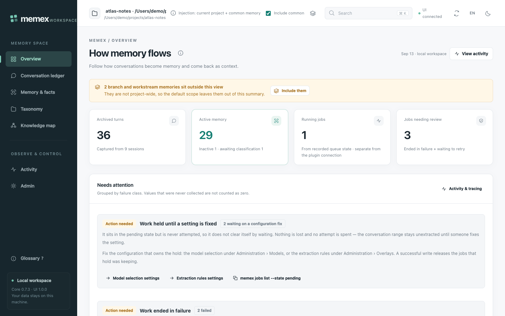
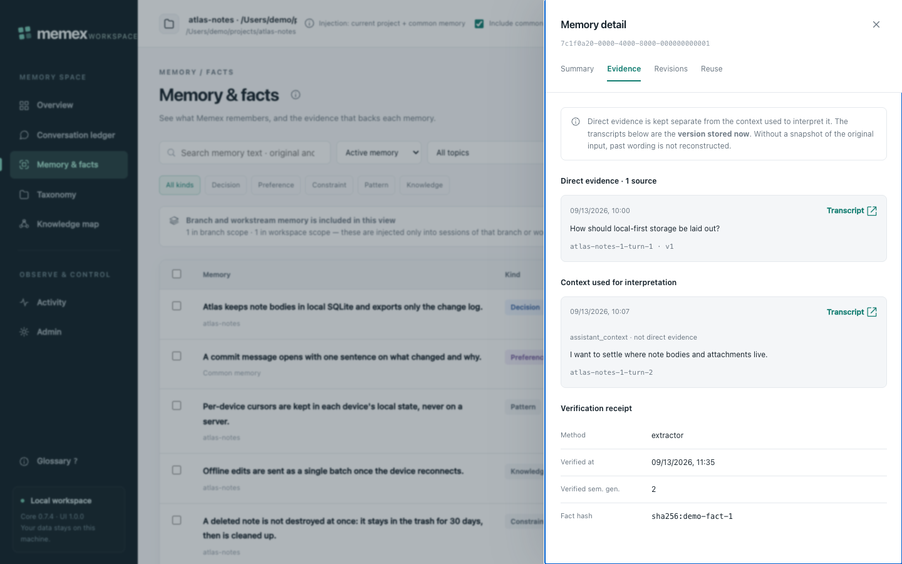
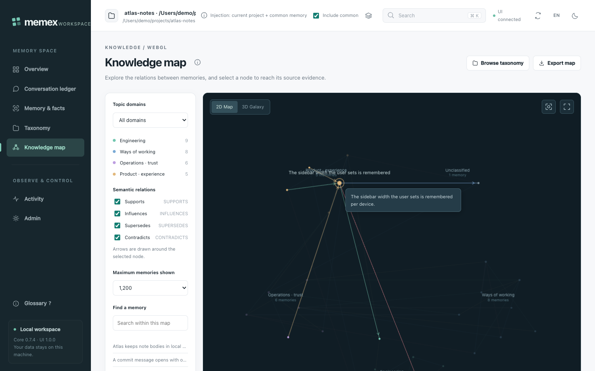
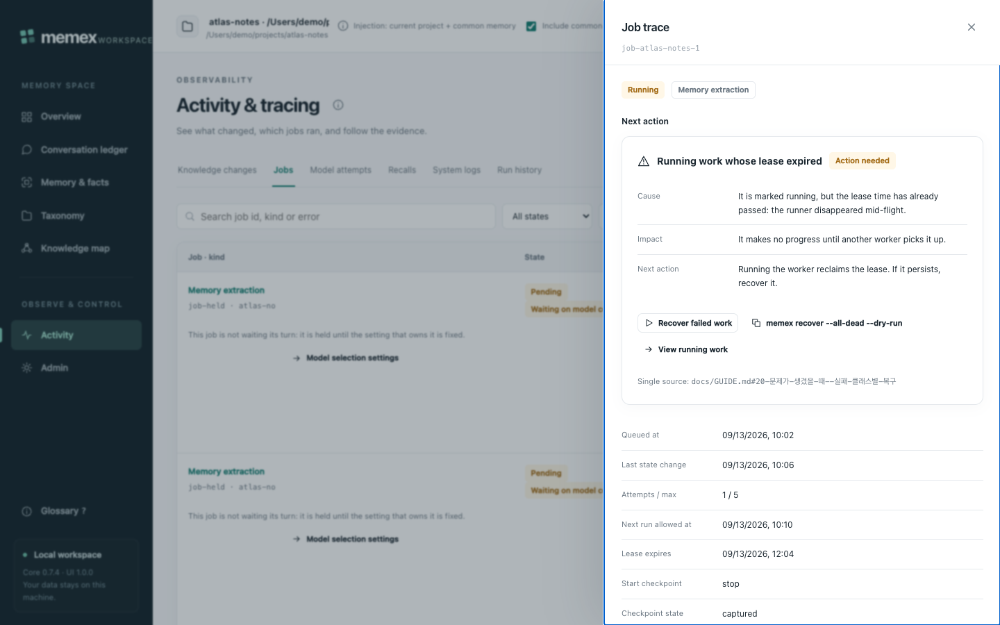
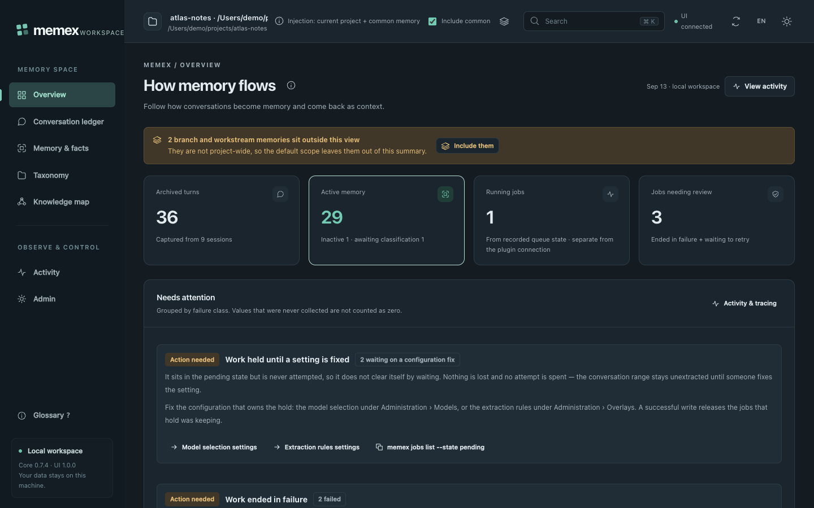
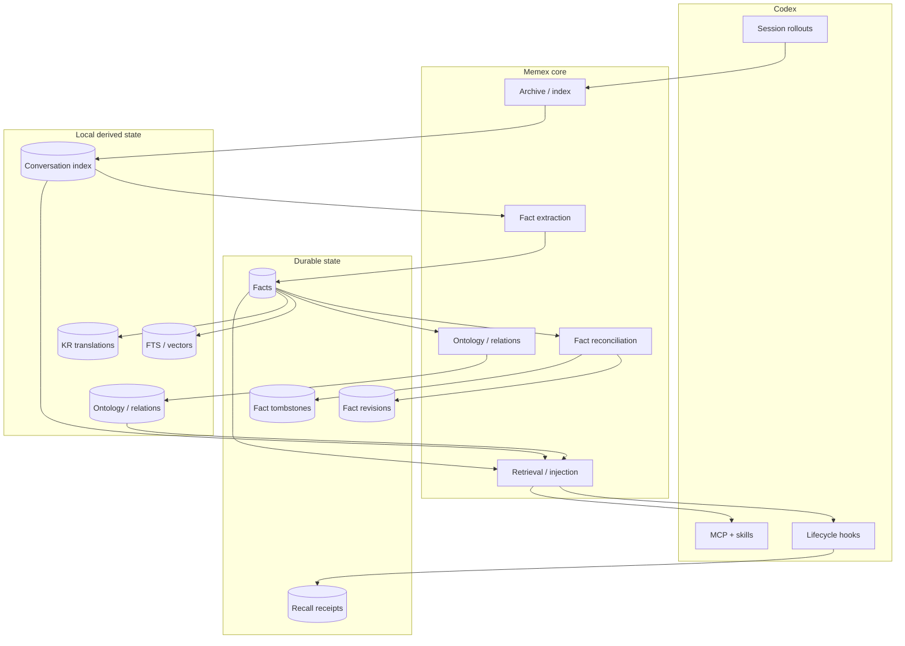

# Memex

[](CHANGELOG.md)
[](https://developers.openai.com/codex/)
[](package.json)
[](LICENSE)

> A local-first long-term memory layer for Codex: collect conversations, distill durable facts, connect them, and bring the right context back when it matters.



Memex turns local Codex session history into a searchable conversation archive, durable facts, a scoped knowledge graph, and bounded context that can be recalled in later work. It is designed as a **memory system**, not a second agent — Codex remains the working agent; Memex provides the persistent layer around it.

[한국어 README](README-KR.md) · [Documentation](docs/README.md) · [Operations guide](docs/GUIDE.md) · [Architecture](docs/ARCHITECTURE.md) · [Verification](docs/VERIFICATION.md)

### What it does

- **Archives conversations** — searchable snapshots of Codex rollouts, with hybrid semantic + FTS5/BM25 retrieval, without modifying the originals.
- **Distills durable facts** — reusable decisions, preferences, patterns, knowledge, and constraints, each bound to the exchange that proves it.
- **Tracks how facts evolve** — duplicate consolidation, contradictions, revisions, deactivation, restoration, and provenance.
- **Connects and recalls** — classifies facts into domains/categories with typed relations, and injects small, relevance-gated memory blocks into later Codex prompts.
- **Takes your rules** — a local overlay adds your own regexes and words to the recall gate, and your own restrictions to extraction: topics to stay away from and patterns that must never be stored, enforced at the storage boundary rather than suggested in a prompt.
- **Lets you choose the model** — pick the model and reasoning effort Memex uses for its own work; a selection the provider refuses pauses that work instead of failing it, and resumes when you fix it.
- **Shows its work** — a loopback Web UI in English or Korean, nine MCP tools, and durable multi-device sync of fact state only.

---

## Why Memex

**Local-first.** Source Codex rollouts stay read-only. The primary database, indexes, derived graph, and operational logs live under the local Memex data root; the archive and DB are a rebuildable local layer.

**Evidence-bound memory.** A fact is not a summary. `source_exchange_ids` holds only exact authoritative human or trusted local-tool exchanges; the separate local `fact_context_dependencies` records the long-range non-authoritative context needed to *interpret* a fact and is never promoted to authority. The Web UI and `trace_fact` render the two lanes apart.

**Honest observability.** Missing data is reported as not-collected, never folded into `0`: unobserved token usage reads `null` / `NOT_PROVEN`, partially observed reads `partial`. "Context was provided" is recorded as exactly that, and is not evidence that the model used it in its answer.

**No model work without an explicit action.** Capture hooks perform bounded local I/O only. Opening a Web UI page never starts model work; automatic maintenance resumes unfinished work only when its cooldown and shared rolling call cap permit.

**Project isolation.** Memex resolves the canonical absolute `session_meta.cwd` to a local workspace and uses a stable `project_id` for logical identity. Search, related facts, tracing, and every graph hop share the same scope, and the MCP server never infers project identity from its own process cwd. A cwd that cannot name a project (`/`, `unknown`, or any path with an empty basename) is refused rather than bucketed: that session reads global memory only.

**Memory tiers, not one flat pile.** Inside a Git project the directory is the project and the branch is the tier: work on the default branch is project-common memory, work on any other branch or worktree stays in its own branch tier, and a one-rung ladder (`branch ⇄ project-common ⇄ global`) moves a memory up or down with an explicit record of who moved it and why. A plain directory has no branch layer at all. See [Scope and memory tiers](#scope-and-memory-tiers).

See [ARCHITECTURE.md](docs/ARCHITECTURE.md), [FACT-LIFECYCLE.md](docs/FACT-LIFECYCLE.md), and [WEBUI-WORKSPACE.md](docs/WEBUI-WORKSPACE.md).

---

## Quick start

**Requirements** — Node.js 22.15+, an authenticated Codex CLI, and macOS or Linux for the current hook / Unix-socket runtime.

```bash
# 1. install the plugin, then restart Codex so hooks, skills and the MCP server load
codex plugin marketplace add BongSuCHOI/memex
codex plugin add memex@memex

# 2. optional: a `memex` command in your own terminal (creates ~/.local/bin/memex,
#    not a global npm install)
npx --yes --package=github:BongSuCHOI/memex#main memex setup --install-cli

# 3. prepare the existing Codex history
memex setup          # check for conflicts with Codex built-in Memory
memex sync           # archive and index eligible $CODEX_HOME/sessions rollouts
memex backfill all   # durable fact extraction, ontology, missing embeddings
memex status         # readiness and remaining backlog

# 4. open the local workspace at http://127.0.0.1:3847
npx --yes --package=github:BongSuCHOI/memex#main memex-ui

# 5. ask for something you already worked on — in Codex, the bundled skills
#    reach for the Memex MCP tools; the same lookup from a shell is:
memex search "why did we choose SQLite?"
```

`memex setup` never disables Codex built-in Memory without explicit approval. All backfill stages are idempotent.

Memex uses native SQLite, vector, and embedding dependencies. Installation materializes them beside the plugin and the launcher runs that same installed artifact first; an isolated npm cache is used only for the MCP server and for the `npx` fallback that a not-yet-materialized plugin registration takes. Neither path installs dependencies into your project or requires a source checkout for normal use.

For local marketplace development and source-based validation, see the [operations guide](docs/GUIDE.md).

---

## Web UI

The workspace is plain server-side CommonJS plus ES modules served to the browser — no separate frontend build and no extra npm package. It binds to `127.0.0.1` only, validates `Host`/`Origin`, and requires a CSRF token for writes. Fact mutations use the same transactional service as the CLI. Set `PORT` to use another port.

```bash
npx --yes --package=github:BongSuCHOI/memex#main memex-ui
# http://127.0.0.1:3847
```

| Page | Covers |
| --- | --- |
| `/` overview | pipeline readiness, recent memory changes, activity |
| `/conversations` conversation ledger | sessions, exchanges, source text |
| `/facts` memory & facts | facts, revisions, authoritative provenance, interpretive context, guarded edit/deactivate/restore/delete, and one-rung tier promote/demote; a tier badge on every row and a banner for branch-tier memory the project scope hides |
| `/taxonomy` classification | ontology domains and categories |
| `/graph` knowledge map | WebGL 2D/3D relation graph with a Canvas2D fallback |
| `/activity` chronicle | jobs, model attempts, recalls, logs, admin runs — each with a "Next action" column derived from the failure-class table in [GUIDE §20](docs/GUIDE.md#20-문제가-생겼을-때--실패-클래스별-복구) (Korean) |
| `/settings` administration | runtime, admin commands, cross-device sync (off by default), display preferences, diagnostics, and two 0.7.0 tabs: **Overlays** (your own recall-gate regexes and extraction restrictions — validate, test against a prompt, simulate the impact, roll back) and **Models** (which model and reasoning effort Memex uses, and any configuration hold pausing model work) |

The workspace ships in **English** and can switch to Korean: `?lang=ko` in the address, the `EN`/`KO` button in the header, or Administration › Display, each remembered in that browser. `memex-ui --lang ko` (or `MEMEX_UI_LANG=ko`) sets the server default. The documents under `docs/` are Korean only, and the English UI links to the same Korean sections.

Every page carries its own help: an ⓘ next to the title linking the matching section of the docs at this release tag, one-line tooltips on controls, badges and table headers, and a searchable glossary on `?`. Turn it down or off in Administration › Display.

Every page takes an explicit scope: one project, common (global) memory, or all projects. All projects is the default view and is read-only breadth — injection always uses the current project plus common memory, and the scope selector says so permanently. Opening a page never starts model work.



*Memory detail, evidence tab — direct evidence and interpretive context stay in separate lanes, with the verification receipt below them.*



*Knowledge map — fact nodes and typed relations (`SUPPORTS`, `INFLUENCES`, `SUPERSEDES`, `CONTRADICTS`) drawn with browser-native WebGL. Layout encodes domain grouping only; on-screen distance is **not** an embedding-similarity number.*



*Activity · tracking, processing jobs — one durable job expanded down to its extraction target, input versions, and model attempts.*

<details>
<summary>Dark mode</summary>



</details>

The Web UI is not an authentication, TLS, or multi-tenant isolation service; do not port-forward or publicly deploy it. See [WEBUI-WORKSPACE.md](docs/WEBUI-WORKSPACE.md).

---

## How it works



### Fact state model

Sync protocol v5 separates fact state into independent axes:

| Axis | Examples | Merge rule |
| --- | --- | --- |
| **Semantic** | fact text, category, scope | semantic event clock + deterministic tie-break |
| **Lifecycle** | active / inactive | lifecycle event clock; inactive wins exact ties |
| **Lineage** | source exchange IDs, consolidated count | monotonic union / max |
| **Derived overlay** | KR text, ontology, relations, vectors | local-only, rebuildable |

This separation matters because editing a fact and deactivating it are different events. A newer semantic edit must not accidentally undo a newer deactivation, and provenance must never disappear just because another device has an older snapshot. When the semantic axis has to choose between two different meanings, the decision is not silent: the importer appends a local `SYNC_IMPORTED` Chronicle event naming the source device, the generation, and which side won.

### Scope and memory tiers

| Situation | Behavior |
| --- | --- |
| **Git project** | Directory = project. Memory from a default-branch session (`main`/`master`/`origin/HEAD`) → **project-common**. Memory from any other branch or worktree session → an independent **branch tier** keyed on `(project, branch)`, so branches never dilute each other and two worktrees of the same repository checked out on the same branch share one tier and see each other's memory. Injection and lookup = global + project-common + the current branch. |
| **Plain (non-Git) project** | Directory = project, no branch layer. All memory is project-common (+ global). |
| **Plain → Git transition** | `workspace_id` and `project_id` are unchanged; only the workspace metadata is refreshed, plus a `WORKSPACE_LOCATION_CHANGED` event. Existing project-common memory stays exactly as it is, with no data change. The branch rule applies from the next session onward. If you never create a branch, nothing changes. If the new common dir or remote already belongs to another project, nothing is merged automatically: the conflict is recorded on the `WORKSPACE_LOCATION_CHANGED` row as `requires_approval = 1` plus a `suggest` entry in `project_identity_audit`, and the merge waits for an explicit `approved_remote_mappings` approval. |
| **Promotion / demotion** | The ladder is `branch ⇄ project-common ⇄ global`, one rung at a time. Three channels: (1) a user assertion in the Web UI or CLI, (2) evidence-based automation (re-confirmed on another branch or on the default branch → project; confirmed in two or more different projects → global; upper evidence gone → demotion), (3) an explicit in-session request ("remember this for the whole project" → `actor=user-directive`). All three write a Chronicle `PROMOTED`/`DEMOTED`. A personal preference classified as global at extraction time keeps that first classification. |

Channel (1) has both surfaces from 0.6.1: the CLI, and the Web UI's memory detail panel, whose promote/demote buttons call the same `promoteFact`/`demoteFact` service with `actor=user` through `POST /api/v2/facts/promote|demote`. The Web UI's fact-mutation allowlist is `edit|deactivate|restore|delete` plus those two tier moves. The stored column is `facts.promotion_state` (`workstream` = branch tier, `project-current` = project-common, `scope_type = global`) and `facts.tier_reason` records the branch signal (`no-branch-signal` | `default-branch` | `branch:<name>`) that placed it there.

Supported fact/query scopes are **project** (project-wide truth plus global facts where appropriate), **workspace/workstream/session** (the selected work scope and permitted parent truth), **global** (global facts only), and **all** (explicit cross-project access).

Read scope and consolidation permission are separate. Consolidation preserves different tiers and promotion states, adopts only verified input wording, and leaves ambiguous legacy identity for review. Existing data can be [backed up, audited, and selectively repaired](docs/GUIDE.md#16-기억-정합성-감사와-선별-복구) without re-extracting every fact.

Facts extracted before 0.6.0 all sit in the branch tier. `memex facts migrate-tiers --dry-run` lists the ones the new rule would make project-common; `--apply` moves them.

### Recall without self-training loops

Recalled memory must not become fresh evidence merely because Codex repeated it. Memex distinguishes human assertions, trusted local repository / Git / test observations, external or unverifiable tool output, Memex recall, and assistant-generated synthesis. The last two remain searchable but are never treated as new durable fact evidence, which prevents:

```text
old fact → recalled into prompt → assistant repeats it → repeated text extracted as a "new" fact
```

Recall events are recorded as durable provenance receipts before context is emitted.

### Privacy and exclusion

A user-role `DO NOT INDEX` marker excludes the whole conversation from the Memex knowledge corpus. The privacy purge removes or invalidates exchanges and tool-call index state, FTS/vector rows, extraction/recall processing state, facts that depended on the excluded conversation as authoritative evidence or persisted interpretive context, fact-derived revisions/relations/vectors, and the local taxonomy derived from the previous corpus. Facts removed this way receive a terminal privacy tombstone so an older device snapshot cannot resurrect them; surviving public facts are reclassified from the remaining evidence.

### Multi-device sync

Cross-device sync is **off by default** and nothing leaves the machine until it is turned on. Point both machines at one shared folder you own — an iCloud Drive, Dropbox, or Syncthing path — and the durable memory state reconciles between them:

```bash
memex sync enable --dir ~/Library/Mobile\ Documents/com~apple~CloudDocs/memex-sync
memex sync export      # publish this device's first generation
memex sync status      # shared folder, this device, last export, devices seen
memex sync alias "home mini"   # name this device; the name travels in the manifest
```

Afterwards the export runs by itself: a SessionEnd hook (its own entry, 3 s timeout) and the automatic maintenance wake publish a generation whenever the durable state changed since the last one, and SessionStart imports the peers'. `MEMEX_SYNC_DIR` overrides the configured folder; the on/off switch is local state in `<data root>/sync/config.json` and never travels. `memex sync disable` turns every one of those paths back into a one-line no-op. Memories in the shared folder are plaintext JSONL — encryption is out of scope, so use a cloud folder that is yours.

**No shared folder?** Hand one generation over as a file. It is the same protocol-v5 generation in a zip, so it gets the same validation:

```bash
memex sync export --archive          # writes <data root>/sync/exports/<device>-<generation>.zip
memex sync import --archive ~/Downloads/<device>-<generation>.zip --dry-run   # validate + preview
memex sync import --archive ~/Downloads/<device>-<generation>.zip
```

The Web UI sync tab does the same thing (it shows the written path instead of downloading, since the loopback UI does not serve browser downloads) and always runs validate → preview → confirm. A device's own archive is refused rather than replayed onto itself. When an import finds the same memory with a different meaning on both sides, the decision is recorded as a local Chronicle `SYNC_IMPORTED` event — which device's generation it came from and which side won — visible in the UI's knowledge-change timeline and in the memory's own history. That event is local provenance and is never exported.

Protocol v5 exports one committed generation per local device, containing `facts.jsonl`, `fact-revisions.jsonl`, `fact-tombstones.jsonl`, `recall-events.jsonl`, and a `meta.json` recording the protocol version, device/generation identity, row counts, and SHA-256 integrity for each payload file. Imports pin and validate an entire generation before mutating SQLite: missing files, hash mismatches, invalid JSON, or schema-invalid rows reject that device generation as a whole. Local exporters are serialized with SQLite's process-owned `BEGIN IMMEDIATE` transaction, so a slower export cannot move `CURRENT` back to an older snapshot and no cloud-synced lockfile is required. KR translations, ontology categories, relations, and vector indexes are rebuilt locally instead.

| Memory tier | Travels | On the receiving device |
| --- | --- | --- |
| Global | yes | injected everywhere |
| Project-common (`legacy-project`, `project-current`, `decision`) | yes | injected in that project |
| Workspace | yes, with its `workspace_id` | not injected — a workspace id is device-local |
| Branch / workstream | yes, with `workstream_id`, `tier_reason` and the branch name | injected only while that device is on the same branch of the same project (`workstream_id` is `hash(project_id, branch)`, so it matches) |

Every promotion state travels, so fact tombstones — which carry no tier of their own — describe exactly the same population as the exported facts. A project-wide promotion (`project-current` / `decision`) always arrives with its workspace and branch keys cleared, the same invariant the local writer enforces; a `promotion_state` this version does not know is reported as a malformed row and rejects its generation instead of being flattened into project scope. Protocol v4 generations still import; a v4 peer rejects a v5 generation rather than mis-reading it.

Deep dives: [ARCHITECTURE.md](docs/ARCHITECTURE.md) · [CONVERSATION-LIFECYCLE.md](docs/CONVERSATION-LIFECYCLE.md) · [FACT-LIFECYCLE.md](docs/FACT-LIFECYCLE.md) · [RETRIEVAL-AND-CONTEXT.md](docs/RETRIEVAL-AND-CONTEXT.md) · [SCHEMA.md](docs/SCHEMA.md)

---

## Usage

```bash
memex search "why did we choose SQLite?"
memex search --text "ERR_MODULE_NOT_FOUND"     # exact string, no embedding
memex facts list
memex stats
memex analyze --top 30 --out ~/memex-report.md
memex status
```

| Command | Purpose |
| --- | --- |
| `memex setup` | Check for a conflict with Codex built-in Memory; `--install-cli` / `--uninstall-cli` manage the `~/.local/bin/memex` shim |
| `memex install` | Register the plugin and materialize its runtime dependencies (idempotent); `--root` targets an explicit installed plugin root |
| `memex deps materialize` | Install the runtime dependencies into the resolved installed plugin root (`npm install --omit=dev --no-audit --no-fund`), then warm the embedding model cache when it is empty; `--root`, `--dry-run`, `--force`, `--no-warm`, `--json` |
| `memex deps warm` | Download the embedding model into the stable cache (`<data root>/models`) so the first prompt does not pay the 129 MB; `--force`, `--json` |
| `memex setup-hooks` / `memex remove-hooks` | Register or remove Memex-owned lifecycle hooks (explicit fallback hosts only) |
| `memex update` | Refresh the marketplace/plugin while preserving data; `--marketplace <name>`, `--no-materialize`, `--no-warm` |
| `memex sync` | Archive and index new Codex rollouts; `--background` |
| `memex sync enable\|disable\|status\|export\|import` | Cross-device sync switch (OFF by default), shared folder (`--dir`), status, manual export (`--force`) / import; `--json` |
| `memex sync export --archive [<path.zip>]` | Write one generation as a zip to carry by hand (works with sync off) |
| `memex sync import --archive <path> [--dry-run]` | Import a received generation zip or directory; `--dry-run` validates and previews |
| `memex sync alias <name\|--clear> [--device <id>]` | Name a device; this device's name travels in every generation manifest |
| `memex index` | Index, verify, repair, or rebuild the conversation index: `--cleanup`, `--session <id>`, `--verify`, `--repair`, `--rebuild`, `--concurrency N`, `--no-summaries` |
| `memex search` | Semantic, text, or hybrid conversation search |
| `memex show` | Read one archived conversation |
| `memex stats` | Inspect corpus/index statistics |
| `memex analyze` | Generate a deterministic history report |
| `memex facts` | Inspect and manage durable facts: `list\|show\|edit\|deactivate\|restore\|history\|explain\|delete`; `list --all` includes inactive facts (`--limit`, `--offset`), `edit --source-exchange <id>` names the evidence |
| `memex facts tier\|promote\|demote` | Inspect or move a memory on the `workstream ⇄ project ⇄ global` ladder, one rung at a time |
| `memex facts migrate-tiers` | List (`--dry-run`) or apply (`--apply`) the 0.6.0 default-tier back-fill |
| `memex backfill` | Run backlog work explicitly: `all\|extract\|ontology\|embeddings\|receipts`; `--background` |
| `memex ontology` | Inspect and repair the local taxonomy: `list\|merge\|rename` (the taxonomy is no longer append-only) |
| `memex status` | Inspect pipeline readiness (`Ontology: … classified, … parked, … pending`, `facts without local evidence: N / M`, `Derived lanes: skipped …`), `Needs attention`, quarantined projects, and `memory_jobs` by kind × state; `--json` |
| `memex jobs` | Inspect and recover memory jobs: `list\|show\|retry\|dismiss` |
| `memex recover` | Reset terminal (dead) work back to claimable in one transaction; `--all-dead`, `--dry-run` |
| `memex model-work` | Inspect a model-work budget or explicitly resume one; [bounded resume](docs/GUIDE.md#17-모델-작업-예산과-대기-진단) |
| `memex models` | Choose the model and reasoning effort for Memex's own model work: `show\|set\|reset\|test`. `set --model <id> [--reasoning <level>]` (`unset` removes the flag); `test` makes exactly one real call and clears the configuration hold for that selection |
| `memex gate` | Your own recall-gate rules: `show\|patterns\|words\|test\|replay\|validate\|history\|quarantine\|reset\|rollback`. Built-ins are disabled by id, never deleted; writes take `--dry-run` and `--expect-revision <n>` |
| `memex extract` | Your own extraction restrictions — this command does not extract: `rules show\|validate\|set\|test\|history\|reset\|rollback\|reextract`, plus `eval`, the only verb that spends model calls |
| `memex doctor` | Diagnose dependencies, build, hooks, injection output, and recall provenance |
| `memex home` | Print the resolved Memex data root |
| `memex migrate-projects` | Re-derive project identity from cwd evidence (CX-02); `--dry-run` prints the plan and writes nothing |

Every subcommand accepts `--help` / `-h`, prints usage only, and exits `0`; the commands with side effects (`update`, `setup-hooks`, `remove-hooks`, `migrate-projects`, `install`) write nothing when asked for help.

Fact management includes edit, deactivate, restore, history, and guarded hard-delete operations. Semantic edits keep fact identity and revision history while invalidating stale derived state.

Foreground backfill exits `0` only when no processable, active, or unresolved work remains. If a bounded run leaves retryable backlog for a later wake, it reports `completed with deferred work`, prints the post-run count for each selected stage, and exits `2`. Active claims or terminal extraction failures are also reported as outstanding work with exit `2`. A worker failure takes precedence, stops later stages, and exits `1`.

See [GUIDE.md](docs/GUIDE.md) for the complete CLI and lifecycle reference.

### MCP tools and skills

Memex exposes nine MCP tools:

| Tool | Purpose |
| --- | --- |
| `search` | Search past conversations |
| `read` | Read archived source text / line ranges |
| `search_facts` | Search distilled facts |
| `search_ontology` | Browse facts by domain/category |
| `ask_avatar` | Synthesize an answer from stored evidence |
| `trace_fact` | Trace current fact → Chronicle timeline → source evidence |
| `explore_graph` | Traverse 1–3 relation hops |
| `cross_project_insights` | Find comparable solutions in other projects |
| `graph_stats` | Inspect graph size and health |

Project-sensitive tools require either a stable project/workspace/workstream/session ID or a legacy canonical absolute project path, `scope: global`, or `scope: all`.

Three bundled Codex skills cover remembering conversations, analyzing all conversations, and opening the Memex dashboard. See [MCP-AND-SKILLS.md](docs/MCP-AND-SKILLS.md).

### Automatic lifecycle

| Event | Memex behavior |
| --- | --- |
| **SessionStart(startup/resume)** | resolve session state, recover the durable queue, then run independent background sync/import/maintenance |
| **SessionStart(clear/compact)** | advance `context_epoch`; compact immediately returns a bounded Capsule/current-fact bundle |
| **UserPromptSubmit** | scoped retrieval and bounded context injection; separate asynchronous maintenance wake check |
| **Stop** | append only new complete transcript bytes and commit a closed-turn fence |
| **Interrupt** | append delta and preserve an interrupted/open fence |
| **PreCompact** | fsync the journal, freeze carry candidates, and atomically commit checkpoint + outbox |
| **PostCompact** | optional telemetry only; correctness never depends on it |
| **SessionEnd** | final delta + final fence + durable jobs; no foreground model, embedding, extraction, or export. A separate entry on the same event (3 s timeout, the most Codex allows at SessionEnd) publishes a cross-device sync generation when sync is on, and is an instant no-op when it is off |

The durable worker queue runs capture indexing first, Work Capsule updates second, and fact/derived work afterward. SessionStart background jobs remain eventually consistent; each writer owns its transaction/CAS safety.

### Data location

Resolution order is `MEMEX_HOME`, then `$XDG_CONFIG_HOME/memex`, then `~/.config/memex`.

```text
~/.config/memex/
├── lifecycle-registration.json         # explicit fallback hook registration
├── conversation-archive/
│   └── <project>--<hash>/              # archived rollouts (.jsonl) and summaries
├── conversation-index/
│   ├── db.sqlite                       # (+ -wal, -shm)
│   ├── exclude.txt
│   ├── inject-daemon.sock
│   ├── logs/
│   │   └── inject-context.jsonl        # (+ .old, rotated at 5 MB)
│   ├── state/
│   │   └── inject-ledger/
│   ├── sync/
│   │   ├── export-status.json
│   │   └── devices/<device>/CURRENT, generations/<id>/
│   └── *.lock, *.log                   # backfill / consolidate / reembed workers
├── sync/
│   ├── config.json                     # cross-device sync switch + shared folder (off by default)
│   ├── devices.json                    # device id → human name (local, never shared)
│   └── exports/<device>-<generation>.zip   # generations written for hand-carrying
├── journals/<session>/<epoch>.jsonl    # rolling transcript journal
├── run-locks/
├── ui/
│   └── operations.json
└── logs/
    ├── hook-events.jsonl
    └── ui-audit.jsonl
```

`ui/operations.json` keeps metadata for admin commands the Web UI ran, and `logs/ui-audit.jsonl` is its audit trail; both record metadata only, never conversation text, fact text, or command output. `logs/hook-events.jsonl` records only the event name and timestamp of each observed lifecycle hook. `conversation-index/logs/inject-context.jsonl` records one line per retrieval — status, counts, and duration, not prompt or fact text. `conversation-archive/` and `journals/` do hold real conversation text, so treat them as sensitive. The original `$CODEX_HOME/sessions` rollouts are always treated as read-only input. Run `memex home` (or `memex home --json`) before deleting or moving Memex data.

---

## Configuration

| Variable | Effect |
| --- | --- |
| `MEMEX_HOME` | Memex data root; highest-precedence override |
| `XDG_CONFIG_HOME` | Fallback root: `$XDG_CONFIG_HOME/memex` |
| `MEMEX_DB_PATH` | Overrides the index DB path independently of the data root |
| `CODEX_HOME` | Codex home; `$CODEX_HOME/sessions` is the read-only rollout source |
| `MEMEX_SYNC_DIR` | Cross-device shared folder; overrides the folder stored by `memex sync enable --dir` (default `<data root>/conversation-index/sync`) |
| `MEMEX_AUTO_ONTOLOGY` | Automatic ontology is on unless this is set to something other than `1` (an empty value still counts as on) |
| `MEMEX_STRICT_CAPTURE` | `1` makes a capture hook fail instead of recording a capture gap |
| `MEMEX_CAPSULE_MAX_CHARS` | Bounded storage size for one Work Capsule generation (default `12000`, floor `2000`); an oversized patch is truncated by priority and recorded, never dropped |
| `MEMEX_INJECT_BASELINE_MARGIN` | Relevance margin a fact must clear over the prompt's background baseline to be injected (default `0.045`, 0-1); measure first with the `baseline_margin_gap` telemetry metric |
| `MEMEX_CODEX_MODEL` / `MEMEX_CODEX_REASONING` | The model and reasoning effort for Memex's own model work; both win over `<data root>/models.json`, which wins over the built-in default (`gpt-5.6-luna`, no reasoning flag). An unknown reasoning level is warned about and ignored; a model id is not shape-checked here, so a typo surfaces as a provider refusal |
| `MEMEX_OVERLAY_DIR` / `MEMEX_DISABLE_OVERLAYS` | Where the user overlays live (default `<data root>/overlays`) and a switch that reads none of them (`1` only) |
| `MEMEX_UI_LANG` | Server default language for the Web UI, `en` (default) or `ko`; `memex-ui --lang` wins over it and an unknown value fails startup |
| `PORT` | Web UI port (default `3847`) |

Automatic ontology stays available through manual `memex backfill ontology`, and existing derived data and core embeddings remain in place when it is disabled.

The model selection and the user overlays are **local to one machine** and never enter a sync generation, because the set of usable models and the rules you want differ per device. Sharing overlays between machines, switching the embedding model, and overriding the gate thresholds are all deferred to 0.7.1.

Model work is budgeted per run ([GUIDE §17](docs/GUIDE.md#17-모델-작업-예산과-대기-진단)):

| Setting | Default | Actual limit |
| --- | --- | --- |
| `MEMEX_MODEL_BUDGET_MAX_ATTEMPTS` | `64` | provider attempts within one work run |
| `MEMEX_MODEL_BUDGET_DEADLINE_MS` | `900000` | deadline for the whole run |
| `MEMEX_CODEX_EXEC_TIMEOUT_MS` | `180000` | per-call timeout; never longer than the run's remaining time |
| `MEMEX_MODEL_BUDGET_MAX_INPUT_CHARS` | `120000` | UTF-16 characters of call input |
| `MEMEX_MODEL_BUDGET_MAX_OUTPUT_CHARS` | `16000` | characters of the final answer; domain schema/field validation applies on top |
| `MEMEX_AUTO_MODEL_MAX_ATTEMPTS` | `256` | shared 24-hour call cap for automatic maintenance in one data root; `0` blocks it |

Token counts are provider observations. Unobserved usage is `null` / `NOT_PROVEN` and partially observed usage is `partial`; missing usage and dollar cost are never estimated as zero.

Optional Korean fact translations (`fact_kr`) are local derived state, intentionally not synced and not generated on every session, so lifecycle hooks never pay translation-model cost. From a source checkout they can be filled manually with `node scripts/translate-facts.mjs`, which records a translation only if the fact meaning is unchanged since the request began.

---

## Verification and releases

The repository keeps the release gate separate from implementation commits. The current verified code baseline is recorded in [`docs/verification/merge-gate.json`](docs/verification/merge-gate.json), which holds the committed candidate SHA, environment, exact gate results, hard-safety results, and any retained notes. Do not infer current verification from numbers copied into an owner document.

A required gate is FAIL if any required item is FAIL; unobserved behavior is never marked PASS by inference. For the full acceptance model, version boundaries, and retained machine receipts, see [VERIFICATION.md](docs/VERIFICATION.md).

---

## Contributing

```bash
git clone https://github.com/BongSuCHOI/memex.git
cd memex
npm install
npm run build          # tsc + esbuild bundle
npm test               # vitest
npm run typecheck
node --test ui/test/*.test.cjs          # Web UI service/HTTP contracts
node scripts/web-ui-browser-e2e.mjs     # real headless-Chrome UI gate
MEMEX_PLUGIN_ROOT="$PWD" node ui/server.cjs   # run the Web UI from a checkout
```

Read [AGENTS.md](AGENTS.md) before changing behavior — it defines repository invariants, verification rules, and documentation ownership. When a public command, persisted field, lifecycle rule, MCP schema, or release contract changes, update its owner document in the same change.

The documentation set is organized by ownership rather than as one large manual; start from [docs/README.md](docs/README.md).

| Document | Covers |
| --- | --- |
| [GUIDE.md](docs/GUIDE.md) | installation, onboarding, CLI, lifecycle, uninstall |
| [ARCHITECTURE.md](docs/ARCHITECTURE.md) | system boundaries and end-to-end flow |
| [CONVERSATION-LIFECYCLE.md](docs/CONVERSATION-LIFECYCLE.md) | rollout parsing, archive/index, sync protocol |
| [FACT-LIFECYCLE.md](docs/FACT-LIFECYCLE.md) | extraction, consolidation, semantic/lifecycle state |
| [KNOWLEDGE-GRAPH.md](docs/KNOWLEDGE-GRAPH.md) | ontology, relations, traversal |
| [RETRIEVAL-AND-CONTEXT.md](docs/RETRIEVAL-AND-CONTEXT.md) | search, RAG, context injection |
| [SCHEMA.md](docs/SCHEMA.md) | SQLite schema and transaction invariants |
| [MCP-AND-SKILLS.md](docs/MCP-AND-SKILLS.md) | MCP tools and bundled skills |
| [WEBUI-WORKSPACE.md](docs/WEBUI-WORKSPACE.md) | local Web UI pages, scope model, knowledge map |
| [CONTINUITY.md](docs/CONTINUITY.md) | lifecycle/journal/outbox/worker, Capsule, identity, Chronicle as built |
| [VERIFICATION.md](docs/VERIFICATION.md) | tests, E2E gates, release evidence |
| [LINEAGE.md](docs/LINEAGE.md) | upstream attribution and project lineage |

---

## Lineage and license

Memex is an independent Codex-native project derived from the MIT-licensed [`obra/episodic-memory`](https://github.com/obra/episodic-memory) and [`jung-wan-kim/memory-bank`](https://github.com/jung-wan-kim/memory-bank). It preserves the knowledge-system ideas while replacing the previous host adapter with Codex-native rollout, hook, plugin, MCP, and model-execution contracts. See [LINEAGE.md](docs/LINEAGE.md) and [THIRD_PARTY_NOTICES.md](THIRD_PARTY_NOTICES.md).

MIT. See [LICENSE](LICENSE).
