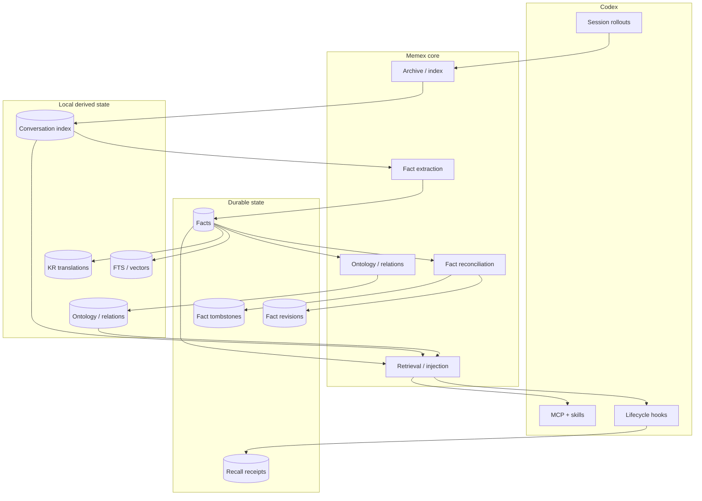

# Memex

[](CHANGELOG.md)
[](https://developers.openai.com/codex/)
[](package.json)
[](LICENSE)

> A local-first long-term memory layer for Codex: collect conversations, distill durable facts, connect them, and bring the right context back when it matters.

Memex turns local Codex session history into a searchable conversation archive, durable facts, a scoped knowledge graph, and bounded context that can be recalled in later work.

It is designed as a **memory system**, not a second agent. Codex remains the working agent; Memex provides the persistent layer around it.

[한국어 README](README-KR.md) · [Documentation](docs/README.md) · [Operations guide](docs/GUIDE.md) · [Architecture](docs/ARCHITECTURE.md) · [Verification](docs/VERIFICATION.md)

---

## What Memex does

Memex builds several layers from your local Codex history:

- **Conversation archive** — preserves searchable snapshots of Codex rollouts without modifying the originals.
- **Hybrid retrieval** — semantic vector search plus FTS5/BM25 text search.
- **Durable facts** — extracts reusable decisions, preferences, patterns, knowledge, and constraints.
- **Fact evolution** — tracks duplicate consolidation, contradictions, revisions, deactivation, restoration, and provenance.
- **Knowledge graph** — classifies facts into domains/categories and creates typed relations.
- **Context recall** — injects small, relevance-gated memory blocks into later Codex prompts.
- **MCP tools and skills** — exposes conversations, facts, graph traversal, provenance, and analysis to Codex.
- **Local Web UI** — provides conversation browsing, fact management, pipeline health, and a 3D Knowledge Galaxy.
- **Multi-device durable sync** — reconciles fact state across devices without syncing local derived overlays.

Memex is intentionally **local-first**. Source Codex rollouts remain read-only, and the primary database, indexes, derived graph, and operational logs live under the local Memex data root.

---

## Architecture



### Fact state model

Sync protocol v4 separates fact state into independent axes:

| Axis | Examples | Merge rule |
| --- | --- | --- |
| **Semantic** | fact text, category, scope | semantic event clock + deterministic tie-break |
| **Lifecycle** | active / inactive | lifecycle event clock; inactive wins exact ties |
| **Lineage** | source exchange IDs, consolidated count | monotonic union / max |
| **Derived overlay** | KR text, ontology, relations, vectors | local-only, rebuildable |

This separation matters because editing a fact and deactivating it are different events. A newer semantic edit must not accidentally undo a newer deactivation, and provenance must never disappear just because another device has an older snapshot.

Multi-device sync therefore carries only durable state:

```text
facts
fact revisions
fact tombstones
recall events
```

KR translations, ontology categories, relations, and vector indexes are rebuilt locally.

See [Architecture](docs/ARCHITECTURE.md), [Fact lifecycle](docs/FACT-LIFECYCLE.md), and [Conversation lifecycle](docs/CONVERSATION-LIFECYCLE.md) for the full contracts.

---

## Requirements

- **Node.js 22.15+**
- An authenticated **Codex CLI**
- **macOS or Linux** for the current hook / Unix-socket runtime

Memex uses native SQLite, vector, and embedding dependencies. The installed plugin launches the runtime through an isolated npm cache; it does not install dependencies into your project or require a source checkout for normal use.

---

## Install

Recommended public installation:

```bash
codex plugin marketplace add BongSuCHOI/memex
codex plugin add memex@memex
```

Restart Codex after installation so new hooks, skills, and the MCP server are loaded.

If you also want the `memex` command available directly in your terminal, install the lightweight CLI shim once:

```bash
npx --yes --package=github:BongSuCHOI/memex#main memex setup --install-cli
```

This creates `~/.local/bin/memex`; it is not a global npm install.

For local marketplace development and source-based validation, see the [operations guide](docs/GUIDE.md).

---

## First-time setup

Prepare the existing Codex history:

```bash
memex setup
memex sync
memex backfill all
memex status
```

What these commands do:

1. **`memex setup`** checks for conflicts with Codex built-in Memory. Memex never disables it without explicit approval.
2. **`memex sync`** reads `$CODEX_HOME/sessions`, archives eligible rollouts, and builds the conversation corpus.
3. **`memex backfill all`** runs durable fact extraction, ontology classification, and missing semantic embedding work.
4. **`memex status`** reports readiness and remaining backlog.

All backfill stages are designed to be idempotent.

### Optional Korean fact translations

`fact_kr` is local derived state and is intentionally **not** synced or automatically generated on every session. This avoids paying translation-model cost during normal lifecycle hooks.

For a source checkout, translations can be filled manually:

```bash
node scripts/translate-facts.mjs
```

The script records translations only if the fact meaning is unchanged since the translation request began. KR vectors are then created by the normal re-embedding maintenance path.

---

## Daily use

```bash
memex search "why did we choose SQLite?"
memex search --both "authentication migration"
memex facts list
memex stats
memex analyze --top 30 --out ~/memex-report.md
memex status
```

Common commands:

| Command | Purpose |
| --- | --- |
| `memex sync` | Archive and index new Codex rollouts |
| `memex search` | Semantic, text, or hybrid conversation search |
| `memex show` | Read one archived conversation |
| `memex stats` | Inspect corpus/index statistics |
| `memex analyze` | Generate a deterministic history report |
| `memex facts` | Inspect and manage durable facts |
| `memex backfill` | Run extraction / ontology / embedding backlog work |
| `memex status` | Inspect pipeline readiness |
| `memex doctor` | Diagnose runtime, plugin, MCP, and lifecycle state |
| `memex update` | Refresh the marketplace/plugin while preserving data |

Fact management includes edit, deactivate, restore, history, and guarded hard-delete operations. Semantic edits keep fact identity and revision history while invalidating stale derived state.

See [GUIDE.md](docs/GUIDE.md) for the complete CLI and lifecycle reference.

---

## Automatic lifecycle

Memex integrates with three Codex lifecycle events:

| Event | Memex behavior |
| --- | --- |
| **SessionStart** | version drift check, background sync, durable sync import, bounded maintenance |
| **UserPromptSubmit** | scoped retrieval, relevance gate, deduplication, bounded context injection |
| **SessionEnd** | rollout stabilization, incremental fact extraction, durable sync export |

SessionStart jobs are intentionally asynchronous and eventually consistent. Each writer is responsible for its own transaction/CAS safety; Memex does not depend on one fixed completion order.

---

## MCP tools and skills

Memex exposes nine MCP tools:

```text
search
read
search_facts
search_ontology
ask_avatar
trace_fact
explore_graph
cross_project_insights
graph_stats
```

Project-sensitive tools require either:

- a canonical absolute project path,
- `scope: global`, or
- `scope: all`.

The MCP server never infers project identity from its own process cwd.

Three bundled Codex skills cover:

- remembering conversations,
- analyzing all conversations,
- opening the Memex dashboard.

See [MCP and skills](docs/MCP-AND-SKILLS.md).

---

## Web UI and Knowledge Galaxy

Start the local UI:

```bash
npx --yes --package=github:BongSuCHOI/memex#main memex-ui
```

Then open:

```text
http://localhost:3847
```

Main routes:

- `/` — projects, conversations, search, exchange details
- `/facts` — facts, revisions, provenance, mutations
- `/graph` — scoped 3D knowledge graph
- `/pipeline` — indexing/backfill readiness

The server binds to loopback only. Fact mutations use the same transactional service as the CLI.

See [Visualization](docs/VISUALIZATION.md).

---

## Scope and provenance

Memex treats the canonical absolute `session_meta.cwd` as project identity.

Supported fact/query scopes are:

- **project** — the selected project plus global facts where appropriate
- **global** — global facts only
- **all** — explicit cross-project access

Cross-project leakage is prevented at query, import, traversal, and relation-write boundaries.

Fact provenance has two separate lanes. `source_exchange_ids` contains only exact authoritative human or trusted local-tool exchanges and is unioned monotonically across sync; `consolidated_count` converges by maximum. Local `fact_context_dependencies` records non-authoritative exchanges needed to interpret a fact; it is canonicalized from semantic-verifier usage, never promoted to authority, and is not part of protocol v4.

---

## Recall without self-training loops

Recalled memory must not become fresh evidence merely because Codex repeated it.

Memex therefore distinguishes:

- human assertions,
- trusted local repository / Git / test observations,
- external or unverifiable tool output,
- Memex recall,
- assistant-generated synthesis.

Memex recall and assistant synthesis remain searchable but are not treated as new durable fact evidence. This prevents a feedback loop such as:

```text
old fact
→ recalled into prompt
→ assistant repeats it
→ repeated text extracted as a "new" fact
```

Recall events are recorded as durable provenance receipts before context is emitted.

See [Retrieval and context](docs/RETRIEVAL-AND-CONTEXT.md) and [Fact lifecycle](docs/FACT-LIFECYCLE.md).

---

## Privacy and exclusion

A user-role `DO NOT INDEX` marker excludes the whole conversation from the Memex knowledge corpus.

The privacy purge removes or invalidates:

- exchanges and tool-call index state,
- FTS/vector rows,
- extraction/recall processing state,
- facts that used the excluded conversation as evidence,
- fact-derived revisions/relations/vectors,
- local taxonomy derived from the previous corpus.

Facts removed for conversation exclusion receive a terminal privacy tombstone so an older device snapshot cannot resurrect them.

Taxonomy is local derived state. After a privacy purge it is invalidated and surviving public facts are reclassified from the remaining evidence.

---

## Data location

Default data root:

```text
~/.config/memex/
```

Resolution order:

1. `MEMEX_HOME`
2. `$XDG_CONFIG_HOME/memex`
3. `~/.config/memex`

Typical layout:

```text
~/.config/memex/
├── conversation-archive/
├── conversation-index/
│   ├── db.sqlite
│   ├── sync/
│   └── logs/
└── logs/
```

The original `$CODEX_HOME/sessions` rollouts are always treated as read-only input.

Use:

```bash
memex home
memex home --json
```

before deleting or moving Memex data.

---

## Multi-device sync

Protocol v4 exports one committed generation per local device.

Each generation contains:

```text
facts.jsonl
fact-revisions.jsonl
fact-tombstones.jsonl
recall-events.jsonl
meta.json
```

`meta.json` records the protocol version, device/generation identity, row counts, and SHA-256 integrity for each payload file.

Imports pin and validate an entire generation before mutating SQLite. Missing files, hash mismatches, invalid JSON, or schema-invalid rows reject that device generation as a whole.

Local exporters are serialized with SQLite's process-owned `BEGIN IMMEDIATE` transaction, so a slower export cannot move `CURRENT` back to an older snapshot and no cloud-synced lockfile is required.

---

## Verification

The repository keeps the release gate separate from implementation commits.

The current verified code baseline is recorded in:

```text
docs/verification/merge-gate.json
```

The receipt records the committed candidate SHA, environment, exact gate results,
hard-safety results, and any retained notes. Do not infer current verification
from numbers copied into an owner document.

For the full acceptance model, version boundaries, and retained machine receipts, see [Verification](docs/VERIFICATION.md).

---

## Documentation

The documentation set is organized by ownership rather than as one large manual:

| Document | Covers |
| --- | --- |
| [GUIDE.md](docs/GUIDE.md) | installation, onboarding, CLI, lifecycle, uninstall |
| [ARCHITECTURE.md](docs/ARCHITECTURE.md) | system boundaries and end-to-end flow |
| [CONVERSATION-LIFECYCLE.md](docs/CONVERSATION-LIFECYCLE.md) | rollout parsing, archive/index, sync protocol |
| [FACT-LIFECYCLE.md](docs/FACT-LIFECYCLE.md) | extraction, consolidation, semantic/lifecycle state |
| [KNOWLEDGE-GRAPH.md](docs/KNOWLEDGE-GRAPH.md) | ontology, relations, traversal |
| [RETRIEVAL-AND-CONTEXT.md](docs/RETRIEVAL-AND-CONTEXT.md) | search, RAG, context injection |
| [SCHEMA.md](docs/SCHEMA.md) | SQLite schema and transaction invariants |
| [MCP-AND-SKILLS.md](docs/MCP-AND-SKILLS.md) | MCP tools and bundled skills |
| [VISUALIZATION.md](docs/VISUALIZATION.md) | Web UI and Knowledge Galaxy |
| [VERIFICATION.md](docs/VERIFICATION.md) | tests, E2E gates, release evidence |
| [LINEAGE.md](docs/LINEAGE.md) | upstream attribution and project lineage |

Start with [docs/README.md](docs/README.md) for the documentation map.

---

## Contributing

For development:

```bash
git clone https://github.com/BongSuCHOI/memex.git
cd memex
npm ci
npm run build
npm test
```

Read [AGENTS.md](AGENTS.md) before changing behavior. It defines repository invariants, verification rules, and documentation ownership.

When a public command, persisted field, lifecycle rule, MCP schema, or release contract changes, update its owner document in the same change.

---

## Project lineage

Memex is an independent Codex-native project derived from the MIT-licensed:

1. [`obra/episodic-memory`](https://github.com/obra/episodic-memory)
2. [`jung-wan-kim/memory-bank`](https://github.com/jung-wan-kim/memory-bank)

It preserves the knowledge-system ideas while replacing the previous host adapter with Codex-native rollout, hook, plugin, MCP, and model-execution contracts.

See [LINEAGE.md](docs/LINEAGE.md) and [THIRD_PARTY_NOTICES.md](THIRD_PARTY_NOTICES.md).

---

## License

MIT. See [LICENSE](LICENSE).
