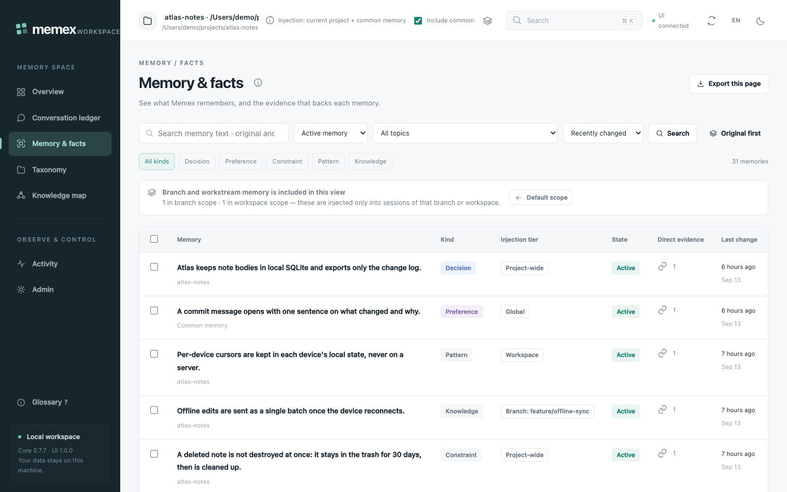
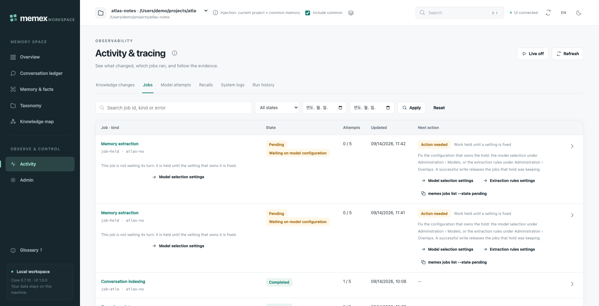
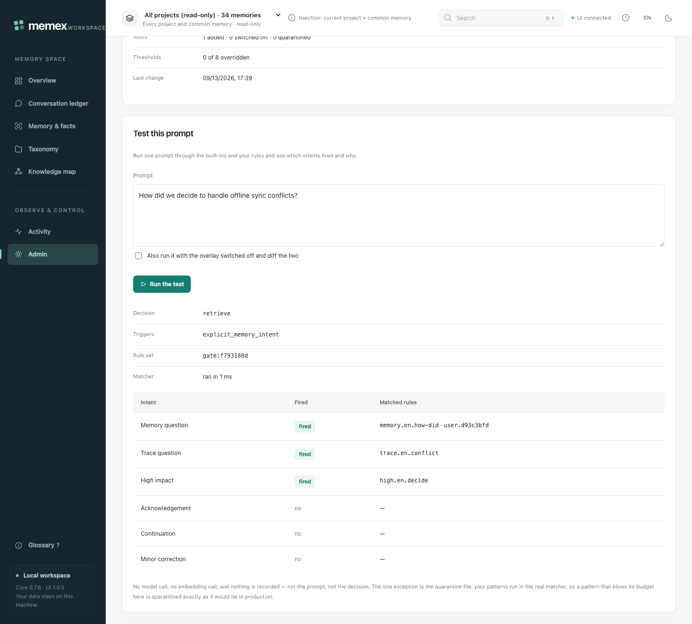
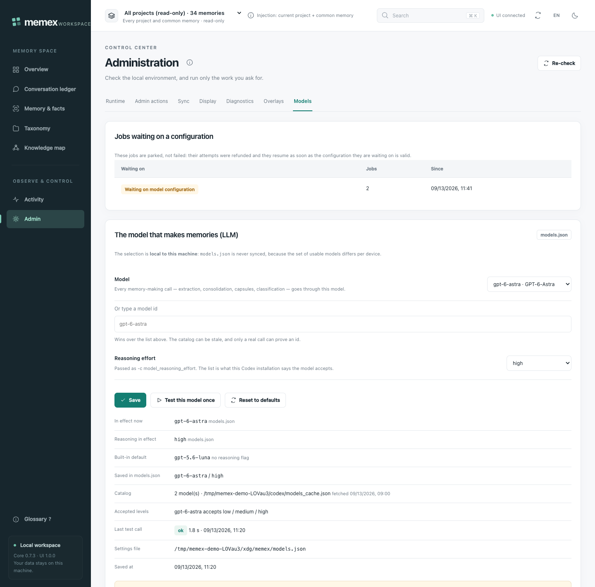
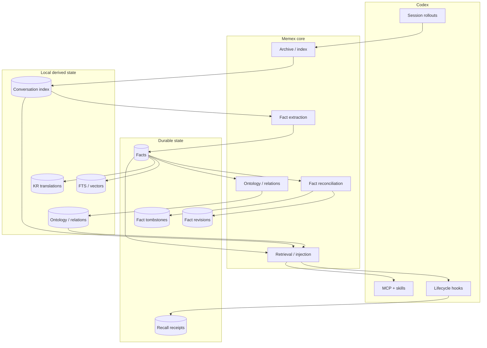

# Memex

**A local-first long-term memory layer for Codex.** It collects your conversations, distills the decisions worth keeping, binds each one to the exchange that proves it, and brings the right ones back the next time they matter.

[](CHANGELOG.md)
[](https://developers.openai.com/codex/)
[](package.json)
[](LICENSE)

<picture>
  <source media="(prefers-color-scheme: dark)" srcset="assets/readme/en/overview-dark.png">
  
</picture>

[한국어 README](README-KR.md) · [Documentation](docs/README.md) · [Operations guide](docs/GUIDE.md) · [Architecture](docs/ARCHITECTURE.md) · [Verification](docs/VERIFICATION.md)

---

## Why Memex

Codex forgets. Every session starts from an empty room, so the same decision gets re-litigated, the same constraint gets rediscovered, and the reason behind last month's choice lives only in a rollout file nobody will read again. Memex is the layer that keeps it: it archives the conversations you already had, distills them into durable facts, connects those facts into a scoped graph, and injects a small, relevance-gated slice of them back into later prompts. It is a **memory system, not a second agent** — Codex stays the working agent.

**Local-first.** The source Codex rollouts stay read-only. The database, indexes, derived graph, and operational logs live under your local Memex data root, and cross-device sync is off until you turn it on — until then nothing is synchronised to another device. Model work is the exception, and it is not local: fact extraction and ontology classification send the conversation text they distil to whatever model provider your Codex CLI is configured with, and `memex models test` calls that same provider with a fixed one-line probe. Extraction runs in the background whether or not sync is on; point Codex at a local provider, or turn extraction off, if that traffic is not acceptable.

**Evidence-bound.** A fact is not a summary. `source_exchange_ids` holds only exact authoritative human or trusted local-tool exchanges; the separate `fact_context_dependencies` records the long-range context needed to *interpret* a fact and is never promoted to authority. The workspace and `trace_fact` render the two lanes apart, and missing data is reported as not-collected rather than folded into `0`.

**Yours to steer.** Your own regexes and words sit on top of the recall gate; your own restrictions on extraction are enforced at the storage boundary, not suggested in a prompt; you pick the model and reasoning effort Memex spends on its own work. Opening a page never starts model work, and a configuration the provider refuses pauses that work instead of failing it.

---

## Quick start

**Requirements** — Node.js 22.15+, an authenticated Codex CLI, and macOS or Linux for the current hook / Unix-socket runtime.

```bash
# 1 · install the plugin, then restart Codex so hooks, skills and the MCP server load
codex plugin marketplace add BongSuCHOI/memex
codex plugin add memex@memex

# 2 · put a `memex` command in your own shell (creates ~/.local/bin/memex,
#     not a global npm install)
npx --yes --package=github:BongSuCHOI/memex#main memex setup --install-cli

# 3 · prepare the Codex history you already have
memex setup          # check for a conflict with Codex built-in Memory
memex sync           # archive and index eligible $CODEX_HOME/sessions rollouts
memex backfill all   # durable fact extraction, ontology, missing embeddings
memex status         # readiness and remaining backlog

# 4 · ask Codex about something you already worked on. The bundled skills reach
#     for the Memex MCP tools; the same lookup from a shell is:
memex search "why did we choose SQLite?"

# 5 · open the local workspace
npx --yes --package=github:BongSuCHOI/memex#main memex-ui   # http://127.0.0.1:3847
```

Steps 1, 2 and 5 take about a minute. Step 3's runtime depends on how much history you have — every backfill stage is idempotent, so it is safe to stop and re-run. `memex setup` never disables Codex built-in Memory without explicit approval. Later, `memex update` refreshes the marketplace and plugin while preserving data.

Did it work? `memex doctor` checks dependencies, build, hooks, injection output, and recall provenance in one pass, and the workspace's **Activity › Recalls** tab shows the receipt written for each retrieval.

Memex uses native SQLite, vector, and embedding dependencies. Installation materializes them beside the plugin and the launcher runs that same installed artifact first; an isolated npm cache is used only for the MCP server and for the `npx` fallback a not-yet-materialized plugin registration takes. Neither path installs dependencies into your project or requires a source checkout for normal use. For local marketplace development and source-based validation, see the [operations guide](docs/GUIDE.md).

---

## The workspace

`memex-ui` serves a loopback workspace at `http://127.0.0.1:3847`. It is plain server-side CommonJS plus ES modules — no frontend build, no extra npm package. It binds to `127.0.0.1` only, validates `Host`/`Origin`, and requires a CSRF token for writes; fact mutations go through the same transactional service as the CLI. It is **not** an authentication, TLS, or multi-tenant isolation service, so do not port-forward or publicly deploy it.

Every page takes an explicit scope — one project, common (global) memory, or all projects. All projects is the default view and is read-only breadth: injection always uses the current project plus common memory, and the scope selector says so permanently. Every page also carries its own help: an ⓘ next to the title linking the matching docs section at this release tag, one-line tooltips on controls and table headers, and a searchable glossary on `?`.

### Overview — what the pipeline is doing, and what needs a person


- Four metrics for the selected scope, then the pipeline stages — capture, extraction, search index, taxonomy — each with its own readiness.
- **Needs attention** groups outstanding work by failure class, not by count: held work, failed work, and work waiting to retry are different problems with different fixes.
- Values that were never collected are shown as not-collected. Nothing here is an estimate.

### Memory & facts — tiers on the left, evidence on the right



- Every row carries an **injection tier** badge: global, project-wide, this workspace, or one branch. A banner says when branch-tier memory sits outside the current view, and includes it in one click.
- Promote or demote a memory one rung at a time (`branch ⇄ project-common ⇄ global`); the move is recorded with who made it and why.
- Filter by kind, state, topic or text; export the page, or just the rows you selected.


- The detail drawer keeps **direct evidence** and **interpretive context** in separate lanes — what proves the fact, and what you need in order to read it.
- The verification receipt sits below them, with the fact's own Chronicle history beside it.
- Edit, deactivate and restore keep fact identity and the whole revision history while invalidating stale derived state — a deactivated memory is still there and still restorable.
- Guarded delete is the one that does not: it asks for the full UUID and shows the impact first, then removes the fact, its revisions and its Chronicle rows for good. What is left is a sync tombstone — enough to stop the row coming back from another device, not a record you can restore from.

### Knowledge map — relations, not a similarity cloud


- Fact nodes and typed relations (`SUPPORTS`, `INFLUENCES`, `SUPERSEDES`, `CONTRADICTS`) drawn with browser-native WebGL, with a Canvas2D fallback.
- 2D and 3D share one engine and one selection; picking a node opens the same detail drawer the memory list uses.
- Layout encodes domain grouping only. On-screen distance is **not** an embedding-similarity number.

### Activity & tracing — one job, all the way down


- Knowledge changes, jobs, model attempts, recalls, system logs and run history, each scoped like every other page.
- Any job opens into its extraction target, its input versions, and the model attempts it actually spent.
- A row that needs something carries a **Next action** derived from the failure-class table in [GUIDE §20](docs/GUIDE.md#20-문제가-생겼을-때--실패-클래스별-복구) (Korean) — a diagnosis, not a status word.



- A job whose configuration the provider refused is **held**, not failed: its attempts are refunded and nothing is recorded as a failure.
- The hold badge names the reason, and the row links to the screen that owns the fix.
- Fix the setting and the held work resumes by itself. Waiting alone never clears it, and the row says so.

### Administration › Overlays — your rules, tested before they bite



- Your own regexes and words sit **on top of** the built-in recall gate. A built-in rule is switched off by id, never deleted, and a rule that cannot be read or run leaves the built-in gate in force.
- **Test this prompt** shows the decision, which intents fired, and exactly which rules matched — including yours. It calls no model and writes to no history; the screen says so.
- The extraction sub-view is the other half: topics to stay away from, and `never_extract` patterns enforced at the storage boundary. It previews the clause that actually reaches the prompt, and simulates the impact without claiming numbers it cannot prove locally. A pattern that blows its time budget is quarantined visibly rather than silently switched off. ([GUIDE §22](docs/GUIDE.md#22-사용자-오버레이--회수-게이트와-추출-규칙-070-29-30))

### Administration › Models — the model Memex spends on itself



- Pick the model and reasoning effort for Memex's own work from this Codex installation's catalog, or type an id the catalog does not list yet.
- **Test this model once** makes exactly one real call — the only button on the page that spends anything — and clears the configuration hold for that selection.
- Jobs parked on an unusable configuration are listed here with the reason and the oldest hold, and each row below the form says not just what is in effect but where it came from: an environment variable, `models.json`, or the built-in default. The embedding model is read-only in 0.7.x. ([GUIDE §21](docs/GUIDE.md#21-모델-선택-070-31))

### English and Korean


- The workspace ships in **English** and switches to Korean from `?lang=ko`, the `EN`/`KO` button in the header, or Administration › Display — each remembered in that browser.
- `memex-ui --lang ko` (or `MEMEX_UI_LANG=ko`) sets the server default; an unknown value fails startup rather than guessing.
- The documents under `docs/` are Korean only, and the English UI links to the same Korean sections. ([WEBUI-WORKSPACE.md](docs/WEBUI-WORKSPACE.md))

### Sync — off by default, and a file when you want one

Cross-device sync is **off by default**: until you turn it on, memory state is written nowhere but your own data root and reaches no other device. (This is about device-to-device state only — Memex's model work goes to your Codex model provider either way; see *Local-first* above.) Point both machines at one shared folder you own — iCloud Drive, Dropbox, Syncthing — and durable memory state reconciles between them.

```bash
memex sync enable --dir ~/Library/Mobile\ Documents/com~apple~CloudDocs/memex-sync
memex sync export      # publish this device's first generation
memex sync status      # shared folder, this device, last export, devices seen
memex sync alias "home mini"   # name this device; the name travels in the manifest
```

No shared folder? Hand one generation over as a file — the same protocol-v5 generation in a zip, so it gets the same validation:

```bash
memex sync export --archive          # writes <data root>/sync/exports/<device>-<generation>.zip
memex sync import --archive ~/Downloads/<device>-<generation>.zip --dry-run
memex sync import --archive ~/Downloads/<device>-<generation>.zip
```

Administration › Sync does the same thing from the workspace and always runs validate → preview → confirm. A device's own archive is refused rather than replayed onto itself. Memories in a shared folder are plaintext JSONL — encryption is out of scope, so use a folder that is yours.

---

## How it works



Memex hangs off the Codex lifecycle rather than polling. Capture hooks do bounded local I/O only — no model, embedding, extraction or export work runs in the foreground of a hook.

| Event | Memex behavior |
| --- | --- |
| **SessionStart** (startup/resume) | resolve session state, recover the durable queue, then run independent background sync/import/maintenance |
| **SessionStart** (clear/compact) | advance `context_epoch`; compact immediately returns a bounded Capsule/current-fact bundle |
| **UserPromptSubmit** | scoped retrieval and bounded context injection, plus a separate asynchronous maintenance wake check |
| **Stop** / **Interrupt** | append only new transcript bytes and commit a closed-turn fence (interrupt preserves an open one) |
| **PreCompact** / **PostCompact** | fsync the journal, freeze carry candidates, atomically commit checkpoint + outbox; post-compact is telemetry only |
| **SessionEnd** | final delta, final fence, durable jobs. A separate entry (3 s timeout, the most Codex allows here) publishes a sync generation when sync is on, and is an instant no-op when it is off |

The durable worker queue runs capture indexing first, Work Capsule updates second, and fact/derived work afterward. SessionStart background jobs stay eventually consistent; each writer owns its own transaction and CAS safety.

Deep dives: [CONTINUITY.md](docs/CONTINUITY.md) (lifecycle, journal, outbox, worker, Capsule, Chronicle) · [FACT-LIFECYCLE.md](docs/FACT-LIFECYCLE.md) (extraction, consolidation, semantic/lifecycle state) · [RETRIEVAL-AND-CONTEXT.md](docs/RETRIEVAL-AND-CONTEXT.md) (search, RAG, injection) · [ARCHITECTURE.md](docs/ARCHITECTURE.md) · [SCHEMA.md](docs/SCHEMA.md)

<details>
<summary><b>Scope and memory tiers</b> — how a directory, a branch and a worktree map onto memory</summary>

| Situation | Behavior |
| --- | --- |
| **Git project** | Directory = project. Memory from a default-branch session (`main`/`master`/`origin/HEAD`) → **project-common**. Memory from any other branch or worktree session → an independent **branch tier** keyed on `(project, branch)`, so branches never dilute each other and two worktrees of the same repository on the same branch share one tier. Injection and lookup = global + project-common + the current branch. |
| **Plain (non-Git) project** | Directory = project, no branch layer. All memory is project-common (+ global). |
| **Plain → Git transition** | `workspace_id` and `project_id` are unchanged; only workspace metadata is refreshed, plus a `WORKSPACE_LOCATION_CHANGED` event. Existing project-common memory stays exactly as it is. If the new common dir or remote already belongs to another project, nothing is merged automatically: the conflict is recorded as `requires_approval = 1` plus a `suggest` entry in `project_identity_audit`, and waits for an explicit `approved_remote_mappings` approval. |
| **Promotion / demotion** | The ladder is `branch ⇄ project-common ⇄ global`, one rung at a time, through three channels: a user assertion in the workspace or CLI, evidence-based automation (re-confirmed on another branch → project; confirmed in two or more projects → global; upper evidence gone → demotion), or an explicit in-session request (`actor=user-directive`). All three write a Chronicle `PROMOTED`/`DEMOTED`. |

The stored column is `facts.promotion_state` (`workstream` = branch tier, `project-current` = project-common, `scope_type = global`), and `facts.tier_reason` records the branch signal (`no-branch-signal` | `default-branch` | `branch:<name>`) that placed it there. Supported fact/query scopes are **project**, **workspace/workstream/session**, **global**, and **all** (explicit cross-project access).

Read scope and consolidation permission are separate. Consolidation preserves different tiers and promotion states, adopts only verified input wording, and leaves ambiguous legacy identity for review. Existing data can be [backed up, audited, and selectively repaired](docs/GUIDE.md#16-기억-정합성-감사와-선별-복구) without re-extracting every fact. Facts extracted before 0.6.0 all sit in the branch tier; `memex facts migrate-tiers --dry-run` lists the ones the new rule would make project-common, and `--apply` moves them.

</details>

<details>
<summary><b>Fact state and the sync protocol</b> — why an edit cannot undo a deactivation</summary>

Sync protocol v5 separates fact state into independent axes:

| Axis | Examples | Merge rule |
| --- | --- | --- |
| **Semantic** | fact text, category, scope | semantic event clock + deterministic tie-break |
| **Lifecycle** | active / inactive | lifecycle event clock; inactive wins exact ties |
| **Lineage** | source exchange IDs, consolidated count | monotonic union / max |
| **Derived overlay** | KR text, ontology, relations, vectors | local-only, rebuildable |

This matters because editing a fact and deactivating it are different events. A newer semantic edit must not accidentally undo a newer deactivation, and provenance must never disappear just because another device has an older snapshot. When the semantic axis has to choose between two meanings, the decision is not silent: the importer appends a local `SYNC_IMPORTED` Chronicle event naming the source device, the generation, and which side won. That event is local provenance and is never exported.

Protocol v5 exports one committed generation per local device, containing `facts.jsonl`, `fact-revisions.jsonl`, `fact-tombstones.jsonl`, `recall-events.jsonl`, and a `meta.json` recording the protocol version, device/generation identity, row counts, and SHA-256 integrity for each payload file. Imports pin and validate an entire generation before mutating SQLite: missing files, hash mismatches, invalid JSON, or schema-invalid rows reject that device generation as a whole. Local exporters are serialized with SQLite's process-owned `BEGIN IMMEDIATE` transaction, so a slower export cannot move `CURRENT` back to an older snapshot. KR translations, ontology categories, relations, and vector indexes are rebuilt locally instead.

| Memory tier | Travels | On the receiving device |
| --- | --- | --- |
| Global | yes | injected everywhere |
| Project-common (`legacy-project`, `project-current`, `decision`) | yes | injected in that project |
| Workspace | yes, with its `workspace_id` | not injected — a workspace id is device-local |
| Branch / workstream | yes, with `workstream_id`, `tier_reason` and the branch name | injected only while that device is on the same branch of the same project |

Every promotion state travels, so fact tombstones — which carry no tier of their own — describe exactly the same population as the exported facts. A `promotion_state` this version does not know is reported as a malformed row and rejects its generation instead of being flattened into project scope. Protocol v4 generations still import; a v4 peer rejects a v5 generation rather than mis-reading it. After the first export, publishing is automatic: a SessionEnd hook and the maintenance wake publish a generation whenever durable state changed, and SessionStart imports the peers'. `memex sync disable` turns every one of those paths back into a one-line no-op.

</details>

<details>
<summary><b>Recall without self-training loops</b> — and what a <code>DO NOT INDEX</code> marker removes</summary>

Recalled memory must not become fresh evidence merely because Codex repeated it. Memex distinguishes human assertions, trusted local repository / Git / test observations, external or unverifiable tool output, Memex recall, and assistant-generated synthesis. The last two remain searchable but are never treated as new durable fact evidence, which prevents:

```text
old fact → recalled into prompt → assistant repeats it → repeated text extracted as a "new" fact
```

Recall events are recorded as durable provenance receipts before context is emitted. "Context was provided" is recorded as exactly that, and is not evidence that the model used it in its answer.

A user-role `DO NOT INDEX` marker excludes the whole conversation from the Memex knowledge corpus. The privacy purge removes or invalidates exchanges and tool-call index state, FTS/vector rows, extraction/recall processing state, facts that depended on the excluded conversation as authoritative evidence or persisted interpretive context, fact-derived revisions/relations/vectors, and the local taxonomy derived from the previous corpus. Facts removed this way receive a terminal privacy tombstone so an older device snapshot cannot resurrect them; surviving public facts are reclassified from the remaining evidence.

</details>

<details>
<summary><b>Where the data lives</b> — the whole data root, file by file</summary>

Resolution order is `MEMEX_HOME`, then `$XDG_CONFIG_HOME/memex`, then `~/.config/memex`.

```text
~/.config/memex/
├── lifecycle-registration.json         # explicit fallback hook registration
├── conversation-archive/
│   └── <project>--<hash>/              # archived rollouts (.jsonl) and summaries
├── conversation-index/
│   ├── db.sqlite                       # (+ -wal, -shm)
│   ├── exclude.txt
│   ├── inject-daemon.sock
│   ├── logs/
│   │   └── inject-context.jsonl        # (+ .old, rotated at 5 MB)
│   ├── state/
│   │   └── inject-ledger/
│   ├── sync/
│   │   ├── export-status.json
│   │   └── devices/<device>/CURRENT, generations/<id>/
│   └── *.lock, *.log                   # backfill / consolidate / reembed workers
├── sync/
│   ├── config.json                     # cross-device sync switch + shared folder (off by default)
│   ├── devices.json                    # device id → human name (local, never shared)
│   └── exports/<device>-<generation>.zip   # generations written for hand-carrying
├── journals/<session>/<epoch>.jsonl    # rolling transcript journal
├── run-locks/
├── ui/
│   └── operations.json
└── logs/
    ├── hook-events.jsonl
    └── ui-audit.jsonl
```

`ui/operations.json` keeps metadata for admin commands the workspace ran and `logs/ui-audit.jsonl` is its audit trail; both record metadata only, never conversation text, fact text, or command output. `logs/hook-events.jsonl` records only the event name and timestamp of each observed lifecycle hook. `conversation-index/logs/inject-context.jsonl` records one line per retrieval — status, counts, duration, not prompt or fact text. `conversation-archive/` and `journals/` do hold real conversation text, so treat them as sensitive. The original `$CODEX_HOME/sessions` rollouts are always read-only input. Run `memex home` (or `memex home --json`) before deleting or moving Memex data.

</details>

---

## CLI cheat sheet

```bash
memex status                                   # readiness, backlog, needs-attention
memex sync                                     # archive and index new Codex rollouts
memex backfill all                             # extraction, ontology, embeddings, receipts
memex search "why did we choose SQLite?"       # hybrid semantic + FTS5/BM25 search
memex search --text "ERR_MODULE_NOT_FOUND"     # exact string, no embedding
memex facts list                               # inspect durable facts (show/edit/history/explain)
memex models set --model <id> --reasoning high # the model Memex spends on its own work
memex gate test "how did we handle retries?"   # what your recall rules would do with a prompt
memex jobs list                                # durable queue; `retry`, `dismiss`, `show <id>`
memex doctor                                   # dependencies, build, hooks, injection, provenance
```

Every subcommand accepts `--help` / `-h`, prints usage only, and exits `0`; commands with side effects write nothing when asked for help. Foreground backfill exits `0` only when no processable, active, or unresolved work remains — a bounded run that leaves retryable backlog reports `completed with deferred work` and exits `2`, and a worker failure stops later stages and exits `1`.

<details>
<summary><b>Every command</b></summary>

| Command | Purpose |
| --- | --- |
| `memex setup` | Check for a conflict with Codex built-in Memory; `--install-cli` / `--uninstall-cli` manage the `~/.local/bin/memex` shim |
| `memex install` | Register the plugin and materialize its runtime dependencies (idempotent); `--root` targets an explicit installed plugin root |
| `memex deps materialize` | Install runtime dependencies into the resolved installed plugin root, then warm the embedding model cache when it is empty; `--root`, `--dry-run`, `--force`, `--no-warm`, `--json` |
| `memex deps warm` | Download the embedding model into the stable cache (`<data root>/models`) so the first prompt does not pay the 129 MB; `--force`, `--json` |
| `memex setup-hooks` / `memex remove-hooks` | Register or remove Memex-owned lifecycle hooks (explicit fallback hosts only) |
| `memex update` | Refresh the marketplace/plugin while preserving data; `--marketplace <name>`, `--no-materialize`, `--no-warm` |
| `memex sync` | Archive and index new Codex rollouts; `--background` |
| `memex sync enable\|disable\|status\|export\|import` | Cross-device sync switch (OFF by default), shared folder (`--dir`), status, manual export (`--force`) / import; `--json` |
| `memex sync export --archive [<path.zip>]` | Write one generation as a zip to carry by hand (works with sync off) |
| `memex sync import --archive <path> [--dry-run]` | Import a received generation zip or directory; `--dry-run` validates and previews |
| `memex sync alias <name\|--clear> [--device <id>]` | Name a device; this device's name travels in every generation manifest |
| `memex index` | Index, verify, repair, or rebuild the conversation index: `--cleanup`, `--session <id>`, `--verify`, `--repair`, `--rebuild`, `--concurrency N`, `--no-summaries` |
| `memex search` | Semantic, text, or hybrid conversation search |
| `memex show` | Read one archived conversation |
| `memex stats` | Inspect corpus/index statistics |
| `memex analyze` | Generate a deterministic history report |
| `memex facts` | Inspect and manage durable facts: `list\|show\|edit\|deactivate\|restore\|history\|explain\|delete`; `list --all` includes inactive facts (`--limit`, `--offset`), `edit --source-exchange <id>` names the evidence |
| `memex facts tier\|promote\|demote` | Inspect or move a memory on the `workstream ⇄ project ⇄ global` ladder, one rung at a time |
| `memex facts migrate-tiers` | List (`--dry-run`) or apply (`--apply`) the 0.6.0 default-tier back-fill |
| `memex backfill` | Run backlog work explicitly: `all\|extract\|ontology\|embeddings\|receipts`; `--background` |
| `memex ontology` | Inspect and repair the local taxonomy: `list\|merge\|rename` |
| `memex status` | Pipeline readiness, `Needs attention`, quarantined projects, and `memory_jobs` by kind × state; `--json` |
| `memex jobs` | Inspect and recover memory jobs: `list\|show\|retry\|dismiss` |
| `memex recover` | Reset terminal (dead) work back to claimable in one transaction; `--all-dead`, `--dry-run` |
| `memex model-work` | Inspect a model-work budget or explicitly resume one; [bounded resume](docs/GUIDE.md#17-모델-작업-예산과-대기-진단) |
| `memex models` | Choose the model and reasoning effort for Memex's own model work: `show\|set\|reset\|test`. `set --model <id> [--reasoning <level>]` (`unset` removes the flag); `test` makes exactly one real call and clears the configuration hold for that selection |
| `memex gate` | Your own recall-gate rules: `show\|patterns\|words\|test\|replay\|validate\|history\|quarantine\|reset\|rollback`. Built-ins are disabled by id, never deleted; writes take `--dry-run` and `--expect-revision <n>` |
| `memex extract` | Your own extraction restrictions — this command does not extract: `rules show\|validate\|set\|test\|history\|reset\|rollback\|reextract`, plus `eval`, the only verb that spends model calls |
| `memex doctor` | Diagnose dependencies, build, hooks, injection output, and recall provenance |
| `memex home` | Print the resolved Memex data root |
| `memex migrate-projects` | Re-derive project identity from cwd evidence (CX-02); `--dry-run` prints the plan and writes nothing |

Full reference: [GUIDE §18](docs/GUIDE.md#18-cli-한눈에-보기).

</details>

<details>
<summary><b>MCP tools and skills</b></summary>

Memex exposes nine MCP tools:

| Tool | Purpose |
| --- | --- |
| `search` | Search past conversations |
| `read` | Read archived source text / line ranges |
| `search_facts` | Search distilled facts |
| `search_ontology` | Browse facts by domain/category |
| `ask_avatar` | Synthesize an answer from stored evidence |
| `trace_fact` | Trace current fact → Chronicle timeline → source evidence |
| `explore_graph` | Traverse 1–3 relation hops |
| `cross_project_insights` | Find comparable solutions in other projects |
| `graph_stats` | Inspect graph size and health |

Project-sensitive tools require either a stable project/workspace/workstream/session ID or a legacy canonical absolute project path, `scope: global`, or `scope: all`. A cwd that cannot name a project (`/`, `unknown`, or any path with an empty basename) is refused rather than bucketed: that session reads global memory only.

Three bundled Codex skills cover remembering conversations, analyzing all conversations, and opening the Memex dashboard. See [MCP-AND-SKILLS.md](docs/MCP-AND-SKILLS.md).

</details>

<details>
<summary><b>Environment variables</b></summary>

| Variable | Effect |
| --- | --- |
| `MEMEX_HOME` | Memex data root; highest-precedence override |
| `XDG_CONFIG_HOME` | Fallback root: `$XDG_CONFIG_HOME/memex` |
| `MEMEX_DB_PATH` | Overrides the index DB path independently of the data root |
| `CODEX_HOME` | Codex home; `$CODEX_HOME/sessions` is the read-only rollout source |
| `MEMEX_SYNC_DIR` | Cross-device shared folder; overrides the folder stored by `memex sync enable --dir` |
| `MEMEX_AUTO_ONTOLOGY` | Automatic ontology is on unless this is set to something other than `1` (an empty value still counts as on) |
| `MEMEX_STRICT_CAPTURE` | `1` makes a capture hook fail instead of recording a capture gap |
| `MEMEX_CAPSULE_MAX_CHARS` | Bounded storage size for one Work Capsule generation (default `12000`, floor `2000`); an oversized patch is truncated by priority and recorded, never dropped |
| `MEMEX_INJECT_BASELINE_MARGIN` | Relevance margin a fact must clear over the prompt's background baseline to be injected (default `0.045`, 0-1) |
| `MEMEX_CODEX_MODEL` / `MEMEX_CODEX_REASONING` | The model and reasoning effort for Memex's own model work; both win over `<data root>/models.json`, which wins over the built-in default (`gpt-5.6-luna`, no reasoning flag) |
| `MEMEX_OVERLAY_DIR` / `MEMEX_DISABLE_OVERLAYS` | Where the user overlays live (default `<data root>/overlays`) and a switch that reads none of them (`1` only) |
| `MEMEX_UI_LANG` | Server default language for the workspace, `en` (default) or `ko` |
| `PORT` | Workspace port (default `3847`) |

Model work is budgeted per run ([GUIDE §17](docs/GUIDE.md#17-모델-작업-예산과-대기-진단)):

| Setting | Default | Actual limit |
| --- | --- | --- |
| `MEMEX_MODEL_BUDGET_MAX_ATTEMPTS` | `64` | provider attempts within one work run |
| `MEMEX_MODEL_BUDGET_DEADLINE_MS` | `900000` | deadline for the whole run |
| `MEMEX_CODEX_EXEC_TIMEOUT_MS` | `180000` | per-call timeout; never longer than the run's remaining time |
| `MEMEX_MODEL_BUDGET_MAX_INPUT_CHARS` | `120000` | UTF-16 characters of call input |
| `MEMEX_MODEL_BUDGET_MAX_OUTPUT_CHARS` | `16000` | characters of the final answer; domain schema/field validation applies on top |
| `MEMEX_AUTO_MODEL_MAX_ATTEMPTS` | `256` | shared 24-hour call cap for automatic maintenance in one data root; `0` blocks it |

Token counts are provider observations. Unobserved usage is `null` / `NOT_PROVEN` and partially observed usage is `partial`; missing usage and dollar cost are never estimated as zero. The model selection and the user overlays are **local to one machine** and never enter a sync generation, because the set of usable models and the rules you want differ per device. Facts are written in the language of the conversation they came from — decided deterministically from a weighted character majority of your own messages in the extraction window (one Hangul syllable counts as 2.5 Latin letters, so a Korean sentence full of English identifiers stays Korean), and overridable per machine or per project with the extraction rules' `preferred_language`. The optional Korean translations (`fact_kr`) are a legacy display path for facts stored in English before that: local derived state, intentionally not synced and not generated for new facts; from a source checkout they can be filled with `node scripts/translate-facts.mjs`, which reads every active fact with no translation, skips the ones whose text is already Korean (the same weighted detector the extraction window uses), and records a translation only if the fact meaning is unchanged since the request began. Complete list: [GUIDE §19](docs/GUIDE.md#19-환경-변수).

</details>

---

## Verification and quality

The repository keeps the release gate separate from implementation commits. The current verified code baseline is recorded in [`docs/verification/merge-gate.json`](docs/verification/merge-gate.json), which holds the committed candidate SHA, environment, exact gate results, hard-safety results, and any retained notes. Do not infer current verification from numbers copied into an owner document.

A required gate is FAIL if any required item is FAIL; unobserved behavior is never marked PASS by inference. The browser gate runs in both languages every release, which is also where the screenshots in this README come from — `assets/readme/en/` and `assets/readme/ko/` are produced by the same run. For the full acceptance model, version boundaries, and retained machine receipts, see [VERIFICATION.md](docs/VERIFICATION.md).

---

## Roadmap

0.7.0 shipped the overlays and model-selection surfaces above. Carried into 0.7.x:

| Issue | What it adds |
| --- | --- |
| [#118](https://github.com/BongSuCHOI/memex/issues/118) | Switching the embedding model — approved identifiers in the DB, generation CAS, a migration service, topic-vector invalidation |
| [#119](https://github.com/BongSuCHOI/memex/issues/119) | Sharing overlays between devices: conflict, revision and reset contracts, plus an optional v5 payload file |
| [#120](https://github.com/BongSuCHOI/memex/issues/120) | Editing the eight recall-gate thresholds (`RecallGateConfig`) as an overlay |
| [#121](https://github.com/BongSuCHOI/memex/issues/121) | `custom_fact_kinds` — fact kinds beyond the five built-in ones |
| [#123](https://github.com/BongSuCHOI/memex/issues/123) | A memory-language policy: extract in the language of the conversation, and reduce `fact_kr` to a legacy display concern |
| [#115](https://github.com/BongSuCHOI/memex/issues/115) | Bringing `gate` / `extract` CLI output into line with the rest of the (English) CLI |
| [#114](https://github.com/BongSuCHOI/memex/issues/114) | Stop the package-runtime E2E from re-fetching the embedding model into a fresh temp root and hiding the underlying error |

---

## Contributing

```bash
git clone https://github.com/BongSuCHOI/memex.git
cd memex
npm install
npm run build          # tsc + esbuild bundle
npm test               # vitest
npm run typecheck
node --test ui/test/*.test.cjs          # Web UI service/HTTP contracts
node scripts/web-ui-browser-e2e.mjs     # real headless-Chrome UI gate
MEMEX_PLUGIN_ROOT="$PWD" node ui/server.cjs   # run the workspace from a checkout
```

Read [AGENTS.md](AGENTS.md) before changing behavior — it defines repository invariants, verification rules, and documentation ownership. When a public command, persisted field, lifecycle rule, MCP schema, or release contract changes, update its owner document in the same change.

The documentation set is organized by ownership rather than as one large manual; start from [docs/README.md](docs/README.md).

| Document | Covers |
| --- | --- |
| [GUIDE.md](docs/GUIDE.md) | installation, onboarding, CLI, lifecycle, uninstall |
| [ARCHITECTURE.md](docs/ARCHITECTURE.md) | system boundaries and end-to-end flow |
| [CONVERSATION-LIFECYCLE.md](docs/CONVERSATION-LIFECYCLE.md) | rollout parsing, archive/index, sync protocol |
| [FACT-LIFECYCLE.md](docs/FACT-LIFECYCLE.md) | extraction, consolidation, semantic/lifecycle state |
| [KNOWLEDGE-GRAPH.md](docs/KNOWLEDGE-GRAPH.md) | ontology, relations, traversal |
| [RETRIEVAL-AND-CONTEXT.md](docs/RETRIEVAL-AND-CONTEXT.md) | search, RAG, context injection |
| [SCHEMA.md](docs/SCHEMA.md) | SQLite schema and transaction invariants |
| [MCP-AND-SKILLS.md](docs/MCP-AND-SKILLS.md) | MCP tools and bundled skills |
| [WEBUI-WORKSPACE.md](docs/WEBUI-WORKSPACE.md) | local workspace pages, scope model, knowledge map |
| [CONTINUITY.md](docs/CONTINUITY.md) | lifecycle/journal/outbox/worker, Capsule, identity, Chronicle as built |
| [VERIFICATION.md](docs/VERIFICATION.md) | tests, E2E gates, release evidence |
| [LINEAGE.md](docs/LINEAGE.md) | upstream attribution and project lineage |

---

## Lineage and license

Memex is an independent Codex-native project derived from the MIT-licensed [`obra/episodic-memory`](https://github.com/obra/episodic-memory) and [`jung-wan-kim/memory-bank`](https://github.com/jung-wan-kim/memory-bank). It preserves the knowledge-system ideas while replacing the previous host adapter with Codex-native rollout, hook, plugin, MCP, and model-execution contracts. See [LINEAGE.md](docs/LINEAGE.md) and [THIRD_PARTY_NOTICES.md](THIRD_PARTY_NOTICES.md).

MIT. See [LICENSE](LICENSE).
