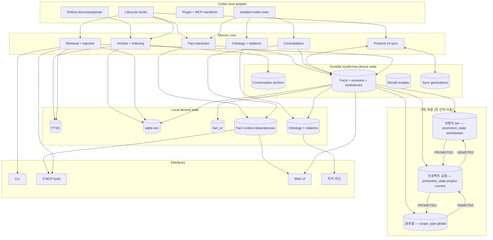
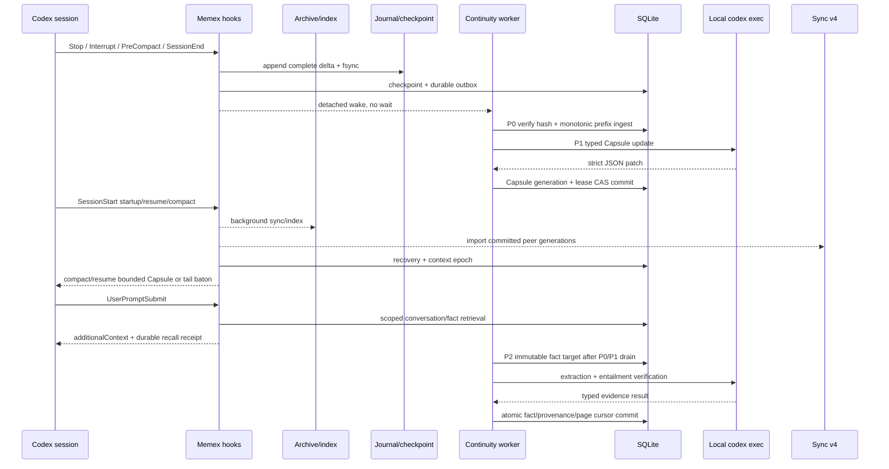

# Memex 아키텍처

## 1. 설계 목표

Memex는 Codex 대화를 수집해 검색 가능한 conversation corpus와 장기 fact로 증류하고, 필요한 순간 다시 꺼내 쓰는 local-first memory layer입니다.

핵심 원칙은 다음과 같습니다.

1. Codex adapter만 rollout, hook, plugin 형식을 압니다.
2. 원본 rollout은 read-only이며 archive와 DB는 재생성 가능한 로컬 계층입니다.
3. fact의 **의미**, **활성 상태**, **provenance**는 서로 다른 수렴 규칙을 가집니다.
4. ontology, KR translation, relation, vector는 local derived state입니다.
5. multi-device sync는 durable state만 generation 단위로 전송합니다.
6. 자동 lifecycle은 bounded, idempotent, observable해야 합니다.
7. `project_id`는 logical identity이고 canonical absolute cwd는 device-local `workspace` provenance입니다.
8. capture hook은 raw evidence fence만 commit하고 model/embedding/distillation을 기다리지 않습니다.
9. Work Capsule은 current work의 `context-only` projection이며 Current Fact authority와 분리합니다.

## 2. 논리 계층



## 3. Fact 상태 모델

하나의 fact row에는 서로 성격이 다른 상태가 함께 존재하지만, 충돌 규칙은 분리됩니다.

### Semantic axis

의미를 구성하는 상태:

- `fact`
- `category`
- `scope_type`
- `scope_project`

로컬 async writer의 stale-result 방지는 `semantic_generation`을 사용하고, cross-device winner는 `semantic_updated_at`으로 결정합니다.

### Lifecycle axis

활성 상태:

- `is_active`

로컬 stale-result 방지는 `lifecycle_generation`, cross-device winner는 `lifecycle_updated_at`을 사용합니다. 동일 시각의 tie는 privacy/search safety를 위해 inactive가 이깁니다.

### Lineage axis

- `source_exchange_ids` — 모든 기기와 concurrent writer의 값을 set union
- `consolidated_count` — max

lineage는 semantic winner가 누구인지와 관계없이 단조 증가해야 합니다.

### Derived overlay

- `fact_kr`
- `ontology_category_id`
- ontology domains/categories
- typed relations
- primary/KR/category vectors
- `fact_context_dependencies` interpretive lineage

`fact_context_dependencies`는 Fact 해석에 실제로 사용된 exchange를 로컬에서 감사하기 위한 별도
관계입니다. Generator dependency는 hint이고 entailment verifier가 removal test 뒤 사용한
`context_id`를 server가 bounded causal constraint로 canonicalize합니다. Authoritative evidence가
아니며 `source_exchange_ids`와 합치거나 protocol v4로 동기화하지 않습니다. 나머지 derived 값처럼
semantic state와 local conversation corpus에 종속됩니다.

## 4. 주요 컴포넌트

| 컴포넌트 | 책임 |
| --- | --- |
| `src/codex-rollout.ts` | sessions root, rollout discovery, host metadata |
| `src/parser.ts` | JSONL → exchange/tool-call 모델 |
| `src/sync.ts` | rollout archive와 incremental indexing orchestration |
| `src/indexer.ts` | archive snapshot을 검색 corpus로 반영 |
| `src/fact-extractor.ts` | exact-span/call-ID provenance validation → mandatory semantic verifier, local window + adaptive bounded referent ranking → local dependency |
| `src/continuity-store.ts` | additive schema v4, project/workspace/workstream/session identity, journal/session/Capsule/privacy-guard tables, immutable extraction targets/pages, checkpoint+outbox, lease/CAS, failed-visible accounting |
| `src/continuity-identity.ts` | stable resolver, approved remote mapping, explicit link/split/rebind, subject promotion, project revision, Hot Evidence |
| `src/continuity-core.ts` | hook payload/path/session-meta validation, serialized rolling journal, checkpoint identity, context epoch/residency, Capsule/tail baton, compact rehydration |
| `src/continuity-evidence.ts` | immutable workstream evidence fragments, fixed-target Capsule pages, frontier CAS |
| `src/continuity-worker.ts` | P0 hash-verified prefix ingest와 P1 typed Capsule update; partition ordering/retry/CAS |
| `src/archive-ingestion.ts` | canonical desired-set ingest와 monotonic prefix ingest 분리 |
| `src/consolidator.ts` | DUPLICATE/CONTRADICTION/EVOLUTION/INDEPENDENT 판단 |
| `src/read-scope.ts` | 필수 stable ReadScope와 membership 검증 |
| `src/legacy-read-scope.ts` | canonical path reader compatibility, read-only overlay |
| `src/fact-policy.ts` | MutationPolicy, 통합 적격성, local evidence receipt |
| `src/fact-management.ts` | policy 기반 semantic/lifecycle transaction과 CAS |
| `src/fact-integrity.ts` | read-only 감사, exact preview 선택, 멱등 선별 복구 |
| `src/sync-export.ts` | durable generation export |
| `src/sync-import.ts` | protocol v4 검증과 axis별 reconciliation |
| `src/ontology-classifier.ts` | taxonomy classification, attempt/fallback 관리 |
| `src/ontology-db.ts` | taxonomy epoch, category/relation persistence |
| `src/search.ts` | vector/text/hybrid retrieval |
| `src/inject-*.ts` | warm/cold retrieval, dedup, budget, recall receipt |
| `src/mcp-server.ts` | MCP validation과 dispatch |
| `ui/server.cjs`, `ui/lib/`, `ui/public/` | loopback Web UI, API v2, guarded fact mutation |

## 5. End-to-end 흐름



SessionStart의 background sync, sync import, maintenance는 독립 async 작업입니다. 순서가 아니라 **eventual consistency**를 계약으로 삼고, 각 writer가 자체적으로 concurrency-safe해야 합니다.

Phase 2는 Phase 1 Correctness Spine 위에 Capture Plane을 올립니다. Every closed generation은 계속 immutable target item으로 accounted되며, capture-index는 canonical reconciliation과 분리된 monotonic prefix ingest만 사용합니다. Capture는 canonical `session_meta.cwd`와 hook session ID를 bounded prefix probe로 대조하고 SQLite writer transaction 안에서 journal append와 DB boundary를 직렬화합니다. `PostCompact`는 telemetry일 뿐이며 `PreCompact -> SessionStart(compact)`만으로 correctness와 immediate rehydration이 성립합니다.

Phase 3은 `project_id → workspace_id → workstream_id → session_id`를 분리합니다. Resolver는 explicit project/portable key, same local Git common-dir, user-approved remote mapping, isolated canonical-path fallback 순서만 허용합니다. basename/package/remote 일치만으로는 합치지 않습니다. 같은 Git common-dir의 worktree는 project를 공유하되 workspace는 분리되고, clone/device 연결과 split은 idempotent audit record를 남기는 explicit API입니다. Session binding은 resume exact → explicit → unique workspace+branch → **결정론적 stream id** → deterministic strong-topic margin 순서이며, 어디에도 걸리지 않으면 그 결정론적 stream을 만듭니다. latest-session fallback이나 per-prompt LLM classifier는 없습니다.

Work Capsule은 workstream-scoped `context-only`, 검증된 workspace state는 workspace-scoped, explicit decision과 `merged`/`validated`/`no-branch-signal` state가 project current slot이 됩니다. Current slot은 `(project_id, subject_key, promotion_state, workspace_id, workstream_id)`에서 active unique입니다. Meaningful current/decision/workspace mutation만 project `memory_revision`을 올리고, sibling session은 다음 prompt/resume/compact boundary에서 bounded correction을 소진한 뒤에만 revision을 seen 처리합니다. Hot Evidence는 recent human/trusted repo/Git/test evidence의 TTL-bounded lane이며 항상 `NOT YET DISTILLED`로 표시됩니다.

Phase 4는 `fact_revisions`를 단일 append-only Chronicle로 확장합니다. 추출 commit은 `(project, subject, promotion, workspace, workstream)` slot을 source-effective time과 authority로 deterministic하게 해소해 `ASSERTED`/`CHANGED`/historical/`CONTRADICTED`를 기록하고, 원인은 source에 있는 span만 grounded로, 모델 추정은 classifier note로 저장합니다. incident는 coalesced episode/pattern/remediation으로 남고 `trace_fact`가 current → event → source를 bounded cursor로 탐색합니다.

Phase 5는 `UserPromptSubmit`에 cheap gate를 둡니다. ack/continuation과 topic-coherent follow-up은 embedding 0회로 skip되고, memory intent·epoch/Capsule/project revision·incident match·drift·coverage·safety refresh에서만 retrieval이 실행됩니다. 결과는 CORRECTION/WORK NOW/CURRENT TRUTH/WATCH/TRACE/RECENT EVIDENCE/ASSISTANT CONTEXT-ONLY 순서의 Memory Bundle(hard 1,000자)로 렌더링되며 MCP deep path는 그대로입니다.

0.6.0은 그 위에 **기억 계층**을 올립니다. 세션 시작의 `inspectWorkspaceLocation`이 브랜치와 저장소 기본
브랜치(`origin/HEAD` → `packed-refs` → `init.defaultBranch`)를 함께 캡처해 세션을 `no-branch-signal` /
`default-branch` / `branch:<name>` 셋 중 하나로 분류하고, workstream id는 `(project_id, branch)`(신호가
없으면 `project_id`만)로 결정론적으로 파생됩니다. 신호가 없는 세션의 새 fact는 바로 프로젝트 공용
(`project-current`), 그 외 브랜치·워크트리 세션의 fact는 브랜치 tier(`workstream`)로 들어가며 근거는
`facts.tier_reason`에 남습니다. 이후 이동은 `workstream ⇄ project ⇄ global` 사다리를 **한 칸씩만** 따르고,
사용자 확언·근거 기반 자동(모델 호출 없이 SQL)·세션 내 명시 지시 세 채널 모두 Chronicle
`PROMOTED`/`DEMOTED`를 남깁니다. 프로젝트를 지목할 수 없는 cwd는 project identity로 거절되고, 과거에
그렇게 만들어진 프로젝트는 `projects.quarantined = 1`로 격리되어 읽기 범위가 글로벌 전용이 됩니다.
전체 표는 [FACT-LIFECYCLE.md §1](FACT-LIFECYCLE.md#1-fact란-무엇인가), 결정 규칙은
[CONTINUITY.md §5](CONTINUITY.md#5-project--workspace--workstream--session-10)에 있습니다.

규범 문서와 as-built의 관계: [Final RFC](architecture/memex-continuity-v1.md)는 SHA로 고정된 목표이고, 이 문서와 [CONTINUITY.md](CONTINUITY.md)는 실제 구현을, [rfc-deviations.md](verification/continuity-v1/rfc-deviations.md)는 차이를 기록합니다.

## 6. Sync protocol v4

기기 간 이동하는 durable payload는 네 파일입니다.

```text
facts.jsonl
fact-revisions.jsonl
fact-tombstones.jsonl
recall-events.jsonl
```

각 export는 `devices/<device-id>/generations/<uuid>/` 한 세대로 commit됩니다. `meta.json`은 protocol version, generation/device identity, payload별 row count와 SHA-256을 고정합니다. `CURRENT`가 새 generation을 가리키는 순간이 commit point입니다.

export 전체(snapshot → generation write → `CURRENT` flip → prune)는 **local SQLite `BEGIN IMMEDIATE` transaction**으로 같은 DB의 exporter를 직렬화합니다. cloud-sync 경로에 별도 lockfile을 두지 않습니다.

importer는 DB mutation 전에 generation 전체를 메모리에 pin하고 다음을 fail-closed로 검증합니다.

- protocol version = 4
- `CURRENT`와 manifest generation 일치
- device identity 일치
- 필수 파일 존재
- row count / SHA-256 일치
- 모든 JSONL row가 JSON이며 v4 schema에 부합

한 항목이라도 실패하면 그 device generation 전체를 적용하지 않습니다.

Phase 3의 protocol-v4 payload는 project fact에 stable `project_id`, optional `portable_project_key`,
`subject_key`, `promotion_state`를 싣고 `scope_project`는 `null`로 보냅니다. Device-local cwd,
workspace path, Git directory는 wire truth가 아닙니다. 같은 portable key는 로컬 project에 매핑하고,
서로 충돌하는 ID/key 조합은 generation을 적용하지 않습니다. Phase 3 shape를 모르는 기존 v4 peer는
schema-invalid generation을 명시적으로 거절하며 silent path merge나 partial import를 하지 않습니다.

## 7. 일관성과 장애 모델

- exchange upsert는 rowid-preserving update입니다.
- extraction의 fact/provenance/context dependency/saved count/watermark는 같은 transaction에 있습니다.
- semantic mutation은 revision, context dependency 정리, vectors, KR/ontology invalidation, relation cleanup을 하나의 commit으로 처리합니다.
- async derived writer는 계산 전에 generation/epoch을 캡처하고 commit 시 다시 검증합니다.
- consolidation은 ReadScope와 별개로 mutation 적격성을 검사하고, 참가자의 의미·활성·placement와 원문 fingerprint를 최종 commit에서 검증합니다. 자동 의미 변경은 검증된 입력 문장만 채택합니다.
- replicated lifecycle은 원격 event time을 보존하며 commit transaction 안에서 LWW를 다시 판단합니다.
- privacy purge는 authoritative source뿐 아니라 excluded context에 의존한 fact도 제거하고,
  taxonomy 전체를 invalidate하며 taxonomy epoch를 증가시켜 in-flight classifier를 폐기합니다.
- 실패한 background 작업은 완료로 가장하지 않으며 다음 lifecycle에서 재시도할 수 있어야 합니다.

모델 호출은 기존 Codex usage 관측을 local `model_work_budgets` / `model_work_attempts`에 연결합니다.
`model_work_targets`는 호출을 시작하기 전에 선택한 파생 작업을 기록하여, 한도 때문에 아직
호출하지 못한 대상도 대기 상태와 재개 범위에 포함합니다.
같은 maintenance wave의 추출·검증·재시도·Capsule·통합·요청된 분류는 durable budget ID를 공유합니다.
프로세스 안의 context 전달은 ID 운반 수단이며 실제 상한은 SQLite reservation이 집행합니다.
예산 소진 시 미완료 상태와 이유를 보존합니다. 시작·메시지 제출 시 자동 유지보수는 공통 rolling 호출
상한·재개 대기 시간·lease 검사를 통과할 때 하나의 transaction에서 새 run을 만들고 미완료
작업만 옮깁니다. 자동 재개는 실패 횟수를 초기화하지 않습니다. 명시적 수동
`model-work resume --new-run` 경로는 별도로 유지합니다.
구체적인 기본값과 사용법은 [운영 가이드](GUIDE.md#17-모델-작업-예산과-대기-진단)를 따릅니다.

## 8. 보안과 신뢰 경계

| 경계 | 방어 |
| --- | --- |
| rollout/archive input | path confinement, bounded decompression, malformed-line isolation |
| project/scope | stable project/workspace/workstream/session IDs, explicit enum, no process-cwd guessing; ambiguous identity stays isolated |
| SQLite | parameterized query, FK enforcement, transactions/CAS |
| sync payload | generation manifest, hash/count/schema fail-closed |
| model call | isolated local `codex exec`, read-only sandbox, recursion guard |
| retrieval evidence | provenance classification, Memex recall non-learnable |
| Web mutation | loopback, same-origin POST JSON, body/schema guard |
| logs | prompt/fact 본문 대신 상태·길이·카운터 중심 기록 |

## 9. 배포 단위

일반 사용자는 source checkout을 직접 build하지 않습니다. Codex plugin cache에는 manifest, skills, hook/MCP launcher와 materialized production dependencies가 설치됩니다. `cli/runtime-exec.js`는 version-pinned installed artifact의 로컬 binary를 우선 실행하여 foreground hook이 moving `github:...#main` revision이나 package-manager/network latency에 의존하지 않게 합니다. Dependency materialization 전의 raw plugin registration에는 기존 `npx` 경로가 compatibility fallback으로만 남습니다.

MCP는 `$XDG_CACHE_HOME/memex/npm-mcp`(기본 `~/.cache/memex/npm-mcp`) 전용 cache를 사용합니다. `main`이 runtime release channel이므로 **검증된 commit만 main에 들어가는 것**이 release safety boundary입니다.
