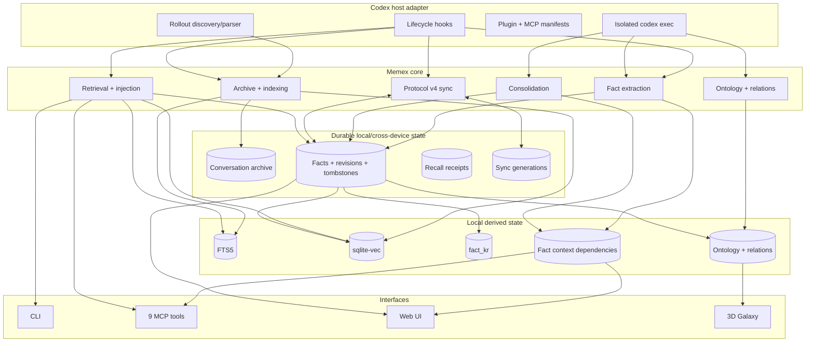
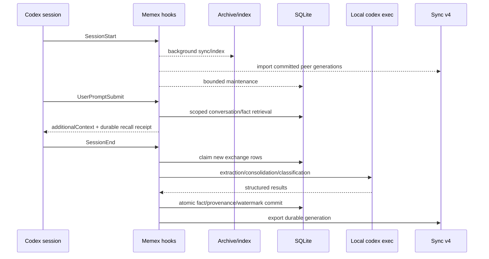

# Memex 아키텍처

## 1. 설계 목표

Memex는 Codex 대화를 수집해 검색 가능한 conversation corpus와 장기 fact로 증류하고, 필요한 순간 다시 꺼내 쓰는 local-first memory layer입니다.

핵심 원칙은 다음과 같습니다.

1. Codex adapter만 rollout, hook, plugin 형식을 압니다.
2. 원본 rollout은 read-only이며 archive와 DB는 재생성 가능한 로컬 계층입니다.
3. fact의 **의미**, **활성 상태**, **provenance**는 서로 다른 수렴 규칙을 가집니다.
4. ontology, KR translation, relation, vector는 local derived state입니다.
5. multi-device sync는 durable state만 generation 단위로 전송합니다.
6. 자동 lifecycle은 bounded, idempotent, observable해야 합니다.
7. project identity는 canonical absolute cwd 하나로 통일합니다.

## 2. 논리 계층



## 3. Fact 상태 모델

하나의 fact row에는 서로 성격이 다른 상태가 함께 존재하지만, 충돌 규칙은 분리됩니다.

### Semantic axis

의미를 구성하는 상태:

- `fact`
- `category`
- `scope_type`
- `scope_project`

로컬 async writer의 stale-result 방지는 `semantic_generation`을 사용하고, cross-device winner는 `semantic_updated_at`으로 결정합니다.

### Lifecycle axis

활성 상태:

- `is_active`

로컬 stale-result 방지는 `lifecycle_generation`, cross-device winner는 `lifecycle_updated_at`을 사용합니다. 동일 시각의 tie는 privacy/search safety를 위해 inactive가 이깁니다.

### Lineage axis

- `source_exchange_ids` — 모든 기기와 concurrent writer의 값을 set union
- `consolidated_count` — max

lineage는 semantic winner가 누구인지와 관계없이 단조 증가해야 합니다.

### Derived overlay

- `fact_kr`
- `ontology_category_id`
- ontology domains/categories
- typed relations
- primary/KR/category vectors
- `fact_context_dependencies` interpretive lineage

`fact_context_dependencies`는 Fact 해석에 사용된 exchange를 로컬에서 감사하기 위한 별도
관계입니다. authoritative evidence가 아니며 `source_exchange_ids`와 합치거나 protocol v4로
동기화하지 않습니다. 나머지 derived 값처럼 semantic state와 local conversation corpus에
종속됩니다.

## 4. 주요 컴포넌트

| 컴포넌트 | 책임 |
| --- | --- |
| `src/codex-rollout.ts` | sessions root, rollout discovery, host metadata |
| `src/parser.ts` | JSONL → exchange/tool-call 모델 |
| `src/sync.ts` | rollout archive와 incremental indexing orchestration |
| `src/indexer.ts` | archive snapshot을 검색 corpus로 반영 |
| `src/fact-extractor.ts` | exact-span/call-ID evidence binding → fact 후보, bounded causal context index → local dependency |
| `src/consolidator.ts` | DUPLICATE/CONTRADICTION/EVOLUTION/INDEPENDENT 판단 |
| `src/fact-management.ts` | semantic/lifecycle mutation과 CAS |
| `src/sync-export.ts` | durable generation export |
| `src/sync-import.ts` | protocol v4 검증과 axis별 reconciliation |
| `src/ontology-classifier.ts` | taxonomy classification, attempt/fallback 관리 |
| `src/ontology-db.ts` | taxonomy epoch, category/relation persistence |
| `src/search.ts` | vector/text/hybrid retrieval |
| `src/inject-*.ts` | warm/cold retrieval, dedup, budget, recall receipt |
| `src/mcp-server.ts` | MCP validation과 dispatch |
| `ui/server.cjs` | loopback UI/API와 guarded fact mutation |

## 5. End-to-end 흐름



SessionStart의 background sync, sync import, maintenance는 독립 async 작업입니다. 순서가 아니라 **eventual consistency**를 계약으로 삼고, 각 writer가 자체적으로 concurrency-safe해야 합니다.

## 6. Sync protocol v4

기기 간 이동하는 durable payload는 네 파일입니다.

```text
facts.jsonl
fact-revisions.jsonl
fact-tombstones.jsonl
recall-events.jsonl
```

각 export는 `devices/<device-id>/generations/<uuid>/` 한 세대로 commit됩니다. `meta.json`은 protocol version, generation/device identity, payload별 row count와 SHA-256을 고정합니다. `CURRENT`가 새 generation을 가리키는 순간이 commit point입니다.

export 전체(snapshot → generation write → `CURRENT` flip → prune)는 **local SQLite `BEGIN IMMEDIATE` transaction**으로 같은 DB의 exporter를 직렬화합니다. cloud-sync 경로에 별도 lockfile을 두지 않습니다.

importer는 DB mutation 전에 generation 전체를 메모리에 pin하고 다음을 fail-closed로 검증합니다.

- protocol version = 4
- `CURRENT`와 manifest generation 일치
- device identity 일치
- 필수 파일 존재
- row count / SHA-256 일치
- 모든 JSONL row가 JSON이며 v4 schema에 부합

한 항목이라도 실패하면 그 device generation 전체를 적용하지 않습니다.

## 7. 일관성과 장애 모델

- exchange upsert는 rowid-preserving update입니다.
- extraction의 fact/provenance/context dependency/saved count/watermark는 같은 transaction에 있습니다.
- semantic mutation은 revision, context dependency 정리, vectors, KR/ontology invalidation, relation cleanup을 하나의 commit으로 처리합니다.
- async derived writer는 계산 전에 generation/epoch을 캡처하고 commit 시 다시 검증합니다.
- consolidation은 semantic + lifecycle generation을 함께 CAS합니다.
- replicated lifecycle은 원격 event time을 보존하며 commit transaction 안에서 LWW를 다시 판단합니다.
- privacy purge는 authoritative source뿐 아니라 excluded context에 의존한 fact도 제거하고,
  taxonomy 전체를 invalidate하며 taxonomy epoch를 증가시켜 in-flight classifier를 폐기합니다.
- 실패한 background 작업은 완료로 가장하지 않으며 다음 lifecycle에서 재시도할 수 있어야 합니다.

## 8. 보안과 신뢰 경계

| 경계 | 방어 |
| --- | --- |
| rollout/archive input | path confinement, bounded decompression, malformed-line isolation |
| project/scope | canonical absolute path, explicit enum, no cwd guessing |
| SQLite | parameterized query, FK enforcement, transactions/CAS |
| sync payload | generation manifest, hash/count/schema fail-closed |
| model call | isolated local `codex exec`, read-only sandbox, recursion guard |
| retrieval evidence | provenance classification, Memex recall non-learnable |
| Web mutation | loopback, same-origin POST JSON, body/schema guard |
| logs | prompt/fact 본문 대신 상태·길이·카운터 중심 기록 |

## 9. 배포 단위

일반 사용자는 source checkout을 직접 build하지 않습니다. Codex plugin cache에는 manifest, skills, hook/MCP launcher가 설치되고 `cli/runtime-exec.js`가 `github:BongSuCHOI/memex#main` runtime을 `npx` isolated cache에서 실행합니다.

MCP는 `$XDG_CACHE_HOME/memex/npm-mcp`(기본 `~/.cache/memex/npm-mcp`) 전용 cache를 사용합니다. `main`이 runtime release channel이므로 **검증된 commit만 main에 들어가는 것**이 release safety boundary입니다.
