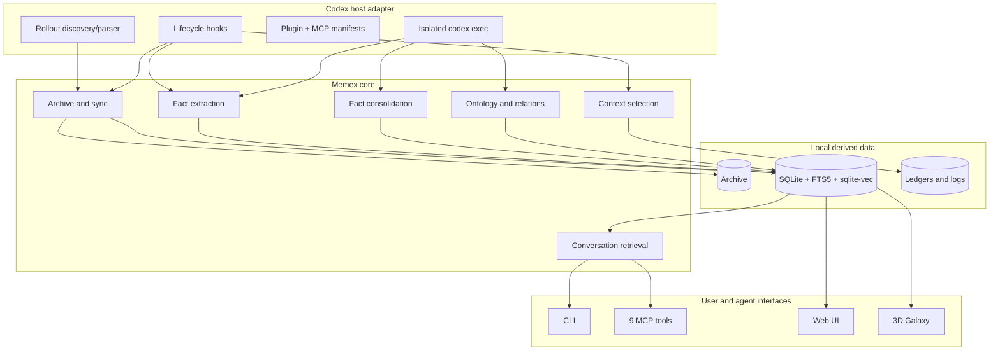
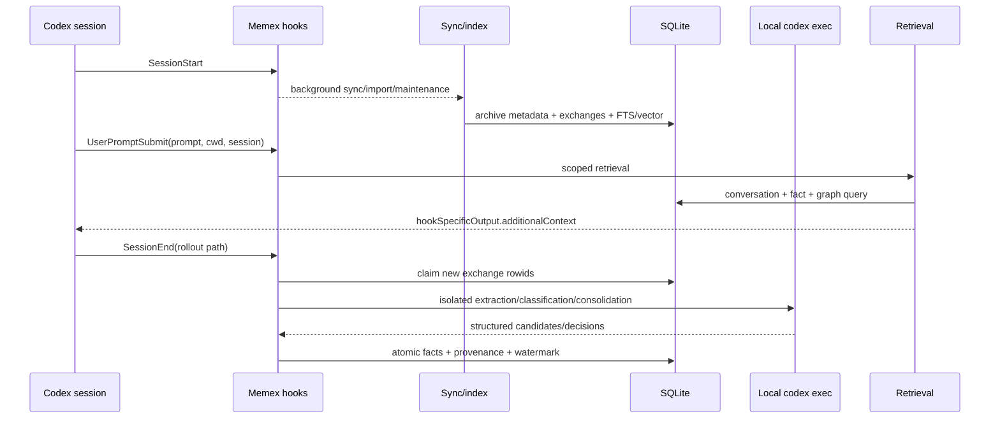
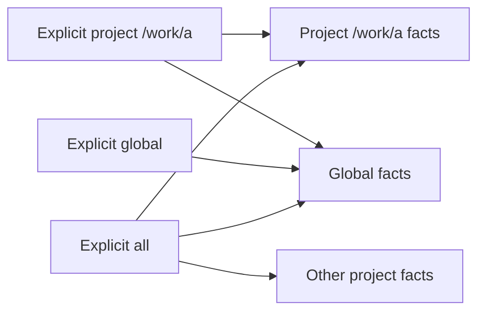

# Memex 아키텍처

## 1. 설계 목표

Memex는 대화 원본, 파생 검색 인덱스, 장기 사실, 지식 그래프, 검색/주입 표면을
분리합니다. 원본을 보존하면서 파생 계층은 재생성할 수 있고, 어떤 fact가 어디서
왔는지 역추적할 수 있어야 합니다.

핵심 원칙:

1. Codex adapter만 rollout/hook/plugin 형식을 안다.
2. core는 archive, exchange, fact, ontology, relation, scope를 다룬다.
3. 원본 rollout은 read-only이며 DB는 파생 상태다.
4. project identity는 canonical absolute cwd 하나다.
5. model execution은 local Codex CLI 하나이며 ephemeral/read-only다.
6. 모든 자동 lifecycle은 bounded, idempotent, observable해야 한다.

## 2. 논리 계층

## 3. 주요 컴포넌트

| 컴포넌트 | 책임 | 금지 사항 |
| --- | --- | --- |
| `src/codex-rollout.ts` | sessions root, rollout discovery, host metadata | 다른 agent transcript 경로 fallback |
| `src/parser.ts` | JSONL을 exchange/tool-call 모델로 변환 | 원본 수정, malformed 전체 중단 |
| `src/sync.ts` | archive copy, incremental index orchestration | partial success를 완료로 기록 |
| `src/db.ts` | schema/migration, FTS/vector capability | rowid를 바꾸는 replace update |
| `src/fact-extractor.ts` | eligible exchange batching, fact 후보 생성 | watermark 선행 전진 |
| `src/consolidator.ts` | duplicate/contradiction/evolution 판정 | provenance/revision 유실 |
| `src/ontology-*.ts` | domain/category와 typed relation | scope를 무시한 edge 생성 |
| `src/search.ts` | vector/text/hybrid conversation retrieval | incompatible embedding 혼합 |
| `src/inject-*.ts` | warm/cold retrieval, gate, dedup, budget | prompt마다 동일 fact 재주입 |
| `src/mcp-server.ts` | MCP schema, validation, tool dispatch | `process.cwd()` project 추측 |
| `src/lifecycle.ts` | hook ownership/setup/remove/doctor | 다른 사용자의 hook 제거 |
| `ui/server.cjs` | loopback API/UI와 guarded fact mutation | 외부 interface bind |

## 4. End-to-end 데이터 흐름

## 5. Identity와 scope

`session_meta.cwd`를 lexical normalize한 absolute path가 canonical project입니다.
같은 basename의 두 경로는 서로 다른 project입니다. archive 저장 폴더는 사람이 읽기
쉬운 basename과 hash를 조합하지만 identity로 사용하지 않습니다.

scope는 seed 선택뿐 아니라 relation traversal의 모든 hop, sync import, fact API,
MCP, Web UI에 반복 적용합니다.

## 6. 일관성과 장애 모델

- sync는 archive/index 각 결과를 관측하고 오류 목록을 반환한다.
- exchange update는 row-preserving UPSERT다.
- extraction은 session 단위 claim lease와 `last_exchange_rowid`를 사용한다.
- 사실/출처/saved count/watermark는 같은 commit 경계에 있다.
- failure는 claim 만료 후 retry 가능하며 동일 session no-new-row는 model call 0이다.
- semantic fact mutation은 existing identity를 유지하고 revision, stored embedding,
  primary/KR vector, ontology, relation 상태를 한 transaction에서 전환한다.
- injection ledger는 bounded/TTL/atomic/fail-open이다. ledger 실패가 prompt를 막지 않는다.
- `memex update`는 Git marketplace refresh 후 plugin cache를 remove/add하고 data를
  보존한다. reinstall 실패 시 exact recovery command를 출력한다.

## 7. 보안과 신뢰 경계

| 경계 | 방어 |
| --- | --- |
| rollout/archive input | path confinement, bounded decompression, malformed-line isolation |
| project/scope input | absolute canonical validation, enum validation, no cwd fallback |
| SQLite | parameterized queries, foreign keys, transactions |
| model call | ephemeral, ignore user config/rules, read-only sandbox, temp cwd, recursion guard |
| MCP read | archive root confinement, schema validation |
| Web mutation | loopback, POST-only, JSON, origin/content-type/body limit, service validation |
| hooks | plugin manifest discovery; explicit fallback만 ownership fingerprint + receipt |
| logs | prompt/fact 본문 대신 상태/길이/카운터 중심 redaction |

## 8. 배포 단위

Codex cache에는 manifest, skills, hook/MCP launcher가 설치됩니다. Dependency-free
`cli/runtime-exec.js`는 MCP와 hook 모두에서 `github:BongSuCHOI/memex#main`을 단일
source spec으로 사용하고, `npx`가 실제 runtime과 native dependency를 npm isolated
cache에서 실행합니다. 장기 실행 MCP는 SessionStart hook과 동시에 Git package를
해석해도 충돌하지 않도록 `$XDG_CACHE_HOME/memex/npm-mcp`(기본
`~/.cache/memex/npm-mcp`) 전용 cache를 사용합니다. 따라서 일반 사용에는 source checkout이나 build가 필요하지
않습니다. MCP manifest의 300초 시작 제한은 첫 isolated-cache 준비가 Codex 기본
10초 제한에 잘리는 것을 방지합니다. 이 구조에서 검증된 `main`만 배포하는 것이
release safety boundary입니다.
