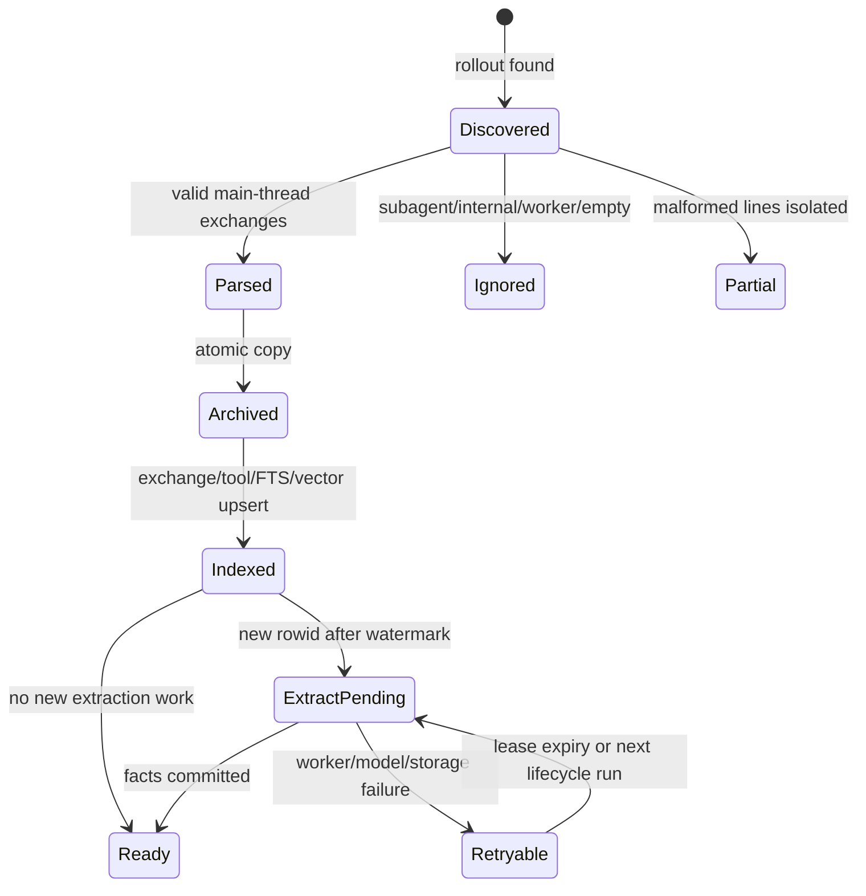
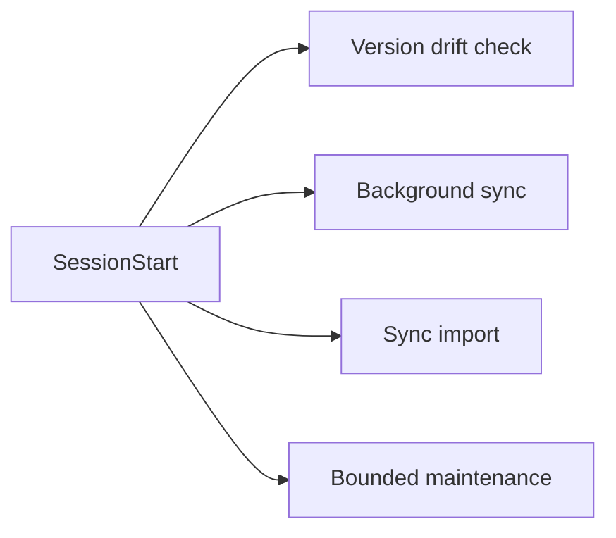
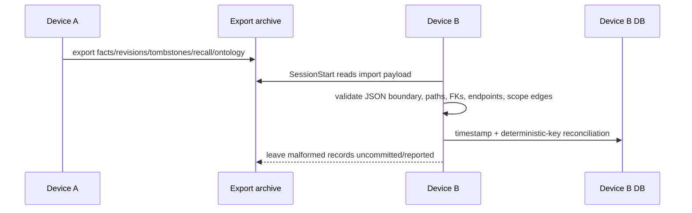

# 대화 수집과 라이프사이클

## 1. 상태 머신



## 2. 발견과 판정

기본 입력은 `$CODEX_HOME/sessions/YYYY/MM/DD/rollout-*.jsonl`입니다. parser는
`session_meta`, user/assistant message, tool call/result를 교환 단위로 조립합니다.
user/assistant turn은 `response_item`의 `message` role에서만 조립하며 `event_msg`는
`user_message` 형태의 payload를 포함해 transport noise로 무시합니다. 지원 근거가 없는
구형 shape를 추측해 human evidence로 승격하지 않습니다.
다음 입력은 knowledge corpus에서 제외됩니다.

- subagent/worker thread
- tool-only 또는 빈 main conversation
- Memex 자체 isolated model prompt/worker workdir — 예약 basename `memex-llm`과
  `codex exec`가 실제 생성하는 mkdtemp 접미사 형태(`memex-llm-XXXXXX`) 모두.
  마지막 경로 세그먼트 기준이므로 basename이 중간에 포함된 slug는 실제 프로젝트로
  유지된다.
- 사용자가 exact canonical path로 제외한 project

malformed 한 줄은 해당 줄의 오류로 격리하며 전체 archive discovery를 중단하지 않습니다.

`type: "compacted"` 레코드는 transport noise로 전체가 무시됩니다. 특히 그 안의
`replacement_history`(user/assistant/developer message 재생 목록과 암호화된
compaction payload)는 어떤 형태로든 exchange로 재조립되지 않습니다. 압축 요약이
recalled fact나 agent synthesis를 human evidence처럼 다시 유입시키는 self-ingestion을
이 계약이 차단하며, 회귀 테스트는 `compacted-thread.jsonl` fixture가 소유합니다.

제외 마커(`DO NOT INDEX`, `NO_INSIGHTS_FOUND`, summarizer context marker)는
**user-role message 페이로드 안에서만** 유효합니다 — 채팅에 직접 입력하거나
AGENTS.md(`user_instructions`/`environment_context` 블록로 기록됨)에 넣은 지시가
여기 해당합니다. tool 결과·assistant 출력·그 외 기록 필드에 등장하는 동일 문자열은
개발 중 소스코드나 문서를 읽은 흔적일 뿐이며 세션 제외 근거가 되지 않습니다.
이 전사적 raw substring 검사가 만든 self-exclusion 루프(memex 개발 세션이
스스로 인덱스에서 빠지는 현상)를 이 계약이 차단하며, 회귀 테스트는
`sync-exclusion-marker.test.ts`가 소유합니다.

user-role 제외 마커의 의미는 **conversation-wide**입니다. marker가 처음 발견된
시점과 무관하게 `sync`, `index-all`/`rebuild`, `index-session`, `index-cleanup`은 같은
`conversation-policy` 판정을 사용합니다. source rollout은 변경하지 않고 rebuild 가능한
archive 사본은 보존하지만, 기존 exchange/tool call, FTS/vector, session extraction/recall ledger,
summary, 그리고 해당 exchange를 evidence로 사용한 fact/revision/vector/relation은
제거합니다. 여러 source가 합쳐진 fact도 문장 일부의 출처를 분리 증명할 수 없으므로
fact 전체를 제거합니다. 제거된 fact는 tombstone(`source_conversation_excluded`)으로
기록해 오래된 multi-device sync snapshot이 부활시키지 못합니다.

SessionEnd 추출 경로도 같은 정책을 적용합니다. fact-extract worker는 extraction gate에서
transcript의 user 제외 마커를 `getConversationEligibility()`로 재확인하고, `user_excluded`
판정이면 추출 전에 purge를 실행한 뒤 추출을 금지합니다. 따라서 부분 인덱싱된 세션에서
마지막 user turn이 marker를 선언해도 fact가 만들어지기 전에 기존 인덱스가 먼저 제거되며,
SessionEnd의 sync-export는 privacy tombstone만 남긴 payload를 내보냅니다
(marker 관측 → purge → 추출 금지 → export 순서 고정). subagent는 훅의 parse 가드가,
excluded project는 extraction의 제외 마커 경로가 각자 소유합니다.

## 3. project identity와 archive key

```text
identity = canonicalAbsolute(session_meta.cwd)
storage  = safeBasename(identity) + "--" + shortHash(identity)
```

identity와 storage key를 분리하므로 `/team-a/app`과 `/team-b/app`은 basename이 같아도
archive/DB/analyze 전 구간에서 충돌하지 않습니다. sync/index 경로뿐 아니라 public
`parseConversationFile()` convenience wrapper도 같은 canonical identity SSOT를 사용하며,
basename은 표시 이름이나 storage key의 일부로만 사용합니다.

## 4. archive와 index

plain `.jsonl`과 `.jsonl.zst`는 같은 logical read API를 통과합니다. zstd는 압축 해제
상한을 넘으면 실패하며, parser/search/read/stats/verify가 동일한 bounded reader를
사용합니다.

exchange upsert는 primary key 충돌 때 기존 row를 update하며 rowid를 보존합니다.
이 불변식이 깨지면 `last_exchange_rowid` 이후라는 extraction 조건이 과거 교환을 새
데이터로 오인하므로 금지합니다.

exchange id는 교환의 논리 신원으로, (세션, user turn 행 위치)에서 결정론적으로
파생됩니다 — `md5(session_id:user_line)`. 기기별 archive 경로와 assistant/tool 행
위치는 신원 재료가 아닙니다(경로는 `archive_path` 컬럼의 location metadata일 뿐).
user 행은 append-only rollout에서 불변이므로 turn이 자라도(assistant/tool 행 추가)
같은 교환으로 upsert되고, session_meta 없는 파일은 경로 독립인 content 폴백 키를
씁니다. 이 결정론 덕에 서로 다른 기기가 같은 rollout을 재색인하면 같은 교환 id를
만들고, cross-device fact provenance(`source_exchange_ids`)가 로컬 exchange와
연결됩니다.

재색인은 삽입 전에 desired-set reconciliation을 수행합니다. 같은 archive의 DB 행
집합과 새 파싱의 교환 집합을 한 transaction으로 대조해, line이 desired에 없는 행은
통합 삭제 primitive(tool_calls + vec + exchange, FTS는 trigger)로 제거하고, line이
일치하지만 legacy(archive 경로 기반) id인 행은 canonical id로 rename하며 그 참조
전부(tool_calls, vec row, facts.source_exchange_ids, fact_revisions.source_exchange_id)를
재작성합니다. 삭제된 교환을 참조하던 provenance 항목도 함께 정리해 죽은 포인터를
남기지 않습니다. tool_calls는 교환별 desired set으로 대체되므로 parse 사이에 사라진
call이 고아 증거로 남지 않습니다.

FTS5 external-content table은 insert/update/delete trigger로 동기화됩니다. vector는
384차원 int8 embedding과 `embedding_version`을 사용합니다. version이 다르면 동일
검색 공간으로 섞지 않습니다.

요약은 아카이브가 마지막 요약 이후 변경되지 않았을 때만 현재 것으로 인정한다(재감사
§6 freshness). resume으로 rollout이 길어져 아카이브 mtime이 요약보다 새로워지면
재색인 경로가 요약을 재생성한다 — 존재 여부만 검사하는 구동작은 잘린 요약을 영원히
광고했다. 아카이브는 Memex가 소유하는 append-only 사본이므로 별도 fingerprint 상태
없이 mtime 비교로 충분하다.

## 5. 세 이벤트의 책임

### SessionStart



네 명령은 `hooks.json`에서 서로 독립적인 async 항목이며 순서 보장은 없다 — 이것은
문서화된 eventual-consistency 계약이지 ordered pipeline이 아니다(재감사 P2-4). 각
명령은 다른 명령의 완료를 기다리지 않고, 완료 순서는 비결정적이다. 이 계약이
성립하는 이유는 의존성이 없기 때문이다: `sync`는 rollout 아카이브와 색인만 만들고
export를 수행하지 않으며, sync import는 다른 기기가 쓴 snapshot을 읽고, maintenance는
로컬 DB 상태만 본다. import가 export와 동시에 실행돼도 generation snapshot(P2-5)이
파일 집합의 일관성을 보장하므로 import는 항상 온전한 generation 중 하나만 읽는다.
놓친 변경은 다음 SessionStart에서 eventual recovery된다. 각 명령은 session 시작을
막지 않고, sync import는 scope enum, canonical path, ontology FK, relation
enum/endpoints/cross-project edge를 검증한 데이터만 기록한다.

### UserPromptSubmit

prompt, session id, canonical cwd를 thin hook client가 받아 warm sidecar socket을 먼저
사용하고, 불가능하면 같은 retrieval core의 cold local 경로를 사용합니다. 성공한
context는 Codex 0.149.1 계약의 `continue: true`와
`hookSpecificOutput.additionalContext`로 반환합니다.

context를 반환하기 전에 retrieval core는 `recall_events`에
`session_id + SHA-256(human prompt) + injected fact IDs` receipt를 기록합니다. receipt
저장 실패는 fail-closed이며 context를 반환하지 않습니다. SessionEnd indexing은 같은
prompt hash를 가진 `status=emitted` receipt의 exchange에 `memex_recall` provenance와
`assistant_learnable=0`을 부여합니다. 각 event는 계산 시 `prepared`, hook이 stdout에
쓴 뒤 `emitted`로 바뀝니다. 동일 prompt 반복은 별도 event ID를 가집니다. Codex host의
실제 consumption은 현재 hook 계약으로 관측하지 못하므로 status로 주장하지 않습니다.
`prepared`만 남은 event는 context emission 증거가 없으므로 exchange를 taint하지 않습니다.

MCP `mcp__memex__*` result는 call 단위 `memex_recall/learnable=0`입니다. parser는
`call_id`로 모든 tool result를 원 호출에 연결하고, sibling local repo/Git/test result는
독립 trust classification을 받아 learnable 상태를 유지합니다.

### SessionEnd

종료 직후 rollout 파일이 계속 쓰일 수 있으므로 size/mtime quiet window를 확인합니다.
안정된 nonempty main rollout만 extraction 대상으로 삼습니다. worker는 extraction 전에
user exclusion gate를 통과하며(위의 conversation-wide exclusion 절 참조), 성공 evidence가
없으면 watermark와 export success 상태를 기록하지 않습니다.
privacy-safe hook observation은 stdin을 읽은 직후 정확히 한 번 기록하며, 정상 extraction
경로가 같은 `SessionEnd` event를 중복 기록하지 않습니다.

## 6. 동기화와 import/export



import는 외부 데이터 경계입니다. global↔project와 same-project relation은 허용하지만,
서로 다른 두 project fact의 직접 relation은 거부합니다.

sync protocol v2는 active/inactive fact, `fact_revisions`, hard-delete
`fact_tombstones`, `recall_events`, ontology domain/category/relation을 내보냅니다.
각 local DB는 `sync_meta.device_id`를 한 번 생성하고 `sync/devices/<device_id>/`만
소유해 다른 기기의 snapshot을 overwrite하지 않습니다.

한 export는 하나의 generation이다(재감사 P2-5): export는 단일 read transaction으로
모든 행을 모으고, 파일 집합 전부를 `sync/devices/<device_id>/generations/<uuid>.tmp`에
쓴 뒤 원자적 directory rename으로 commit하고, 마지막에 `CURRENT` manifest를 원자적으로
교체한다. importer는 committed generation만 읽으므로 crash·cloud-sync 관측·동시 export
어느 쪽도 facts=N+1/revisions=N 같은 혼합 snapshot을 만들 수 없다. importer가 기기당
읽는 것은 CURRENT가 가리키는 generation 하나뿐이며(legacy v2 layout인 device root는
CURRENT가 없을 때의 폴백), CURRENT가 깨진 경우 device root로 폴백하고 그 손상을
`malformedRows`로 보고한다. export는 최신 2개 generation(current + 이전)만 유지하고
1시간 넘은 `.tmp` 잔재를 정리한다. root JSONL은 v1 reader를 위한 호환 mirror로서
generation commit 이후 파일 단위 원자 쓰기로 갱신된다 — 파일 전체는 항상 온전하지만
파일 집합의 동시성은 보장하지 않는다(v1 compat surface는 set-atomic이 아님). v2
import는 root mirror와 각 device의 committed generation을 합쳐 판정한다.

export 성공/실패는 `sync/export-status.json`에 기록된다(재감사 P2-6). SessionEnd는
export 실패로 lifecycle을 wedge하지 않지만, parent hook은 child 결과와 status를 검사해
`EXPORT_FAILED`를 stderr에 남기고 `memex doctor`의 `sync-export` 체크가 마지막 시도를
노출한다. 다음 SessionEnd export가 자연히 재시도하고 status를 덮어쓴다.

import는 외부 데이터 경계이며 malformed 행을 조용히 버리지 않는다(재감사 P2-7): 유효
행은 계속 import하되, parse에 실패한 행은 file/line/error와 함께 `malformedRows`로
누적되어 hook의 stderr에 보고된다.
fact 충돌은 semantic event clock(`semantic_updated_at`)이 최신인 event가 이기며,
같은 시각은 canonical fact key로 결정합니다. 분류나 consolidation 확인 같은 비의미
metadata 쓰기가 `updated_at`을 밀어도 상대의 의미 편집을 이기지 못하고, payload에
`semantic_updated_at`이 없는 구버전은 `updated_at`으로 폴백합니다. hard-delete
tombstone은 같은 timestamp의 fact보다 우선하고, tombstone보다 strictly newer
semantic event만 restore/edit event로 인정합니다. 예외로
`source_conversation_excluded` tombstone은 terminal privacy state입니다 — unexclude 또는
re-consent event가 프로토콜에 존재하지 않으므로 timestamp와 무관하게 fact를 부활시키지
않고, 더 새로운 peer edit보다 우선해 삭제를 전파하며, 더 새로운 non-privacy tombstone으로
이유가 강등되지 않습니다. imported fact text는 local current
embedding으로 다시 생성하며, fact row와 vector swap은 한 transaction입니다. fact update는
기존 endpoint relation을 무효화한 뒤 현재 export relation만 다시 연결하므로 stale edge가
남지 않습니다. relation payload는 양 endpoint의 `semantic_updated_at`을 함께 기록하며(구버전
reader를 위한 `updated_at` stamp 병행), chosen current fact version과 일치할 때만
import합니다 — payload에 semantic stamp가 없으면 기존 `updated_at` 검증으로 폴백합니다.
inactive fact도 relation endpoint 완전성을 위해 export합니다.

`recall_events`는 rollout만으로 재구축할 수 없는 self-ingestion 안전 receipt라 sync합니다.
import는 emitted receipt와 같은 `session_id + prompt_hash` exchange에 `memex_recall`,
`assistant_learnable=0`, `has_memex_recall=1`을 다시 적용하므로 conversation reindex와
receipt import의 실행 순서가 바뀌어도 safety provenance가 복구됩니다.
반면 `extraction_log.last_exchange_rowid`는 각 local DB의 `exchanges.rowid`에 종속되고,
`needs_consolidation`/`consolidation_attempts`는 local processing state이므로 기기 간
복사하지 않습니다. sync-import된 active fact는 source `created_at`과 무관하게 local dirty
queue에 등록됩니다.

DB 파일만 삭제되고 archive/source rollout은 남은 복구에서는 `memex sync`가 unchanged
archive도 전부 다시 index합니다. 이후 SessionStart sync import가 protocol v2 durable state를
복원하고 maintenance/backfill이 local processing state를 재생성합니다. source rollout,
archive, sync JSONL까지 모두 삭제한 경우 facts/revisions/recall receipt의 완전 복구는
불가능하며, 사전 data-root backup이 필요합니다.

## 7. 관측 가능성

- lifecycle observation: timestamp/event/session/cwd 같은 최소 메타데이터
- injection log: status, prompt length, candidates, injected/deduped/chars, duration, path
- error log: import/Node-level failure
- sync export status: `sync/export-status.json` — 마지막 export 시도의 ok/error/counts(재감사 P2-6)
- sync import: malformed 행은 file:line/error로 hook stderr에 보고(재감사 P2-7)
- `memex doctor`: dependency/build/hook configured/observed/trust/MCP contract/sync-export
- `memex status`: conversation/fact/graph readiness와 backlog를 분리. extraction pending은
  워커가 실제로 처리할 적격 세션만 계산하고, 정책상 제외된 세션(min-exchange gate,
  excluded project/LLM workdir)은 `excluded`로 별도 표시한다 — 상태 표시와 워커 선정 술어가
  같은 게이트(pendingExtractionCoreQuery의 minExchanges/excludeProjects)를 공유한다.
  워커가 영원히 다시 집지 않는 세션(seed marker(-1), 워터마크가 덮이지 않는 permanent
  failure(-2))은 `deferred`로 별도 계상해 pending을 부풀리지 않는다.
  `done`은 성공 marker뿐 아니라 `last_exchange_rowid`가 현재 session의 최대 exchange
  rowid를 덮을 때만 증가한다. 따라서 resume suffix가 추가된 session은 기존 성공 marker가
  있어도 `done`에서 빠지고 `pending`에만 포함된다.

로그가 없으면 hook 미실행과 no-match를 구분할 수 없습니다. `doctor`와 injection
status를 함께 봅니다.
