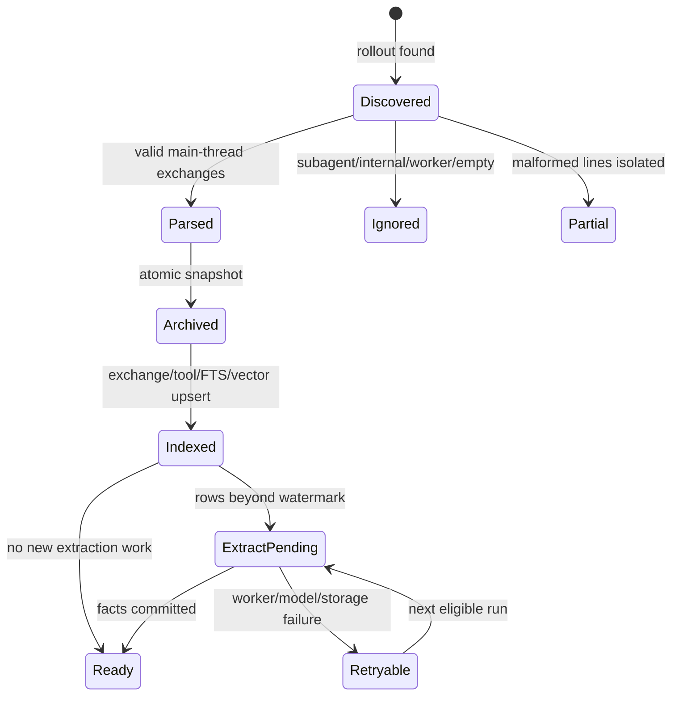
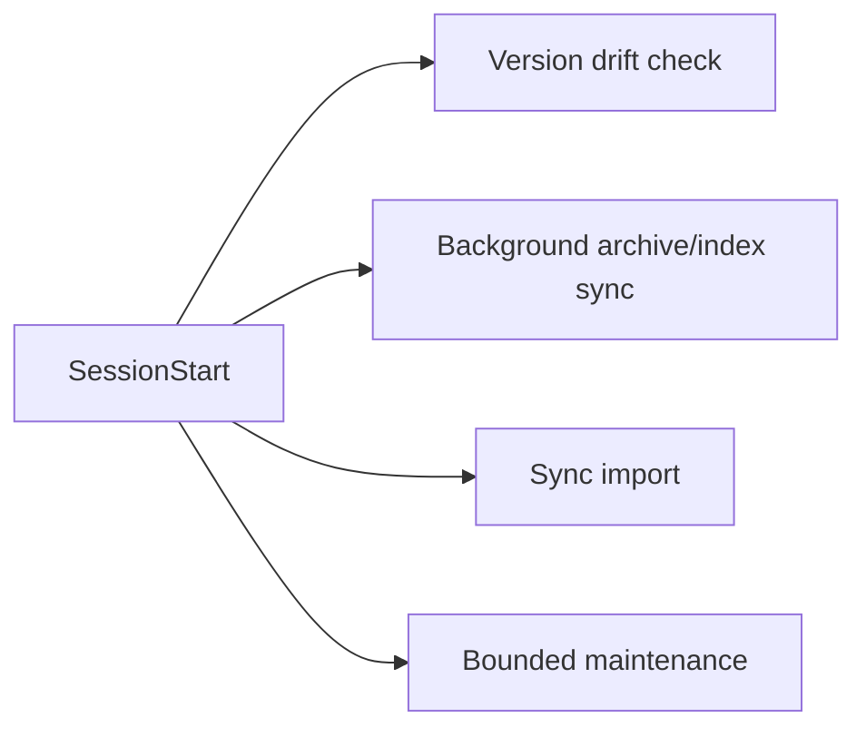

# 대화 수집과 라이프사이클

## 1. 상태 머신



## 2. Rollout 발견과 eligibility

기본 입력은 `$CODEX_HOME/sessions/YYYY/MM/DD/rollout-*.jsonl`입니다. parser는 `session_meta`, user/assistant message, tool call/result를 exchange 단위로 조립합니다.

다음은 knowledge corpus에서 제외합니다.

- subagent/worker thread
- tool-only 또는 빈 main conversation
- Memex 자체 isolated model workdir (`memex-llm`, `memex-llm-*`)
- 사용자가 exact canonical path로 제외한 project
- user-role payload에 conversation exclusion marker가 있는 session

`type: "compacted"` transport record와 그 안의 replacement history는 인간 evidence로 승격하지 않습니다. malformed JSONL line은 해당 line의 오류로 격리하며 전체 파일 discovery를 중단하지 않습니다.

### Conversation exclusion

`DO NOT INDEX`, `NO_INSIGHTS_FOUND` 등 exclusion marker는 **user-role message payload**에서만 유효합니다. tool 결과나 assistant 출력, 소스코드 안에 같은 문자열이 등장한 것은 제외 근거가 아닙니다.

marker의 의미는 conversation-wide입니다. marker가 어느 시점에 나타났든 sync/index/rebuild/SessionEnd extraction은 동일한 eligibility 판정을 사용합니다.

## 3. Project identity와 archive

```text
identity = canonicalAbsolute(session_meta.cwd)
storage  = safeBasename(identity) + "--" + shortHash(identity)
```

같은 basename을 가진 서로 다른 cwd는 다른 project입니다. archive storage key는 표시/저장 편의를 위한 값일 뿐 identity가 아닙니다.

원본 rollout은 수정하지 않습니다. Memex archive는 재구축 가능한 snapshot이며 parser/indexer는 **검증한 archive snapshot 자체를 다시 parse**합니다. source를 검사한 뒤 live source를 다시 읽는 TOCTOU 경로를 만들지 않습니다.

## 4. Exchange index

exchange ID는 `(session_id, user turn line)`에서 결정론적으로 파생되며 archive path는 identity 재료가 아닙니다. 같은 turn이 assistant/tool suffix를 더 받아도 동일 ID로 upsert됩니다.

재색인은 desired-set reconciliation을 수행합니다.

- desired에 없는 기존 exchange 삭제
- legacy ID를 canonical ID로 rename
- `tool_calls`, vector row, fact provenance, revision source reference 갱신
- 사라진 tool call/죽은 provenance pointer 제거

FTS5는 external-content trigger로 동기화하며 vector row는 현재 embedding generation과 같은 공간에서만 검색합니다.

## 5. Lifecycle hooks

### SessionStart



이 작업들은 독립적인 async hook entry입니다. 실행 순서를 보장하지 않으며 eventual consistency를 계약으로 사용합니다. 따라서 import, maintenance, reembed 등 각 writer는 다른 작업이 동시에 진행돼도 안전해야 합니다.

### UserPromptSubmit

prompt/session/project를 받아 warm sidecar를 우선 사용하고 불가능하면 같은 retrieval core의 cold path로 fallback합니다. context를 반환하기 전에 `recall_events`에 durable `prepared` receipt를 기록하고, hook stdout emit 후 `emitted`로 전환합니다.

receipt 저장이 실패하면 provenance 없는 context를 주입하지 않습니다.

### SessionEnd

rollout의 size/mtime quiet window를 확인한 뒤 stable main-thread session만 incremental extraction 대상으로 사용합니다. exclusion gate를 다시 확인하고, 성공 evidence가 없으면 extraction watermark를 전진시키지 않습니다.

마지막으로 durable sync generation export를 시도합니다. export contention은 `ExportLockedError` 성격의 retryable 상태이며 다음 SessionEnd에서 다시 시도할 수 있습니다.

## 6. Sync protocol v4

protocol v4는 semantic, lifecycle, lineage를 분리합니다.

### Durable payload

```text
facts.jsonl
fact-revisions.jsonl
fact-tombstones.jsonl
recall-events.jsonl
meta.json   # integrity manifest
```

다음은 sync하지 않는 local derived state입니다.

- `fact_kr`
- `ontology_category_id`
- ontology domains/categories
- ontology relations
- `vec_*` tables

### Generation commit

한 export는 하나의 generation입니다.

```text
sync/
└── devices/<device-id>/
    ├── CURRENT
    └── generations/
        ├── <generation-a>/
        └── <generation-b>/
```

exporter는 local DB에서 하나의 consistent snapshot을 읽고 generation temp directory에 전체 파일을 쓴 뒤 directory rename으로 commit합니다. 그 다음에만 `CURRENT`를 원자적으로 교체합니다.

같은 local DB의 exporters는 SQLite `BEGIN IMMEDIATE` transaction으로 직렬화됩니다. 별도 stale lockfile을 cloud-sync 영역에 만들지 않으며 process 종료 시 SQLite가 lock을 회수합니다.

### Import integrity

importer는 `CURRENT`가 가리키는 generation을 DB mutation 전에 pin합니다. 다음 중 하나라도 실패하면 그 device generation 전체를 reject합니다.

- `meta.json` 누락/파싱 실패
- protocol version != 4
- generation/device mismatch
- payload file 누락
- SHA-256/row count mismatch
- JSON parse failure
- v4 row schema failure
- pinning 중 파일이 사라지거나 읽기 실패

partial generation이나 malformed row를 일부만 적용하지 않습니다.

## 7. Axis별 reconciliation

동일 fact ID에 여러 device generation이 있으면 remote aggregate를 먼저 만듭니다.

### Semantic winner

`semantic_updated_at`이 더 최신인 의미가 승리합니다. 정확한 timestamp tie는 canonical semantic key로 결정합니다.

### Lifecycle winner

`lifecycle_updated_at`이 더 최신인 active/inactive event가 승리합니다. 정확한 tie는 inactive가 승리합니다.

### Lineage merge

모든 contributing row에 대해:

```text
source_exchange_ids = set union
consolidated_count  = max
```

로컬 row가 이미 있으면 최종 commit 직전에 **현재 live lineage를 다시 읽어** remote aggregate와 union/max합니다. embedding await 중 concurrent DUPLICATE consolidation이 provenance를 추가해도 잃지 않습니다.

로컬 row가 없는 fresh insert도 semantic winner의 의미 + lifecycle winner의 상태 + aggregate lineage union/max를 조합합니다.

## 8. Replicated lifecycle

replication은 새로운 사용자 사건이 아닙니다. 따라서 import한 deactivate/restore는 로컬 `now`가 아니라 **원격 `lifecycle_updated_at`을 그대로 보존**합니다.

`applyReplicatedLifecycle`은 commit transaction 안에서 현재 lifecycle clock과 상태를 다시 읽고 LWW를 재판정합니다.

- 상태가 같아도 remote clock이 더 새로우면 clock을 수렴시킵니다.
- 실제 state transition일 때만 local lifecycle generation을 증가시킵니다.
- await 중 더 새로운 local lifecycle event가 발생하면 stale remote plan을 적용하지 않습니다.
- hard-delete tombstone이 있으면 lifecycle event만으로 fact를 부활시키지 않습니다.

## 9. Privacy purge

conversation exclusion이 확인되면 해당 conversation에서 유래한 searchable/model-derived 상태를 제거합니다.

- exchanges/tool calls/FTS/vectors
- extraction/recall ledger와 summary
- 해당 exchange를 evidence로 사용한 facts/revisions/relations/vectors
- terminal privacy tombstone (`source_conversation_excluded`)
- ontology domains/categories/category vectors 전체 invalidate
- surviving public facts의 `ontology_category_id`, attempt ledger reset
- global `taxonomy_state.epoch` 증가

in-flight classifier는 시작 전에 taxonomy epoch을 캡처합니다. purge가 중간에 일어나 epoch이 바뀌면 이전 taxonomy를 근거로 한 결과를 commit하지 못합니다.

원본 Codex rollout과 Memex archive snapshot은 보존됩니다. 즉 privacy purge는 **Memex의 검색/학습/파생 상태에서 제외**하는 계약이며 Codex 자체 history 삭제 기능은 아닙니다.

## 10. Repair와 재구축

archive/index는 재구축 가능해야 합니다. `verify --repair`와 일반 indexing entrypoint는 동일한 archive-ingestion SSOT를 사용해야 하며 worker/internal prompt exclusion, desired-set reconciliation, vector/FTS update 규칙을 우회하지 않습니다.

sync durable state는 DB를 새로 만들더라도 peer generations에서 다시 import할 수 있습니다. 반면 ontology, KR translation, relation, vectors는 local derived state이므로 maintenance/backfill에서 재구성합니다.
