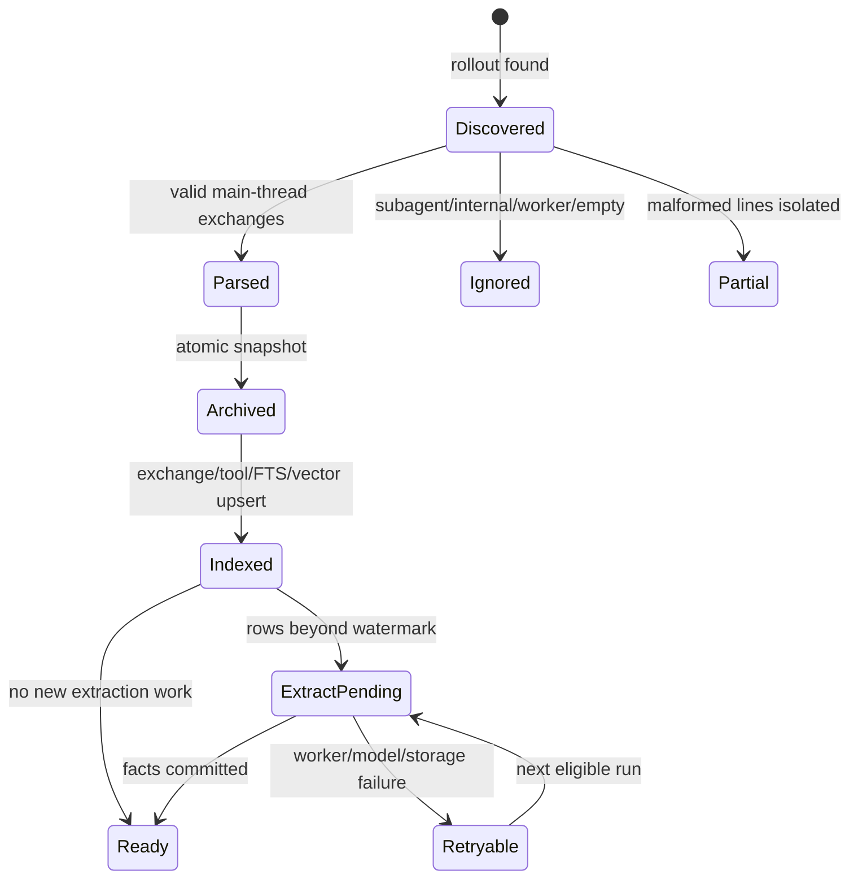
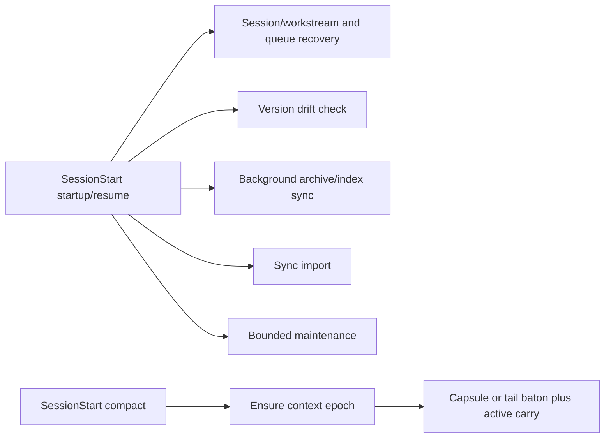

# 대화 수집과 라이프사이클

## 1. 상태 머신



## 2. Rollout 발견과 eligibility

기본 입력은 `$CODEX_HOME/sessions/YYYY/MM/DD/rollout-*.jsonl`입니다. parser는 `session_meta`, user/assistant message, tool call/result를 exchange 단위로 조립합니다.

다음은 knowledge corpus에서 제외합니다.

- subagent/worker thread
- tool-only 또는 빈 main conversation
- Memex 자체 isolated model workdir (`memex-llm`, `memex-llm-*`)
- 사용자가 exact canonical path로 제외한 project
- user-role payload에 conversation exclusion marker가 있는 session

`type: "compacted"` transport record와 그 안의 replacement history는 인간 evidence로 승격하지 않습니다. malformed JSONL line은 해당 line의 오류로 격리하며 전체 파일 discovery를 중단하지 않습니다.

### Conversation exclusion

`DO NOT INDEX`, `NO_INSIGHTS_FOUND` 등 exclusion marker는 **user-role message payload**에서만 유효합니다. tool 결과나 assistant 출력, 소스코드 안에 같은 문자열이 등장한 것은 제외 근거가 아닙니다.

marker의 의미는 conversation-wide입니다. marker가 어느 시점에 나타났든 sync/index/rebuild/SessionEnd extraction은 동일한 eligibility 판정을 사용합니다.

## 3. Project/workspace identity와 archive

```text
logical identity = project_id
local location   = workspace_id + canonicalAbsolute(session_meta.cwd)
archive storage  = safeBasename(cwd) + "--" + shortHash(cwd)
```

기존 path-scoped 데이터는 먼저 canonical path별 1:1 project/workspace로 보존 migration합니다. 같은
device에서 검증된 Git common-dir만 staged auto-link할 수 있습니다. 다른 clone/device는 portable key,
explicit project ID 또는 user-approved remote mapping이 있어야 합칩니다. basename, package name,
remote URL만 같은 후보는 suggestion audit만 남기고 분리합니다. Local Git directory inode identity는
동일 checkout rename을 탐지하는 device-local 보조 신호이며 sync하지 않습니다.

**신뢰할 수 없는 cwd (0.6.0).** `/`, `unknown`, basename이 비어 있는 경로는 project identity로
거절됩니다(`UntrustedProjectPathError`). 예전에는 이런 세션이 전부 하나의 catch-all project로 모여
서로의 fact를 자기 프로젝트 기억처럼 읽었습니다. 그렇게 생긴 기존 project는 `projects.quarantined = 1`로
격리되고(fact는 하나도 지우지 않습니다) `memex status`의 `Quarantined projects`에 나열되며, 격리된
project나 project에 붙지 못한 세션의 read scope는 글로벌 전용으로 낮아집니다.

**Workspace 전이 (0.6.0).** 경로가 실제로 존재하면 세션 시작의 재검사가 권위이며 workspace 행의
`location_kind`/`git_common_dir`/`git_common_identity`/`git_dir_identity`/`remote_fingerprint`/`branch`/
`default_branch`를 그 자리에서 갱신합니다. `workspace_id`·`project_id`는 바뀌지 않으므로 전이 이전의
프로젝트 공용 기억·Capsule·이력은 데이터 변경 없이 그대로 남습니다. 변경이 있으면
`workspace_location_events`에 `WORKSPACE_LOCATION_CHANGED` 한 건(내용 기반 id이므로 같은 전이는 한 번만)이
남고, 새 common dir/remote가 이미 다른 project에 묶여 있으면 자동 병합 대신 `requires_approval = 1`로
표시해 `approved_remote_mappings` 승인을 요구합니다. `.git`이 사라지면 행만 `directory`로 되돌리고
브랜치 tier 기억은 삭제도 자동 강등도 하지 않습니다.

Archive storage key와 absolute path는 location/provenance이지 logical identity가 아닙니다. 기존
canonical-path query는 지원 기간 동안 compatibility reader로 유지하지만 새 code/MCP/sync는 stable
ID scope를 우선합니다. 제거 시점은 future breaking migration에서 별도로 결정합니다.

원본 rollout은 수정하지 않습니다. Memex archive는 재구축 가능한 snapshot이며 parser/indexer는 **검증한 archive snapshot 자체를 다시 parse**합니다. source를 검사한 뒤 live source를 다시 읽는 TOCTOU 경로를 만들지 않습니다.

## 4. Exchange index

exchange ID는 `(session_id, user turn line)`에서 결정론적으로 파생되며 archive path는 identity 재료가 아닙니다. 같은 turn이 assistant/tool suffix를 더 받아도 동일 ID로 upsert됩니다.

재색인은 desired-set reconciliation을 수행합니다.

- desired에 없는 기존 exchange 삭제
- legacy ID를 canonical ID로 rename
- `tool_calls`, vector row, fact provenance, revision source reference, fact context dependency 갱신
- 사라진 tool call/죽은 provenance pointer 제거

FTS5는 external-content trigger로 동기화하며 vector row는 현재 embedding generation과 같은 공간에서만 검색합니다.

`exchanges.git_branch`는 rollout이 직접 알려준 브랜치 → 그 세션이 묶인 workstream의 `branch_hint` →
workspace 행의 `branch` 순으로 채웁니다(0.6.0 #16). 예전에는 rollout이 브랜치를 실어 보내지 않으면
`NULL`로 남아 브랜치가 exchange에도 workstream에도 전파되지 않았습니다.

### Exchange의 visibility/authority 매핑

| exchange content | Archive/FTS/vector | Extraction context | Fact evidence |
| --- | --- | --- | --- |
| human assertion/decision/correction/ratification | searchable | visible | validator 통과 시 허용 |
| trusted local repo/git/test result | searchable | evidence block | 실제 tool provenance 일치 시 허용 |
| ordinary assistant synthesis | searchable | context-only | 금지 |
| recall-influenced assistant / Memex tool result | searchable | context-only | 금지 |
| external/unknown output | archive/search 가능 | 기본 extraction envelope에서 제외 | 금지 |

즉 `assistant_learnable = 0`은 검색 제외 표시가 아닙니다. `has_memex_recall = 1`도 assistant
transcript를 FTS/vector에서 제거하지 않으며, extraction 단계에서 authority만 차단합니다.

## 5. Lifecycle hooks

### Capture plane

`Stop`, `Interrupt`, `PreCompact`, `SessionEnd`는 하나의 `continuity-hook` gateway를 사용합니다. Gateway는 installed runtime의 snake_case payload를 보존해 normalize하고, transcript가 허용된 sessions root 아래의 regular file인지 확인합니다. Symlink·foreign absolute path·traversal은 거절합니다.

각 capture는 canonical `session_meta.cwd`/session ID를 bounded prefix에서 먼저 확인하고, SQLite immediate writer transaction으로 동일 session의 competing hook을 직렬화합니다. 그 안에서 이전 committed source byte 이후의 complete newline까지만 읽어 Memex journal에 append하고 fsync합니다. trailing partial line은 다음 capture로 이월합니다. 동일 `(session, stream_epoch, through_byte, prefix_hash, kind)`은 같은 checkpoint이며, 같은 turn이라도 prefix가 늘면 다른 checkpoint입니다. truncate, inode/path 교체, same-size mtime rewrite, copied-boundary tail hash가 달라진 growing rewrite, short committed journal은 기존 journal을 되감지 않고 새 `stream_epoch`을 만듭니다.

```text
source delta -> journal fsync -> checkpoint + capture_index job
                                + coalesced capsule_update job
                                (one SQLite IMMEDIATE transaction)
```

기본 capture 실패는 fail-open이지만 `capture_gaps`에 durable하게 남고 stderr warning을 허용하는 contract에서 보입니다. `MEMEX_STRICT_CAPTURE=1`만 opt-in fail-closed switch입니다. Startup/resume/compact는 committed boundary 밖 orphan journal tail을 제거하고 open gap을 진단합니다. 다음 성공 capture는 관련 gap을 `recovered`로 전환합니다.

| Event | Closure / synchronous responsibility |
| --- | --- |
| `Stop` | `closed`; delta/fence/outbox only |
| `Interrupt` | `interrupted`; partial evidence, never completed |
| `PreCompact(manual\|auto)` | `interrupted` prefix, fsync, carry freeze |
| `SessionEnd` | `final`; no stabilize/model/embedding/extraction/export wait. 0.6.1부터 같은 이벤트에 **별도 async 항목**으로 크로스디바이스 export(`scripts/sync-export-hook.js`)가 등록되지만 fence는 그것을 기다리지 않습니다 |
| `PostCompact(manual\|auto)` | telemetry only; no correctness transition |

Capture commit 뒤 worker wake는 detached best-effort입니다. Wake가 사라져도 durable job은 남으며 다음 lifecycle에서 재개됩니다.

### SessionStart



Startup/resume의 background 작업은 독립 async entry입니다. 다만 maintenance launcher는 Continuity P0/P1 backlog가 있으면 그것만 깨우고 lower fact/derived worker는 다음 lifecycle로 미룹니다. `clear`는 old residency/carry를 폐기합니다. `compact`는 `PostCompact` 없이 epoch을 idempotent하게 ensure하고 새 query/model call 없이 local Capsule 또는 deterministic tail baton과 latest active carry revision을 즉시 반환합니다. Workstream은 resume exact → explicit → same workspace/branch의 유일 active candidate → **결정론적 stream id**(`(project_id, branch)`, 브랜치 신호가 없으면 project당 기본 stream 하나) → deterministic topic margin 순서로 bind하고, 어디에도 걸리지 않으면 그 결정론적 stream을 만듭니다(binding reason `workspace-branch` 또는 `project-default`). latest session은 fallback이 아닙니다. 세션마다 새 stream을 만들던 `ws-hash(project, session)` 폴백은 0.6.0에서 없어졌습니다 — 그 폴백이 한 프로젝트를 세션 수만큼의 workstream으로 쪼개 새 기억이 다음 세션에 주입되지 않던 원인이었습니다.

Async SessionStart의 sync/import/version 상태 안내는 stderr로만 출력합니다. stdout은
호스트가 모델 입력으로 전달할 수 있으므로 운영 로그를 쓰지 않습니다. 동기 Continuity와
UserPromptSubmit의 JSON additionalContext는 계속 stdout으로 전달하며, 공통 launcher에서
전체 stdout을 차단하지 않습니다.

### UserPromptSubmit

Context injection과 별도로 `memex-hook-maintenance --prompt`를 async 실행합니다.
같은 세션에서 유휴 후 메시지를 보내도 유지보수 재개 기회가 됩니다. 시작·메시지 이벤트는
같은 데이터 루트에서 3분 단위로 묶으며, 모델 재개 cooldown·rolling cap·worker lock은 유지합니다.
이 비동기 경로는 stdout으로 추가 context를 출력하거나 worker 완료를 기다리지 않습니다.


prompt/session/project를 받아 stable project/workspace/workstream scope를 확정한 뒤 warm sidecar를 우선 사용하고 불가능하면 같은 retrieval core의 cold path로 fallback합니다. `project.memory_revision > session.memory_revision_seen`이면 semantic match보다 correction을 먼저 처리합니다. Bounded correction이 여러 boundary에 걸치면 실제 emitted revision만 residency에 누적하고 모든 관련 correction이 소진되기 전에는 revision을 seen 처리하지 않습니다. context를 반환하기 전에 `recall_events`에 durable `prepared` receipt를 기록하고, hook stdout emit 후 `emitted`로 전환합니다.

receipt 저장이 실패하면 provenance 없는 context를 주입하지 않습니다.

### Deferred worker와 privacy

Worker는 P0 `capture_index`를 먼저 처리하며 checkpoint의 block/prefix hash chain과 exact journal boundary를 검증한 뒤 그 prefix만 monotonic ingest합니다. Capture와 hash 검증은 4MiB 이하 버퍼를 사용하며 전체 delta 64MiB 제한은 없습니다. 마지막 완전한 JSONL line까지만 journal에 쓰고 hash·fsync 뒤 checkpoint/outbox를 atomic commit합니다. Chunk·fsync·DB 실패는 committed boundary를 전진시키지 않으며 retry가 orphan tail만 정리합니다. Source replacement epoch의 exchange/tool ID는 이전 epoch와 분리해 짧아진 새 본문도 기존 evidence를 덮어쓰지 않고 index합니다.

P1 `capsule_update`는 workstream의 immutable evidence sequence를 고정 target까지 처리합니다. 한 페이지는 최대 8개 fragment·24,000 payload 문자이며, 긴 exchange는 누락 없이 여러 fragment/page로 나눕니다. Capsule generation·frontier revision·lease를 검증하고 projection과 cursor, job 상태를 한 transaction에서 commit합니다. 남은 페이지는 `partial`로 보고하고 같은 job을 pending으로 되돌립니다. Stop/Interrupt boundary 6개 또는 8KiB, PreCompact, SessionEnd 기준은 DB capture 순서로 집계하며 session-local ordinal을 서로 비교하지 않습니다. Pending job 중 도착한 후속 경계도 다음 worker 순회에서 재예약합니다. 상세 계약은 [schema v7](SCHEMA.md#sequence-cursors-schema-v7)에 있습니다.

User-role exclusion marker가 journal에 있으면 P0 worker는 indexing/model 전에 conversation purge를 실행합니다. Purge transaction은 terminal `conversation_exclusions` session guard를 먼저 남깁니다. Hook은 이후 recapture를 거부하고 P0 worker는 ingest 직전과 직후에도 guard를 재확인하므로 in-flight purge race가 private exchange를 부활시키지 못합니다. Journal/checkpoint/pending job/session state/Capsule은 같은 privacy 경계에서 제거되며 journal directory는 DB transaction 뒤 삭제됩니다. Purge된 session이 만든 Capsule이나 purge된 exchange를 인용하는 Capsule은 sibling session이 같은 workstream을 공유하더라도 삭제되고, 그 workstream에 묶인 session의 `capsule_generation_seen`은 0으로 되돌아가 다음 Capsule이 다시 `[WORK NOW]`로 전달됩니다(D-035). Capsule과 tail baton은 `context-only`이고 Fact evidence로 승격하지 않습니다.

## 6. Sync protocol v5

protocol v5는 semantic, lifecycle, lineage를 분리합니다.

### Durable payload

```text
facts.jsonl
fact-revisions.jsonl
fact-tombstones.jsonl
recall-events.jsonl
meta.json   # integrity manifest
```

다음은 sync하지 않는 local derived state입니다.

- `fact_kr`
- `ontology_category_id`
- ontology domains/categories
- ontology relations
- `vec_*` tables
- `fact_context_dependencies`
- `fact_evidence_receipts`, `fact_integrity_repairs`

### Generation commit

한 export는 하나의 generation입니다.

```text
sync/
└── devices/<device-id>/
    ├── CURRENT
    └── generations/
        ├── <generation-a>/
        └── <generation-b>/
```

exporter는 local DB에서 하나의 consistent snapshot을 읽고 generation temp directory에 전체 파일을 쓴 뒤 directory rename으로 commit합니다. 그 다음에만 `CURRENT`를 원자적으로 교체합니다.

같은 local DB의 exporters는 SQLite `BEGIN IMMEDIATE` transaction으로 직렬화됩니다. 별도 stale lockfile을 cloud-sync 영역에 만들지 않으며 process 종료 시 SQLite가 lock을 회수합니다.

### Import integrity

importer는 `CURRENT`가 가리키는 generation을 DB mutation 전에 pin합니다. 다음 중 하나라도 실패하면 그 device generation 전체를 reject합니다.

- `meta.json` 누락/파싱 실패
- protocol version != 4
- generation/device mismatch
- payload file 누락
- SHA-256/row count mismatch
- JSON parse failure
- v4 row schema failure
- pinning 중 파일이 사라지거나 읽기 실패

partial generation이나 malformed row를 일부만 적용하지 않습니다.

## 7. Axis별 reconciliation

동일 fact ID에 여러 device generation이 있으면 remote aggregate를 먼저 만듭니다.

### Semantic winner

`semantic_updated_at`이 더 최신인 의미가 승리합니다. 정확한 timestamp tie는 canonical semantic key로 결정합니다.
Import plan은 embedding 전에 `replicated` MutationPolicy를 캡처하고 최종 transaction에서 local
semantic/placement 상태를 확인합니다. Lifecycle 축은 별도 LWW를 유지합니다. Peer authority는 보존하되
local entailment receipt로 승격하지 않으며 semantic replacement는 이전 local receipt를 지웁니다.

### Lifecycle winner

`lifecycle_updated_at`이 더 최신인 active/inactive event가 승리합니다. 정확한 tie는 inactive가 승리합니다.

### Lineage merge

모든 contributing row에 대해:

```text
source_exchange_ids = set union
consolidated_count  = max
```

로컬 row가 이미 있으면 최종 commit 직전에 **현재 live lineage를 다시 읽어** remote aggregate와 union/max합니다. embedding await 중 concurrent DUPLICATE consolidation이 provenance를 추가해도 잃지 않습니다.

로컬 row가 없는 fresh insert도 semantic winner의 의미 + lifecycle winner의 상태 + aggregate lineage union/max를 조합합니다.

이 union의 입력은 extractor가 검증한 authoritative `source_exchange_ids`뿐입니다. Assistant,
recall, watermark prefix의 context dependency는 sync payload에 추가되지 않습니다. Conversation
exclusion purge는 authoritative lineage와 local context dependency를 각각 역참조합니다. 따라서
context visibility를 durable source lineage로 확장하지 않으면서도 excluded context에 의미상
의존한 local fact를 안전하게 제거합니다. Purge가 두 lineage를 모두 따라가더라도 authority 의미는
합치지 않습니다. Remote semantic replacement는 sync되지 않은 이전
local context dependency를 지워 새 의미에 stale 해석 경로가 붙지 않게 합니다.

## 8. Replicated lifecycle

replication은 새로운 사용자 사건이 아닙니다. 따라서 import한 deactivate/restore는 로컬 `now`가 아니라 **원격 `lifecycle_updated_at`을 그대로 보존**합니다.

`applyReplicatedLifecycle`은 commit transaction 안에서 현재 lifecycle clock과 상태를 다시 읽고 LWW를 재판정합니다.

- 상태가 같아도 remote clock이 더 새로우면 clock을 수렴시킵니다.
- 실제 state transition일 때만 local lifecycle generation을 증가시킵니다.
- await 중 더 새로운 local lifecycle event가 발생하면 stale remote plan을 적용하지 않습니다.
- hard-delete tombstone이 있으면 lifecycle event만으로 fact를 부활시키지 않습니다.

## 9. Privacy purge

conversation exclusion이 확인되면 해당 conversation에서 유래한 searchable/model-derived 상태를 제거합니다.

- exchanges/tool calls/FTS/vectors
- extraction/recall ledger와 summary
- 해당 exchange를 evidence 또는 interpretive context로 사용한 facts/revisions/relations/vectors
- context-dependent fact의 terminal privacy tombstone과 context dependency FK cascade
- terminal privacy tombstone (`source_conversation_excluded`)
- session/workstream binding, orphan workspace/project mapping, Work Capsule, Hot Evidence, checkpoint provenance
- ontology domains/categories/category vectors 전체 invalidate
- surviving public facts의 `ontology_category_id`, attempt ledger reset
- global `taxonomy_state.epoch` 증가

in-flight classifier는 시작 전에 taxonomy epoch을 캡처합니다. purge가 중간에 일어나 epoch이 바뀌면 이전 taxonomy를 근거로 한 결과를 commit하지 못합니다.

원본 Codex rollout과 Memex archive snapshot은 보존됩니다. 즉 privacy purge는 **Memex의 검색/학습/파생 상태에서 제외**하는 계약이며 Codex 자체 history 삭제 기능은 아닙니다.

## 10. Repair와 재구축

archive/index는 재구축 가능해야 합니다. `verify --repair`와 일반 indexing entrypoint는 동일한 archive-ingestion SSOT를 사용해야 하며 worker/internal prompt exclusion, desired-set reconciliation, vector/FTS update 규칙을 우회하지 않습니다.

sync durable state는 DB를 새로 만들더라도 peer generations에서 다시 import할 수 있습니다. 반면
ontology, KR translation, relation, vectors와 `fact_context_dependencies`는 local state입니다.
Context dependency는 peer generation에서 재구성하지 않으며 새 local extraction/consolidation이
만드는 해석 lineage만 유지합니다. 기존 fact의 정합성 문제는 전체 삭제/재추출 대신
[선별 복구](GUIDE.md#16-기억-정합성-감사와-선별-복구)로 preview와 exact finding 선택을 먼저 고정합니다.
