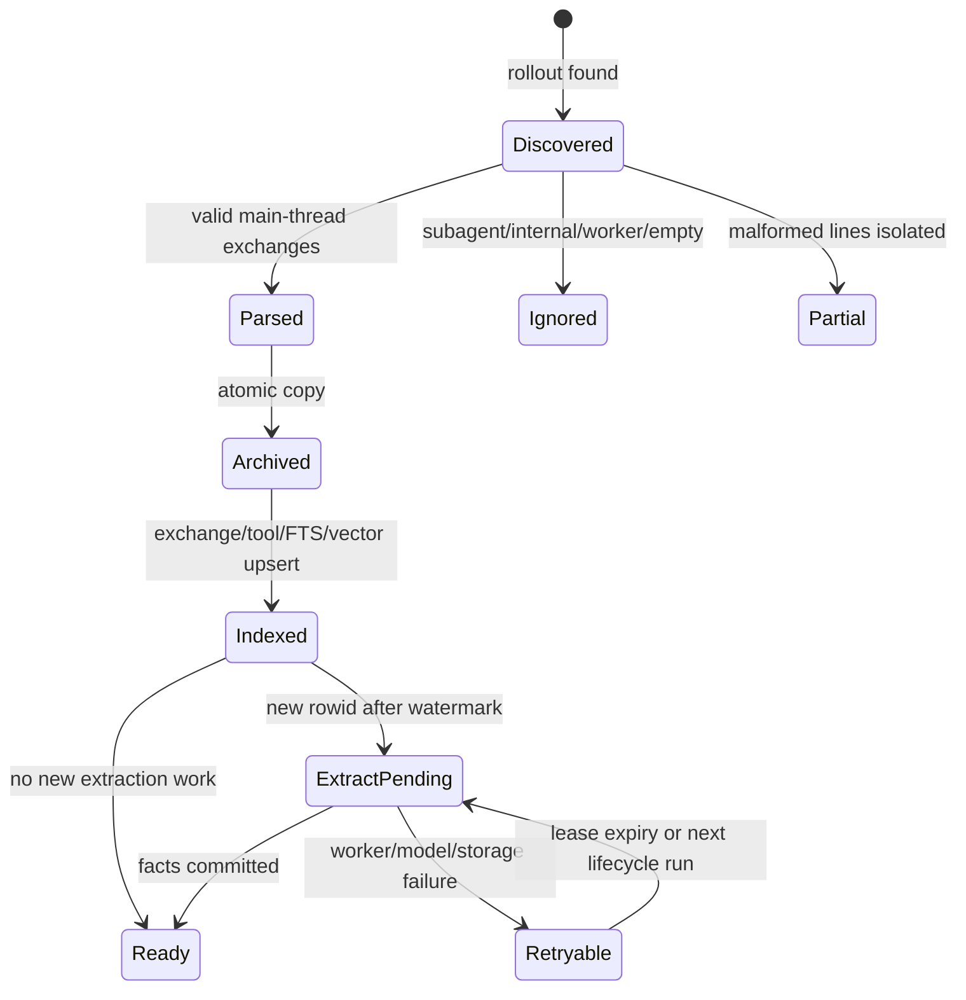
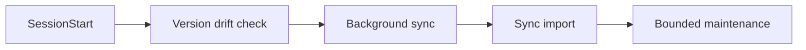
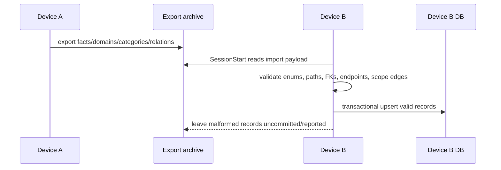

# 대화 수집과 라이프사이클

## 1. 상태 머신



## 2. 발견과 판정

기본 입력은 `$CODEX_HOME/sessions/YYYY/MM/DD/rollout-*.jsonl`입니다. parser는
`session_meta`, user/assistant message, tool call/result를 교환 단위로 조립합니다.
다음 입력은 knowledge corpus에서 제외됩니다.

- subagent/worker thread
- tool-only 또는 빈 main conversation
- Memex 자체 isolated model prompt/worker workdir
- 사용자가 exact canonical path로 제외한 project

malformed 한 줄은 해당 줄의 오류로 격리하며 전체 archive discovery를 중단하지 않습니다.

`type: "compacted"` 레코드는 transport noise로 전체가 무시됩니다. 특히 그 안의
`replacement_history`(user/assistant/developer message 재생 목록과 암호화된
compaction payload)는 어떤 형태로든 exchange로 재조립되지 않습니다. 압축 요약이
recalled fact나 agent synthesis를 human evidence처럼 다시 유입시키는 self-ingestion을
이 계약이 차단하며, 회귀 테스트는 `compacted-thread.jsonl` fixture가 소유합니다.

## 3. project identity와 archive key

```text
identity = canonicalAbsolute(session_meta.cwd)
storage  = safeBasename(identity) + "--" + shortHash(identity)
```

identity와 storage key를 분리하므로 `/team-a/app`과 `/team-b/app`은 basename이 같아도
archive/DB/analyze 전 구간에서 충돌하지 않습니다.

## 4. archive와 index

plain `.jsonl`과 `.jsonl.zst`는 같은 logical read API를 통과합니다. zstd는 압축 해제
상한을 넘으면 실패하며, parser/search/read/stats/verify가 동일한 bounded reader를
사용합니다.

exchange upsert는 primary key 충돌 때 기존 row를 update하며 rowid를 보존합니다.
이 불변식이 깨지면 `last_exchange_rowid` 이후라는 extraction 조건이 과거 교환을 새
데이터로 오인하므로 금지합니다.

FTS5 external-content table은 insert/update/delete trigger로 동기화됩니다. vector는
384차원 int8 embedding과 `embedding_version`을 사용합니다. version이 다르면 동일
검색 공간으로 섞지 않습니다.

## 5. 세 이벤트의 책임

### SessionStart



순서는 `src/lifecycle.ts`와 `hooks.json`이 함께 소유합니다. background 작업은 session
시작을 막지 않습니다. sync import는 scope enum, canonical path, ontology FK,
relation enum/endpoints/cross-project edge를 검증한 데이터만 기록합니다.

### UserPromptSubmit

prompt, session id, canonical cwd를 thin hook client가 받아 warm sidecar socket을 먼저
사용하고, 불가능하면 같은 retrieval core의 cold local 경로를 사용합니다. 성공한
context는 Codex 0.149.1 계약의 `continue: true`와
`hookSpecificOutput.additionalContext`로 반환합니다.

context를 반환하기 전에 retrieval core는 `recall_events`에
`session_id + SHA-256(human prompt) + injected fact IDs` receipt를 기록합니다. receipt
저장 실패는 fail-closed이며 context를 반환하지 않습니다. SessionEnd indexing은 같은
prompt hash를 가진 exchange에 `memex_recall` provenance와
`assistant_learnable=0`을 부여합니다. 각 event는 계산 시 `prepared`, hook이 stdout에
쓴 뒤 `emitted`로 바뀝니다. 동일 prompt 반복은 별도 event ID를 가집니다. Codex host의
실제 consumption은 현재 hook 계약으로 관측하지 못하므로 status로 주장하지 않습니다.

MCP `mcp__memex__*` result는 call 단위 `memex_recall/learnable=0`입니다. parser는
`call_id`로 모든 tool result를 원 호출에 연결하고, sibling local repo/Git/test result는
독립 trust classification을 받아 learnable 상태를 유지합니다.

### SessionEnd

종료 직후 rollout 파일이 계속 쓰일 수 있으므로 size/mtime quiet window를 확인합니다.
안정된 nonempty main rollout만 extraction 대상으로 삼습니다. 성공 evidence가 없으면
watermark와 export success 상태를 기록하지 않습니다.

## 6. 동기화와 import/export



import는 외부 데이터 경계입니다. global↔project와 same-project relation은 허용하지만,
서로 다른 두 project fact의 직접 relation은 거부합니다.

## 7. 관측 가능성

- lifecycle observation: timestamp/event/session/cwd 같은 최소 메타데이터
- injection log: status, prompt length, candidates, injected/deduped/chars, duration, path
- error log: import/Node-level failure
- `memex doctor`: dependency/build/hook configured/observed/trust/MCP contract
- `memex status`: conversation/fact/graph readiness와 backlog를 분리

로그가 없으면 hook 미실행과 no-match를 구분할 수 없습니다. `doctor`와 injection
status를 함께 봅니다.
