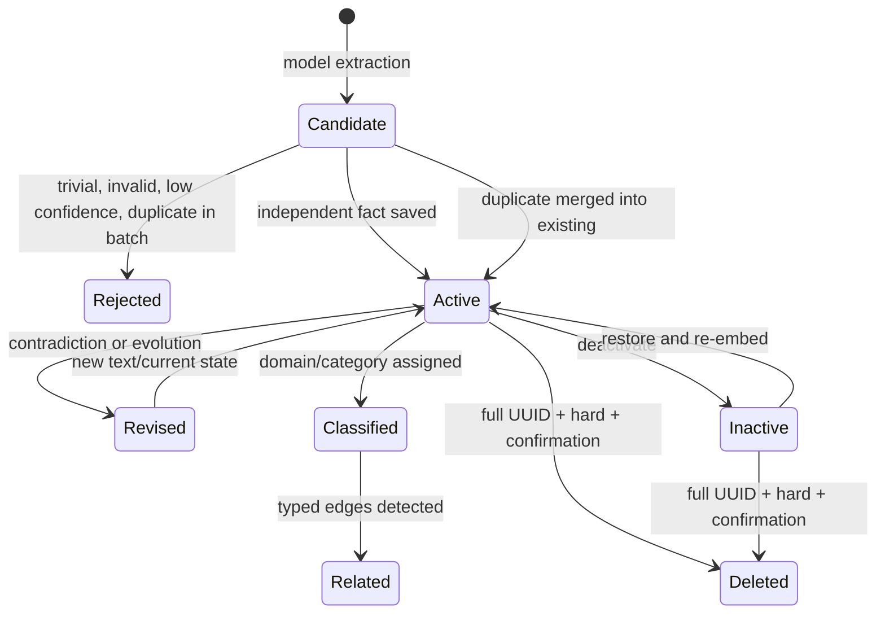
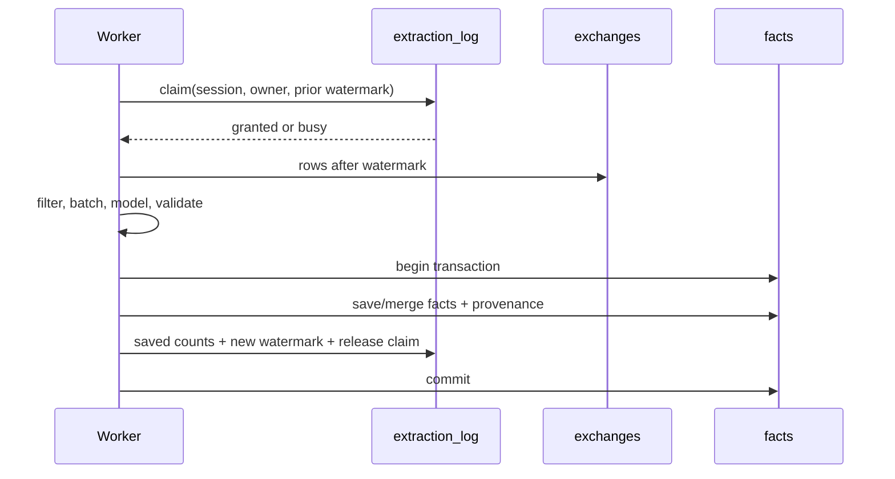
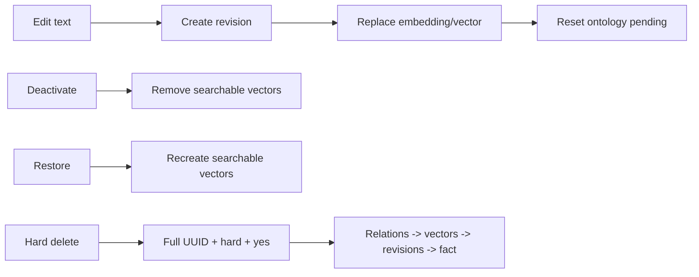

# 팩트 라이프사이클

## 1. fact란 무엇인가

Fact는 대화 전체 요약이 아니라 이후 작업에서 재사용할 가치가 있는 원자적 장기
지식입니다. 기본 category는 decision, preference, pattern, knowledge, constraint이며
각 fact는 scope, confidence, source exchanges, embedding, ontology category를 가집니다.
Fact는 실행 규칙이 아니며 Codex 권한이나 hook을 변경하지 않습니다.

## 2. 상태 전이



## 3. 추출 eligibility

SessionEnd 또는 backlog worker가 session claim을 획득한 뒤
`exchanges.rowid > extraction_log.last_exchange_rowid`인 새 exchange만 읽습니다.
bare command, 짧은 acknowledgement, harness artifact, Memex worker prompt 같은 trivial
exchange는 model call 전에 제거합니다.

provenance는 turn taint가 아니라 evidence source 단위입니다.

| source | learnable |
| --- | --- |
| `human_assertion` | yes |
| `repo_file`, `git_history`, `test_execution` | allowlist 통과 시 yes |
| `external_unverified`, unknown/generated tool output | no |
| `memex_recall` | no |
| `assistant_generated` | no |

parser는 call ID로 tool result를 원 호출에 연결합니다. extractor는 human assertion과
`learnable=1` tool result를 직접 읽어 candidate를 만들며, assistant가 그 evidence를
요약한 문장을 다시 evidence로 쓰지 않습니다. 같은 turn의 Memex recall은 sibling
repo/Git/test result를 오염시키지 않습니다. 전체 text는 FTS/vector search에 남습니다.
여러 내부 source가 하나로 합쳐져 call 단위 귀속이 불가능한 composite `exec` output은
안전한 기본값인 `external_unverified/learnable=0`입니다.

긴 session은 `MEMORY_BANK_MAX_EXTRACT_CALLS` 범위에서 전체 시간대를 고르게 샘플링한
batch를 사용합니다. model output은 구조/enum/숫자 confidence를 검증하고 confidence
0.7 미만을 저장하지 않습니다. 같은 session batch 사이의 normalized duplicate도
저장 전에 제거합니다.

## 4. claim과 atomic commit



fact 저장은 성공했는데 watermark가 실패하거나 그 반대가 되는 상태를 허용하지
않습니다. 모델/DB/프로세스 실패 시 claim은 만료 후 재시도 가능하고 watermark는 마지막
성공 commit에 머뭅니다.

## 5. consolidation 규칙

| 판정 | 동작 | 보존 증거 |
| --- | --- | --- |
| DUPLICATE | existing fact 유지, count/source 추가 | 기존 ID와 모든 source |
| CONTRADICTION | 기존 문장을 새 현재 상태로 교체 | revision reason/source, relation |
| EVOLUTION | 더 최신/구체 fact로 갱신 | previous/new revision, source |
| INDEPENDENT | 두 fact 모두 유지 | 개별 provenance |

consolidation은 같은 scope eligibility 안에서 candidate를 비교합니다. 서로 다른 project의
사실을 하나로 합쳐 scope를 누출하지 않습니다.

## 6. ontology와 relation 후처리

active fact는 domain/category 분류 대상입니다. deterministic category reuse는 측정된
threshold가 명시된 경우에만 사용하고, 기본은 model classification입니다. relation
탐지는 `INFLUENCES`, `SUPPORTS`, `SUPERSEDES`, `CONTRADICTS`만 저장합니다.

분류 실패 횟수/최근 시각을 기록해 무한 재시도를 막고 backlog 상태를 관측 가능하게
합니다.

## 7. 사용자 수정



CLI와 Web UI는 같은 `fact-management` transaction service를 호출합니다. UI가 별도
shortcut으로 DB를 갱신하지 않습니다.

## 8. provenance

`trace_fact`와 Facts detail은 다음 chain을 제공합니다.

```text
fact UUID
  -> current text/scope/category/timestamps
  -> revisions and reasons
  -> source_exchange_ids
  -> exchange project/session/timestamp
  -> archive_path + line_start/line_end
```

source archive가 data root 밖을 가리키면 read하지 않습니다. provenance는 설명 가능성과
수정 판단의 근거이며, 사용자 원본 rollout을 변경하는 통로가 아닙니다.

`recall_events`는 fact provenance와 반대 방향의 안전 장치입니다. 기존 fact가 어느
prompt에 주입됐는지 기록하여 그 결과 agent echo가 새 fact의 독립 evidence로
재사용되지 않게 합니다.

EVOLUTION/DUPLICATE consolidation은 새 trusted evidence의
`source_exchange_ids`를 기존 fact에 합치고 revision에 새 evidence source를 남깁니다.
따라서 recall 횟수는 confidence/support를 올리지 않지만, repo 관찰로 SQLite→PostgreSQL
변화가 확인되면 provenance를 보존한 진화가 가능합니다.

## 9. 성공/실패 판정 예

정상:

- 같은 session no-new-row 재실행에서 extracted/saved 0, model call 0
- contradiction 후 current fact 1개와 revision 1개, 두 source 모두 추적 가능
- deactivate 후 fact search/vector 결과에서 제외, restore 후 다시 검색 가능

실패:

- re-index만 했는데 과거 exchange가 다시 추출됨
- model 실패 뒤 watermark가 전진함
- edit 후 old vector가 검색됨
- 다른 project fact가 explicit all 없이 consolidation됨
