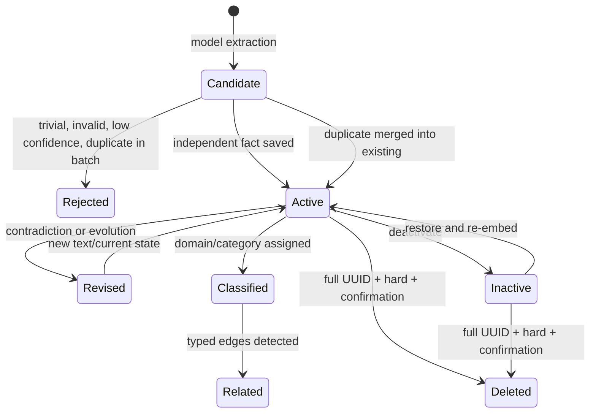
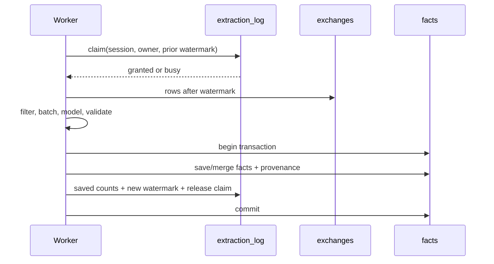
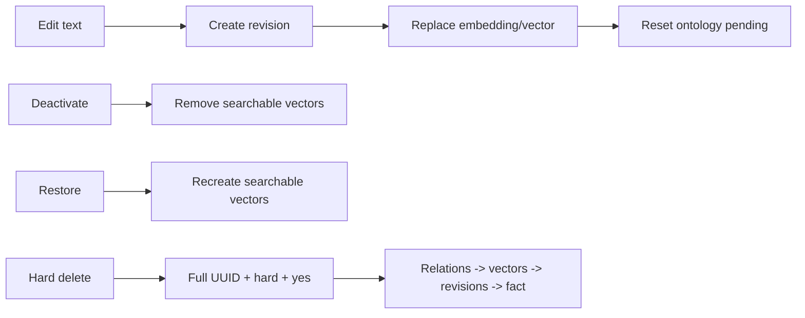

# 팩트 라이프사이클

## 1. fact란 무엇인가

Fact는 대화 전체 요약이 아니라 이후 작업에서 재사용할 가치가 있는 원자적 장기
지식입니다. 기본 category는 decision, preference, pattern, knowledge, constraint이며
각 persisted fact는 scope, source exchanges, embedding, ontology category를 가집니다.
confidence는 model이 반환한 extraction-time candidate를 0.7 threshold로 거르는 데만
사용하며 fact schema에는 저장하지 않습니다. Fact는 실행 규칙이 아니며 Codex 권한이나
hook을 변경하지 않습니다.

## 2. 상태 전이



## 3. 추출 eligibility

SessionEnd 또는 backlog worker가 session claim을 획득한 뒤
`exchanges.rowid > extraction_log.last_exchange_rowid`인 새 exchange만 읽습니다.
bare command, 짧은 acknowledgement, harness artifact, Memex worker prompt 같은 trivial
exchange는 model call 전에 제거합니다.

backfill 대기열은 `extraction_log`의 settled 상태만으로 완료를 판정하지 않습니다.
settled(성공) 마커의 `last_exchange_rowid`가 세션의 `MAX(rowid)`보다 뒤처지면 resume으로
늘어난 suffix를 위해 다시 pending으로 돌아오고, worker claim도 그 세션을 선점할 수
있습니다. 단 SEED(-1, 과거 batch 재추출 방지)와 PERMANENT(-2, 무한 재시도 방지)는
워터마크가 뒤처져도 제외되며, suffix 재시작은 SessionEnd 훅 경로가 담당합니다.
살아있는 claim(-3)은 다른 러너가 처리 중이므로 제외됩니다.
`backfill-extract-worker`가 심는 seed 마커는 `last_exchange_rowid = MAX(rowid)`를
함께 기록합니다. SessionEnd extraction은 SQLite만 읽으므로, 백그라운드 sync가 아직
이 rollout을 인덱싱하지 못한 경우(exchanges 0건 + transcript 파싱 결과 비어있지 않음)
성공 마커를 쓰지 않고 `SKIPPED (not_indexed)`로 이연하며, 이 세션은 sync 완료 후
backfill이 회수합니다. transcript 파싱에 실패하면 증명 불가로 fail-closed 이연합니다.

provenance는 turn taint가 아니라 evidence source 단위입니다.

| source | learnable |
| --- | --- |
| `human_assertion` | yes |
| `repo_file`, `git_history`, `test_execution` | allowlist 통과 시 yes |
| `external_unverified`, unknown/generated tool output | no |
| `memex_recall` | no |
| `assistant_generated` | no |

parser는 call ID로 tool result를 원 호출에 연결합니다. extractor는 human assertion과
`learnable=1` tool result를 직접 읽어 candidate를 만들며, assistant가 그 evidence를
요약한 문장을 다시 evidence로 쓰지 않습니다. 같은 turn의 Memex recall은 sibling
repo/Git/test result를 taint하지 않습니다. 전체 text는 FTS/vector search에 남습니다.
여러 내부 source가 하나로 합쳐져 call 단위 귀속이 불가능한 composite `exec` output은
안전한 기본값인 `external_unverified/learnable=0`입니다.

파일 관측 evidence의 learnability는 경로로 증명됩니다. project cwd 밖으로
resolve되거나(extraction 시 exchange cwd 기준), 대상 경로를 특정할 수 없으면
fail-closed로 demote됩니다. 프로젝트 내부라도 Memex 데이터 루트(`MEMEX_HOME` 아래
archive/index/DB), `$CODEX_HOME/sessions`, 임시 model workdir 안의 관측은 레이블을
유지한 채 `learnable=0`으로 강등됩니다. 이 경계가 없으면 self 요약·rollout을 로컬 파일
tool로 다시 읽어 assistant synthesis나 recall이 repository evidence로 세탁됩니다.

shell/exec evidence도 같은 locality proof를 통과해야 합니다. exchange의 canonical cwd와
tool의 `workdir`/`cwd`, `git -C`, `npm --prefix`, command target을 symlink-resolved path로
정규화합니다. 모든 effective cwd와 target이 project cwd 안에 있음을 증명한 bounded
Git/test/read command만 learnable입니다. wrapper, 알 수 없는 target, project 밖 상대·절대
경로, pipeline, redirect, command substitution은 `external_unverified/learnable=0`으로
fail-closed 처리합니다. project 내부의 denied data root 관측은 source label만 유지하고
`learnable=0`입니다.

긴 session은 `MEMEX_MAX_EXTRACT_CALLS` 범위에서 전체 시간대를 고르게 샘플링한
batch를 사용합니다. model output은 구조/enum/숫자 confidence를 검증하고 confidence
0.7 미만을 저장하지 않습니다. 각 candidate는 직접 근거가 된 batch 내 exchange의
1-based `source_exchange_indices`를 하나 이상 반환해야 합니다. 서버는 모든 index가
해당 batch 범위 안인지 검증한 뒤 실제 exchange UUID로 변환하며, 누락되거나 유효하지
않은 candidate는 저장하지 않습니다. 같은 session의 여러 batch에서 normalized duplicate가
나오면 fact는 하나만 저장하되 각 batch에서 검증된 source UUID는 합칩니다.

## 4. claim과 atomic commit



fact 저장은 성공했는데 watermark가 실패하거나 그 반대가 되는 상태를 허용하지
않습니다. 모델/DB/프로세스 실패 시 claim은 만료 후 재시도 가능하고 watermark는 마지막
성공 commit에 머뭅니다.

## 5. consolidation 규칙

| 판정 | 동작 | 보존 증거 |
| --- | --- | --- |
| DUPLICATE | existing fact 유지, count/source 추가 | 기존 ID와 모든 source |
| CONTRADICTION | existing ID의 문장을 새 현재 상태로 교체, new fact 비활성화 | current ID의 predecessor revision/source |
| EVOLUTION | 더 최신/구체 fact로 갱신 | previous/new revision, source |
| INDEPENDENT | 두 fact 모두 유지 | 개별 provenance |

consolidation은 같은 scope eligibility 안에서 candidate를 비교합니다. 서로 다른 project의
사실을 하나로 합쳐 scope를 누출하지 않습니다.

consolidation 대상은 `created_at` cursor가 아니라 local `needs_consolidation` dirty queue로
선정합니다. extraction insert, sync-import, semantic edit, restore는 active fact를 dirty로
등록하고, 성공적으로 검사한 정확한 `updated_at` generation만 queue에서 제거합니다.
따라서 과거 `created_at`을 보존한 late sync-import도 누락되지 않습니다. transient/provider
failure와 internal failure는 dirty 상태를 유지하며, deterministic per-fact rejection만 bounded
attempt 뒤 searchable fact를 보존한 채 queue에서 제외합니다.

EVOLUTION과 CONTRADICTION은 모두 `mutateFactMeaning()`을 사용합니다. current identity는
existing fact ID로 유지하며, revision 추가, text와 stored embedding 교체, primary vector
교체, KR text/vector 무효화, ontology pending reset, 기존 relation 제거, 병합 대상 fact
비활성화를 한 transaction에서 commit합니다. embedding 생성이나 transaction 내부 단계가
실패하면 기존 semantic generation 전체가 유지됩니다.

## 6. ontology와 relation 후처리

active fact는 domain/category 분류 대상입니다. deterministic category reuse는 측정된
threshold가 명시된 경우에만 사용하고, 기본은 model classification입니다. relation
탐지는 `INFLUENCES`, `SUPPORTS`, `SUPERSEDES`, `CONTRADICTS`만 저장합니다.

분류 실패 횟수/최근 시각을 기록해 무한 재시도를 막고 backlog 상태를 관측 가능하게
합니다. attempt ledger도 세대 인지적이다(재감사 P1-8) — 이전 의미에 대한 실패 기록이
변이 후의 새 의미의 attempts를 태우지 않으며, MAX 도달 parking은 parking write 자체가
`semantic_generation`과 attempts 임계 조건으로 CAS된다 — ledger 기록과 parking 사이에
의미가 변이되면 새 의미는 General/Misc에 박히지 않고 분류 대기로 남습니다. taxonomy row 생성과 fact의 분류 할당은 같은 transaction에서
commit됩니다 — stale 분류가 폐기될 때 그 결과가 만든 domain/category도 함께 롤백되어
taxonomy 오염이 남지 않습니다.

ontology 분류, relation 생성, fact/KR 재임베딩 같은 비동기 파생 writer는 시작 시
fact의 `semantic_generation`을 캡처하고 최종 쓰기를 그 세대에 대한 CAS로 수행합니다.
LLM/임베딩 대기 중에 의미가 변이되면(세대 상승) 그 결과는 폐기됩니다 — 분류는
pending을 유지하고(변이가 리셋), 관계는 생성되지 않고, stale 벡터는 쓰이지 않습니다.
폐기된 시도는 분류 ledger를 태우지 않습니다. fact 의미가 바뀌면 그 의미에서 파생된
모든 representation은 같은 세대를 가리키거나 invalid여야 합니다.

exchange 재임베딩은 semantic 세대가 아니라 content hash로 CAS합니다. exchange ID는
턴 성장에도 유지되는 stable identity라 같은 행의 내용이 in-place로 갱신될 수 있고,
임베딩 대기 중 privacy purge가 행을 지우면 vec0 가상 테이블은 FK로 이를 막지 못합니다
(재감사 P1-2). reembed commit은 대기 전 캡처한 (user turn, assistant turn, tool 이름)
hash를 트랜잭션 안에서 재검증해, 내용이 변했거나 행이 사라졌으면 벡터 쓰기를
통째로 폐기합니다 — 삭제된 대화의 벡터 행이 부활하는 일도 없습니다.

## 7. 사용자 수정



CLI/Web UI의 manual edit와 consolidation의 EVOLUTION/CONTRADICTION은 같은
`fact-management.mutateFactMeaning()` transaction service를 호출합니다. UI나 자동
consolidation이 text만 바꾸는 shortcut을 갖지 않습니다.

restore는 모델 업그레이드로 stale이 된 저장 embedding을 재생성할 수 있다. 이 재임베딩
await는 race window이므로 최종 commit은
`is_active=0 AND semantic_generation=캡처값 AND lifecycle_generation=캡처값`의 dual
CAS다(재감사 P1-2, P1-3 v4) — 대기 중 의미가 변이되거나 다른 경로가 활성화/비활성화했으면
restore는
`StaleFactMutationError`로 폐기되고, "B 문장 + A 벡터 + current 스탬프"라면 자가 치유로도
발견할 수 없는 조합이 만들어지지 않는다.

deactivate/restore는 **lifecycle 사건**입니다(재감사 P1-3 v4). 두 경로 모두
`lifecycle_generation`을 올리고 `lifecycle_updated_at`을 기록하며, semantic 시계는
건드리지 않습니다 — 의미 편집과 활성 전환은 독립인 축이라 서로를 롤백하지 않고,
sync는 이 시계로 deactivate/restore를 어느 기기로든 전파합니다(정확히 같은 시각의
tie는 inactive 승리). **복제 방향은 `applyReplicatedLifecycle`이 담당합니다**(재감사
P1-2/P1-3 v4 본 회차): 복제는 새 사건이 아니므로 원격 event 시각을 그대로 기록하고(로컬
now를 스탬프하면 조작된 미래 시각이 진짜 restore를 영구히 거부한다), commit
transaction 안에서 현재 행의 lifecycle 시계와 상태를 다시 읽어 LWW를 재판정합니다 —
상태가 같아도 더 새로운 event clock은 수렴하고, await 중에 일어난 로컬 lifecycle
사건은 stale plan을 이기며, tombstone이 있으면 lifecycle 축은 부활을 하지 않습니다.
sync import의 DUPLICATE provenance union도 commit 시점에 현재
행을 다시 읽어 union/max하므로, 어떤 metadata 쓰기와 교차해도 provenance가
유실되지 않습니다. 번역(`fact_kr`)과 taxonomy(`ontology_domains/categories`,
`ontology_category_id`)는 derived state로 sync payload에서 제외되었고(v4), 의미가
바뀐 fact는 로컬 번역 백필(`scripts/translate-facts.mjs` — 읽은 시점의
`semantic_generation`+원문 텍스트 CAS로 기록, 재감사 P2 v4 본 회차)과 분류 백필로
overlay를 다시 채웁니다. privacy purge(`source_conversation_excluded`)는 taxonomy를 전면
invalidate하고 잔존 facts의 overlay와 attempt ledger를 함께 리셋해 공개 facts만으로
재구축하게 합니다(재감사 P2 v4 본 회차 — attempts가 MAX인 잔존 fact도 새 taxonomy로
재분류된다).

의미 변경은 fact의 `semantic_generation`을 올리고 `semantic_updated_at`을 갱신하는
유일한 경로입니다(다른 하나는 sync fact import의 replication). consolidation 세
판정(DUPLICATE/CONTRADICTION/EVOLUTION) 모두 양 endpoint의 세대를 commit 시점에
재검증합니다 — DUPLICATE는 commit 직전 검사, CONTRADICTION/EVOLUTION은
`expectedSemanticGeneration`(existing)과 비활성화 대상의 세대 CAS(driver)로, 하나라도
밀리면 transaction 전체가 롤백됩니다(재감사 P1-2). 재감사 P1-4 v4 본 회차부터 양
참가자는 **`lifecycle_generation`까지 함께 CAS**합니다 — consolidation은 active
참가자끼리 내린 판정이므로 LLM 왕복 중 deactivate→restore가 일어나면(semantic
generation은 그대로) stale verdict가 대상을 다시 비활성화하거나 inactive fact에
벡터를 재삽입하는 일이 없고, verdict 전체가 폐기되어 dirty queue에 남아 재평가됩니다.
drain의 queue 확인/clear도 세대
토큰으로 수행합니다. 세대가 밀린 비교 판정은 `StaleFactMutationError`로 폐기되며 대상
fact는 dirty queue에 남아 새 의미로 다시 비교됩니다.

## 8. provenance

`trace_fact`와 Facts detail은 다음 chain을 제공합니다.

```text
fact UUID
  -> current text/scope/category/timestamps
  -> revisions and reasons
  -> source_exchange_ids
  -> exchange project/session/timestamp
  -> archive_path + line_start/line_end
```

source archive가 data root 밖을 가리키면 read하지 않습니다. provenance는 설명 가능성과
수정 판단의 근거이며, 사용자 원본 rollout을 변경하는 통로가 아닙니다.

`recall_events`는 fact provenance와 반대 방향의 안전 장치입니다. 기존 fact가 어느
prompt에 주입됐는지 기록하여 그 결과 agent echo가 새 fact의 독립 evidence로
재사용되지 않게 합니다.

추출 시 fact의 `source_exchange_ids`에는 model이 해당 candidate의 직접 근거로 지목하고
서버가 검증한 exchange UUID만 들어갑니다. 같은 extraction run의 batch나 session suffix에
포함됐다는 이유만으로 모든 exchange를 일괄 귀속하지 않습니다.

EVOLUTION/CONTRADICTION/DUPLICATE consolidation은 새 trusted evidence의
`source_exchange_ids`를 기존 fact에 합칩니다. EVOLUTION과 CONTRADICTION은 revision에도
새 evidence source를 남깁니다. 따라서 recall 횟수는 confidence/support를 올리지 않지만,
repo 관찰로 SQLite→PostgreSQL 변화가 확인되면 provenance를 보존한 진화가 가능합니다.

## 9. 성공/실패 판정 예

정상:

- 같은 session no-new-row 재실행에서 extracted/saved 0, model call 0
- contradiction 후 current fact 1개와 revision 1개, 두 source 모두 추적 가능
- deactivate 후 fact search/vector 결과에서 제외, restore 후 다시 검색 가능.
  restore는 동기 semantic operation으로 저장 embedding의 `embedding_version`이
  현재 모델과 같으면 그 vector를 재사용하고, inactive 동안 model upgrade가 있었으면
  현재 모델로 재임베딩한 뒤 vector와 stamp를 같은 commit에 복원한다(재사용/재임베딩
  여부는 결과로 보고된다). stale vector를 그대로 복원해 restore 직후 검색에서만
  보이지 않는 상태는 결함이다.

실패:

- re-index만 했는데 과거 exchange가 다시 추출됨
- model 실패 뒤 watermark가 전진함
- edit 후 old vector가 검색됨
- 다른 project fact가 explicit all 없이 consolidation됨
