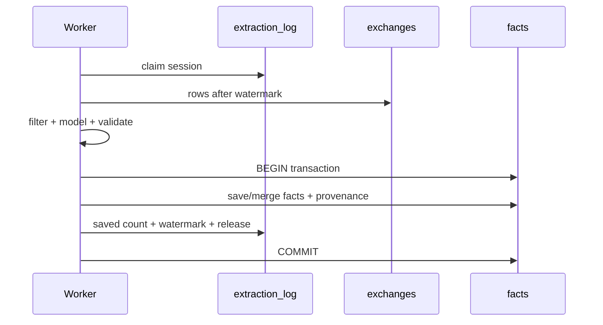

# 팩트 라이프사이클

## 1. Fact란 무엇인가

Fact는 대화 전체 요약이 아니라 다음 작업에서 재사용할 가치가 있는 원자적 장기 지식입니다.

기본 category:

- `decision`
- `preference`
- `pattern`
- `knowledge`
- `constraint`

fact는 scope와 source exchange provenance를 가지며 검색, revision, consolidation, ontology의 기준이 됩니다. extraction-time `confidence`는 저장 후보 필터에만 사용하고 fact row에는 보존하지 않습니다.

## 2. 네 종류의 상태

Memex는 fact row의 상태를 네 성격으로 나눕니다.

| 축 | 대표 필드 | 규칙 |
| --- | --- | --- |
| Semantic | fact/category/scope | 의미 변경 시 generation 증가, remote는 semantic event clock으로 LWW |
| Lifecycle | `is_active` | semantic과 독립, lifecycle event clock으로 LWW |
| Lineage | sources/count | union/max로 단조 수렴 |
| Derived | KR/ontology/relation/vector | semantic state에서 local rebuild |

### Semantic generation

`semantic_generation`은 **로컬 async writer용 CAS token**입니다. 의미가 바뀔 때 증가합니다. `semantic_updated_at`은 cross-device semantic event clock입니다.

### Lifecycle generation

`lifecycle_generation`은 activate/deactivate race를 감지하는 로컬 CAS token입니다. `lifecycle_updated_at`은 cross-device lifecycle event clock입니다.

두 generation 값 자체는 기기 간 공통 version number가 아니므로 sync conflict 판단에 사용하지 않습니다.

## 3. 추출 eligibility

SessionEnd 또는 backlog worker는 `extraction_log.last_exchange_rowid` 이후의 새 exchange만 처리합니다.

fact extraction evidence는 source 단위로 분류합니다.

| source | 기본 학습 |
| --- | --- |
| `human_assertion` | 허용 |
| local `repo_file`, bounded `git_history`, explicit `test_execution` | 검증 후 허용 |
| `assistant_generated` | 금지 |
| `memex_recall` | 금지 |
| network/unknown/generated output | 금지 |

Memex가 주입한 기억을 assistant가 다시 요약한 텍스트를 새 사실의 증거로 재섭취하지 않습니다. project 밖 파일, Memex data root, `$CODEX_HOME/sessions`, model workdir 등 출처가 안전하게 증명되지 않는 tool result도 fail-closed로 학습에서 제외합니다.

## 4. Extraction commit



fact가 저장됐지만 watermark는 실패하거나, watermark만 먼저 전진하는 상태를 허용하지 않습니다. transient failure에서는 기존 successful watermark가 유지됩니다.

## 5. Consolidation

| 판정 | 동작 |
| --- | --- |
| `DUPLICATE` | existing fact 유지, provenance union, count 증가 |
| `CONTRADICTION` | existing identity를 새 현재 의미로 갱신하고 predecessor revision 보존 |
| `EVOLUTION` | existing identity를 더 최신/구체 의미로 갱신 |
| `INDEPENDENT` | 두 fact 유지 |

consolidation은 active participant를 대상으로 LLM 판단을 수행하므로, **LLM await 중 participant의 semantic 또는 lifecycle generation이 움직이면 verdict 전체를 stale로 폐기**합니다.

DUPLICATE commit과 CONTRADICTION/EVOLUTION mutation은 semantic + lifecycle CAS를 사용해 deactivate→restore 같은 lifecycle churn 뒤 stale verdict가 다시 fact를 비활성화하지 못하게 합니다.

## 6. Semantic mutation

manual edit와 consolidation의 의미 변경은 `mutateFactMeaning()` 경로를 공유합니다.

한 semantic commit에서 처리해야 하는 것:

- 기존 fact ID 유지
- revision 추가
- fact text/category/scope 변경
- `semantic_generation + 1`
- `semantic_updated_at` 갱신
- primary embedding/vector 교체 또는 invalidation
- `fact_kr` 및 KR vector invalidation
- `ontology_category_id` reset
- ontology attempt ledger reset
- 기존 relation 제거
- consolidation dirty state 갱신

중간 단계가 실패하면 이전 semantic generation 전체를 유지합니다.

## 7. Lifecycle mutation

### Deactivate

- `is_active = 0`
- searchable primary/KR vector 제거
- `lifecycle_generation + 1`
- `lifecycle_updated_at = local event time`

### Restore

restore는 현재 fact text로 searchable vector를 다시 준비해야 할 수 있으므로 async race window가 있습니다. 최종 commit은 캡처한 semantic + lifecycle generation을 모두 검사합니다.

semantic edit나 다른 activate/deactivate가 대기 중 발생하면 stale restore를 폐기합니다.

### Replication

sync import는 local user action과 다른 경로입니다.

- remote event timestamp를 그대로 보존
- transaction 안에서 현재 lifecycle clock을 다시 읽어 LWW 재판정
- 같은 state의 newer clock도 수렴
- 더 최신 local event가 있으면 remote stale event 무시

## 8. Multi-device lineage

`source_exchange_ids`와 `consolidated_count`는 semantic/lifecycle winner에 종속되지 않습니다.

```text
sources = union(local live sources, every remote source)
count   = max(local live count, every remote count)
```

remote 여러 기기를 fold할 때도 이 규칙을 적용하고, local commit 직전 live row를 다시 읽습니다. fresh remote insert도 aggregate lineage를 그대로 저장합니다.

이 provenance는 conversation exclusion purge가 어떤 fact를 제거해야 하는지 판단하는 privacy evidence이기도 하므로 유실해서는 안 됩니다.

## 9. Ontology와 relation

ontology와 relation은 protocol v4에서 **local derived state**입니다. 기기 간 UUID를 맞추려고 sync하지 않습니다.

classifier는 fact의 semantic generation과 global taxonomy epoch을 캡처합니다. LLM/embedding await 중:

- fact 의미가 바뀌면 semantic CAS 실패
- privacy purge가 taxonomy epoch을 올리면 epoch CAS 실패

stale 결과가 domain/category/relation을 다시 만들지 않습니다.

classification이 반복 실패하면 bounded attempt ledger를 사용하고 MAX 이후 General/Misc fallback으로 park할 수 있습니다. privacy purge는 surviving fact의 attempts를 0으로 리셋해 새 taxonomy에서 다시 분류할 수 있게 합니다.

## 10. KR translation

`fact_kr`는 local derived state이며 sync하지 않습니다. 자동 SessionStart translation은 수행하지 않습니다. 번역 모델 호출 비용을 명시적으로 통제하기 위해 현재는 수동 스크립트를 사용합니다.

```bash
node scripts/translate-facts.mjs
```

스크립트는 번역 시작 시 `fact`, `semantic_generation`을 캡처하고 다음 조건의 CAS로 결과를 기록합니다.

```text
id matches
semantic_generation unchanged
fact text unchanged
```

또한 모델 응답은 요청 batch와 **항목 수가 정확히 같고 모든 항목이 non-empty string**일 때만 batch 전체를 적용합니다. 중간 항목 누락으로 번역이 한 칸씩 밀리는 상황을 허용하지 않습니다.

스크립트는 `fact_kr`를 채웁니다. `vec_facts_kr`는 이후 reembed maintenance 또는 다음 SessionStart의 reembed worker가 생성합니다.

## 11. Privacy purge와 taxonomy rebuild

conversation exclusion purge는 private-derived taxonomy가 남아 후속 분류 prompt에 재등장하지 않게 ontology를 전면 invalidate합니다.

- `ontology_domains`, `ontology_categories`, `vec_categories` 제거
- surviving facts의 `ontology_category_id = NULL`
- ontology attempt ledger reset
- `taxonomy_state.epoch + 1`

따라서 purge 이후에는 public surviving facts가 다시 taxonomy backfill 대상이 됩니다. 분류 LLM 호출이 다시 발생할 수 있지만 worker는 bounded batch/run으로 처리합니다.

## 12. Hard delete와 tombstone

hard delete는 full UUID와 explicit confirmation을 요구합니다. fact를 실제로 지우기 전에 `fact_tombstones`에 deletion event를 기록합니다.

특히 `reason = source_conversation_excluded`는 terminal privacy state입니다. 더 오래된 peer snapshot이나 lifecycle event가 해당 fact를 다시 살리지 못합니다.
