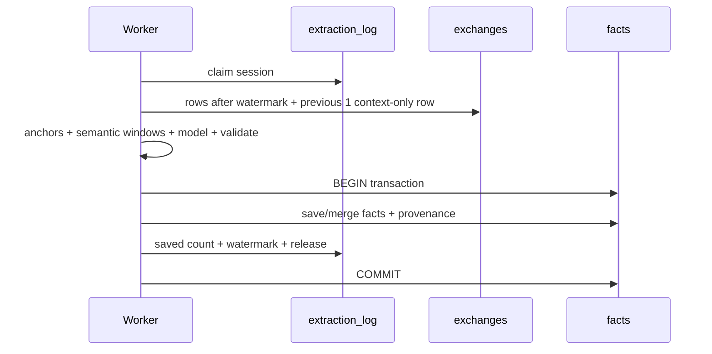

# 팩트 라이프사이클

## 1. Fact란 무엇인가

Fact는 대화 전체 요약이 아니라 다음 작업에서 재사용할 가치가 있는 원자적 장기 지식입니다.

기본 category:

- `decision`
- `preference`
- `pattern`
- `knowledge`
- `constraint`

fact는 scope와 source exchange provenance를 가지며 검색, revision, consolidation, ontology의 기준이 됩니다. extraction-time `confidence`는 저장 후보 필터에만 사용하고 fact row에는 보존하지 않습니다.

## 2. 네 종류의 상태

Memex는 fact row의 상태를 네 성격으로 나눕니다.

| 축 | 대표 필드 | 규칙 |
| --- | --- | --- |
| Semantic | fact/category/scope | 의미 변경 시 generation 증가, remote는 semantic event clock으로 LWW |
| Lifecycle | `is_active` | semantic과 독립, lifecycle event clock으로 LWW |
| Lineage | sources/count | union/max로 단조 수렴 |
| Derived | KR/ontology/relation/vector | semantic state에서 local rebuild |

### Semantic generation

`semantic_generation`은 **로컬 async writer용 CAS token**입니다. 의미가 바뀔 때 증가합니다. `semantic_updated_at`은 cross-device semantic event clock입니다.

### Lifecycle generation

`lifecycle_generation`은 activate/deactivate race를 감지하는 로컬 CAS token입니다. `lifecycle_updated_at`은 cross-device lifecycle event clock입니다.

두 generation 값 자체는 기기 간 공통 version number가 아니므로 sync conflict 판단에 사용하지 않습니다.

## 3. 추출 eligibility

SessionEnd 또는 backlog worker는 `extraction_log.last_exchange_rowid` 이후의 새 exchange만 처리합니다.

fact extraction evidence는 source 단위로 분류합니다.

| source | 기본 학습 |
| --- | --- |
| `human_assertion` | 허용 |
| local `repo_file`, bounded `git_history`, explicit `test_execution` | 검증 후 허용 |
| `assistant_generated` | 금지 |
| `memex_recall` | 금지 |
| network/unknown/generated output | 금지 |

Memex가 주입한 기억을 assistant가 다시 요약한 텍스트를 새 사실의 증거로 재섭취하지 않습니다. project 밖 파일, Memex data root, `$CODEX_HOME/sessions`, model workdir 등 출처가 안전하게 증명되지 않는 tool result도 fail-closed로 학습에서 제외합니다.

### Context visibility와 evidence authority

Extractor input은 JSON data envelope이며 모든 필드를 untrusted conversation data로
취급합니다. 한 exchange는 다음 역할을 분리해 전달합니다.

- `human_evidence` — authoritative human candidate
- `human_context_only` — durable watermark 이전 prefix의 human text; 지시어 해석 전용
- `trusted_tool_evidence` — DB에서 learnable로 분류된 local repo/git/test 관측
- `assistant_context_only` — 지시어·선택지·ratification 대상 해석 전용
- `memex_recall_context_only` — 과거 recall의 의미 문맥 전용

`assistant_context_only.recall_influenced`는 `has_memex_recall`을 반영합니다. assistant와
recall 본문은 extractor에 보이지만 evidence가 될 수 없으며, external/unverified tool
output은 현재 extraction envelope에 포함하지 않습니다. 각 block은 고정된 per-message 및
per-tool 문자 예산으로 잘리고 tool 개수도 제한됩니다.

Model candidate는 `grounding_type`, `durable`, typed `evidence[]`, optional
`context_exchange_indices`를 선언합니다. Server validator는 이를 `unknown` JSON에서
검증하고 실제 `exchanges.provenance` 및 `tool_calls.learnable/source_type/is_error`와
대조합니다.

- `explicit` — valid human evidence가 최소 1개
- `verified` — valid trusted tool evidence가 최소 1개
- `inferred` — 서로 다른 authoritative exchange가 최소 2개
- `durable`은 반드시 `true`; confidence는 그 다음 secondary threshold

assistant/recall/external/unknown evidence 선언이나 실제 tool row와 불일치하는 선언은
candidate 전체를 폐기합니다. `source_exchange_ids`는 검증을 통과한 authoritative
exchange UUID에서만 생성되며 context index는 persisted lineage에 들어가지 않습니다.

### Precision과 durability policy

`precision-durability-v1` extraction policy는 candidate를 다음 순서로 판정합니다.

1. **Grounding** — explicit human, verified local tool, 또는 같은 결론을 독립적으로 지지하는
   authoritative exchange 2개 이상의 inferred evidence인지 확인합니다.
2. **Durability** — 다음 task/session에서도 재사용할 안정된 decision, constraint, knowledge,
   preference, verified problem→solution pattern인지 확인합니다.
3. **Category/scope** — 의미 기준 category와 보수적인 project/global scope를 정합니다.
4. **Confidence** — 앞 gate를 모두 통과한 candidate에만 secondary threshold를 적용합니다.

질문, 비교, 단순 관심사, brainstorming, 현재 진행, temporary state, 일회성 package/file/command
요청은 Fact가 아닙니다. 특히 한 번의 행동을 global preference로 올리지 않으며, durable하지 않은
signal을 project fact로 바꿔 저장하지도 않습니다. global scope는 명시적인 cross-project human
statement 또는 복수의 독립된 cross-project human signal에만 허용합니다.

현재 project state를 바로잡는 human correction은 stable knowledge가 될 수 있습니다. recall을
assistant가 반복했을 뿐이면 authority가 없지만, human이 recalled choice를 이번 project에서 새로
채택하면 새 project decision이 될 수 있습니다. 이때도 recall은 context일 뿐이고 새 ratification
exchange만 durable lineage에 들어갑니다.

Fact 개수 목표는 없습니다. `MAX_FACTS_PER_SESSION`은 과다 출력을 제한하는 safety cap이며 품질
KPI가 아닙니다. 0개가 올바른 session은 `[]`가 정상 결과입니다.

### Context-aware selection과 semantic window

Extraction 호출 여부와 input visibility는 별도 단계입니다.

- `isContextEligibleExchange()`는 빈 turn, harness transport artifact, bare slash command만
  제외합니다. 짧은 human reply와 pure social/bridge reply는 인접 문맥에 남습니다.
- `isCandidateAnchorExchange()`는 durable candidate 가능성이 있는 human turn 또는 trusted
  local tool evidence가 있는 turn만 LLM 호출 anchor로 삼습니다. `응/네/좋아/아니`처럼
  승인·정정일 수 있는 짧은 reply는 anchor이고, `고마워/감사합니다/계속/왜?`처럼 단독
  durable signal이 아닌 reply는 context-only neighbor입니다.
- 각 anchor는 같은 raw-adjacency run의 직전·직후 1 exchange와 묶입니다. 인접 anchor
  range는 최대 5 raw exchanges까지 합치고, 더 긴 run은 neighbor 보존에 필요한 만큼
  window가 겹칩니다. ineligible transport row는 run을 끊으므로 멀리 떨어진 turn을 가짜
  이웃으로 연결하지 않습니다.
- `MEMEX_MAX_EXTRACT_CALLS`의 spread cap은 이 semantic window를 모두 만든 뒤 적용합니다.
  겹친 window가 같은 fact를 다시 만들면 기존 session-level normalized-text dedup이
  validated authoritative lineage를 set-union합니다.

증분 추출은 watermark 이후 suffix를 authoritative target으로 유지하면서, suffix가 있을 때만
같은 session의 `rowid <= last_exchange_rowid` 중 직전 1개를 bounded prefix로 읽습니다. prefix는
persisted schema가 아닌 read-time `context_only_due_to_watermark=true` 표식을 가지며 anchor가 될
수 없습니다. suffix anchor의 immediate neighbor로는 window에 들어가므로 첫 신규 ratification이
이전 assistant proposition을 해석할 수 있습니다.

prefix의 human text는 `human_context_only`에만 보이고 `human_evidence`는 `null`입니다. prefix의
trusted tool evidence도 envelope에서 제거합니다. 이 prompt-level 분리와 별개로 server validator는
prefix index를 human/tool evidence로 선언한 candidate를 hard reject합니다. 따라서 prefix index는
`context_exchange_indices`에는 들어갈 수 있지만 `source_exchange_ids`에는 들어갈 수 없고, prefix
단독으로 old Fact를 다시 추출하는 model call도 생기지 않습니다.

## 4. Extraction commit



fact가 저장됐지만 watermark는 실패하거나, watermark만 먼저 전진하는 상태를 허용하지 않습니다. transient failure에서는 기존 successful watermark가 유지됩니다.

### Extraction evaluation

Phase 0 평가 harness는 production의 `extractFactsFromExchanges()`와 동일한
anchor/window/prompt/parser 경로를 사용하되 model call만 계측 가능한 seam으로 주입합니다.
평가 경로는 `saveExtractedFacts()`나 `runFactExtraction()`을 호출하지 않으므로 fact,
claim, `extraction_log`, watermark를 쓰지 않습니다.

```bash
# 17개 synthetic curated case의 현재 extractor 결과
npm run eval:fact-extraction -- \
  --out docs/verification/fact-extraction-baseline.json

# 이후 extractor를 같은 fixture와 비교
npm run eval:fact-extraction -- \
  --baseline docs/verification/fact-extraction-baseline.json
```

실제 archive shadow mode는 SQLite를 `readonly` + `query_only`로 열고 명시한
session만 평가합니다. 하지만 대화 본문이 configured Codex model로 전달되므로 별도
사용자 승인이 필요합니다. 실제 session report는 기본적으로 ignored
`.fact-extraction-eval/` 아래에 두며 repository receipt로 커밋하지 않습니다.

평가 report는 case별 후보/오류 taxonomy와 함께 model call 수, prompt/output 문자 수,
latency를 기록합니다. Codex JSONL에 `turn.completed.usage`가 있을 때만 token 수를
`observed`로 기록하고, 없으면 추정값을 만들지 않고 `NOT_PROVEN`으로 남깁니다.

## 5. Consolidation

| 판정 | 동작 |
| --- | --- |
| `DUPLICATE` | existing fact 유지, provenance union, count 증가 |
| `CONTRADICTION` | existing identity를 새 현재 의미로 갱신하고 predecessor revision 보존 |
| `EVOLUTION` | existing identity를 더 최신/구체 의미로 갱신 |
| `INDEPENDENT` | 두 fact 유지 |

consolidation은 active participant를 대상으로 LLM 판단을 수행하므로, **LLM await 중 participant의 semantic 또는 lifecycle generation이 움직이면 verdict 전체를 stale로 폐기**합니다.

DUPLICATE commit과 CONTRADICTION/EVOLUTION mutation은 semantic + lifecycle CAS를 사용해 deactivate→restore 같은 lifecycle churn 뒤 stale verdict가 다시 fact를 비활성화하지 못하게 합니다.

## 6. Semantic mutation

manual edit와 consolidation의 의미 변경은 `mutateFactMeaning()` 경로를 공유합니다.

한 semantic commit에서 처리해야 하는 것:

- 기존 fact ID 유지
- revision 추가
- fact text/category/scope 변경
- `semantic_generation + 1`
- `semantic_updated_at` 갱신
- primary embedding/vector 교체 또는 invalidation
- `fact_kr` 및 KR vector invalidation
- `ontology_category_id` reset
- ontology attempt ledger reset
- 기존 relation 제거
- consolidation dirty state 갱신

중간 단계가 실패하면 이전 semantic generation 전체를 유지합니다.

## 7. Lifecycle mutation

### Deactivate

- `is_active = 0`
- searchable primary/KR vector 제거
- `lifecycle_generation + 1`
- `lifecycle_updated_at = local event time`

### Restore

restore는 현재 fact text로 searchable vector를 다시 준비해야 할 수 있으므로 async race window가 있습니다. 최종 commit은 캡처한 semantic + lifecycle generation을 모두 검사합니다.

semantic edit나 다른 activate/deactivate가 대기 중 발생하면 stale restore를 폐기합니다.

### Replication

sync import는 local user action과 다른 경로입니다.

- remote event timestamp를 그대로 보존
- transaction 안에서 현재 lifecycle clock을 다시 읽어 LWW 재판정
- 같은 state의 newer clock도 수렴
- 더 최신 local event가 있으면 remote stale event 무시

## 8. Multi-device lineage

`source_exchange_ids`와 `consolidated_count`는 semantic/lifecycle winner에 종속되지 않습니다.

```text
sources = union(local live sources, every remote source)
count   = max(local live count, every remote count)
```

remote 여러 기기를 fold할 때도 이 규칙을 적용하고, local commit 직전 live row를 다시 읽습니다. fresh remote insert도 aggregate lineage를 그대로 저장합니다.

이 provenance는 conversation exclusion purge가 어떤 fact를 제거해야 하는지 판단하는 privacy evidence이기도 하므로 유실해서는 안 됩니다.

## 9. Ontology와 relation

ontology와 relation은 protocol v4에서 **local derived state**입니다. 기기 간 UUID를 맞추려고 sync하지 않습니다.

classifier는 fact의 semantic generation과 global taxonomy epoch을 캡처합니다. LLM/embedding await 중:

- fact 의미가 바뀌면 semantic CAS 실패
- privacy purge가 taxonomy epoch을 올리면 epoch CAS 실패

stale 결과가 domain/category/relation을 다시 만들지 않습니다.

classification이 반복 실패하면 bounded attempt ledger를 사용하고 MAX 이후 General/Misc fallback으로 park할 수 있습니다. privacy purge는 surviving fact의 attempts를 0으로 리셋해 새 taxonomy에서 다시 분류할 수 있게 합니다.

## 10. KR translation

`fact_kr`는 local derived state이며 sync하지 않습니다. 자동 SessionStart translation은 수행하지 않습니다. 번역 모델 호출 비용을 명시적으로 통제하기 위해 현재는 수동 스크립트를 사용합니다.

```bash
node scripts/translate-facts.mjs
```

스크립트는 번역 시작 시 `fact`, `semantic_generation`을 캡처하고 다음 조건의 CAS로 결과를 기록합니다.

```text
id matches
semantic_generation unchanged
fact text unchanged
```

또한 모델 응답은 요청 batch와 **항목 수가 정확히 같고 모든 항목이 non-empty string**일 때만 batch 전체를 적용합니다. 중간 항목 누락으로 번역이 한 칸씩 밀리는 상황을 허용하지 않습니다.

스크립트는 `fact_kr`를 채웁니다. `vec_facts_kr`는 이후 reembed maintenance 또는 다음 SessionStart의 reembed worker가 생성합니다.

## 11. Privacy purge와 taxonomy rebuild

conversation exclusion purge는 private-derived taxonomy가 남아 후속 분류 prompt에 재등장하지 않게 ontology를 전면 invalidate합니다.

- `ontology_domains`, `ontology_categories`, `vec_categories` 제거
- surviving facts의 `ontology_category_id = NULL`
- ontology attempt ledger reset
- `taxonomy_state.epoch + 1`

따라서 purge 이후에는 public surviving facts가 다시 taxonomy backfill 대상이 됩니다. 분류 LLM 호출이 다시 발생할 수 있지만 worker는 bounded batch/run으로 처리합니다.

## 12. Hard delete와 tombstone

hard delete는 full UUID와 explicit confirmation을 요구합니다. fact를 실제로 지우기 전에 `fact_tombstones`에 deletion event를 기록합니다.

특히 `reason = source_conversation_excluded`는 terminal privacy state입니다. 더 오래된 peer snapshot이나 lifecycle event가 해당 fact를 다시 살리지 못합니다.
