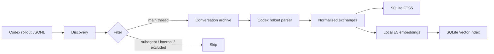
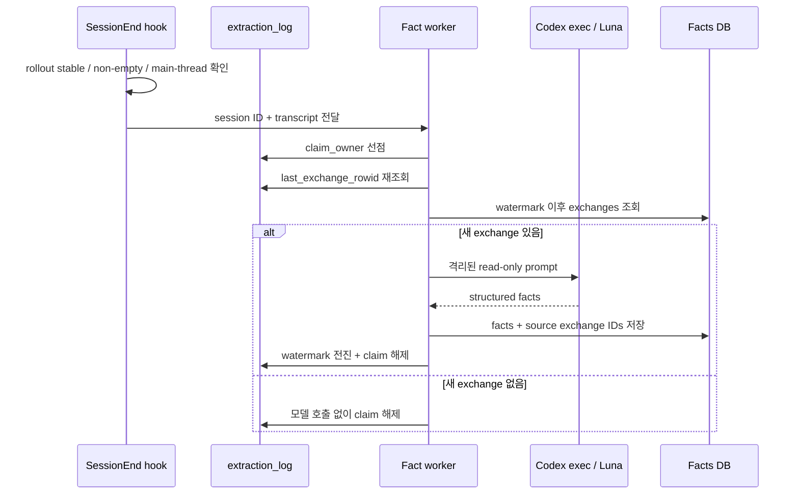
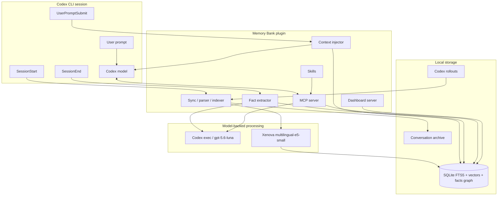

# Memory Bank for Codex 운영·아키텍처 가이드

이 문서는 로컬 체크아웃을 빌드하고 Codex plugin으로 등록하는 과정부터
MCP·CLI·hooks·대시보드 사용, 내부 처리 로직, 완전 해제까지 설명합니다.

## 1. 구성 요소와 사용 시점

| 구성 요소 | 하는 일 | 언제 사용하는가 |
| --- | --- | --- |
| Codex plugin | MCP, hooks, skills를 하나의 설치 단위로 제공 | 평소 Codex 세션에서 자동 메모리를 사용할 때 |
| MCP server | 대화, facts, ontology, provenance를 대화 중 조회 | Codex에게 과거 결정이나 근거를 찾아달라고 할 때 |
| CLI | 동기화, 색인 관리, 직접 검색, 통계와 전체 분석 | 초기 색인, 장애 진단, 자동화, 터미널 작업 시 |
| hooks | 세션 시작·프롬프트 제출·세션 종료에 자동 처리 | 별도 명령 없이 최신 상태와 문맥을 유지할 때 |
| dashboard | 프로젝트와 대화를 브라우저에서 탐색 | 전체 현황을 시각적으로 훑을 때 |

MCP는 현재 세션 안에서 Codex가 호출하는 인터페이스이고, CLI는 사용자가
터미널에서 직접 실행하는 운영 인터페이스입니다. 초기 구축과 복구에는 CLI,
일상적인 회상에는 MCP를 쓰는 것이 기본 흐름입니다.

## 2. 요구 사항과 빌드

- Node.js 22.15 이상
- Codex CLI 0.149 이상
- 로컬 Codex CLI 로그인

현재 체크아웃 경로를 지정하고 빌드합니다.

```bash
export MEMORY_BANK_REPO="/Users/choibongsu/Documents/memory-bank-codex"
cd "$MEMORY_BANK_REPO"
npm install
npm run build
```

Memory Bank는 의존성 설치, plugin 등록, Codex 설정 변경을 자동으로 하지
않습니다. `npm install`은 처음 받았거나 `package-lock.json`이 바뀐 경우에만
필요합니다.

## 3. 로컬 plugin 등록

Codex plugin은 marketplace를 통해 설치합니다. plugin cache나
`~/.codex/config.toml`을 직접 편집하지 않습니다. 아래 예시는 Memory Bank만
담는 전용 로컬 marketplace를 만듭니다.

### 3.1 marketplace 준비

```bash
export MEMORY_BANK_MARKETPLACE="/Users/choibongsu/.local/share/memory-bank-marketplace"
mkdir -p "$MEMORY_BANK_MARKETPLACE/.agents/plugins"
mkdir -p "$MEMORY_BANK_MARKETPLACE/plugins"
ln -s "$MEMORY_BANK_REPO" "$MEMORY_BANK_MARKETPLACE/plugins/memory-bank"
```

`$MEMORY_BANK_MARKETPLACE/.agents/plugins/marketplace.json`을 다음 내용으로
만듭니다.

```json
{
  "name": "memory-bank-local",
  "interface": {
    "displayName": "Memory Bank Local"
  },
  "plugins": [
    {
      "name": "memory-bank",
      "source": {
        "source": "local",
        "path": "./plugins/memory-bank"
      },
      "policy": {
        "installation": "AVAILABLE",
        "authentication": "ON_USE"
      },
      "category": "Engineering"
    }
  ]
}
```

### 3.2 marketplace와 plugin 등록

```bash
codex plugin marketplace add "$MEMORY_BANK_MARKETPLACE" --json
codex plugin add memory-bank@memory-bank-local --json
```

등록 상태를 확인합니다.

```bash
codex plugin marketplace list
codex plugin list
```

출력에 `memory-bank-local`과 `memory-bank@memory-bank-local`이 있어야 합니다.
등록 후에는 새 Codex thread를 시작해야 MCP tools, hooks, skills가 새 plugin
상태로 로드됩니다.

### 3.3 첫 동기화와 확인

```bash
cd "$MEMORY_BANK_REPO"
node cli/memory-bank.js sync
node cli/memory-bank.js stats
```

새 Codex thread에서 다음처럼 요청해 MCP 연결을 확인할 수 있습니다.

```text
Memory Bank의 graph_stats를 호출해서 현재 facts 수를 알려줘.
```

처음 동기화할 때 로컬 embedding 모델을 내려받고 과거 세션을 색인하므로
시간이 걸릴 수 있습니다. 이후 `sync`는 새 파일과 변경된 파일만 처리합니다.

## 4. MCP tools

| Tool | 기능 | 권장 사용 시점 |
| --- | --- | --- |
| `search` | semantic vector와 FTS text를 결합해 과거 exchange 검색. 2~5개 query 배열은 AND 검색 | 작업 시작 전 유사 문제, 결정, 오류를 회상할 때 |
| `read` | `search` 결과의 원본 대화를 줄 단위 범위로 읽음 | 요약만으로 부족해 전체 맥락과 근거가 필요할 때 |
| `search_facts` | 추출된 decision, preference, pattern, knowledge, constraint 검색 | 대화 원문보다 정제된 장기 지식이 필요할 때 |
| `search_ontology` | Domain → Category → Facts 계층 탐색 | 축적된 지식의 주제 구조를 파악할 때 |
| `ask_avatar` | 과거 결정과 선호를 근거로 Luna가 답변을 합성 | “나는 보통 어떤 선택을 했나” 같은 종합 질문을 할 때 |
| `trace_fact` | fact를 source exchange까지 역추적 | fact의 근거와 provenance를 검증할 때 |
| `graph_stats` | facts, domain, category, relation 통계 | 색인·추출 상태를 빠르게 점검할 때 |
| `cross_project_insights` | 현재 프로젝트를 제외한 다른 프로젝트의 유사 결정 검색 | 다른 프로젝트의 해결책을 재사용할 때 |
| `explore_graph` | fact/topic에서 최대 3-hop 관계 탐색 | 간접적으로 연결된 결정과 패턴을 찾을 때 |

일반적으로 `search` → `read` 또는 `search_facts` → `trace_fact` 순서로
좁혀가면 불필요한 context 사용을 줄일 수 있습니다. `ask_avatar`는 모델
호출이 필요한 종합 도구이고, 나머지 조회 도구는 저장된 데이터에 대한
read-only 탐색입니다.

## 5. CLI 명령

모든 예시는 저장소 루트에서 실행합니다.

| 명령 | 변경 여부 | 기능과 사용 시점 |
| --- | --- | --- |
| `sync [--background]` | 쓰기 | Codex rollouts를 archive로 복사하고 새 exchange를 색인. 최초 설정과 수동 최신화에 사용 |
| `index --cleanup` | 쓰기 | archive 중 아직 색인되지 않은 대화 처리. 대량 backfill에 사용 |
| `index --verify` | 읽기 | archive와 DB의 색인 상태 점검 |
| `index --repair` | 쓰기 | 확인된 누락·orphan 색인 복구 |
| `index --rebuild` | 파괴적 쓰기 | DB를 삭제하고 전체 재색인. 백업과 명시적 확인 후 최후 수단으로만 사용 |
| `search <query>` | 읽기 | 터미널에서 semantic/text 대화 검색 |
| `show <file>` | 읽기 | Codex JSONL 대화를 Markdown 또는 HTML로 변환 |
| `stats` | 읽기 | conversation, exchange, summary, project 통계 출력 |
| `analyze` | 읽기 | coverage, facts, ontology, 프로젝트·월별 활동을 종합 분석 |

대표 예시:

```bash
node cli/memory-bank.js sync
node cli/memory-bank.js search "React 인증"
node cli/memory-bank.js search --text "정확한 오류 문자열"
node cli/memory-bank.js show path/to/rollout.jsonl
node cli/memory-bank.js stats
node cli/memory-bank.js analyze --top 30 --out conversation-report.md
node cli/memory-bank.js index --verify
```

각 명령의 현재 옵션은 다음처럼 확인합니다.

```bash
node cli/memory-bank.js <command> --help
```

## 6. hooks 자동화

| Event | 실행 로직 | 사용자 영향 |
| --- | --- | --- |
| `SessionStart` | 버전 drift 확인, background `sync`, consolidation·re-embedding·ontology·extraction backlog 재개 | 세션 시작을 막지 않고 최신 상태를 따라잡음 |
| `UserPromptSubmit` | 현재 prompt로 관련 대화와 facts를 검색해 context 주입 | Codex가 이전 결정과 선호를 자동으로 참고 |
| `SessionEnd` | rollout 안정화 확인, 빈 세션·subagent 제외, 동기식 fact 추출, 성공 증거 후 export | 완료된 대화에서 durable facts를 증분 축적 |

hook 실패는 Codex 세션 자체를 막지 않습니다. SessionEnd 추출이 성공했다는
증거가 없으면 완료 watermark와 export를 남기지 않아 다음 실행에서 재시도할
수 있게 합니다.

## 7. Dashboard

```bash
cd "$MEMORY_BANK_REPO"
MEMORY_BANK_PLUGIN_ROOT="$MEMORY_BANK_REPO" node ui/server.cjs
```

브라우저에서 `http://127.0.0.1:3847`을 엽니다. dashboard는 loopback에만
bind하며 기본 Memory Bank DB를 읽습니다. 포트가 이미 사용 중이면 소유
프로세스를 확인하고, 다른 프로세스를 임의로 종료하지 마세요. 종료는 dashboard를
실행한 terminal에서 `Ctrl-C`를 사용합니다.

Codex에서는 “Memory Bank dashboard를 열어줘”라고 요청하면
`show-memory-bank-dashboard` skill이 같은 절차를 수행합니다.

## 8. 처리 로직

### 8.1 대화 수집과 검색 색인

1. `$CODEX_HOME/sessions/YYYY/MM/DD/rollout-*.jsonl`을 재귀 탐색합니다.
2. `parent_thread_id`가 있는 subagent, 내부 harness context, 제외 marker가 있는
   세션을 제외합니다.
3. rollout의 `session_meta.cwd`를 project 경계로 삼아 archive에 원자적으로
   복사합니다.
4. user/assistant exchange와 tool call을 정규화합니다.
5. `Xenova/multilingual-e5-small`로 로컬 embedding을 만들고 SQLite의
   FTS5·vector index에 저장합니다.
6. 동일 exchange는 ID 기반 UPSERT로 갱신해 SQLite `rowid`를 보존합니다.



### 8.2 증분 fact 추출

SessionEnd는 `extraction_log.last_exchange_rowid`보다 큰 exchange만 처리합니다.
동시에 hook과 backlog worker가 실행돼도 `claim_owner`가 한 runner만 선점하게
합니다. 선점 후 다시 watermark를 읽고, Luna가 facts를 추출하면 source exchange
ID를 provenance로 저장한 다음 watermark를 원자적으로 전진시킵니다.

동일 세션 재실행은 새 row가 없으면 모델을 호출하지 않는 no-op입니다. 세션에
exchange가 추가되면 추가분만 처리합니다. 일시 오류나 claim 이양은 완료로
기록하지 않아 다음 실행에서 재시도합니다.



### 8.3 전체 아키텍처



## 9. 모델과 격리 경계

| 모델 | 용도 | 실행 위치 |
| --- | --- | --- |
| `gpt-5.6-luna` | summary, fact extraction, consolidation, translation, avatar 합성 등 생성 작업 | 로그인된 로컬 `codex exec`를 통한 Codex 서비스 |
| `Xenova/multilingual-e5-small` | conversation/fact semantic embedding | 로컬 Node.js process |

생성 작업은 기본적으로 다음 보호 옵션과 임시 작업 디렉터리를 사용합니다.

```text
codex exec --ephemeral --ignore-user-config --ignore-rules \
  --sandbox read-only --skip-git-repo-check -C <temporary-directory> \
  -m gpt-5.6-luna --json -
```

따라서 child run은 user plugin/hooks를 다시 불러오지 않고, 활성 저장소에 쓰지
않으며, 별도 session rollout도 남기지 않습니다. 단, “로컬 Codex CLI 사용”은
“완전 오프라인 모델”이라는 뜻이 아닙니다. 생성 prompt의 처리는 로그인된 Codex
서비스와 계정 정책을 따릅니다.

## 10. 데이터 위치

기본 데이터 루트는 `~/.config/memory-bank`입니다.

```text
~/.config/memory-bank/
├── conversation-archive/       # project별 rollout과 summary
└── conversation-index/
    └── db.sqlite               # exchanges, vectors, facts, ontology, provenance
```

우선순위는 다음과 같습니다.

1. `MEMORY_BANK_HOME`
2. `MEMORY_BANK_CONFIG_DIR`
3. `$XDG_CONFIG_HOME/memory-bank`
4. `~/.config/memory-bank`

`MEMORY_BANK_DB_PATH`는 SQLite 파일만, `MEMORY_BANK_SESSIONS_DIR`는 읽을 Codex
rollout root만 바꿉니다. 현재 schema는 [SCHEMA.md](SCHEMA.md)를 참고하세요.

## 11. plugin 해제와 데이터 정리

먼저 Memory Bank를 사용하는 Codex thread를 종료하고 dashboard가 실행 중이면
해당 terminal에서 `Ctrl-C`로 종료합니다.

### 11.1 plugin과 marketplace 등록 해제

```bash
codex plugin remove memory-bank@memory-bank-local --json
codex plugin marketplace remove memory-bank-local --json
```

등록이 사라졌는지 확인합니다.

```bash
codex plugin list
codex plugin marketplace list
```

plugin 제거는 Memory Bank DB와 원본 Codex rollouts를 삭제하지 않습니다.

### 11.2 전용 marketplace 파일 제거

아래 명령은 3절에서 만든 전용 marketplace 경로를 그대로 사용하는 경우에만
실행합니다.

```bash
rm "$MEMORY_BANK_MARKETPLACE/plugins/memory-bank"
rm "$MEMORY_BANK_MARKETPLACE/.agents/plugins/marketplace.json"
rmdir "$MEMORY_BANK_MARKETPLACE/plugins"
rmdir "$MEMORY_BANK_MARKETPLACE/.agents/plugins"
rmdir "$MEMORY_BANK_MARKETPLACE/.agents"
rmdir "$MEMORY_BANK_MARKETPLACE"
```

`rmdir`은 예상하지 않은 파일이 남아 있으면 실패하므로 다른 데이터를 함께
삭제하지 않습니다.

### 11.3 선택: Memory Bank 데이터 삭제

데이터를 보존하려면 이 단계는 건너뜁니다. 환경 변수로 경로를 바꿨다면 아래
기본값 대신 실제 사용한 정확한 경로를 지정해야 합니다.

```bash
export MEMORY_BANK_DATA_ROOT="/Users/choibongsu/.config/memory-bank"
du -sh "$MEMORY_BANK_DATA_ROOT"
lsof +D "$MEMORY_BANK_DATA_ROOT"
rm -r "$MEMORY_BANK_DATA_ROOT"
test ! -e "$MEMORY_BANK_DATA_ROOT"
```

삭제 전에 `du`와 `lsof`로 대상과 활성 사용자를 확인합니다. 원본
`$CODEX_HOME/sessions`는 Memory Bank 소유가 아니므로 삭제 대상이 아닙니다.

## 12. 문제 해결

- MCP가 보이지 않음: plugin 등록 후 새 Codex thread를 시작했는지 확인합니다.
- build 파일 없음: 저장소에서 `npm run build`를 실행합니다.
- 검색 결과 없음: `sync`와 `stats`를 실행해 archive와 exchange 수를 확인합니다.
- exact error/SHA 검색 실패: `search --text` 또는 MCP `search`의 `mode: text`를
  사용합니다.
- 중복 추출 의심: `graph_stats`, `trace_fact`, `index --verify`로 상태를 확인하고
  임의로 DB를 수정하지 않습니다.
- dashboard가 열리지 않음: `lsof -nP -iTCP:3847 -sTCP:LISTEN`으로 포트 소유자를
  먼저 확인합니다.
