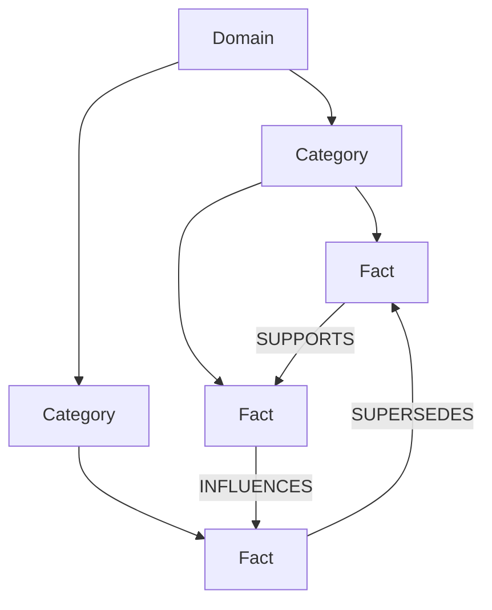
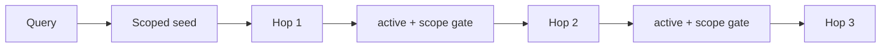

# 지식 그래프

## 1. 모델

Memex graph는 대화 원문을 직접 node로 연결하지 않습니다. 대화에서 증류한 **active fact**를 ontology에 배치하고 fact 사이의 typed relation을 연결합니다.



## 2. Local-derived 계약

protocol v5에서 다음은 sync payload에 포함하지 않습니다.

- ontology domains/categories
- `ontology_category_id`
- ontology relations
- category vectors

각 기기는 durable fact state에서 graph를 자체 재구축합니다. 이를 통해 taxonomy UUID 충돌과 private-derived taxonomy의 cross-device 전파를 구조적으로 피합니다.

## 3. Taxonomy 유일성과 수리 (issue #47)

Domain 이름과 domain 안의 category 이름은 **스키마 레벨에서 unique**합니다.

```sql
CREATE UNIQUE INDEX idx_ontology_domains_name           ON ontology_domains(name COLLATE NOCASE);
CREATE UNIQUE INDEX idx_ontology_categories_domain_name ON ontology_categories(domain_id, name COLLATE NOCASE);
```

`createDomain` / `createCategory`는 `INSERT ... ON CONFLICT DO NOTHING` 후 재조회하므로, 경쟁에서 진 writer는 taxonomy를 분기시키지 않고 승자의 행을 채택합니다. `applyClassification`의 transaction은 `.immediate()`입니다 — 이름을 읽고 나서 쓰는 transaction이라 DEFERRED로는 두 커넥션이 같은 이름을 동시에 만들 수 있습니다(`createRelation`은 이미 같은 이유로 immediate였습니다).

이 index를 만들기 전에, 이미 존재하는 대소문자 중복은 idempotent migration이 먼저 병합합니다: 가장 오래된 행을 남기고 category/fact를 그쪽으로 재지정한 뒤 나머지를 지웁니다. Chronicle 이벤트는 남기지 않고 semantic/lifecycle generation도 올리지 않습니다 — fact 의미는 전혀 바뀌지 않고 filed-under overlay만 옮겨가기 때문입니다.

한계: SQLite의 `COLLATE NOCASE`는 ASCII만 접습니다. `Café`와 `café`는 여전히 다른 이름으로 취급됩니다.

### merge / rename

```bash
memex ontology list [--json]
memex ontology merge <from-category-id> <to-category-id> [--dry-run]
memex ontology rename <category-id> "<new name>"
```

- `merge`: `from`의 모든 fact를 `to`로 재지정하고 `from` 행과 그 vector를 삭제합니다(`deleteCategoryEmbedding`이 드디어 호출자를 얻었습니다).
- `rename`: label만 바꾸고 fact 할당은 유지합니다. 임베딩 텍스트가 `"name: description"`이므로 vector는 무효화(`embedding_version = 0`)되고 bounded self-heal / `memex backfill embeddings`가 다시 만듭니다. 같은 domain에 이미 있는 이름으로의 rename은 거부되고 merge를 안내합니다.

둘 다 Chronicle 이벤트도, generation bump도, attempt ledger reset도 만들지 않습니다(fact의 **의미**는 바뀌지 않습니다). `logs/ui-audit.jsonl`에 metadata 한 줄만 남깁니다.

0.6.3(#73)부터 둘 다 **taxonomy epoch을 자기 트랜잭션 안에서 올립니다**. candidate identity는 바뀌기 때문입니다: `applyClassification`의 resolve-or-create는 **이름 기반**이라, 병합으로 사라진 이름을 candidate로 들고 있던 진행 중 분류가 epoch CAS를 통과하면 그 이름을 **새 id로 되살렸습니다**(실측: `Cache`를 `Storage`로 병합한 뒤 `epochUnchanged: true`, `sameId: false` — 사용자의 병합이 조용히 되돌려짐). 이제 그런 결과는 `StaleFactMutationError`로 폐기되고(시도 ledger도 태우지 않습니다) 다음 패스에서 새 taxonomy로 재분류됩니다. `--dry-run`은 epoch를 올리지 않습니다.

## 4. Category 분류

active fact는 하나의 category에 속할 수 있고 category는 하나의 domain에 속합니다. 미분류 fact도 일반 fact 검색에는 나타날 수 있지만 ontology graph에는 아직 배치되지 않습니다.

분류 candidate는 category 이름/설명의 vector index를 사용합니다. vector가 누락됐거나 embedding generation이 맞지 않으면 bounded self-heal을 먼저 수행해 서로 다른 vector space를 섞지 않습니다.

### 분류 유사도와 결정론적 재사용 레인

선택된 category가 candidate 목록에 있었다면 그 코사인 유사도를 `facts.ontology_similarity`에 남깁니다. 저장하지 않으면 0.42로 붙은 할당과 0.98로 붙은 할당이 사후 구분 불가라, "낮은 신뢰도 할당만 재분류" 같은 정책 자체가 불가능합니다.

무비용 결정론적 재사용 레인(`tryDeterministicAssign`)은 **`MEMEX_ONTOLOGY_DET_GATE`가 설정되지 않으면 꺼져 있습니다** — 기본값이 `+Infinity`라 어떤 유사도도 통과하지 못하고, 따라서 프로덕션 기본에서 `totals.deterministic`은 항상 0입니다. 이는 의도된 동작입니다: 고정 임계값은 코퍼스마다 다르고, 잘못 고른 값은 서로 다른 주제를 조용히 한 category로 접어버립니다. 켜려면 현재 taxonomy에 대해 측정한 `(0,1)` 값을 명시적으로 설정하십시오(이제 `ontology_similarity`가 그 측정의 입력입니다).

### Semantic CAS

classifier는 fact의 `semantic_generation`을 캡처합니다. LLM/embedding await 중 fact 의미가 바뀌면 최종 assignment를 폐기합니다.

의미가 대기 중에 바뀐 결과는 `stale`로 보고됩니다. stale은 실패가 아니라 진행(새 의미가 다음 분류 대상)이므로 worker의 `totals`에 집계되고 서킷 브레이커의 "무진전" 판정에서 제외됩니다 — 예전에는 100% stale 배치가 무진전 transient로 오인되어 브레이커를 밀었습니다.

### Taxonomy epoch

privacy purge는 taxonomy 전체를 invalidate하므로 fact generation만으로는 stale classifier를 막을 수 없습니다. `taxonomy_state`의 global epoch을 별도로 사용합니다.

```text
classification start       → capture epoch N
privacy purge              → wipe taxonomy + epoch N+1
ontology merge / rename    → candidate identity 변경 + epoch N+1   (0.6.3, #73)
old result returns         → epoch mismatch, discard
```

새 domain/category 생성과 fact assignment는 stale 결과가 taxonomy residue를 남기지 않도록 같은 commit 경계에서 처리합니다.

## 5. Attempt ledger와 parking

반복적으로 분류할 수 없는 fact가 매 maintenance마다 LLM 호출을 소비하지 않도록 bounded attempt ledger를 둡니다. MAX에 도달한 같은 semantic generation만 General/Misc fallback으로 park할 수 있습니다.

semantic mutation은 attempt ledger를 reset합니다. privacy purge도 surviving facts의 attempts/last-attempt를 reset하여 새 taxonomy에서 다시 분류할 수 있게 합니다.

### Parking은 별도 state이고 영구가 아닙니다 (issue #41)

Parking은 `ontology_category_id`만 쓰지 않습니다. 그렇게 하면 **LLM이 실제로 Misc를 고른 assignment**와 **실패해서 park된 assignment**가 schema 상 구분되지 않고, status가 park된 fact를 classified로 세어 `Ontology: READY`라고 보고합니다.

| Column | 의미 |
| --- | --- |
| `facts.ontology_state` | `'parked'` 이면 bounded 실패 후 보관 중. LLM이 고른 Misc는 `NULL` |
| `facts.ontology_parked_at` | park된 시각 |
| `facts.ontology_parked_version` | park 당시의 `(classifier policy, embedding generation)` 토큰 (`p<policy>:e<embedding>`) |

재시도는 **정책/embedding 세대당 정확히 한 번**입니다. 저장된 토큰이 현재 토큰과 다를 때만 selector가 park를 pending으로 되돌리고, release 시점에 현재 토큰을 다시 stamp하므로 재시도 도중 크래시가 나도 같은 세대에서 두 번째 재시도는 발생하지 않습니다. 다시 실패하면 현재 토큰으로 re-park됩니다.

selector는 `src/ontology-selector.ts` 한 곳에 있고 worker / SessionStart hook / maintenance budget / status가 모두 이것을 씁니다.

### Batch 출력 예산 초과는 개별 fact의 실패가 아닙니다

출력 토큰 예산은 batch 크기의 함수이므로(`256 * n + 512`), 초과는 시스템 원인입니다. 초과 시 batch를 절반으로 나눠 다시 호출하며 attempt를 소모하지 않습니다. fact 하나만 남았는데도 초과하면 그때만 content 실패로 ledger에 청구합니다.

### Index repair는 log가 아니라 status/doctor로 올라갑니다

`vec_categories`가 self-heal로 고칠 수 없는 상태면 `IndexRepairError`가 발생하고 `ontology_index_repair_state`(단일 행)에 기록됩니다. `memex status`는 `ontology category index: MANUAL REPAIR REQUIRED (...)`를, `memex doctor`는 `ontology-index` check를 FAIL로 보고합니다. 인덱스가 다시 정합해지면 같은 행이 `clear`로 바뀝니다.

## 6. Relation

허용 relation:

| Relation | 의미 |
| --- | --- |
| `INFLUENCES` | source가 target의 선택/형태에 영향을 줌 |
| `SUPPORTS` | source가 target을 강화하는 근거/제약 |
| `SUPERSEDES` | source가 target을 대체하는 더 최신 사실 |
| `CONTRADICTS` | 두 사실을 동시에 현재 상태로 보기 어려움 |

단순 vector similarity는 relation이 아닙니다. 자동 classifier는 필수 `ReadScope`와 참가자 `MutationPolicy`를 `createRelationInScope`에 전달합니다. 최종 transaction은 양 endpoint의 의미·활성 상태·placement와 read scope를 검사하고, LLM 대기 중 바뀐 edge를 폐기합니다.

`(source_fact_id, relation_type, target_fact_id)`는 unique입니다.

## 7. Scope isolation

Stable project/workspace/workstream/session과 global/all의 정확한 가시성은
[ReadScope 계약](RETRIEVAL-AND-CONTEXT.md#3-scope)을 따릅니다. `cross_project_insights`는 명시적으로
current project를 제외한 범위를 선택합니다. Legacy path 해석은 별도 adapter에만 있습니다.

서로 다른 두 project fact 사이의 direct edge는 금지합니다. global↔project edge는 허용합니다.
`getRelatedFactsInScope`는 scope를 필수로 받아 seed와 모든 hop에서 active/scope를 검사합니다.
범위 밖 seed나 중간 node를 통해 범위 안 node로 우회할 수 없습니다. Legacy positional
`getRelatedFacts()`에서 scope를 생략하면 global만 읽습니다.

## 8. Traversal

`explore_graph`는 scoped seed를 찾은 뒤 최대 1–3 hop relation을 확장합니다.



visited set으로 cycle을 차단합니다.

## 9. Privacy purge 이후 rebuild

`DO NOT INDEX` conversation purge는 private-derived taxonomy가 future classifier candidate로 남지 않도록 domains/categories/category vectors를 전부 지우고 taxonomy epoch을 올립니다.

surviving public facts는:

```text
ontology_category_id = NULL
ontology_attempts = 0
ontology_last_attempt_at = NULL
```

상태로 돌아가 다음 ontology backfill에서 재분류됩니다. 이 과정은 추가 LLM 비용을 만들 수 있지만 privacy correctness를 우선한 의도된 동작입니다.

## 10. Graph health

정상 graph의 기본 조건:

- dangling category/fact/relation endpoint 0
- `ontology_index_repair_state.state = 'blocked'` 없음
- invalid relation enum 0
- forbidden cross-project direct edge 0
- inactive fact node 0
- project query에서 다른 project fact 0
- provenance 없는 fact는 health gap으로 보고

`graph_stats`와 `/api/v2/graph`는 이 local-derived graph 상태를 관측하는 public surface입니다.
