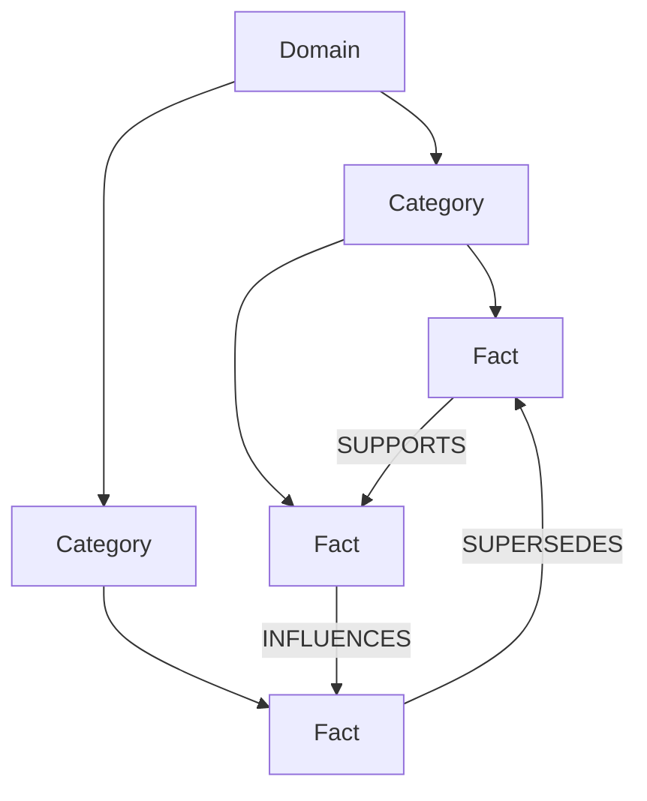
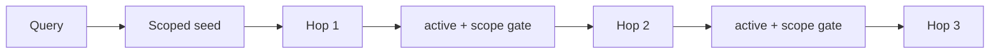

# 지식 그래프

## 1. 모델

Memex graph는 대화 원문을 직접 node로 연결하지 않습니다. 대화에서 증류한 **active fact**를 ontology에 배치하고 fact 사이의 typed relation을 연결합니다.



## 2. Local-derived 계약

protocol v5에서 다음은 sync payload에 포함하지 않습니다.

- ontology domains/categories
- `ontology_category_id`
- ontology relations
- category vectors

각 기기는 durable fact state에서 graph를 자체 재구축합니다. 이를 통해 taxonomy UUID 충돌과 private-derived taxonomy의 cross-device 전파를 구조적으로 피합니다.

## 3. Category 분류

active fact는 하나의 category에 속할 수 있고 category는 하나의 domain에 속합니다. 미분류 fact도 일반 fact 검색에는 나타날 수 있지만 ontology graph에는 아직 배치되지 않습니다.

분류 candidate는 category 이름/설명의 vector index를 사용합니다. vector가 누락됐거나 embedding generation이 맞지 않으면 bounded self-heal을 먼저 수행해 서로 다른 vector space를 섞지 않습니다.

### Semantic CAS

classifier는 fact의 `semantic_generation`을 캡처합니다. LLM/embedding await 중 fact 의미가 바뀌면 최종 assignment를 폐기합니다.

### Taxonomy epoch

privacy purge는 taxonomy 전체를 invalidate하므로 fact generation만으로는 stale classifier를 막을 수 없습니다. `taxonomy_state`의 global epoch을 별도로 사용합니다.

```text
classification start → capture epoch N
privacy purge         → wipe taxonomy + epoch N+1
old result returns    → epoch mismatch, discard
```

새 domain/category 생성과 fact assignment는 stale 결과가 taxonomy residue를 남기지 않도록 같은 commit 경계에서 처리합니다.

## 4. Attempt ledger와 parking

반복적으로 분류할 수 없는 fact가 매 maintenance마다 LLM 호출을 소비하지 않도록 bounded attempt ledger를 둡니다. MAX에 도달한 같은 semantic generation만 General/Misc fallback으로 park할 수 있습니다.

semantic mutation은 attempt ledger를 reset합니다. privacy purge도 surviving facts의 attempts/last-attempt를 reset하여 새 taxonomy에서 다시 분류할 수 있게 합니다.

### Parking은 별도 state이고 영구가 아닙니다 (issue #41)

Parking은 `ontology_category_id`만 쓰지 않습니다. 그렇게 하면 **LLM이 실제로 Misc를 고른 assignment**와 **실패해서 park된 assignment**가 schema 상 구분되지 않고, status가 park된 fact를 classified로 세어 `Ontology: READY`라고 보고합니다.

| Column | 의미 |
| --- | --- |
| `facts.ontology_state` | `'parked'` 이면 bounded 실패 후 보관 중. LLM이 고른 Misc는 `NULL` |
| `facts.ontology_parked_at` | park된 시각 |
| `facts.ontology_parked_version` | park 당시의 `(classifier policy, embedding generation)` 토큰 (`p<policy>:e<embedding>`) |

재시도는 **정책/embedding 세대당 정확히 한 번**입니다. 저장된 토큰이 현재 토큰과 다를 때만 selector가 park를 pending으로 되돌리고, release 시점에 현재 토큰을 다시 stamp하므로 재시도 도중 크래시가 나도 같은 세대에서 두 번째 재시도는 발생하지 않습니다. 다시 실패하면 현재 토큰으로 re-park됩니다.

selector는 `src/ontology-selector.ts` 한 곳에 있고 worker / SessionStart hook / maintenance budget / status가 모두 이것을 씁니다.

### Batch 출력 예산 초과는 개별 fact의 실패가 아닙니다

출력 토큰 예산은 batch 크기의 함수이므로(`256 * n + 512`), 초과는 시스템 원인입니다. 초과 시 batch를 절반으로 나눠 다시 호출하며 attempt를 소모하지 않습니다. fact 하나만 남았는데도 초과하면 그때만 content 실패로 ledger에 청구합니다.

### Index repair는 log가 아니라 status/doctor로 올라갑니다

`vec_categories`가 self-heal로 고칠 수 없는 상태면 `IndexRepairError`가 발생하고 `ontology_index_repair_state`(단일 행)에 기록됩니다. `memex status`는 `ontology category index: MANUAL REPAIR REQUIRED (...)`를, `memex doctor`는 `ontology-index` check를 FAIL로 보고합니다. 인덱스가 다시 정합해지면 같은 행이 `clear`로 바뀝니다.

## 5. Relation

허용 relation:

| Relation | 의미 |
| --- | --- |
| `INFLUENCES` | source가 target의 선택/형태에 영향을 줌 |
| `SUPPORTS` | source가 target을 강화하는 근거/제약 |
| `SUPERSEDES` | source가 target을 대체하는 더 최신 사실 |
| `CONTRADICTS` | 두 사실을 동시에 현재 상태로 보기 어려움 |

단순 vector similarity는 relation이 아닙니다. 자동 classifier는 필수 `ReadScope`와 참가자 `MutationPolicy`를 `createRelationInScope`에 전달합니다. 최종 transaction은 양 endpoint의 의미·활성 상태·placement와 read scope를 검사하고, LLM 대기 중 바뀐 edge를 폐기합니다.

`(source_fact_id, relation_type, target_fact_id)`는 unique입니다.

## 6. Scope isolation

Stable project/workspace/workstream/session과 global/all의 정확한 가시성은
[ReadScope 계약](RETRIEVAL-AND-CONTEXT.md#3-scope)을 따릅니다. `cross_project_insights`는 명시적으로
current project를 제외한 범위를 선택합니다. Legacy path 해석은 별도 adapter에만 있습니다.

서로 다른 두 project fact 사이의 direct edge는 금지합니다. global↔project edge는 허용합니다.
`getRelatedFactsInScope`는 scope를 필수로 받아 seed와 모든 hop에서 active/scope를 검사합니다.
범위 밖 seed나 중간 node를 통해 범위 안 node로 우회할 수 없습니다. Legacy positional
`getRelatedFacts()`에서 scope를 생략하면 global만 읽습니다.

## 7. Traversal

`explore_graph`는 scoped seed를 찾은 뒤 최대 1–3 hop relation을 확장합니다.



visited set으로 cycle을 차단합니다.

## 8. Privacy purge 이후 rebuild

`DO NOT INDEX` conversation purge는 private-derived taxonomy가 future classifier candidate로 남지 않도록 domains/categories/category vectors를 전부 지우고 taxonomy epoch을 올립니다.

surviving public facts는:

```text
ontology_category_id = NULL
ontology_attempts = 0
ontology_last_attempt_at = NULL
```

상태로 돌아가 다음 ontology backfill에서 재분류됩니다. 이 과정은 추가 LLM 비용을 만들 수 있지만 privacy correctness를 우선한 의도된 동작입니다.

## 9. Graph health

정상 graph의 기본 조건:

- dangling category/fact/relation endpoint 0
- `ontology_index_repair_state.state = 'blocked'` 없음
- invalid relation enum 0
- forbidden cross-project direct edge 0
- inactive fact node 0
- project query에서 다른 project fact 0
- provenance 없는 fact는 health gap으로 보고

`graph_stats`와 `/api/v2/graph`는 이 local-derived graph 상태를 관측하는 public surface입니다.
