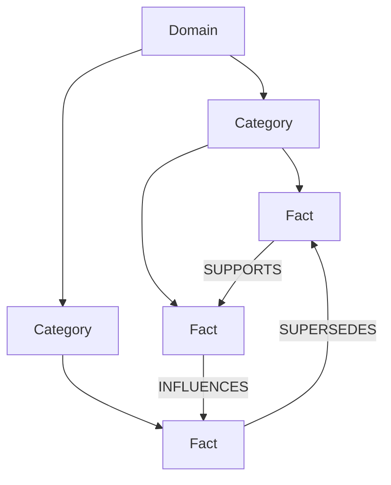
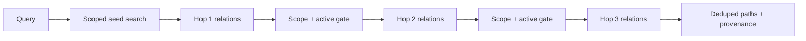

# 지식 그래프

## 1. 모델

Memex graph는 대화를 직접 node로 연결하는 그래프가 아니라, 대화에서 증류한 active
fact를 ontology에 배치하고 fact 사이의 의미 관계를 연결한 그래프입니다.

## 2. relation 의미

| Relation | 질문 | 방향 의미 |
| --- | --- | --- |
| `INFLUENCES` | A가 B의 선택/형태에 영향을 주었는가 | A → B |
| `SUPPORTS` | A가 B의 근거/제약을 강화하는가 | A → B |
| `SUPERSEDES` | A가 B를 대체하는 더 최신 사실인가 | A → B |
| `CONTRADICTS` | A와 B를 동시에 현재 사실로 보기 어려운가 | 저장 방향은 provenance, UI는 양방향 탐색 가능 |

relation에는 reasoning과 생성 시각이 붙습니다. 단순 vector 유사도는 edge가 아닙니다.
endpoint와 enum 검증을 통과한 관계만 저장됩니다.

## 3. ontology 분류

fact는 정확히 한 category에 속할 수 있고 category는 정확히 한 domain에 속합니다.
분류되지 않은 active fact는 검색에는 나타날 수 있지만 ontology graph에는 포함되지
않습니다. edit는 의미가 바뀔 수 있으므로 기존 category를 신뢰하지 않고 pending으로
되돌립니다.

category candidate 검색은 category 이름과 설명의 vector를 사용합니다. 각 category는
`embedding_version`을 가지며 vector write와 version stamp가 한 transaction에서
커밋됩니다. 현재 embedding generation과 다른 category 또는 vector row가 누락된
category가 하나라도 있으면 KNN을 실행하지 않고 bounded self-heal/re-embed를 먼저
수행합니다. 따라서 model 변경 중 서로 다른 vector space의 distance를 비교하지 않습니다.

## 4. traversal

`explore_graph`는 query에서 seed fact를 찾고 1–3 hop 관계를 확장합니다.

각 hop은 active와 scope를 다시 검사합니다. seed만 project 범위이고 2-hop부터 다른
project로 새는 구현은 허용하지 않습니다. cycle은 visited set으로 차단하며 max hops는
3입니다.

## 5. scope isolation

- `project=/a`: `/a` project fact + global fact
- `scope=global`: global fact만
- `scope=all`: 모든 project를 명시적으로 요청한 경우만
- `cross_project_insights`: current project를 명시하고 그 project를 결과에서 제외

서로 다른 project fact의 direct edge는 금지합니다. global fact가 여러 project의 공통
제약으로 연결되는 것은 허용합니다. 이 규칙은 caller filtering이 아니라
`ontology_relations`의 INSERT와 endpoint UPDATE trigger가 최종 write boundary에서
강제하므로 low-level `createRelation()`, sync/import, raw SQL writer가 우회할 수 없습니다.

## 6. graph API

`/api/graph-data` 응답의 최상위 배열은 `domains`, `cats`, `facts`, `rel`입니다.
각 fact는 category/scope/type/label과 UI에 필요한 최소 메타데이터를 포함하고 relation은
source/target/type을 포함합니다. API boundary는 누락 배열을 오류로 처리하지만 네 배열이
모두 빈 것은 정상 신규 설치 상태입니다.

## 7. 품질 점검

정상 graph:

- dangling category/fact/relation endpoint 0
- 허용되지 않은 relation enum 0
- cross-project direct edge 0
- inactive fact node 0
- project query에서 다른 project fact 0
- provenance 없는 fact는 health gap으로 표시

`graph_stats`는 domain/category/fact/relation 수와 health를 제공하며, UI 숫자를 수작업으로
재계산하는 대신 이 deterministic 결과를 사용합니다.
