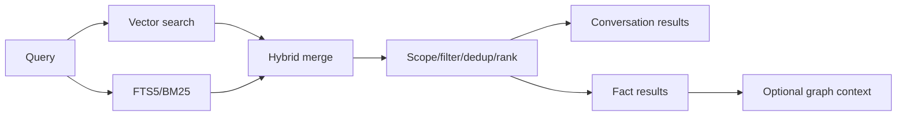
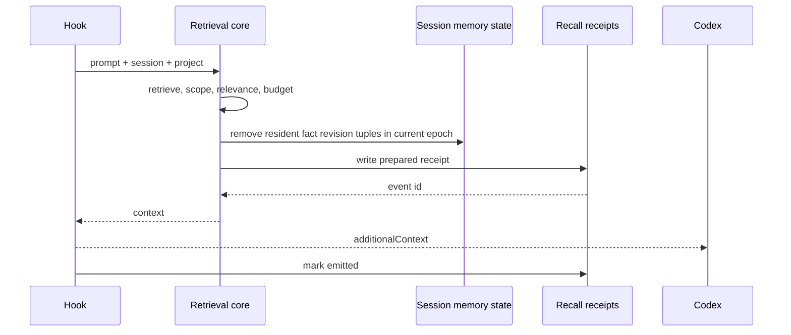

# 검색, RAG, 컨텍스트 주입

## 1. 검색 lane

Memex는 exact term과 semantic similarity를 함께 다룹니다.



- `vector` — 의미 유사도
- `text` — 정확한 용어·식별자
- `both` — 두 lane을 합침

scope/date/category filter는 caller limit보다 먼저 적용합니다.

Fact 검색은 `searchFactsCombinedInScope`가 lexical과 semantic 결과를 ID로 합칩니다.
경로, 함수 호출, camelCase/snake_case, 오류 코드는 자연어 안에서도 최대 4개 식별자로
추출하며 긴 일반 문장은 lexical `LIKE` 대상에서 제외합니다. SQL pattern은 escape하고,
기존 legacy identity adapter와 `ReadScope` 검증을 통과한 뒤 caller limit을 적용합니다.
Lexical-only 결과를 관측된 semantic similarity 100%로 표시하지 않습니다.

## 2. Expanding KNN

sqlite-vec의 KNN limit은 metadata filter보다 먼저 후보를 자를 수 있습니다. out-of-scope row가 상위 후보를 채우면 유효한 project fact가 보이지 않는 문제가 생기므로 Memex는 작은 window에서 시작해 필요한 수가 채워지거나 index를 소진할 때까지 window를 단계적으로 확장합니다.

conversation과 fact 검색은 같은 원칙을 사용합니다.

## 3. Scope

새 fact core는 `src/read-scope.ts`의 `ReadScope`를 필수로 받습니다.
`searchFactsInScope`, `listFactsInScope`, `factMatchesReadScope`, `getRelatedFactsInScope`,
`getFactsByCategoryInScope`는 누락/잘못된 scope를 런타임에서도 거부합니다.

- `project-id`: project-wide/legacy fact; `includeGlobal` 기본 true, false일 때만 global 제외
- `workspace-id`: 해당 workspace truth와 project-wide truth
- `workstream-id`: 해당 workstream truth와 허용 workspace/project-wide truth
- `session-id`: 같은 project에서 해당 session의 source exchange를 인용한 fact
- `global`: global만
- `all`/`other-project-id`: 명시적 관리/교차 프로젝트 조회
- `fact-ids`: legacy adapter가 확정한 유한 ID 집합

`legacy-read-scope.ts`만 canonical path compatibility를 해석합니다. 기존 positional reader는 이
adapter를 거치며 scope 생략 시 global만 읽습니다. Legacy row의 read-time identity overlay는 DB를
수정하지 않습니다. 새 core에 path 비교를 추가하거나 생략된 scope를 all로 확장하지 않습니다.
Workspace/workstream/session은 project membership을 검증합니다. 명시적으로 공유한 workstream은
여러 workspace의 session에서 사용할 수 있으므로 workstream의 최초 workspace를 독점 owner로 보지 않습니다.

`readScopeForSession`(0.6.0)은 세션의 `session_memory_state`에서 scope를 유도합니다. project와
workstream이 모두 있으면 `workstream-id` scope(= 글로벌 + 프로젝트 공용 + 현재 브랜치 tier)이고,
project에 붙지 못했거나 그 project가 `quarantined = 1`이면 **글로벌 전용**으로 낮춥니다. 아무것도 못 읽는
쪽이 남의 프로젝트 기억을 자기 것으로 읽는 쪽보다 안전하기 때문입니다(#38). 브랜치 tier 사이에는
가시성이 없으므로 다른 브랜치의 기억은 승격되기 전까지 주입되지 않습니다.

`process.cwd()`나 MCP 설치 경로는 project 추론 근거가 아닙니다. Graph는 seed와 모든 hop에 같은
scope를 적용하고 범위 밖 node를 다음 hop의 bridge로 쓰지 않습니다. 읽기 범위는
[MutationPolicy](FACT-LIFECYCLE.md#6-semantic-mutation)의 수정 권한을 부여하지 않습니다.

## 4. UserPromptSubmit injection



warm sidecar와 cold fallback은 transport만 다르고 selection logic은 같습니다.

정확한 경로·심볼·오류 코드가 active scoped fact에서 누락됐을 때는 검증된 사용자 원문을
제한적으로 조회합니다. Fact 요약은 원문의 모든 식별자를 보존하는 색인이 아니므로, 누락을
고치기 위해 검증된 fact 본문에 문자열을 덧붙이거나 extraction을 다시 실행하지 않습니다.
이 원문은 현재 사실이 아닌 잠재적으로 오래된 context-only 참고 근거입니다. Assistant,
tool output, recall과 compaction 전달문은 이 사용자 원문 경로에 포함하지 않습니다.
현재 source session과 exchange의 project/workspace/workstream이 일치해야 하며, workspace도
같은 project 소속이어야 합니다. 명시적으로 공유한 workstream의 다른 workspace는 허용합니다.
같은 turn에 Memex 도구를 호출했어도 독립된 사용자 발언은 그대로 조회할 수 있습니다.
질의당 최대 4개 식별자, 식별자당 최근 후보 최대 128개, 최종 원문 최대 2개로 제한하며,
정확한 식별자와 exchange ID/line pointer가 함께 들어가지 않는 긴 항목은 생략합니다.

## 4a. Pre-retrieval cheap gate (Phase 5)

`UserPromptSubmit` hook은 매번 실행되지만, embedding/vector search/graph expansion/model call은
`src/recall-gate.ts`의 cheap gate가 `retrieve`로 판정할 때만 실행됩니다. gate는 local session state와
lexical fingerprint만 사용하고 LLM을 호출하지 않습니다.

| 순서 | 판정 | 결과 |
| --- | --- | --- |
| 1 | state trigger: explicit memory intent(왜/언제/이전/기록/출처/why/history/source/again…), verified incident signature match, `project.memory_revision > seen`, resident revision stale(이 epoch에 주입된 fact의 semantic/lifecycle generation이 바뀌었거나 비활성화됨 — workstream truth는 project revision을 올리지 않으므로 residency 자체가 invalidation token, D-036), Capsule generation 변경, context epoch 변경(compact/clear 뒤 첫 prompt, epoch 내 첫 prompt) | retrieve (길이·ack 여부 무관) |
| 2 | acknowledgement/continuation lexicon(KR/EN, ≤ 4 tokens), 짧은 minor correction | skip, embedding 0 |
| 3 | high-impact intent(decide/switch/migrate/rollback/전환/롤백…), safety refresh(substantive skip 6회) | retrieve |
| 4 | topic drift: prompt tokens vs topic fingerprint Jaccard < 0.12 (≥ 5 tokens) | retrieve |
| 5 | low resident coverage: ≥ 8 tokens인데 resident fact vocabulary와 교집합 0 | retrieve |
| 6 | 짧은 prompt가 topic과 겹침(Jaccard ≥ 0.3) 또는 substantive prompt가 강하게 겹침(≥ 0.35) | skip, embedding 0 |
| 7 | 그 외 | ambiguous → embedding 1회: `cos(prompt, topic) - baseline ≥ 0.08`이면 skip(coherent), 아니면 retrieve(embedding_drift); topic embedding이 없으면 retrieve |

state trigger(1)는 acknowledgement보다 먼저 평가됩니다. 그래서 새 session/epoch의 첫 prompt가 "계속해"여도
Capsule(`[WORK NOW]`)과 pending correction은 전달됩니다. 다만 ack/continuation은 vector 없이 처리됩니다
(embedding 0, CURRENT TRUTH 검색 없음, topic fingerprint 유지). 그 외 retrieve path는 embedding을 정확히
1회 계산하고 ambiguous path의 embedding은 retrieval에 그대로 재사용됩니다.

fingerprint tokenizer는 소문자·stopword 제거 뒤 한국어 token의 꼬리 조사/어미(을/를/도/에서/해줘/해주세요 …)를
한 개 벗겨 "클라이언트를"과 "클라이언트"를 같은 token으로 만듭니다(retrieval embedding에는 영향 없음).
기본값은 `DEFAULT_RECALL_GATE_CONFIG`에 있으며 threshold는 deterministic이고 소수입니다. embedding이
불가능하면(model 없음/offline) scoped lexical fact 조회와 vector가 필요 없는 section(CORRECTION,
WORK NOW, WATCH, RECENT EVIDENCE)을 유지합니다. 구체적인 식별자 질의는 짧거나 자연어 안에 있어도
lexical 조회를 시도하며, 단순 acknowledgement의 무료 skip은 유지합니다. 임베딩 실패를 의미 검색의
성공으로 표시하지 않습니다.

session state(`session_memory_state`): `topic_fingerprint_json`, `topic_embedding`,
`informative_prompts_since_retrieval`, `last_retrieval_epoch`, `last_retrieval_at`(retrieval 시각), `hot_evidence_cursor`,
`watch_emitted_json`(WATCH/TRACE hint ledger). 새 session은 생성 시점의 `projects.memory_revision`을
`memory_revision_seen`으로 시작합니다(resident가 없으므로 correct할 것이 없음).

## 4b. Memory Bundle

`src/memory-bundle.ts`가 section을 고정 우선순위로 렌더링합니다.

| Section | 조건 |
| --- | --- |
| `[MEMEX CORRECTION]` | residency에서 도출: resident revision의 fact가 새 generation이면 `Updated (supersedes earlier context): … — earlier: "…"`, 비활성화됐으면 `No longer active`. prompt와 무관하게 모든 resident fact를 검사하며, stale project revision(sibling 변경)은 이 검사를 강제할 뿐 never-resident fact를 밀어넣지 않습니다. budget 때문에 남은 correction이 있으면 `memory_revision_seen`을 올리지 않고 다음 prompt에서 이어서 내보냅니다 |
| `[WORK NOW]` | 현재 Capsule generation이 이 epoch에 resident가 아닐 때(새 session, compact/clear, 새 generation). SessionStart(compact/resume) rehydration이 이미 넣은 generation은 반복하지 않으며, 빈 Capsule도 resident로 표시해 retrieval loop를 막습니다 (Capsule은 context-only) |
| `[CURRENT TRUTH]` | relevance gate를 통과한 resident가 아닌 current fact 2~4개 |
| `[RAW EVIDENCE — CONTEXT-ONLY, MAY BE STALE]` | exact identifier를 active scoped fact에서 찾지 못했을 때만 같은 workstream의 사용자 원문을 source pointer와 함께 반환합니다. Own session도 명시적인 질의에 응답할 수 있지만 fact residency와 Hot Evidence cursor는 변경하지 않습니다 |
| `[WATCH — VERIFIED INCIDENT PATTERN]` | Phase 4 `matchIncidentPatterns`의 verified pattern(independent episode ≥ 2 또는 user repeat)만; candidate/remediated 제외; 같은 signature는 새 verified episode가 없으면 substantive prompt 5회 동안 반복하지 않음 |
| `[TRACE — HISTORY AVAILABLE]` | why/history/source intent일 때 `trace_fact subject_key=… — N Chronicle event(s), latest …` pointer(전체 history 주입 금지). 같은 subject는 Chronicle이 바뀌지 않는 한 epoch 동안 반복하지 않음 |
| `[RECENT EVIDENCE — NOT YET DISTILLED]` | sibling session의 미소비 Hot Evidence를 sequence 오름차순으로 조회합니다. 실제 출력한 prefix만 session/epoch cursor로 기록하며, query limit·budget에 남은 suffix는 다음 prompt에서 재시도합니다. epoch 변경·명시 rebind는 cursor를 0으로 초기화합니다 |
| `[ASSISTANT CONTEXT-ONLY — NOT AUTHORITATIVE]` | current truth/correction이 없고 explicit memory intent일 때만 source-linked 과거 답변 1건 |

예산은 고정 안내와 JSON escaping을 포함한 **최종 additionalContext 문자열** 기준입니다.
normal prompt는 최대 1,000자 / 추정 320 tokens, resume/compact는 최대 2,000자 / 추정 640 tokens입니다.
`context-envelope.ts`는 문자당 ASCII 0.25, 비ASCII BMP 1, astral 문자 2 tokens로 추정한 뒤
25% 여유를 더합니다. 실제 tokenizer나 provider 한도가 아니며 billed usage로 쓰지 않습니다.
후보를 추가할 때마다 최종 포맷의 크기를 확인하므로 예산에 들어가지 않은 항목은 residency/cursor에
소비한 것으로 기록하지 않습니다. Section 우선순위와 truncation은 deterministic입니다.
relation 1-hop expansion은 why/related/dependency/contradiction/trace intent에서만 실행됩니다.

## 5. Selection 규칙

1. 비정보성 prompt는 skip할 수 있습니다.
2. relevance gate를 통과한 scoped result만 후보입니다.
3. 현재 `context_epoch`에 이미 resident인 `(fact_id, semantic_generation, lifecycle_generation)`만 제거합니다.
4. 필요하면 허용 scope relation을 1-hop 확장합니다.
5. fact별 길이와 전체 char/token budget을 적용합니다.
6. 결과가 없으면 context block을 만들지 않습니다.

Project `memory_revision`이 stale이면 normal semantic match보다 `[MEMEX CORRECTION]`을 먼저 냅니다.
비활성화된 resident fact는 `No longer active`로 철회합니다. 다른 scope로 이동한 resident fact는 새
본문을 노출하지 않는 unavailable notice로 철회하고 실제 출력 후 residency에서 제거합니다. 최종
주입 receipt transaction에서도 emitted fact의 현재 scope와 generation을 검사합니다. 예산 때문에 correction 일부만 들어가면
실제 emitted revision만 resident로 기록하고 다음 natural boundary에서 나머지를 이어서 처리합니다.
관련 correction을 모두 소진했거나 현재 workspace/workstream에 해당하는 변경이 없음을 확인한 뒤에만
scalar revision을 seen 처리합니다.

실제 출력할 RAW EVIDENCE도 receipt transaction에서 원문의 내용·provenance snapshot,
source 좌표, session/scope membership과 exclusion 상태를 다시 확인합니다. 비공개 삭제나
수정·rebind가 감지되면 해당 bundle을 전달하지 않고 다음 질의에서 재시도할 수 있게 남깁니다.
Source ID는 참고 위치이며, `source_exchange_ids`나 current fact로 승격하지 않습니다.

Residency는 SQLite `session_memory_state`에 epoch별로 기록됩니다. 같은 fact ID라도 semantic/lifecycle generation이 바뀌면 같은 epoch에서 correction으로 다시 주입할 수 있고, compact 뒤 새 epoch에서는 old residency가 필요한 revision을 suppress하지 않습니다. Inactive revision은 carry에서 제외됩니다. Recall provenance receipt는 학습 경계이므로 `prepared` write가 실패하면 residency를 기록하거나 context를 주입하지 않습니다.

`SessionStart(compact)`는 semantic query를 실행하지 않습니다. Capsule 작업 맥락을 먼저 예약하고,
남은 공간에 correction/current truth를 넣으며 최종 wrapper와 token 추정 예산도 적용합니다.
작업 맥락은 현재 목표, 확인된 결과, 미검증 가설, 최근 정정, 막힌 지점, 다음 행동, 근거 위치를
구분합니다. 기록이 없으면 추측하지 않습니다. 미소비 evidence나 미완료 capture/Capsule 작업이 있으면
Capsule을 `stale/context-only`로 표시하고 최근 source와 pending 상태를 tail baton에 별도로 냅니다.
과거 superseded job만 남은 경우에는 최신 Capsule을 stale로 만들지 않습니다. 실제 포함한 revision과
Hot Evidence prefix만 residency에 기록합니다. Capsule과 tail baton은 모두 context-only입니다.

미소비 sibling Hot Evidence 자체가 cheap gate trigger입니다. 짧은 acknowledgement/continuation도 vector 호출 없이 남은 항목을 전달합니다. Prompt의 receipt·fact residency·Hot Evidence cursor·gate 상태는 한 transaction에서 commit합니다. Cursor commit은 scope/epoch/기존 cursor와 출력 prefix의 생존을 검증하므로 purge·rebind race는 전체 bundle을 재시도 가능하게 남깁니다. Compact/resume도 timestamp 대신 실제 출력 sequence만 commit합니다. DB commit 이후 stdout 전송까지 exactly-once인 것은 아닙니다.

Recent human과 learnable trusted repo/Git/test observation은 별도 Hot Evidence lane에서 TTL과 keyset
cursor로 제한됩니다. 자동 context와 MCP 출력은 `[RECENT EVIDENCE — NOT YET DISTILLED]`로 표시하며
Current Fact 문법으로 렌더링하지 않습니다. Assistant, compact summary, Capsule은 Assistant Continuity
lane의 context-only 자료이고 Fact extraction authority로 재진입할 수 없습니다.

## 6. Recall provenance

Memex가 주입하거나 MCP로 반환한 기억은 다시 fact extraction evidence가 되면 안 됩니다.

```text
memex_recall     → searchable, non-learnable
assistant output → searchable, non-learnable
trusted repo/git/test observation → 검증 후 learnable 가능
human assertion  → learnable
```

parser는 tool call ID로 결과를 분리합니다. 같은 turn에 Memex MCP call이 있어도 별도의 trusted repo/test result까지 자동으로 taint하지 않습니다.

반대로 unified `exec`처럼 여러 source가 하나의 결과에 섞여 원 출처를 증명할 수 없으면 전체를 `external_unverified/learnable=0`으로 처리합니다.

### Searchability와 learnability의 독립성

Conversation retrieval은 exchange의 `user_message`와 `assistant_message`를 모두 FTS5에
색인하고, 두 본문을 함께 만든 exchange embedding을 vector lane에서 검색합니다. 따라서
`assistant_learnable = 0`이거나 `has_memex_recall = 1`인 assistant text도 transcript로서는
FTS/vector 검색 가능해야 합니다. 이 플래그는 extraction evidence authority를 제한할 뿐
conversation index에서 assistant text를 제거하는 filter가 아닙니다.

회귀 gate는 recall-influenced assistant에만 존재하는 용어가 text/vector 두 mode 모두에서 같은
exchange를 반환하면서, DB row의 `assistant_learnable = 0`이 그대로인지 함께 확인합니다. 검색
결과가 durable Fact evidence가 되는 것은 아니며, extractor는 별도의 typed evidence validator를
계속 적용합니다.

Verifier가 removal test 뒤 실제 사용했다고 반환한 opaque `context_id`와 typed relation이 bounded
causal check와 server resolution을 통과하면 `fact_context_dependencies`에 local audit lineage로
남습니다. Generator 선언은 hint이며 최종 set은 verifier usage로 canonicalize됩니다.
참조·지속 신호가 있는 새 human anchor에만 같은 session의 이전 최대 30개 exchange에서 최대 5개
referent candidate를 제공하며, fact 하나가 선언할 수 있는 dependency는 최대 3개입니다. 이는
“어떤 assistant/recall/prefix가 지시어 해석에 쓰였는가”를 추적하기 위한 정보이며 검색
relevance, Fact authority, `source_exchange_ids`, recall learnability를 변경하지 않습니다.
Strong deictic adoption은 기존 ranking과 함께 최근 substantive semantic material 최대 2개를 낮은
score fallback으로 유지해 open-vocabulary recommendation을 verifier까지 전달합니다. 전체 candidate
상한은 계속 5개이고 여러 referent가 plausible하면 verifier는 `NOT_ENOUGH`로 fail-closed합니다.
현재 non-watermark local exchange는 long-range pool에서 제외해 local index와 persistent dependency로
이중 기록하지 않습니다. Watermark prefix는 historical dependency가 필요할 수 있어 이 제외 대상이
아닙니다.

## 7. Derived state와 retrieval

`fact_kr`, ontology, relation, vectors는 local derived state입니다. sync 직후 새 fact가 들어오면 durable fact 자체는 존재하지만 다음 maintenance가 derived indexes를 채우기 전까지 일부 검색/graph surface가 pending일 수 있습니다.

KR translation은 자동이 아닙니다. 사용자가 `scripts/translate-facts.mjs`를 실행해 `fact_kr`를 만든 뒤 reembed worker가 `vec_facts_kr`를 생성합니다.

0.6.1부터 분류에 반복 실패한 fact는 `facts.ontology_state = 'parked'`로 General/Misc에 보관됩니다
(#41). Parked fact는 fact 검색·주입에서 그대로 후보이고, 달라지는 것은 ontology surface입니다 —
`search_ontology`와 `/taxonomy`에서 General/Misc 아래에 나타나고, `memex status`는 이들을
`classified`가 아니라 `parked`로 셉니다. 재시도는 분류 정책/embedding 세대당 정확히 한 번이므로,
같은 세대에서 `memex backfill ontology`를 반복해도 같은 fact를 다시 부르지 않습니다.

로컬 의미 검증 영수증(`fact_evidence_receipts`)이 없는 fact도 검색·주입에서는 정상 후보입니다.
영향은 통합 쪽입니다: `hasLocalMeaningEvidence`가 `src/consolidator.ts`의 세 게이트를 막아 자동
통합에서 제외됩니다(#45). sync는 반대 방향으로만 얽힙니다 — 충돌 판정 자체는 영수증을 읽지 않고,
peer의 semantic win이 로컬 영수증을 `peer-authority`로 강등시켜 통합을 막습니다.
`memex status`의 `facts without local evidence: N / M`이 그 수이고 `memex backfill receipts`가
model 호출 없이 재구성합니다.

## 8. Hook output contract

성공한 UserPromptSubmit hook은 Codex가 요구하는 `hookSpecificOutput.additionalContext` shape를 사용합니다. host version이 바뀌면 output shape와 실제 model turn consumption을 함께 재검증해야 합니다.

고정된 코드 소유 안내와 JSON 문자열로 직렬화한 비신뢰 기억 데이터를 분리합니다. 기억 내부의
명령·줄바꿈·가짜 closing tag가 고정 안내가 되지 않도록 escape합니다. 이는 포맷 경계이며,
prompt injection을 모든 모델에서 완전히 차단한다는 보장은 아닙니다.

Fact가 없는 Capsule/Hot Evidence 출력도 `prepared` receipt를 residency/cursor와 같은 transaction에
기록합니다. Warm daemon과 cold hook은 정확한 receipt ID를 전달하며 stdout callback 성공 뒤 그 ID만
`emitted`로 바꿉니다. 같은 prompt의 다른 receipt를 대신 완료하지 않습니다. stdout 실패나 marking
실패는 prepared 상태로 남습니다. DB commit과 stdout 사이에 exactly-once 전달을 보장하지 않습니다.

Memex가 durable하게 관측하는 상태는 `prepared`/`emitted`입니다. 실제 host response에서 확인한 수락은
별도 검증 증거로만 기록하며, 일반 실행에서 확인 수단이 없으면 host acceptance는 `NOT_PROVEN`입니다.

## 8a. Metrics와 calibration

`continuity_telemetry`에 측정 sample만 기록합니다: `retrieval_gate_skip_count`(reason),
`retrieval_execute_count`(triggers, vector 여부), `embedding_calls`(embedding module이 센 실제 model
inference 수 — probe warm-up 포함), `embedding_cache_hits`(query memo hit), `candidate_facts`, `current_facts`,
`delta_facts`, `injected_facts`, `injected_chars`, `section_chars`(section), `bundle_size`, `estimated_tokens`,
`correction_count`, `correction_delay_prompts`, `watch_emissions`, `project_revision_invalidations`,
`repeated_context_turns`. `summarizeTelemetry`는 `TELEMETRY — MEASURED, NOT A FACT` 보고서를 만들며 fact나
Chronicle event를 만들지 않습니다.

`node scripts/continuity-recall-benchmark.mjs`는 deterministic embedding stub 위에서 Prompt 5A/5B workload
(follow-up, ack, topic shift, explicit history/source, same-fact evolution/rollback/correction, 200-turn
compaction with continuation carry, Korean follow-up/ack, same project same/different workstream, incident
recurrence, embeddings unavailable)를 baseline(gate off)과 gated로 두 번 실행하고
`docs/verification/continuity-v1/recall-calibration.json`을 씁니다. harness는 prompt text를 재사용하므로
embedding 비용은 request(inference + memo hit)로 보고합니다. Phase 5B 측정(prompts 365): retrievals 365 →
142(−61.1%), embedding requests 370 → 224, ack prompt embedding 85 → 0, injected chars 7,557 → 6,035,
stale/wrong-workstream/duplicate injection 0, mandatory memory intent miss 0/20, max bundle 432자.
production model(multilingual-e5-small) spot check는 `rfc-deviations.md` D-027에 기록되어 있습니다.

## 9. 관측 상태

대표 injection status:

- `injected` — 추출된 fact가 1개 이상 들어간 발행
- `context-only` — 번들은 발행했지만 fact는 0개(Capsule `WORK NOW` / `ASSISTANT CONTEXT`만). 이전에는 이 경우도 `injected`로 기록돼 "기억이 주입됐다"와 구분되지 않았습니다.
- `no-match`
- `deduped`
- `skipped` (`gate: skip:<reason>`, `embedding_calls`)
- `no-session-provenance`
- `receipt-failed` — 컨텍스트를 발행했으나 durable recall 영수증이 `prepared`에 머무름(provenance 계약 위반)
- `error`

`injected`/`context-only` 로그는 `gate: retrieve:<triggers>`, `embedding_calls`, `sections`, `lexical_lane`을 함께 기록합니다. `lexical_lane: unavailable`은 리터럴 매칭 레인이 예외로 죽었다는 뜻이며 `lexical_lane_unavailable` 텔레메트리로도 남습니다.

관련성 게이트(`similarity - baseline >= margin`)의 마진은 기본 `0.045`이고 `MEMEX_INJECT_BASELINE_MARGIN`으로 조정합니다. 후보가 임계값에서 얼마나 떨어져 있었는지는 retrieval당 1행씩 `continuity_telemetry`의 `baseline_margin_gap`에 기록됩니다(`value` = 가장 근접한 gap, `dims.gaps`/`margin`/`baseline`/`passed`/`rejected`). 마진 조정은 이 측정값을 근거로 하십시오.

`passed`/`rejected`는 **반올림 전 gap**으로 셉니다(0.6.3, #75). `dims.gaps`와 `value`는 소수 4자리 표시값이지만, 게이트의 판단은 원값이므로 집계를 표시값으로 다시 계산하면 경계에서 어긋납니다 — 기본 마진 `0.045`에서 gap `0.04496`은 게이트가 **거부**하지만 반올림하면 `0.045`로 "통과"해, 일어나지 않은 주입이 telemetry에 남았습니다. 이제 `passed`는 주입된 semantic 후보 수와 항상 일치합니다.

`memex doctor`의 `injection-yield`는 최근 로그에서 fact 0개 주입이 연속되면 `warn`으로 보고합니다.

계획된 후속(0.6.1에는 없음): 회수 시그널을 사용자 규칙으로 덧씌우는 durable 오버레이는 #29,
추출 규칙의 durable 구조화 오버레이는 #30이며 둘 다 0.6.2 대상입니다. 현재는 내장 규칙만 동작합니다.

로그에는 prompt/fact 본문보다 길이, candidate/injected count, duration, warm/cold path 같은 운영 메타데이터를 우선 기록합니다.
