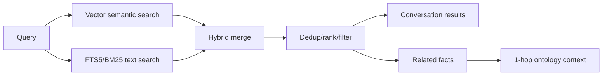
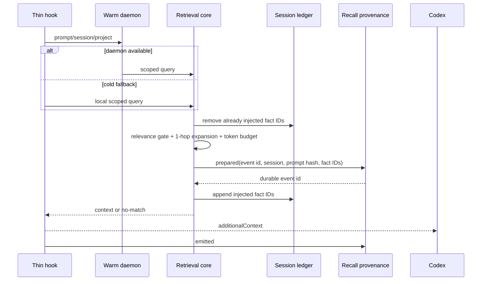

# 검색, RAG, 컨텍스트 주입

## 1. 검색 lane



`vector`는 의미 유사도, `text`는 정확한 용어/식별자, `both`는 두 lane을 합칩니다.
다중 query 배열은 모든 concept가 필요한 AND 성격의 semantic search입니다. date,
limit, project metadata는 결과 단계에서 일관되게 적용합니다.

## 2. RAG enrichment

conversation search 결과는 관련 fact와 ontology context를 덧붙일 수 있습니다. 이때
fact 검색은 단일 scope-aware search 경로에서 현재 project/global/all gate를 통과하고
relation 확장은 1-hop으로 제한합니다. archive line range가 함께 반환되어 원문 확인이
가능합니다. scope와 MCP의 optional category filter는 전체 KNN 후보에 먼저 적용하고
그 뒤 caller limit으로 자릅니다.

## 3. UserPromptSubmit injection



warm과 cold 경로는 transport만 다르고 selection logic은 같습니다. daemon이 없다는
이유로 scope나 budget이 달라지면 안 됩니다.

## 4. 선택 규칙

1. 짧거나 비정보성 prompt는 skip할 수 있다.
2. query background baseline보다 충분히 높은 관련도만 통과한다.
3. scope를 전체 KNN 후보에 먼저 적용한 뒤 caller limit으로 자른다.
4. top fact에서 허용 scope의 typed relation을 1-hop 확장한다.
5. session ledger에 이미 기록된 fact를 제거한다.
6. fact별 text 길이와 전체 block budget을 적용한다.
7. 낮은 relevance부터 제거해 budget 안에 맞춘다.
8. 결과가 없으면 context를 출력하지 않는다.

기본 block budget은 1,000 chars, fact별 최대는 160 chars입니다. session ledger는 최대
400 ids와 7일 TTL을 가지며 atomic write하고 fail-open합니다. ledger 오류 때문에 사용자
prompt가 실패해서는 안 되지만 오류는 log에 남아야 합니다.

dedup ledger는 best-effort 운영 상태이지만 recall provenance receipt는 학습 경계입니다.
실제 context를 주입하기 전에 durable `prepared` write가 성공해야 합니다. hook이 stdout에
쓴 뒤 `emitted`로 전환하며, host가 실제 소비했다는 `consumed` 주장은 하지 않습니다.
`prepared` write가 실패하면 context를 반환하지 않고 ledger도 갱신하지 않아 다음 prompt가
안전하게 재시도할 수 있습니다. receipt가 성공한 뒤의 ledger write 실패는 dedup 최적화만
잃으며 context와 provenance의 정합성에는 영향을 주지 않습니다.
sessionId가 없는 주입 요청은 durable `prepared` write를 남길 수 없으므로 주입 자체를
생략합니다(`no-session-provenance` 로그). provenance 없이 context를 emission하는
경로는 존재하지 않습니다.

## 5. 검색 가능하지만 학습 불가

```mermaid
flowchart LR
    F[Existing fact] --> R[Hook or Memex MCP recall]
    R --> A[Agent answer]
    A --> S[Conversation FTS/vector search]
    A -. assistant_generated .->|blocked| X[Fact extraction]
    T[Trusted repo/Git/test result] --> X
    H[Human prompt] --> S
    H --> X
```

`memex_recall` exchange의 full text와 tool provenance는 검색·감사에 남습니다. fact
extractor에는 human assertion과 allowlisted local repo/Git/test result만 전달됩니다.
assistant synthesis, Memex tool result, network/unknown/generated output은 제외됩니다. 한
turn의 Memex call은 sibling tool을 taint하지 않습니다.

이 격리는 call ID와 독립 tool result가 있는 경우에 성립합니다. unified `exec`처럼 여러
source의 출력이 하나의 result에 합쳐져 귀속을 증명할 수 없으면 전체 composite result를
`external_unverified/learnable=0`으로 보수적으로 분류합니다.

## 6. Codex hook 출력 계약

Codex CLI 0.149.1에서 관측된 성공 shape:

```json
{
  "continue": true,
  "hookSpecificOutput": {
    "hookEventName": "UserPromptSubmit",
    "additionalContext": "..."
  }
}
```

top-level `additionalContext`는 이 버전에서 소비되지 않습니다. host version이 바뀌면
shape와 실제 model turn 반영을 함께 재검증합니다.

## 7. 관측 상태

injection JSONL status:

- `injected`: context가 생성됨
- `no-match`: eligible result 없음
- `deduped`: 관련 fact는 있었지만 이미 session에 주입됨
- `skipped`: prompt/시간 budget 정책으로 건너뜀
- `no-session-provenance`: session 신원이 없어 durable recall receipt를 남길 수 없음 — provenance 계약상 주입하지 않음
- `error`: retrieval/output failure

각 행은 prompt 본문 대신 길이, candidate/injected/deduped 수, chars, duration, warm/cold
경로를 기록합니다.

## 7. 정상 예

첫 질문에서는 관련 decision/constraint가 bounded block으로 추가되고, 같은 session의
동일 주제 두 번째 질문에서는 `deduped`, context 0 bytes가 정상입니다. 다른 project의
fact가 explicit all 없이 나타나거나 budget을 넘는 block이 생성되면 실패입니다.
