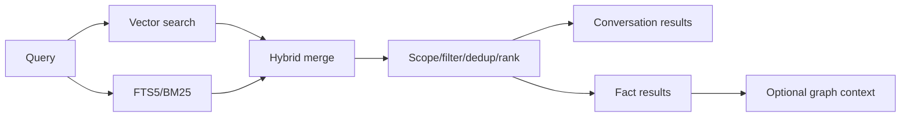
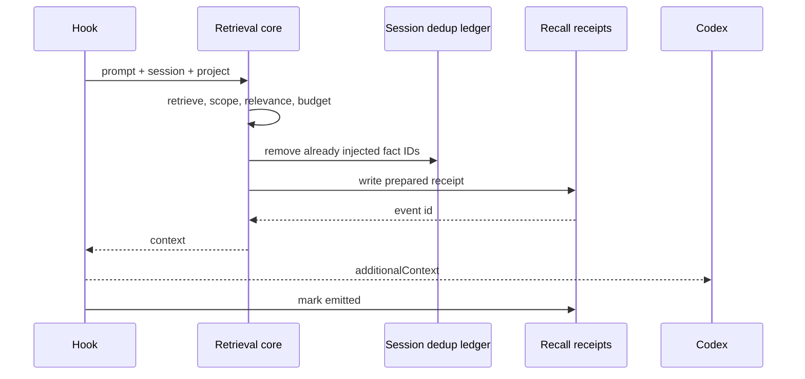

# 검색, RAG, 컨텍스트 주입

## 1. 검색 lane

Memex는 exact term과 semantic similarity를 함께 다룹니다.



- `vector` — 의미 유사도
- `text` — 정확한 용어·식별자
- `both` — 두 lane을 합침

scope/date/category filter는 caller limit보다 먼저 적용합니다.

## 2. Expanding KNN

sqlite-vec의 KNN limit은 metadata filter보다 먼저 후보를 자를 수 있습니다. out-of-scope row가 상위 후보를 채우면 유효한 project fact가 보이지 않는 문제가 생기므로 Memex는 작은 window에서 시작해 필요한 수가 채워지거나 index를 소진할 때까지 window를 단계적으로 확장합니다.

conversation과 fact 검색은 같은 원칙을 사용합니다.

## 3. Scope

project-sensitive retrieval은 다음 중 하나를 명시합니다.

- canonical absolute project path
- `scope=global`
- `scope=all`

`process.cwd()`나 MCP server의 설치 경로를 project로 추측하지 않습니다. graph relation을 확장할 때도 각 hop에서 같은 scope gate를 다시 적용합니다.

## 4. UserPromptSubmit injection



warm sidecar와 cold fallback은 transport만 다르고 selection logic은 같습니다.

## 5. Selection 규칙

1. 비정보성 prompt는 skip할 수 있습니다.
2. relevance gate를 통과한 scoped result만 후보입니다.
3. 이미 같은 session에 주입한 fact를 제거합니다.
4. 필요하면 허용 scope relation을 1-hop 확장합니다.
5. fact별 길이와 전체 char/token budget을 적용합니다.
6. 결과가 없으면 context block을 만들지 않습니다.

session dedup ledger는 운영 최적화라 fail-open이지만, recall provenance receipt는 학습 경계이므로 `prepared` write가 실패하면 context를 주입하지 않습니다.

## 6. Recall provenance

Memex가 주입하거나 MCP로 반환한 기억은 다시 fact extraction evidence가 되면 안 됩니다.

```text
memex_recall     → searchable, non-learnable
assistant output → searchable, non-learnable
trusted repo/git/test observation → 검증 후 learnable 가능
human assertion  → learnable
```

parser는 tool call ID로 결과를 분리합니다. 같은 turn에 Memex MCP call이 있어도 별도의 trusted repo/test result까지 자동으로 taint하지 않습니다.

반대로 unified `exec`처럼 여러 source가 하나의 결과에 섞여 원 출처를 증명할 수 없으면 전체를 `external_unverified/learnable=0`으로 처리합니다.

### Searchability와 learnability의 독립성

Conversation retrieval은 exchange의 `user_message`와 `assistant_message`를 모두 FTS5에
색인하고, 두 본문을 함께 만든 exchange embedding을 vector lane에서 검색합니다. 따라서
`assistant_learnable = 0`이거나 `has_memex_recall = 1`인 assistant text도 transcript로서는
FTS/vector 검색 가능해야 합니다. 이 플래그는 extraction evidence authority를 제한할 뿐
conversation index에서 assistant text를 제거하는 filter가 아닙니다.

회귀 gate는 recall-influenced assistant에만 존재하는 용어가 text/vector 두 mode 모두에서 같은
exchange를 반환하면서, DB row의 `assistant_learnable = 0`이 그대로인지 함께 확인합니다. 검색
결과가 durable Fact evidence가 되는 것은 아니며, extractor는 별도의 typed evidence validator를
계속 적용합니다.

Model이 선택한 opaque context ID와 typed relation이 bounded causal check와 server resolution을 통과하면
`fact_context_dependencies`에 local audit lineage로 남을 수 있습니다.
참조·지속 신호가 있는 새 human anchor에만 같은 session의 이전 최대 30개 exchange에서 최대 5개
referent candidate를 제공하며, fact 하나가 선언할 수 있는 dependency는 최대 3개입니다. 이는
“어떤 assistant/recall/prefix가 지시어 해석에 쓰였는가”를 추적하기 위한 정보이며 검색
relevance, Fact authority, `source_exchange_ids`, recall learnability를 변경하지 않습니다.

## 7. Derived state와 retrieval

`fact_kr`, ontology, relation, vectors는 local derived state입니다. sync 직후 새 fact가 들어오면 durable fact 자체는 존재하지만 다음 maintenance가 derived indexes를 채우기 전까지 일부 검색/graph surface가 pending일 수 있습니다.

KR translation은 자동이 아닙니다. 사용자가 `scripts/translate-facts.mjs`를 실행해 `fact_kr`를 만든 뒤 reembed worker가 `vec_facts_kr`를 생성합니다.

## 8. Hook output contract

성공한 UserPromptSubmit hook은 Codex가 요구하는 `hookSpecificOutput.additionalContext` shape를 사용합니다. host version이 바뀌면 output shape와 실제 model turn consumption을 함께 재검증해야 합니다.

Memex는 `prepared`/`emitted`까지만 durable하게 관측합니다. host가 실제로 context를 소비했다는 별도 receipt가 없다면 `consumed`를 주장하지 않습니다.

## 9. 관측 상태

대표 injection status:

- `injected`
- `no-match`
- `deduped`
- `skipped`
- `no-session-provenance`
- `error`

로그에는 prompt/fact 본문보다 길이, candidate/injected count, duration, warm/cold path 같은 운영 메타데이터를 우선 기록합니다.
