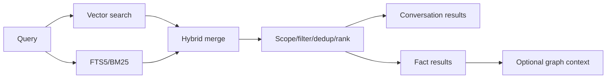
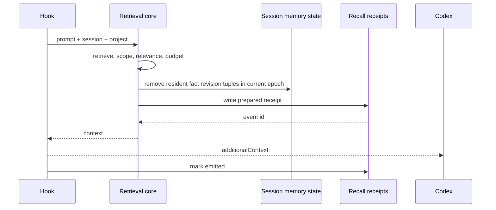

# 검색, RAG, 컨텍스트 주입

## 1. 검색 lane

Memex는 exact term과 semantic similarity를 함께 다룹니다.



- `vector` — 의미 유사도
- `text` — 정확한 용어·식별자
- `both` — 두 lane을 합침

scope/date/category filter는 caller limit보다 먼저 적용합니다.

## 2. Expanding KNN

sqlite-vec의 KNN limit은 metadata filter보다 먼저 후보를 자를 수 있습니다. out-of-scope row가 상위 후보를 채우면 유효한 project fact가 보이지 않는 문제가 생기므로 Memex는 작은 window에서 시작해 필요한 수가 채워지거나 index를 소진할 때까지 window를 단계적으로 확장합니다.

conversation과 fact 검색은 같은 원칙을 사용합니다.

## 3. Scope

project-sensitive retrieval은 다음 중 하나를 명시합니다.

- stable `project_id`, `workspace_id`, `workstream_id`, 또는 `session_id`
- 지원 기간의 canonical absolute project path compatibility key
- `scope=global`
- `scope=all`

`process.cwd()`나 MCP server의 설치 경로를 project로 추측하지 않습니다. graph relation을 확장할 때도 각 hop에서 같은 scope gate를 다시 적용합니다.

## 4. UserPromptSubmit injection



warm sidecar와 cold fallback은 transport만 다르고 selection logic은 같습니다.

## 4a. Pre-retrieval cheap gate (Phase 5)

`UserPromptSubmit` hook은 매번 실행되지만, embedding/vector search/graph expansion/model call은
`src/recall-gate.ts`의 cheap gate가 `retrieve`로 판정할 때만 실행됩니다. gate는 local session state와
lexical fingerprint만 사용하고 LLM을 호출하지 않습니다.

| 순서 | 판정 | 결과 |
| --- | --- | --- |
| 1 | state trigger: explicit memory intent(왜/언제/이전/기록/출처/why/history/source/again…), verified incident signature match, `project.memory_revision > seen`, Capsule generation 변경, context epoch 변경(compact/clear 뒤 첫 prompt, epoch 내 첫 prompt) | retrieve (길이·ack 여부 무관) |
| 2 | acknowledgement/continuation lexicon(KR/EN, ≤ 4 tokens), 짧은 minor correction | skip, embedding 0 |
| 3 | high-impact intent(decide/switch/migrate/rollback/전환/롤백…), safety refresh(substantive skip 6회) | retrieve |
| 4 | topic drift: prompt tokens vs topic fingerprint Jaccard < 0.12 (≥ 5 tokens) | retrieve |
| 5 | low resident coverage: ≥ 8 tokens인데 resident fact vocabulary와 교집합 0 | retrieve |
| 6 | 짧은 prompt가 topic과 겹침(Jaccard ≥ 0.3) 또는 substantive prompt가 강하게 겹침(≥ 0.35) | skip, embedding 0 |
| 7 | 그 외 | ambiguous → embedding 1회: `cos(prompt, topic) - baseline ≥ 0.08`이면 skip(coherent), 아니면 retrieve(embedding_drift); topic embedding이 없으면 retrieve |

state trigger(1)는 acknowledgement보다 먼저 평가됩니다. 그래서 새 session/epoch의 첫 prompt가 "계속해"여도
Capsule(`[WORK NOW]`)과 pending correction은 전달됩니다. 다만 ack/continuation은 vector 없이 처리됩니다
(embedding 0, CURRENT TRUTH 검색 없음, topic fingerprint 유지). 그 외 retrieve path는 embedding을 정확히
1회 계산하고 ambiguous path의 embedding은 retrieval에 그대로 재사용됩니다.

fingerprint tokenizer는 소문자·stopword 제거 뒤 한국어 token의 꼬리 조사/어미(을/를/도/에서/해줘/해주세요 …)를
한 개 벗겨 "클라이언트를"과 "클라이언트"를 같은 token으로 만듭니다(retrieval embedding에는 영향 없음).
기본값은 `DEFAULT_RECALL_GATE_CONFIG`에 있으며 threshold는 deterministic이고 소수입니다. embedding이
불가능하면(model 없음/offline) skip은 그대로 무료이고 retrieve path는 vector가 필요 없는 section(CORRECTION,
WORK NOW, WATCH, RECENT EVIDENCE)만 렌더링하며 실패는 log로 남기고 절대 throw하지 않습니다.

session state(`session_memory_state`): `topic_fingerprint_json`, `topic_embedding`,
`informative_prompts_since_retrieval`, `last_retrieval_epoch`, `last_retrieval_at`(Hot Evidence watermark),
`watch_emitted_json`(WATCH/TRACE hint ledger). 새 session은 생성 시점의 `projects.memory_revision`을
`memory_revision_seen`으로 시작합니다(resident가 없으므로 correct할 것이 없음).

## 4b. Memory Bundle

`src/memory-bundle.ts`가 section을 고정 우선순위로 렌더링합니다.

| Section | 조건 |
| --- | --- |
| `[MEMEX CORRECTION]` | residency에서 도출: resident revision의 fact가 새 generation이면 `Updated (supersedes earlier context): … — earlier: "…"`, 비활성화됐으면 `No longer active`. prompt와 무관하게 모든 resident fact를 검사하며, stale project revision(sibling 변경)은 이 검사를 강제할 뿐 never-resident fact를 밀어넣지 않습니다. budget 때문에 남은 correction이 있으면 `memory_revision_seen`을 올리지 않고 다음 prompt에서 이어서 내보냅니다 |
| `[WORK NOW]` | 현재 Capsule generation이 이 epoch에 resident가 아닐 때(새 session, compact/clear, 새 generation). SessionStart(compact/resume) rehydration이 이미 넣은 generation은 반복하지 않으며, 빈 Capsule도 resident로 표시해 retrieval loop를 막습니다 (Capsule은 context-only) |
| `[CURRENT TRUTH]` | relevance gate를 통과한 resident가 아닌 current fact 2~4개 |
| `[WATCH — VERIFIED INCIDENT PATTERN]` | Phase 4 `matchIncidentPatterns`의 verified pattern(independent episode ≥ 2 또는 user repeat)만; candidate/remediated 제외; 같은 signature는 새 verified episode가 없으면 substantive prompt 5회 동안 반복하지 않음 |
| `[TRACE — HISTORY AVAILABLE]` | why/history/source intent일 때 `trace_fact subject_key=… — N Chronicle event(s), latest …` pointer(전체 history 주입 금지). 같은 subject는 Chronicle이 바뀌지 않는 한 epoch 동안 반복하지 않음 |
| `[RECENT EVIDENCE — NOT YET DISTILLED]` | sibling session의 Hot Evidence만(자기 session 것은 이미 context에 있음), `last_retrieval_at` 이후 index된 것만. epoch 변경 시 watermark가 초기화되고 rehydration이 다시 stamp합니다 |
| `[ASSISTANT CONTEXT-ONLY — NOT AUTHORITATIVE]` | current truth/correction이 없고 explicit memory intent일 때만 source-linked 과거 답변 1건 |

예산: normal prompt target 700 / hard 1,000자(line 160자), resume/compact target 1,500 / hard 2,000자.
ranking은 section 우선순위 → caller 순서(score desc, id asc)이며 truncation은 deterministic입니다.
relation 1-hop expansion은 why/related/dependency/contradiction/trace intent에서만 실행됩니다.

## 5. Selection 규칙

1. 비정보성 prompt는 skip할 수 있습니다.
2. relevance gate를 통과한 scoped result만 후보입니다.
3. 현재 `context_epoch`에 이미 resident인 `(fact_id, semantic_generation, lifecycle_generation)`만 제거합니다.
4. 필요하면 허용 scope relation을 1-hop 확장합니다.
5. fact별 길이와 전체 char/token budget을 적용합니다.
6. 결과가 없으면 context block을 만들지 않습니다.

Project `memory_revision`이 stale이면 normal semantic match보다 `[MEMEX CORRECTION]`을 먼저 냅니다.
비활성화된 resident fact는 `No longer active`로 철회합니다. 예산 때문에 correction 일부만 들어가면
실제 emitted revision만 resident로 기록하고 다음 natural boundary에서 나머지를 이어서 처리합니다.
관련 correction을 모두 소진했거나 현재 workspace/workstream에 해당하는 변경이 없음을 확인한 뒤에만
scalar revision을 seen 처리합니다.

Residency는 SQLite `session_memory_state`에 epoch별로 기록됩니다. 같은 fact ID라도 semantic/lifecycle generation이 바뀌면 같은 epoch에서 correction으로 다시 주입할 수 있고, compact 뒤 새 epoch에서는 old residency가 필요한 revision을 suppress하지 않습니다. Inactive revision은 carry에서 제외됩니다. Recall provenance receipt는 학습 경계이므로 `prepared` write가 실패하면 residency를 기록하거나 context를 주입하지 않습니다.

`SessionStart(compact)`는 semantic query를 실행하지 않습니다. 최신 Work Capsule을 우선하고, 없거나 `through_checkpoint_id`가 session latest checkpoint보다 오래됐으면 latest substantive user request·plan item·touched files·trusted test·unresolved error로 만든 deterministic tail baton을 함께 사용합니다. 여기에 이전 epoch carry candidate의 latest active revision만 더해 2,000자 이하 `additionalContext`를 만들고, 실제 포함한 revision을 새 epoch residency로 기록합니다. Capsule과 tail baton은 모두 context-only입니다.

Recent human과 learnable trusted repo/Git/test observation은 별도 Hot Evidence lane에서 TTL과 keyset
cursor로 제한됩니다. 자동 context와 MCP 출력은 `[RECENT EVIDENCE — NOT YET DISTILLED]`로 표시하며
Current Fact 문법으로 렌더링하지 않습니다. Assistant, compact summary, Capsule은 Assistant Continuity
lane의 context-only 자료이고 Fact extraction authority로 재진입할 수 없습니다.

## 6. Recall provenance

Memex가 주입하거나 MCP로 반환한 기억은 다시 fact extraction evidence가 되면 안 됩니다.

```text
memex_recall     → searchable, non-learnable
assistant output → searchable, non-learnable
trusted repo/git/test observation → 검증 후 learnable 가능
human assertion  → learnable
```

parser는 tool call ID로 결과를 분리합니다. 같은 turn에 Memex MCP call이 있어도 별도의 trusted repo/test result까지 자동으로 taint하지 않습니다.

반대로 unified `exec`처럼 여러 source가 하나의 결과에 섞여 원 출처를 증명할 수 없으면 전체를 `external_unverified/learnable=0`으로 처리합니다.

### Searchability와 learnability의 독립성

Conversation retrieval은 exchange의 `user_message`와 `assistant_message`를 모두 FTS5에
색인하고, 두 본문을 함께 만든 exchange embedding을 vector lane에서 검색합니다. 따라서
`assistant_learnable = 0`이거나 `has_memex_recall = 1`인 assistant text도 transcript로서는
FTS/vector 검색 가능해야 합니다. 이 플래그는 extraction evidence authority를 제한할 뿐
conversation index에서 assistant text를 제거하는 filter가 아닙니다.

회귀 gate는 recall-influenced assistant에만 존재하는 용어가 text/vector 두 mode 모두에서 같은
exchange를 반환하면서, DB row의 `assistant_learnable = 0`이 그대로인지 함께 확인합니다. 검색
결과가 durable Fact evidence가 되는 것은 아니며, extractor는 별도의 typed evidence validator를
계속 적용합니다.

Verifier가 removal test 뒤 실제 사용했다고 반환한 opaque `context_id`와 typed relation이 bounded
causal check와 server resolution을 통과하면 `fact_context_dependencies`에 local audit lineage로
남습니다. Generator 선언은 hint이며 최종 set은 verifier usage로 canonicalize됩니다.
참조·지속 신호가 있는 새 human anchor에만 같은 session의 이전 최대 30개 exchange에서 최대 5개
referent candidate를 제공하며, fact 하나가 선언할 수 있는 dependency는 최대 3개입니다. 이는
“어떤 assistant/recall/prefix가 지시어 해석에 쓰였는가”를 추적하기 위한 정보이며 검색
relevance, Fact authority, `source_exchange_ids`, recall learnability를 변경하지 않습니다.
Strong deictic adoption은 기존 ranking과 함께 최근 substantive semantic material 최대 2개를 낮은
score fallback으로 유지해 open-vocabulary recommendation을 verifier까지 전달합니다. 전체 candidate
상한은 계속 5개이고 여러 referent가 plausible하면 verifier는 `NOT_ENOUGH`로 fail-closed합니다.
현재 non-watermark local exchange는 long-range pool에서 제외해 local index와 persistent dependency로
이중 기록하지 않습니다. Watermark prefix는 historical dependency가 필요할 수 있어 이 제외 대상이
아닙니다.

## 7. Derived state와 retrieval

`fact_kr`, ontology, relation, vectors는 local derived state입니다. sync 직후 새 fact가 들어오면 durable fact 자체는 존재하지만 다음 maintenance가 derived indexes를 채우기 전까지 일부 검색/graph surface가 pending일 수 있습니다.

KR translation은 자동이 아닙니다. 사용자가 `scripts/translate-facts.mjs`를 실행해 `fact_kr`를 만든 뒤 reembed worker가 `vec_facts_kr`를 생성합니다.

## 8. Hook output contract

성공한 UserPromptSubmit hook은 Codex가 요구하는 `hookSpecificOutput.additionalContext` shape를 사용합니다. host version이 바뀌면 output shape와 실제 model turn consumption을 함께 재검증해야 합니다.

Memex는 `prepared`/`emitted`까지만 durable하게 관측합니다. host가 실제로 context를 소비했다는 별도 receipt가 없다면 `consumed`를 주장하지 않습니다.

## 8a. Metrics와 calibration

`continuity_telemetry`에 측정 sample만 기록합니다: `retrieval_gate_skip_count`(reason),
`retrieval_execute_count`(triggers, vector 여부), `embedding_calls`(embedding module이 센 실제 model
inference 수 — probe warm-up 포함), `embedding_cache_hits`(query memo hit), `candidate_facts`, `current_facts`,
`delta_facts`, `injected_facts`, `injected_chars`, `section_chars`(section), `bundle_size`, `estimated_tokens`,
`correction_count`, `correction_delay_prompts`, `watch_emissions`, `project_revision_invalidations`,
`repeated_context_turns`. `summarizeTelemetry`는 `TELEMETRY — MEASURED, NOT A FACT` 보고서를 만들며 fact나
Chronicle event를 만들지 않습니다.

`node scripts/continuity-recall-benchmark.mjs`는 deterministic embedding stub 위에서 Prompt 5A/5B workload
(follow-up, ack, topic shift, explicit history/source, same-fact evolution/rollback/correction, 200-turn
compaction with continuation carry, Korean follow-up/ack, same project same/different workstream, incident
recurrence, embeddings unavailable)를 baseline(gate off)과 gated로 두 번 실행하고
`docs/verification/continuity-v1/recall-calibration.json`을 씁니다. harness는 prompt text를 재사용하므로
embedding 비용은 request(inference + memo hit)로 보고합니다. Phase 5B 측정(prompts 365): retrievals 365 →
142(−61.1%), embedding requests 370 → 224, ack prompt embedding 85 → 0, injected chars 7,557 → 6,035,
stale/wrong-workstream/duplicate injection 0, mandatory memory intent miss 0/20, max bundle 432자.
production model(multilingual-e5-small) spot check는 `rfc-deviations.md` D-027에 기록되어 있습니다.

## 9. 관측 상태

대표 injection status:

- `injected`
- `no-match`
- `deduped`
- `skipped` (`gate: skip:<reason>`, `embedding_calls`)
- `no-session-provenance`
- `error`

`injected` 로그는 `gate: retrieve:<triggers>`, `embedding_calls`, `sections`를 함께 기록합니다.

로그에는 prompt/fact 본문보다 길이, candidate/injected count, duration, warm/cold path 같은 운영 메타데이터를 우선 기록합니다.
