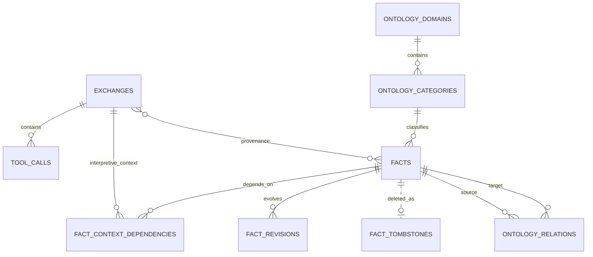

# Memex SQLite 스키마와 불변식

schema의 최종 소유자는 `src/db.ts`입니다. 이 문서는 모든 SQL 세부를 복제하기보다 **외부 동작에 영향을 주는 persisted state와 transaction invariant**를 설명합니다.

기본 DB:

```text
~/.config/memex/conversation-index/db.sqlite
```

우선순위는 `MEMEX_DB_PATH`(DB 직접 override), `MEMEX_HOME`, `$XDG_CONFIG_HOME/memex`, `~/.config/memex` 순으로 해석됩니다.

## 1. 주요 관계



`source_exchange_ids`는 JSON array라 물리 FK가 아니며 privacy/provenance service가 논리 연결을 관리합니다.

SQLite writer는 `foreign_keys = ON`을 명시적으로 설정합니다. 기존 orphan은 verify 경로의 `PRAGMA foreign_key_check`로 검출합니다.

## 2. Conversation state

주요 테이블:

- `exchanges`
- `tool_calls`
- `recall_events`
- `extraction_log`
- summary/FTS metadata
- `exchanges_fts`
- `vec_exchanges`

### Exchange identity

exchange ID는 session과 user turn 위치에서 결정론적으로 파생됩니다. `archive_path`는 identity가 아니라 location metadata입니다.

동일 exchange re-index는 rowid를 보존합니다. extraction watermark가 rowid를 기준으로 하므로 `INSERT OR REPLACE`처럼 rowid를 바꾸는 update는 금지합니다.

### Provenance

conversation/tool result는 source type과 learnable state를 저장합니다. `memex_recall`과 assistant synthesis는 searchable하더라도 fact evidence로 학습하지 않습니다.

Extraction model이 반환하는 `grounding_type`, `durable`, `evidence`,
`context_exchange_indices`는 server-side validation input입니다. 검증된 authoritative exchange
UUID만 `facts.source_exchange_ids`에 들어가며 context-only assistant/recall exchange를 이 배열에
넣지 않습니다. Human evidence의 exact `supporting_span`, tool evidence의 exact
`tool_call_id`/`supporting_span`도 실제 row와 대조합니다. Context index는 model-declared input이며
ratification보다 앞선 최대 2개 claim-bearing context라는 causal constraint를 통과한 경우에만
server가 실제 exchange UUID/kind로 resolve해 `fact_context_dependencies`로 별도 저장합니다.
Canonical `fact`만 lexical binding에 참여하고 extraction candidate의 `fact_kr`는 저장하지 않습니다.
구조 검증 뒤 별도 entailment verifier가 bounded authoritative source text와 candidate 전체 의미를 판정하며
`ENTAILED`만 저장 단계로 전달합니다. 이 verifier verdict와 거절 사유는 process-local 진단값이고
durable fact/schema/sync payload에는 추가되지 않습니다.

```sql
fact_context_dependencies (
  fact_id,
  exchange_id,
  dependency_kind,
  created_at,
  PRIMARY KEY (fact_id, exchange_id, dependency_kind),
  FOREIGN KEY (fact_id) REFERENCES facts(id) ON DELETE CASCADE,
  FOREIGN KEY (exchange_id) REFERENCES exchanges(id)
    ON UPDATE CASCADE ON DELETE CASCADE
)
```

`dependency_kind`는 `assistant_context`, `recall_influenced_assistant`,
`watermark_prefix`, `conversation_context` 중 하나입니다. 이 관계는 local persistent audit
lineage이지만 fact truth의 authority가 아니며 protocol v4 durable payload가 아닙니다.

Phase 6 evaluation의 candidate/accepted/rejection/grounding/ratification counter도 process-local
report diagnostics입니다. `extraction_log`, `facts`, protocol v4 payload에 새 telemetry column이나
field를 추가하지 않습니다.

## 3. Facts

핵심 컬럼:

```sql
facts (
  id,
  fact,
  category,
  scope_type,
  scope_project,
  source_exchange_ids,
  created_at,
  updated_at,
  consolidated_count,
  is_active,
  fact_kr,
  ontology_category_id,
  embedding_version,
  ontology_attempts,
  ontology_last_attempt_at,
  consolidation_attempts,
  needs_consolidation,
  semantic_generation,
  semantic_updated_at,
  lifecycle_generation,
  lifecycle_updated_at
)
```

### Semantic fields

`semantic_generation`은 local CAS token이며 의미 변경마다 증가합니다. `semantic_updated_at`은 cross-device semantic event clock입니다.

의미 변경은 revision과 derived-state invalidation을 같은 transaction에 포함해야 합니다.

### Lifecycle fields

`lifecycle_generation`은 local active/inactive CAS token입니다. `lifecycle_updated_at`은 cross-device lifecycle event clock입니다.

semantic edit는 lifecycle clock을 건드리지 않고 deactivate/restore는 semantic clock을 건드리지 않습니다.

### Lineage fields

`source_exchange_ids`와 `consolidated_count`는 sync/concurrent writer에서 각각 union/max로 수렴합니다. 의미 winner의 metadata로 단순 덮어쓰지 않습니다.

## 4. Revisions와 tombstones

`fact_revisions`는 기존 fact identity의 의미 변화를 보존합니다.

`fact_tombstones`는 hard-delete event이며 fact row가 없어져도 남아 stale peer snapshot의 resurrection을 막습니다.

`reason = source_conversation_excluded`는 terminal privacy tombstone으로 취급합니다. 일반 newer lifecycle event만으로 복원하지 않습니다.

## 5. Ontology

주요 테이블:

```text
ontology_domains
ontology_categories
ontology_relations
vec_categories
taxonomy_state
```

`taxonomy_state`는 singleton epoch을 가집니다.

```sql
CREATE TABLE taxonomy_state (
  id INTEGER PRIMARY KEY CHECK (id = 1),
  epoch INTEGER NOT NULL DEFAULT 1
);
```

privacy purge가 taxonomy를 전면 invalidate할 때 같은 transaction에서 epoch도 증가합니다. classifier는 epoch을 캡처하고 commit 전에 검증하여 purge 전 candidate에서 계산된 결과가 taxonomy를 다시 만들지 못하게 합니다.

ontology/relation/category vector는 protocol v4 local-derived state입니다.

## 6. Vector tables

대표 vec0 table:

```text
vec_exchanges
vec_facts
vec_facts_kr
vec_categories
```

fresh DB는 int8 embedding storage를 사용하며 실제 sqlite schema에서 dtype을 확인합니다. float32/int8 blob을 flag 추정만으로 섞지 않습니다.

vector는 물리 FK가 없을 수 있으므로 parent delete/semantic mutation 시 application transaction에서 명시적으로 정리합니다.

## 7. Async writer CAS

비동기 작업은 await 전에 input generation/content/epoch을 캡처합니다.

| Writer | Guard |
| --- | --- |
| fact semantic mutation | expected semantic generation (+ 필요한 lifecycle generation) |
| restore | semantic + lifecycle generation |
| consolidation | 양 participant semantic + lifecycle generation |
| ontology classification | semantic generation + taxonomy epoch |
| relation creation | 양 endpoint semantic generation |
| fact/KR reembed | semantic generation/content |
| exchange reembed | exchange content hash |
| translation script | semantic generation + exact fact text |

stale 결과는 새 상태와 merge하지 않고 폐기합니다.

## 8. Privacy purge transaction

conversation exclusion purge는 다음을 하나의 policy operation으로 다룹니다.

- matching exchange/tool/vector/search state 삭제
- authoritative source 또는 context dependency로 연결된 fact/revision/relation/vector 제거
- `fact_context_dependencies` FK cascade 정리
- terminal privacy tombstone 기록
- taxonomy domains/categories/category vectors 전면 invalidate
- surviving fact ontology assignment/attempt ledger reset
- taxonomy epoch 증가

원본 rollout과 archive snapshot은 이 DB transaction의 삭제 대상이 아닙니다.

## 9. Sync state

`sync_meta.device_id`는 local DB writer identity입니다. 각 device는 자기 `sync/devices/<device-id>/` generation만 씁니다.

protocol v4는 SQLite 파일을 복제하지 않습니다. JSONL generation으로 durable state만 교환합니다.

```text
facts
fact_revisions
fact_tombstones
recall_events
```

`fact_context_dependencies`는 local conversation corpus에 종속된 interpretive lineage이므로
export/import하지 않습니다. Remote semantic winner가 local fact 의미를 교체하면 이전 의미에
붙은 stale context dependency를 제거합니다.

`semantic_generation`/`lifecycle_generation`은 local CAS token이므로 cross-device version number로 사용하지 않습니다. 기기 간 conflict는 event timestamps로 판단합니다.

## 10. Export serialization

sync export는 같은 local DB의 exporters를 SQLite `BEGIN IMMEDIATE` transaction으로 직렬화합니다. snapshot read부터 generation write, `CURRENT` flip, prune까지 같은 serialized export operation 안에서 처리합니다.

이를 위해 sync directory에 stale-break lockfile을 두지 않습니다.

## 11. 검증 불변식

최소 health checks:

- `PRAGMA foreign_key_check` 위반 0
- active fact의 required semantic/lifecycle clocks 유효
- deleted parent를 가리키는 derived vector/relation 0
- relation endpoint/scope 규칙 만족
- FTS readiness와 source row 정합
- generation manifest hash/row/schema 검증 성공
- fact/exchange 삭제·exchange ID rename 뒤 context dependency FK 정합성 유지

schema 변경 시 이 문서뿐 아니라 해당 lifecycle owner doc도 함께 갱신해야 합니다.
