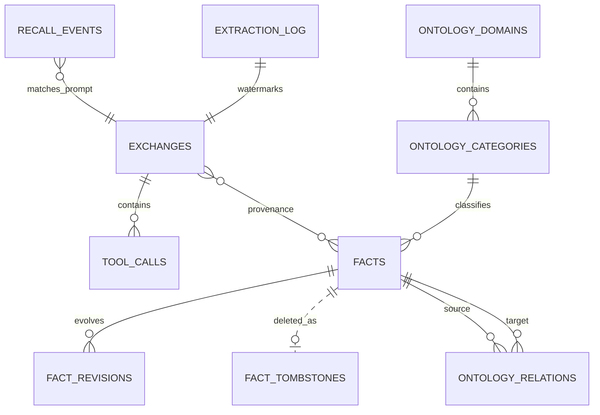

# Memex SQLite 스키마와 불변식

schema의 최종 소유자는 `src/db.ts`입니다. 기본 DB는
`~/.config/memex/conversation-index/db.sqlite`이며 우선순위는 다음과 같습니다.

1. `MEMEX_HOME` — 현재 표준 오버라이드
2. `MEMORY_BANK_HOME` / `MEMORY_BANK_CONFIG_DIR` — 기존 설치 호환(read-only)
3. `$XDG_CONFIG_HOME/memex`
4. `~/.config/memex` (기본)

DB 경로는 별도로 `MEMEX_DB_PATH`가 최우선이며 `MEMORY_BANK_DB_PATH`는 동일한
호환 의미로 읽기 전용으로 존중합니다. 기존 memory-bank 네임스페이스의 durable
data는 자동 이동하지 않습니다. `memex migrate-home` 커맨드로 명시적으로
복사→검증 후 전환할 수 있습니다.

## 1. 관계 개요



`source_exchange_ids`는 JSON 배열이므로 물리 FK는 아니지만 provenance API가 이
논리 연결을 검증합니다.

## 2. Conversation corpus

```sql
CREATE TABLE exchanges (
  id TEXT PRIMARY KEY,
  project TEXT NOT NULL,
  timestamp TEXT NOT NULL,
  user_message TEXT NOT NULL,
  assistant_message TEXT NOT NULL,
  archive_path TEXT NOT NULL,
  line_start INTEGER NOT NULL,
  line_end INTEGER NOT NULL,
  embedding BLOB,
  last_indexed INTEGER,
  parent_uuid TEXT,
  is_sidechain BOOLEAN DEFAULT 0,
  session_id TEXT,
  cwd TEXT,
  git_branch TEXT,
  codex_version TEXT,
  thinking_level TEXT,
  thinking_disabled BOOLEAN,
  thinking_triggers TEXT,
  embedding_version INTEGER NOT NULL DEFAULT 0,
  provenance TEXT NOT NULL DEFAULT '["human_assertion","assistant_generated"]',
  assistant_learnable BOOLEAN NOT NULL DEFAULT 0,
  has_memex_recall BOOLEAN NOT NULL DEFAULT 0
);

CREATE TABLE tool_calls (
  id TEXT PRIMARY KEY,
  exchange_id TEXT NOT NULL REFERENCES exchanges(id),
  tool_name TEXT NOT NULL,
  tool_input TEXT,
  tool_result TEXT,
  is_error BOOLEAN DEFAULT 0,
  timestamp TEXT NOT NULL,
  source_type TEXT NOT NULL DEFAULT 'external_unverified',
  learnable BOOLEAN NOT NULL DEFAULT 0
);

CREATE TABLE recall_events (
  id TEXT PRIMARY KEY,
  session_id TEXT NOT NULL,
  project TEXT NOT NULL,
  prompt_hash TEXT NOT NULL,
  fact_ids TEXT NOT NULL,
  source_type TEXT NOT NULL DEFAULT 'memex_recall',
  learnable BOOLEAN NOT NULL DEFAULT 0,
  status TEXT NOT NULL DEFAULT 'prepared',
  created_at TEXT NOT NULL,
  emitted_at TEXT
);
```

중요한 불변식:

- `project`는 canonical absolute `session_meta.cwd`다.
- `archive_path`는 data root 안의 읽기 가능한 원본 사본을 가리킨다.
- 동일 exchange re-index는 `INSERT ... ON CONFLICT DO UPDATE`로 rowid를 보존한다.
- `line_start/end`는 provenance read의 재현 가능한 범위다.
- sidechain/worker/internal prompt는 사용자 knowledge로 승격하지 않는다.
- `provenance`는 `human_assertion`, `assistant_generated`, `repo_file`,
  `git_history`, `test_execution`, `external_unverified`, `memex_recall`의 JSON 배열이다.
- `tool_calls`마다 source/trust를 따로 저장한다. Memex sibling tool이 있어도
  allowlisted repo/Git/test result의 `learnable=1`은 유지된다.
- assistant synthesis는 recall 유무와 관계없이 기본 `assistant_learnable=0`이다.
- FTS/vector search는 full exchange를 유지하지만 fact extraction은 human assertion과
  `learnable=1` tool result만 prompt에 넣는다.
- recall event는 context 계산 시 `prepared`, hook stdout emit 후 `emitted`다. Codex가
  실제 소비했는지는 host receipt가 없어 별도 주장하지 않는다.
- user-role conversation exclusion은 conversation-wide purge다. `exchanges` 삭제 trigger가
  `exchanges_fts`를 정리하고, policy service가 `tool_calls`, `vec_exchanges`, session
  `extraction_log`/`recall_events`, summary와 해당 source exchange를 참조하는
  fact/revision/vector/relation을 함께 제거한다. source rollout과 archive 사본은 보존한다.

`exchanges_fts`는 user/assistant text의 external-content FTS5 테이블입니다.
insert/update/delete trigger가 동기화하며 `fts_meta`의 rebuild-ready 상태가 없으면
검색은 결과를 숨기지 않고 안전한 text fallback을 사용합니다.

## 3. Facts, revisions, extraction ledger

```sql
CREATE TABLE facts (
  id TEXT PRIMARY KEY,
  fact TEXT NOT NULL,
  category TEXT,
  scope_type TEXT NOT NULL DEFAULT 'project',
  scope_project TEXT,
  source_exchange_ids TEXT,
  embedding BLOB,
  created_at TEXT NOT NULL,
  updated_at TEXT NOT NULL,
  consolidated_count INTEGER DEFAULT 1,
  is_active INTEGER DEFAULT 1,
  ontology_category_id TEXT,
  fact_kr TEXT,
  embedding_version INTEGER NOT NULL DEFAULT 1,
  ontology_attempts INTEGER NOT NULL DEFAULT 0,
  consolidation_attempts INTEGER NOT NULL DEFAULT 0,
  ontology_last_attempt_at TEXT
);

CREATE TABLE fact_revisions (
  id TEXT PRIMARY KEY,
  fact_id TEXT NOT NULL REFERENCES facts(id),
  previous_fact TEXT NOT NULL,
  new_fact TEXT NOT NULL,
  reason TEXT,
  source_exchange_id TEXT,
  created_at TEXT NOT NULL
);

CREATE TABLE fact_tombstones (
  fact_id TEXT PRIMARY KEY,
  deleted_at TEXT NOT NULL,
  reason TEXT
);

CREATE TABLE sync_meta (
  key TEXT PRIMARY KEY,
  value TEXT NOT NULL
);

CREATE TABLE extraction_log (
  session_id TEXT PRIMARY KEY,
  processed_at TEXT NOT NULL,
  extracted INTEGER NOT NULL DEFAULT 0,
  saved INTEGER NOT NULL DEFAULT 0,
  dropped_batches INTEGER NOT NULL DEFAULT 0,
  claim_owner TEXT,
  last_exchange_rowid INTEGER NOT NULL DEFAULT 0
);
```

`source_exchange_ids`는 fact의 1차 provenance입니다. `fact_revisions`는 기존 문장을
삭제하지 않고 수정/진화를 기록합니다. deactivate는 `is_active=0`과 vector 제거를
같이 수행하고, restore는 검색 가능한 vector 상태를 재구성합니다.
hard delete는 fact/revision/relation/vector를 지우기 전에 `fact_tombstones`를 같은
transaction에 기록합니다. tombstone은 FK를 갖지 않는 의도적 deletion event이며,
cross-device sync가 오래된 fact snapshot을 되살리지 못하게 합니다.
`sync_meta.device_id`는 local DB의 snapshot writer identity입니다. 각 writer가 별도
directory를 소유하므로 offline device export가 peer snapshot을 덮어쓰지 않습니다.

`extraction_log` 불변식:

1. `session_id`당 한 행
2. 한 시점에 하나의 유효 `claim_owner`
3. `rowid > last_exchange_rowid`만 추출 가능
4. fact/provenance/saved count/watermark는 같은 transaction에서 commit
5. 새 row가 없는 같은 session 재실행은 model call 0의 no-op
6. 만료 claim은 duplicate ledger row 없이 pending으로 복귀

## 4. Ontology와 relations

```sql
CREATE TABLE ontology_domains (
  id TEXT PRIMARY KEY,
  name TEXT NOT NULL,
  description TEXT,
  created_at TEXT NOT NULL DEFAULT (datetime('now'))
);

CREATE TABLE ontology_categories (
  id TEXT PRIMARY KEY,
  domain_id TEXT NOT NULL REFERENCES ontology_domains(id),
  name TEXT NOT NULL,
  description TEXT,
  created_at TEXT NOT NULL DEFAULT (datetime('now'))
);

CREATE TABLE ontology_relations (
  id TEXT PRIMARY KEY,
  source_fact_id TEXT NOT NULL REFERENCES facts(id),
  relation_type TEXT NOT NULL CHECK (
    relation_type IN ('INFLUENCES','SUPERSEDES','SUPPORTS','CONTRADICTS')
  ),
  target_fact_id TEXT NOT NULL REFERENCES facts(id),
  reasoning TEXT,
  created_at TEXT NOT NULL DEFAULT (datetime('now'))
);
```

`(source_fact_id, relation_type, target_fact_id)`는 unique입니다. 양 endpoint는 존재해야
합니다. 서로 다른 두 project fact를 직접 연결하는 relation은 import와 mutation
경계에서 거부합니다. global↔project와 same-project edge는 허용합니다.

## 5. Vector indexes

sqlite-vec의 384차원 int8 테이블:

- `vec_exchanges`
- `vec_facts`
- `vec_facts_kr`
- `vec_categories`

`embedding_version`은 다른 모델/양자화 공간의 vector 비교를 막습니다. fact edit는
text/vector를 transaction으로 교체하고 ontology classification을 pending으로
되돌립니다. Korean vector를 분리해 같은 언어 retrieval을 보강합니다.

## 6. Scope predicate

| 요청 | 사실 predicate |
| --- | --- |
| 기본 fact list/API | `scope_type = 'global'` |
| explicit project | `scope_type = 'global' OR scope_project = :canonical_project` |
| explicit global | global만 |
| explicit all | project predicate 없음, active만 |
| graph project | project + global + classified + active |
| graph global | global + classified + active |
| graph all | 모든 classified active fact |

project fact는 absolute canonical `scope_project`를 가져야 하고 global fact는
`NULL`이어야 합니다. traversal은 seed뿐 아니라 매 hop에 같은 predicate를 적용합니다.

## 7. Mutation transaction

`src/fact-management.ts`가 manual edit와 자동 semantic mutation의 단일 service입니다.
`mutateFactMeaning()`은 existing fact ID를 current identity로 유지합니다.

| 작업 | 같은 transaction에서 지켜야 할 것 |
| --- | --- |
| semantic edit/evolution/contradiction | revision 추가, text/stored embedding/primary vector 교체, KR·ontology·relation 무효화, 병합 대상 비활성화 |
| deactivate | active=0, 관련 searchable vector 제거 |
| restore | active=1, embedding/vector 재생성 |
| hard delete | tombstone 기록 후 relation, vector, revision, fact를 dependency 순서로 제거 |

hard delete는 full UUID와 명시적 confirmation이 없으면 시작하지 않습니다.
`status`, `analyze`, search/MCP read, graph API는 read-only입니다.

semantic mutation은 replacement embedding을 먼저 준비한 뒤 위 durable state를 한
transaction에서 전환합니다. CONTRADICTION은 새 row를 current identity로 승격하지 않고
existing fact ID를 갱신하므로, current fact에서 `fact_revisions.fact_id`를 직접 따라
predecessor를 조회할 수 있습니다.

## 8. 인덱스와 성능 의도

conventional index는 session/project/archive/timestamp, active fact scope, ontology
membership, relation endpoints, revisions, consolidation keyset pagination을 덮습니다.
FTS/vector가 모두 없는 상태에서는 조용히 빈 결과를 반환하지 않고 readiness 또는
fallback 상태를 노출해야 합니다.

## 9. 데이터 재생성 경계

| 데이터 | 원본/파생 | 재생성 |
| --- | --- | --- |
| `$CODEX_HOME/sessions` | 원본 | Memex가 생성/수정하지 않음 |
| conversation archive | 파생 증거 사본 | rollout에서 재동기화 가능 |
| exchanges/FTS/vector | 파생 index | archive/rollout에서 재구축 가능 |
| facts/revisions/tombstones | model-backed durable state | sync JSONL 또는 data-root backup 필요; rollout 재추출만으로 동일 lineage/deletion 복원 불가 |
| ontology/relations | fact에서 파생 | 재분류/재탐지 가능 |
| injection ledger/log | 운영 파생 상태 | 삭제 시 dedup/관측 연속성만 초기화 |
| recall_events/provenance flags | self-ingestion 방지 증거 | source rollout만으로는 hook receipt를 복원할 수 없으므로 sync JSONL 또는 DB backup으로 보존 |
