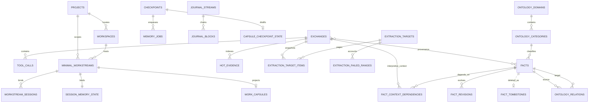

# Memex SQLite 스키마와 불변식

schema의 최종 소유자는 `src/db.ts`와 `src/continuity-store.ts`입니다. 이 문서는 모든 SQL 세부를 복제하기보다 **외부 동작에 영향을 주는 persisted state와 transaction invariant**를 설명합니다.

Continuity DB schema version은 `PRAGMA user_version = 7`와
`continuity_schema_meta.schema_version = 7`에 함께 기록됩니다. Migration은 기존 table/rowid를
rewrite하지 않는 additive DDL + deterministic backfill이며, version은 전체 migration transaction의
마지막에만 기록됩니다.

기본 DB:

```text
~/.config/memex/conversation-index/db.sqlite
```

우선순위는 `MEMEX_DB_PATH`(DB 직접 override), `MEMEX_HOME`, `$XDG_CONFIG_HOME/memex`, `~/.config/memex` 순으로 해석됩니다.

## 1. 주요 관계



`source_exchange_ids`는 JSON array라 물리 FK가 아니며 privacy/provenance service가 논리 연결을 관리합니다.

SQLite writer는 `foreign_keys = ON`을 명시적으로 설정합니다. 기존 orphan은 verify 경로의 `PRAGMA foreign_key_check`로 검출합니다.

## 2. Conversation state

주요 테이블:

- `exchanges`
- `tool_calls`
- `recall_events`
- `extraction_log`
- `checkpoints`, `memory_jobs`
- `journal_streams`, `journal_blocks`, `capture_gaps`
- `conversation_exclusions`
- `projects`, `workspaces`, `approved_remote_mappings`, `project_identity_audit`
- `workstream_sessions`, `hot_evidence`
- `minimal_workstreams`, `session_memory_state`
- `work_capsules`, `capsule_checkpoint_state`
- `extraction_targets`, `extraction_target_items`, `extraction_failed_ranges`
- `exchange_extraction_state`
- summary/FTS metadata
- `exchanges_fts`
- `vec_exchanges`

### Exchange identity

exchange ID는 session과 user turn 위치에서 결정론적으로 파생됩니다. `archive_path`는 identity가 아니라 location metadata입니다.

동일 exchange re-index는 rowid를 보존합니다. extraction watermark가 rowid를 기준으로 하므로 `INSERT OR REPLACE`처럼 rowid를 바꾸는 update는 금지합니다.

각 exchange는 `exchange_seq`, `content_hash`, `content_generation`, `closure_state`,
`parser_version`을 가집니다. `line_end` 또는 canonical content hash가 변하면 generation이 증가합니다.
명시적 lower generation, shorter `line_end`, 같은 generation의 다른 hash, 같은 generation의 closure
regression은 `insertExchange()` transaction에서 거절됩니다. `open|interrupted`는 closed extraction
fence에 들어가지 않습니다. Released reader가 직접 쓴 legacy row는 startup backfill에서 hash/sequence와
generation 1을 얻되 rowid는 유지됩니다.

### Correctness Spine state

`extraction_targets`는 model call 전 고정한 immutable rowid fence와 ordered generation snapshot을
소유합니다. Legacy watermark가 unseen row를 건넜다면 fence는 첫 missing item 직전부터 다시
형성되며, 완료 권한은 target item이지 `extraction_log.last_exchange_rowid`가 아닙니다.
`cursor_ordinal`은 오직 contiguous page commit에서 증가합니다. 각 target item은
`pending|processing|processed|retry|superseded|failed-visible` 중 하나이며,
`exchange_extraction_state`의 identity는 `(exchange_id, content_generation, policy_version)`입니다.
`superseded`는 async work 중 source generation/hash/closure/deletion이 바뀐 obsolete work이며 failure나
completion으로 계산하지 않습니다. `extraction_target_items.exchange_id`는 이 stale identity를 commit
검증까지 보존하려고 FK cascade를 두지 않습니다. Privacy purge는 source delete와 같은 transaction에서
target을 먼저 지워 private identity가 commit 후 남지 않게 합니다.

`extraction_failed_ranges`는 exact ordinal/rowid range, payload SHA-256, error kind/message를 저장합니다.
`failed-visible` target/job은 completed가 아니며 pipeline readiness를 막습니다. Zero-fact page도 policy가
실제로 page 전체를 성공 처리한 경우에만 cursor를 전진합니다.

`checkpoints`와 `memory_jobs`는 같은 SQLite transaction에서 생성됩니다. Job idempotency key는 UNIQUE이며,
claim마다 `lease_generation`이 증가합니다. Completion은 running state, owner, generation, unexpired lease가
모두 일치할 때만 성공합니다. Partial page 성공은 job을 pending으로 되돌리고 attempts를 reset합니다.
Crash/restart 뒤 `pending|retry|running with expired lease|dead`는 durable query로 식별할 수 있습니다.
동일 partition은 priority lane(P0 `capture_index` 100 > P1 `capsule_update` 80 > P2 `fact_extract` 20)
순서로 먼저 claim됩니다. Session partition의 capture/extraction lane은 각각 checkpoint ordinal을 사용하지만, 여러 session이 생산하는 Capsule lane은 job 삽입 순서를 사용합니다. Capture checkpoint ordinal은 journal byte 기준이고 extraction checkpoint ordinal은 exchange rowid 기준이라 lane을 넘어 비교하지 않습니다(Final Integration D-034). Semantic target이 다른 idempotency-key 충돌은 기존 row 재사용 대신
전체 transaction을 rollback합니다.

Prefix ingest는 `ingestPrefixExchanges()`만 사용하며 desired-set delete를 수행하지 않습니다. Full
archive 경로의 `ingestArchiveExchanges()`만 `reconcileArchiveExchanges()`를 호출합니다.

### Continuity Core state

`model_work_budgets`와 `model_work_attempts`는 local operational ledger입니다. Budget은 parent wave,
호출 상한·예약 수, 입력/출력 문자 상한, deadline과 상태를 보존합니다. Attempt는 실제 provider
시도마다 예약되며 stage/job/target, 지연, 문자 수와 nullable usage를 연결합니다. 재시도·실패도
상한을 소비하고, 사용량을 받지 못한 시도는 0이 아닌 미관측 상태로 남습니다.
`model_work_targets`는 시도 예약 전 선택한 파생 작업의 stage/target membership과 pending 상태를
보존합니다. 아직 첫 호출을 하지 못한 batch 항목도 완료 판정에서 빠지지 않게 합니다.
`memory_jobs.budget_id`와 `maintenance_wave_id`는 작업의 예산 귀속입니다. 기존 귀속을 환경 변수로
덮어써서 상한을 우회할 수 없습니다. 예약은 `BEGIN IMMEDIATE` 안에서 처리하며 완료된 작업의
새 run, 조건부 자동 재개와 명시적 수동 예산 갱신을 구분합니다.
`model_work_budgets.automatic`은 additive local column이며 시작·메시지 훅이 채택한 유지보수
wave에 1을 기록합니다. 해당 budget의 append-only 예약 시각으로 데이터 루트 공통 rolling
호출 수를 계산합니다. 새 run 생성·미완료 membership 이동은 같은 `BEGIN IMMEDIATE`에 묶고,
자동 재개는 완료 기록·실패 횟수·미확인 호출 비용을 보존합니다.
`model_maintenance_wake`의 단일 local row는 다음 wake 허용 시각을 저장합니다.
원자적 UPSERT로 여러 세션의 시작·메시지 이벤트를 묶으며 모델 호출 예산과 별개입니다.
이 상태와 ledger는 protocol v4에 export하지 않습니다.
이 additive ledger를 모르는 이전 worker와 현재 worker를 같은 DB에서 혼용하면 예산 보장이 성립하지
않습니다. 업그레이드 시 이전 worker를 종료하고 같은 코드 버전으로 재시작해야 합니다.

`journal_streams`는 `(session_id, stream_epoch)`별 source realpath/dev/inode/mtime, copied source byte/line, journal byte, parser version, current prefix hash와 copied boundary 직전 최대 4KiB의 source guard hash를 저장합니다. Capture는 session writer transaction을 먼저 선점한 뒤 journal을 append하므로 competing hook process가 같은 boundary를 동시에 쓰지 못합니다. `journal_blocks`는 contiguous source/journal range와 segment/prefix SHA-256 chain을 가집니다. Checkpoint worker는 exact prefix boundary까지만 읽고 모든 block hash를 다시 검증한 뒤 ingest합니다. Source rewind/replace, same-size rewrite, 기존 prefix를 바꾸고 더 길어진 rewrite, committed journal 손상은 기존 stream row와 journal을 보존한 채 새 epoch을 생성합니다.

`conversation_exclusions`는 user-role conversation exclusion의 terminal session guard입니다. Privacy purge transaction에서 먼저 기록되며 journal/checkpoint/job/workstream projection이 삭제된 뒤에도 남습니다. Hook과 capture-index worker는 이 guard를 재검사하므로 purge와 이미 실행 중인 worker가 경쟁해도 private exchange나 Continuity state를 재생성하지 못합니다.

`projects.memory_revision`은 project current/decision/workspace truth의 meaningful semantic/lifecycle/scope mutation에만 증가합니다. `workspaces`는 device ID, canonical path, Git common-dir와 inode identity, remote fingerprint, location kind, branch, `default_branch`(0.6.0 additive; `origin/HEAD` → `init.defaultBranch` 순으로 감지, 없으면 NULL이고 `main`/`master`가 관례 기본값)를 local provenance로 가집니다. `default_branch`는 세션의 브랜치 신호(`no-branch-signal`/`default-branch`/`branch:<name>`)와 workstream 결정론적 ID를 정하는 유일한 근거입니다. `approved_remote_mappings`만 remote fingerprint auto-link를 허용하고 모든 resolve/suggest/link/split/rebind 결정은 `project_identity_audit`에 남습니다.

`workspace_location_events`(0.6.0 additive, device-local, sync 미대상)는 workspace 전이를 기록합니다.
세션 시작마다 경로가 실제로 존재하면 fresh inspection이 권위이며 workspace 행의 git 메타데이터를
그 자리에서 갱신합니다 — `workspace_id`·`project_id`는 불변이라 프로젝트 공용 기억·Capsule·이력은
그대로 유지됩니다. 존재하지 않는 historical 경로는 기존 값을 보존합니다. `location_kind`/common
dir/inode identity/remote fingerprint 중 하나라도 바뀌면 `WORKSPACE_LOCATION_CHANGED` 한 건을 남기며,
event_id는 시계가 아니라 전이의 모양에서 파생되므로 같은 전이가 세션마다 중복 기록되지 않습니다.
새로 감지한 common dir/remote가 **다른 프로젝트**에 이미 묶여 있으면 자동 병합하지 않고
`requires_approval = 1`과 `project_identity_audit`의 `suggest` 행으로 남겨 기존
`approved_remote_mappings` 승인 경로를 그대로 요구합니다. `.git`이 사라지는 역방향 전이는 행만
`directory`로 갱신하며 브랜치 tier 기억을 삭제하거나 자동 강등하지 않습니다.

`session_memory_state`는 stable project/workspace/workstream, binding reason/confidence, `context_epoch`, resident/carry revision tuple, observed Capsule generation, project revision seen, latest checkpoint를 소유합니다. `workstream_sessions`는 여러 session이 같은 workstream Capsule을 공유할 수 있게 하되 unrelated workstream은 분리합니다. `hot_evidence`는 human 또는 learnable trusted repo/Git/test source만 저장하고 project/workspace/workstream/session scope, TTL, keyset pagination을 가집니다. 이 lane의 authority는 `hot-evidence`이며 Fact authority가 아닙니다.

`work_capsules.authority`는 항상 `context-only`입니다. Patch는 exact required-key set, strict scalar/list bounds, declared existing source IDs, verified-source authority와 verified/hypothesis type separation을 통과해야 합니다. Generation·frontier revision·lease CAS와 Capsule/cursor/job write는 한 transaction에 commit됩니다. `capsule_checkpoint_state.expected_generation`은 model call 직전에 current generation으로 rebase되며 model await 중 변경되면 stale result를 버리고 retry합니다. `through_checkpoint_id`는 trigger/provenance이고 다중 세션 coverage는 아래 sequence frontier가 결정합니다. 미소비 evidence 또는 미완료 capture가 있으면 compact/resume에 deterministic tail baton을 함께 넣습니다.

Capture checkpoint마다 P0 `capture_index` job이 있고, P1 `capsule_update`는 Stop/Interrupt boundary 6개 또는 accumulated 8KiB, PreCompact, SessionEnd에서 coalesce됩니다. Checkpoint와 outbox insert는 atomic입니다. Capture gap은 `open|recovered|purged`로 명시되며 silent completion으로 계산하지 않습니다. Retry가 소진된 checkpoint는 `dead-letter`, 관련 Capsule state는 `failed-visible`이고, dependency가 죽은 Capsule job을 pending으로 남기지 않습니다.

### Sequence cursors (schema v7)

- `workstream_evidence.seq`는 SQLite `INTEGER PRIMARY KEY AUTOINCREMENT`인 device-local 순서입니다. Workstream별로 필터링한 순서를 소비하므로 다른 stream·privacy deletion의 빈 번호는 누락이 아닙니다. `(workstream_id, exchange_id, content_generation, part)`는 unique입니다. Exchange/vector/tool write와 같은 transaction에서 human·assistant-context·trusted-tool 본문 snapshot을 고정합니다. 새 generation은 새 입력이고, 동일 generation 재index는 추가하지 않습니다. 긴 text는 최대 3,000 UTF-16 code unit fragment로 나눠 원문 suffix를 보존합니다.
- `capsule_frontiers(workstream_id, through_seq, revision)`은 성공 처리 위치와 invalidation revision을 분리합니다. `capsule_checkpoint_state.target_seq/target_revision`은 첫 페이지에서 고정되며 새 evidence가 도착해도 target을 늘리지 않습니다. 삭제·scope 이동은 revision을 올려 in-flight CAS를 차단합니다. 이미 소비한 evidence를 삭제하면 Capsule을 지우고 cursor를 0으로 되돌려 살아 있는 evidence로 rebuild합니다. Coverage가 불명인 구버전 Capsule도 같은 stream의 evidence 삭제 시 제거합니다. 그 외 미소비 evidence 삭제는 기존 Capsule을 지우지 않습니다.
- P1 페이지는 최대 8개 fragment이며 JSON payload 길이 합계는 24,000 UTF-16 code unit 이하입니다. Fragment `textOffset`도 UTF-16 code unit 기준입니다. 실패는 cursor를 전진시키지 않습니다. 성공한 partial page는 Capsule generation과 cursor를 함께 commit하고 job을 pending으로 되돌리며 attempts를 reset합니다. 고정 target을 drain한 후 새 evidence는 다음 경계/job에서 처리하며, 완료된 job을 다시 열면 target을 초기화합니다. 모델 호출은 재시도로 반복될 수 있고, exactly-once 호출을 주장하지 않습니다.
- `hot_evidence_sequence(seq, evidence_id)`도 never-reused local sequence입니다. Hot Evidence는 content-hash/TTL 단위이므로 Capsule의 generation fragment와 독립된 sequence를 사용합니다. `session_memory_state.hot_evidence_cursor`는 session/context epoch/workstream에 귀속합니다. 실제 출력된 eligible prefix만 전진하고, 만료·자기 session·삭제 행은 조회에서 제외합니다. Scope/content 이동은 새 sequence를 발급합니다. 자세한 출력 규칙은 [retrieval](RETRIEVAL-AND-CONTEXT.md#5-selection-규칙)을 따릅니다.
- v6 migration은 scalar checkpoint로 모든 session의 과거 coverage를 추정하지 않습니다. 기존 Capsule을 유지한 채 현재 남은 exchange generation을 sequence로 backfill하고 cursor 0부터 한 번 replay합니다. 과거에 이미 덮어쓴 generation은 복원했다고 주장하지 않습니다. 기존 in-flight Capsule lease를 fencing하고 policy `continuity-capsule-v2`로 pending 전환합니다. 새로운 projection의 첫 성공 commit부터 기존 Capsule을 대체합니다. Checkpoint/journal이 없는 stream은 다음 capture 경계가 생길 때 처리합니다.
- 이 state는 전부 local-derived입니다. Protocol v4 export 파일은 늘리지 않습니다. Locked v1 RFC의 scalar frontier를 대체하는 as-built amendment이며 이전 gate receipt의 관측값은 변경하지 않습니다.
- Capsule의 verified source 판정은 실제 page의 immutable human/trusted-tool payload를 사용합니다. 같은 exchange의 최신 행이나 앞 페이지의 human text가 현재 assistant-only fragment의 authority를 대신하지 않습니다.

### Provenance

conversation/tool result는 source type과 learnable state를 저장합니다. `memex_recall`과 assistant synthesis는 searchable하더라도 fact evidence로 학습하지 않습니다.

Extraction model이 반환하는 `grounding_type`, `durable`, `evidence`,
`context_dependencies[{context_id, relation}]`는 server-side validation hint입니다. 검증된 authoritative exchange
UUID만 `facts.source_exchange_ids`에 들어가며 context-only assistant/recall exchange를 이 배열에
넣지 않습니다. Human evidence의 exact `supporting_span`, tool evidence의 exact
`tool_call_id`/`supporting_span`도 실제 row와 대조합니다. Entailment verifier는 removal test로 실제
사용한 opaque `context_id`와 local pre-authority exchange index를 반환합니다. Server는 제공한 ID인지,
authoritative anchor에 결속됐는지, authority와 겹치지 않는지, 최대 3개인지, relation이 허용값인지
검증하고 verifier-used historical context만 실제 exchange UUID/kind로 canonicalize해
`fact_context_dependencies`로 별도 저장합니다. Generator가 선언했지만 verifier가 사용하지 않은
dependency는 저장하지 않고, 필요한 usage lineage가 없거나 malformed이면 context-derived fact를
fail-closed로 거절합니다.
Extraction candidate의 `fact_kr`는 저장하지 않습니다. 구조 검증은 exact span, provenance, tool identity,
authority와 context-ID bounds만 판정합니다. 별도 entailment verifier가 canonical `fact`, bounded
authoritative source text와 candidate 전체 의미를 판정하며
`ENTAILED`만 저장 단계로 전달합니다. 이 verifier verdict와 거절 사유는 process-local 진단값이고
durable fact/schema/sync payload에는 추가되지 않습니다.

```sql
fact_context_dependencies (
  fact_id,
  exchange_id,
  dependency_kind,
  created_at,
  PRIMARY KEY (fact_id, exchange_id, dependency_kind),
  FOREIGN KEY (fact_id) REFERENCES facts(id) ON DELETE CASCADE,
  FOREIGN KEY (exchange_id) REFERENCES exchanges(id)
    ON UPDATE CASCADE ON DELETE CASCADE
)
```

`dependency_kind`는 기존 local audit kind 외에 `ratified_proposition`, `referent_definition`,
`style_reference`, `workflow_reference`, `recall_reference`를 허용합니다. 기존 DB는 초기화 시
table을 transaction 안에서 rebuild해 old row를 보존하며 CHECK constraint를 확장합니다. 이 관계는
local persistent audit lineage이지만 fact truth의 authority가 아니며 protocol v4 durable payload가
아닙니다.

Phase 6 evaluation의 candidate/accepted/rejection/grounding/ratification counter도 process-local
report diagnostics입니다. `extraction_log`, `facts`, protocol v4 payload에 새 telemetry column이나
field를 추가하지 않습니다.

## 3. Facts

핵심 컬럼:

```sql
facts (
  id,
  fact,
  category,
  scope_type,
  scope_project,
  source_exchange_ids,
  created_at,
  updated_at,
  consolidated_count,
  is_active,
  fact_kr,
  ontology_category_id,
  embedding_version,
  ontology_attempts,
  ontology_last_attempt_at,
  consolidation_attempts,
  needs_consolidation,
  semantic_generation,
  semantic_updated_at,
  lifecycle_generation,
  lifecycle_updated_at,
  project_id,
  workspace_id,
  workstream_id,
  subject_key,
  promotion_state,
  tier_reason
)
```

`promotion_state`는 `legacy-project|decision|project-current|workspace|workstream`입니다. Active subject
slot은 project와 optional workspace/workstream 범위에서 unique입니다. `decision`은 explicit decision,
`project-current`는 `merged`/`validated`/`no-branch-signal` evidence만 허용하고 experimental state는
`workstream` 또는 Capsule에 남습니다. Branch 전체 fact graph는 만들지 않습니다.

`tier_reason`(0.6.0 additive, nullable)은 fact가 그 tier에 놓인 근거입니다: `no-branch-signal`(비-git
프로젝트 또는 브랜치를 못 읽음), `default-branch`(저장소 기본 브랜치 세션), `branch:<name>`(그 외
브랜치·워크트리 세션). 앞의 둘은 프로젝트 공용(`project-current`), 마지막은 브랜치 tier(`workstream`)로
들어갑니다. "브랜치 신호 없음"은 추측이 아니라 그 자체가 근거이므로 `project-current`의 정당한 evidence
값(`no-branch-signal`)입니다. 같은 값이 추출 시 Chronicle `ASSERTED` 이벤트 `outcome.tier_reason`에도
남습니다.

### Semantic fields

`semantic_generation`은 local CAS token이며 의미 변경마다 증가합니다. `semantic_updated_at`은 cross-device semantic event clock입니다.

의미 변경은 revision과 derived-state invalidation을 같은 transaction에 포함해야 합니다.

### Lifecycle fields

`lifecycle_generation`은 local active/inactive CAS token입니다. `lifecycle_updated_at`은 cross-device lifecycle event clock입니다.

semantic edit는 lifecycle clock을 건드리지 않고 deactivate/restore는 semantic clock을 건드리지 않습니다.

### Lineage fields

`source_exchange_ids`와 `consolidated_count`는 sync/concurrent writer에서 각각 union/max로 수렴합니다. 의미 winner의 metadata로 단순 덮어쓰지 않습니다.

### Local evidence and repair receipts

`fact_evidence_receipts`는 schema v7 DB 초기화 시 additive로 생성하며 protocol v4에 포함하지 않습니다.

```text
fact_id (PK, facts FK ON DELETE CASCADE)
semantic_generation, fact_hash, source_snapshot_json
method (extractor | user | consolidator), verified_at
```

Local verified projection의 exact meaning과 source/tool snapshot만 기록합니다. Source content/identity가
바뀌거나 누락되면 receipt는 사용할 수 없고, remote semantic replacement는 receipt를 제거합니다.
Peer Chronicle를 import하는 것만으로 local verification이 생성되지 않습니다. Legacy row의 receipt는
자동 backfill하지 않습니다. 이 table은 entailment model의 상세 verdict/payload를 보존하는 telemetry가 아닙니다.

`fact_integrity_repairs`는 선별 복구 transaction에서만 생성합니다. `finding_id` PK,
`plan_id`, `reason`, `target_json`, `evidence_json`, `applied_at`으로 무엇을 왜 적용했는지 기록하며
같은 finding의 재적용을 막습니다. 부모를 제거한 뒤에도 남는 local audit ledger이므로 fact FK는
없습니다. 동일 손상이 재발하면 성공으로 숨기지 않고 새 검토를 요구합니다. 두 table 모두 sync되지 않습니다.

## 4. Chronicle (extended `fact_revisions`)와 tombstones

`fact_revisions`는 Phase 4부터 Chronicle event table입니다. 별도의 history table을 두지 않고 released
revision row를 같은 table 안에서 CHANGED event로 확장합니다(schema v5 rebuild: `fact_id`/`previous_fact`/`new_fact`
nullable, id·값 보존). Current Fact(`facts`)는 빠른 projection이고, Chronicle은 append-only 의미 전환 계보입니다.
매 query마다 event replay로 current를 계산하지 않습니다.

| Column | 의미 |
| --- | --- |
| `id` | content-derived event id(sha256 32hex). 같은 내용의 duplicate delivery/sync replay는 같은 id로 수렴 |
| `fact_id` | projection fact(nullable — VALIDATED/INCIDENT 같은 event-only row) |
| `previous_fact` / `new_fact` | previous/new value |
| `project_id`, `subject_key` | stable slot |
| `event_kind` | `ASSERTED|CHANGED|RETIRED|RESTORED|VALIDATED|INCIDENT|CONTRADICTED|PROMOTED|DEMOTED`(뒤 둘은 0.6.0 additive) |
| `from/to_semantic_generation`, `lifecycle_generation` | device-local generation(export 시 제거) |
| `problem`, `grounded_cause`, `rationale` | source에 명시된 문장만. 검증 실패는 기록하지 않음 |
| `classifier_note` | model/consolidator 추정. 절대 authoritative cause가 아님 |
| `outcome_json` | validation/incident/temporal 판정 결과 |
| `source_exchange_ids`, `source_evidence_ids` | authoritative exchange / trusted tool_calls id |
| `reverts_event_id`, `related_event_ids` | rollback/관계 |
| `actor` | `extractor|consolidator|user|sync|legacy|auto|user-directive|migration`(뒤 셋은 0.6.0 additive) |
| `policy_version`, `evidence_authority` | `chronicle-v1`; `human-decision|human|trusted-tool|unknown` |
| `effective_at` / `effective_at_source` | 실제 사건 시점(`source`) 또는 처리 시점 fallback(`recorded`), peer 수신(`peer`) |
| `recorded_at` | worker 처리 시점 |
| `projection_applied` | 1이면 같은 transaction에서 current가 바뀜, 0이면 event-only/historical/candidate |
| `chronicle_seq` | local append 순서 tie-breaker(clock 아님) |

Timeline 정렬은 항상 `effective_at, recorded_at, chronicle_seq`이며 worker 완료 순서나 generation 번호로
정렬하지 않습니다. Legacy row backfill: `event_kind=CHANGED`, `actor=legacy`, `reason → classifier_note`,
`effective_at`은 cited source exchange timestamp(없으면 `created_at`, `recorded`).

`incident_occurrences`는 source-linked incident episode(session, signature_key, retry_count, state)이고
`incident_signatures`는 project별 stable failure signature(`episode_count`, `pattern_state`
`candidate|pattern|remediated`, remediation event)입니다. `continuity_telemetry`는 측정된 outcome sample이며
fact/event가 아닙니다(allowlist metric은 `TELEMETRY_METRICS`).

`session_memory_state`는 Phase 5 recall gate state를 additive column으로 가집니다(schema v6):
`topic_fingerprint_json`, `topic_embedding`, `informative_prompts_since_retrieval`, `last_retrieval_epoch`,
`last_retrieval_at`, `resident_bundle_hash`, `watch_emitted_json`. Schema v7은 `hot_evidence_cursor`를 추가합니다. `last_retrieval_at`은 retrieval 시각 기록이며 Hot Evidence 누락/중복 판단에는 사용하지 않습니다.
`watch_emitted_json`은 hint ledger(`watch:<signature>`/`trace:<subject>` key, epoch, substantive prompt
counter, change token)입니다. `resident_bundle_hash`는 RFC §12.2 예약 column이며 현재 쓰지 않습니다.
새 session row의 `memory_revision_seen`은 생성 시점의 project revision입니다.

`fact_tombstones`는 hard-delete event이며 fact row가 없어져도 남아 stale peer snapshot의 resurrection을 막습니다.
`chronicle_tombstones`는 purge된 event id를 같은 목적으로 보존합니다.

`reason = source_conversation_excluded`는 terminal privacy tombstone으로 취급합니다. 일반 newer lifecycle event만으로 복원하지 않습니다.

## 5. Ontology

주요 테이블:

```text
ontology_domains
ontology_categories
ontology_relations
vec_categories
taxonomy_state
```

`taxonomy_state`는 singleton epoch을 가집니다.

```sql
CREATE TABLE taxonomy_state (
  id INTEGER PRIMARY KEY CHECK (id = 1),
  epoch INTEGER NOT NULL DEFAULT 1
);
```

privacy purge가 taxonomy를 전면 invalidate할 때 같은 transaction에서 epoch도 증가합니다. classifier는 epoch을 캡처하고 commit 전에 검증하여 purge 전 candidate에서 계산된 결과가 taxonomy를 다시 만들지 못하게 합니다.

ontology/relation/category vector는 protocol v4 local-derived state입니다.

## 6. Vector tables

대표 vec0 table:

```text
vec_exchanges
vec_facts
vec_facts_kr
vec_categories
```

fresh DB는 int8 embedding storage를 사용하며 실제 sqlite schema에서 dtype을 확인합니다. float32/int8 blob을 flag 추정만으로 섞지 않습니다.

vector는 물리 FK가 없을 수 있으므로 parent delete/semantic mutation 시 application transaction에서 명시적으로 정리합니다.

## 7. Async writer CAS

비동기 작업은 await 전에 input generation/content/epoch을 캡처합니다.

| Writer | Guard |
| --- | --- |
| fact semantic mutation | 필수 MutationPolicy: exact targets, semantic/lifecycle/placement, 자동 변경의 verified text와 source fingerprint |
| restore | semantic + lifecycle generation |
| consolidation | 양 participant meaning/lifecycle/placement + 검증 source snapshot; commit-time 양쪽 lineage union |
| ontology classification | semantic generation + taxonomy epoch |
| relation creation | 자동 writer의 필수 ReadScope + 양 endpoint MutationPolicy |
| fact/KR reembed | semantic generation/content |
| exchange reembed | exchange content hash |
| translation script | semantic generation + exact fact text |

stale 결과는 새 상태와 merge하지 않고 폐기합니다.

## 8. Privacy purge transaction

conversation exclusion purge는 다음을 하나의 policy operation으로 다룹니다.

- matching exchange/tool/vector/search state 삭제
- authoritative source 또는 context dependency로 연결된 fact/revision/relation/vector 제거
- `fact_context_dependencies` FK cascade 정리
- terminal privacy tombstone 기록
- taxonomy domains/categories/category vectors 전면 invalidate
- surviving fact ontology assignment/attempt ledger reset
- taxonomy epoch 증가

원본 rollout과 archive snapshot은 이 DB transaction의 삭제 대상이 아닙니다.

## 9. Sync state

`sync_meta.device_id`는 local DB writer identity입니다. 각 device는 자기 `sync/devices/<device-id>/` generation만 씁니다.

protocol v4는 SQLite 파일을 복제하지 않습니다. JSONL generation으로 durable state만 교환합니다.

```text
facts
fact_revisions
fact_tombstones
recall_events
```

Project-scoped wire rows는 stable project/portable identity를 사용하고 `scope_project = null`입니다.
`fact-revisions.jsonl`은 Chronicle event 전체 shape(legacy 7-field + event field, `portable_project_key`)를 additive로
실어 나르며 device-local generation 번호는 내보내지 않습니다. importer는 legacy 7-field row와 event row를 모두
받아 stable event id로 replay-idempotent하게 append하고, 같은 id에 다른 내용이 오면 local history를 보존한 채
`malformedRows`에 conflict를 기록합니다. event row의 grounded field는 origin에서 검증된 값으로 신뢰하되
구조 검증을 통과해야 합니다(source 없는 `problem`/`grounded_cause`, actor `user`가 아닌 source 없는 `rationale`,
`fact_id` 없는 `projection_applied=1`은 schema-invalid로 generation 전체 reject). `fact-tombstones.jsonl`에는
`{fact_id: null, event_id, ...}` 형태의 Chronicle tombstone row가 추가됩니다(구 peer는 generation 전체를 visible reject).
Workspace path, Git common-dir, branch와 Hot Evidence는 device-local/ephemeral이므로 export하지 않습니다.
Legacy v4 path row는 importer가 canonical local workspace로 migration할 수 있지만, 새 path-free shape를
모르는 peer는 generation 전체를 visible하게 reject해야 하며 partial compatibility import는 금지합니다.

`fact_context_dependencies`는 local conversation corpus에 종속된 interpretive lineage이므로
export/import하지 않습니다. Remote semantic winner가 local fact 의미를 교체하면 이전 의미에
붙은 stale context dependency를 제거합니다.

`semantic_generation`/`lifecycle_generation`은 local CAS token이므로 cross-device version number로 사용하지 않습니다. 기기 간 conflict는 event timestamps로 판단합니다.

## 10. Export serialization

sync export는 같은 local DB의 exporters를 SQLite `BEGIN IMMEDIATE` transaction으로 직렬화합니다. snapshot read부터 generation write, `CURRENT` flip, prune까지 같은 serialized export operation 안에서 처리합니다.

이를 위해 sync directory에 stale-break lockfile을 두지 않습니다.

## 11. 검증 불변식

최소 health checks:

- `PRAGMA foreign_key_check` 위반 0
- active fact의 required semantic/lifecycle clocks 유효
- deleted parent를 가리키는 derived vector/relation 0
- relation endpoint/scope 규칙 만족
- FTS readiness와 source row 정합
- generation manifest hash/row/schema 검증 성공
- fact/exchange 삭제·exchange ID rename 뒤 context dependency FK 정합성 유지

schema 변경 시 이 문서뿐 아니라 해당 lifecycle owner doc도 함께 갱신해야 합니다.
