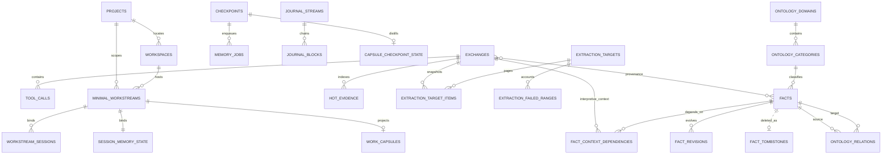

# Memex SQLite 스키마와 불변식

schema의 최종 소유자는 `src/db.ts`와 `src/continuity-store.ts`입니다. 이 문서는 모든 SQL 세부를 복제하기보다 **외부 동작에 영향을 주는 persisted state와 transaction invariant**를 설명합니다.

Continuity DB schema version은 `PRAGMA user_version = 4`와
`continuity_schema_meta.schema_version = 4`에 함께 기록됩니다. Migration은 기존 table/rowid를
rewrite하지 않는 additive DDL + deterministic backfill이며, version은 전체 migration transaction의
마지막에만 기록됩니다.

기본 DB:

```text
~/.config/memex/conversation-index/db.sqlite
```

우선순위는 `MEMEX_DB_PATH`(DB 직접 override), `MEMEX_HOME`, `$XDG_CONFIG_HOME/memex`, `~/.config/memex` 순으로 해석됩니다.

## 1. 주요 관계



`source_exchange_ids`는 JSON array라 물리 FK가 아니며 privacy/provenance service가 논리 연결을 관리합니다.

SQLite writer는 `foreign_keys = ON`을 명시적으로 설정합니다. 기존 orphan은 verify 경로의 `PRAGMA foreign_key_check`로 검출합니다.

## 2. Conversation state

주요 테이블:

- `exchanges`
- `tool_calls`
- `recall_events`
- `extraction_log`
- `checkpoints`, `memory_jobs`
- `journal_streams`, `journal_blocks`, `capture_gaps`
- `conversation_exclusions`
- `projects`, `workspaces`, `approved_remote_mappings`, `project_identity_audit`
- `workstream_sessions`, `hot_evidence`
- `minimal_workstreams`, `session_memory_state`
- `work_capsules`, `capsule_checkpoint_state`
- `extraction_targets`, `extraction_target_items`, `extraction_failed_ranges`
- `exchange_extraction_state`
- summary/FTS metadata
- `exchanges_fts`
- `vec_exchanges`

### Exchange identity

exchange ID는 session과 user turn 위치에서 결정론적으로 파생됩니다. `archive_path`는 identity가 아니라 location metadata입니다.

동일 exchange re-index는 rowid를 보존합니다. extraction watermark가 rowid를 기준으로 하므로 `INSERT OR REPLACE`처럼 rowid를 바꾸는 update는 금지합니다.

각 exchange는 `exchange_seq`, `content_hash`, `content_generation`, `closure_state`,
`parser_version`을 가집니다. `line_end` 또는 canonical content hash가 변하면 generation이 증가합니다.
명시적 lower generation, shorter `line_end`, 같은 generation의 다른 hash, 같은 generation의 closure
regression은 `insertExchange()` transaction에서 거절됩니다. `open|interrupted`는 closed extraction
fence에 들어가지 않습니다. Released reader가 직접 쓴 legacy row는 startup backfill에서 hash/sequence와
generation 1을 얻되 rowid는 유지됩니다.

### Correctness Spine state

`extraction_targets`는 model call 전 고정한 immutable rowid fence와 ordered generation snapshot을
소유합니다. Legacy watermark가 unseen row를 건넜다면 fence는 첫 missing item 직전부터 다시
형성되며, 완료 권한은 target item이지 `extraction_log.last_exchange_rowid`가 아닙니다.
`cursor_ordinal`은 오직 contiguous page commit에서 증가합니다. 각 target item은
`pending|processing|processed|retry|superseded|failed-visible` 중 하나이며,
`exchange_extraction_state`의 identity는 `(exchange_id, content_generation, policy_version)`입니다.
`superseded`는 async work 중 source generation/hash/closure/deletion이 바뀐 obsolete work이며 failure나
completion으로 계산하지 않습니다. `extraction_target_items.exchange_id`는 이 stale identity를 commit
검증까지 보존하려고 FK cascade를 두지 않습니다. Privacy purge는 source delete와 같은 transaction에서
target을 먼저 지워 private identity가 commit 후 남지 않게 합니다.

`extraction_failed_ranges`는 exact ordinal/rowid range, payload SHA-256, error kind/message를 저장합니다.
`failed-visible` target/job은 completed가 아니며 pipeline readiness를 막습니다. Zero-fact page도 policy가
실제로 page 전체를 성공 처리한 경우에만 cursor를 전진합니다.

`checkpoints`와 `memory_jobs`는 같은 SQLite transaction에서 생성됩니다. Job idempotency key는 UNIQUE이며,
claim마다 `lease_generation`이 증가합니다. Completion은 running state, owner, generation, unexpired lease가
모두 일치할 때만 성공합니다. Partial page 성공은 job을 pending으로 되돌리고 attempts를 reset합니다.
Crash/restart 뒤 `pending|retry|running with expired lease|dead`는 durable query로 식별할 수 있습니다.
동일 partition은 checkpoint ordinal 순서로만 claim되며, semantic target이 다른 idempotency-key 충돌은
기존 row 재사용 대신 전체 transaction을 rollback합니다.

Prefix ingest는 `ingestPrefixExchanges()`만 사용하며 desired-set delete를 수행하지 않습니다. Full
archive 경로의 `ingestArchiveExchanges()`만 `reconcileArchiveExchanges()`를 호출합니다.

### Continuity Core state

`journal_streams`는 `(session_id, stream_epoch)`별 source realpath/dev/inode/mtime, copied source byte/line, journal byte, parser version, current prefix hash와 copied boundary 직전 최대 4KiB의 source guard hash를 저장합니다. Capture는 session writer transaction을 먼저 선점한 뒤 journal을 append하므로 competing hook process가 같은 boundary를 동시에 쓰지 못합니다. `journal_blocks`는 contiguous source/journal range와 segment/prefix SHA-256 chain을 가집니다. Checkpoint worker는 exact prefix boundary까지만 읽고 모든 block hash를 다시 검증한 뒤 ingest합니다. Source rewind/replace, same-size rewrite, 기존 prefix를 바꾸고 더 길어진 rewrite, committed journal 손상은 기존 stream row와 journal을 보존한 채 새 epoch을 생성합니다.

`conversation_exclusions`는 user-role conversation exclusion의 terminal session guard입니다. Privacy purge transaction에서 먼저 기록되며 journal/checkpoint/job/workstream projection이 삭제된 뒤에도 남습니다. Hook과 capture-index worker는 이 guard를 재검사하므로 purge와 이미 실행 중인 worker가 경쟁해도 private exchange나 Continuity state를 재생성하지 못합니다.

`projects.memory_revision`은 project current/decision/workspace truth의 meaningful semantic/lifecycle/scope mutation에만 증가합니다. `workspaces`는 device ID, canonical path, Git common-dir와 inode identity, remote fingerprint, location kind, branch를 local provenance로 가집니다. `approved_remote_mappings`만 remote fingerprint auto-link를 허용하고 모든 resolve/suggest/link/split/rebind 결정은 `project_identity_audit`에 남습니다.

`session_memory_state`는 stable project/workspace/workstream, binding reason/confidence, `context_epoch`, resident/carry revision tuple, observed Capsule generation, project revision seen, latest checkpoint를 소유합니다. `workstream_sessions`는 여러 session이 같은 workstream Capsule을 공유할 수 있게 하되 unrelated workstream은 분리합니다. `hot_evidence`는 human 또는 learnable trusted repo/Git/test source만 저장하고 project/workspace/workstream/session scope, TTL, keyset pagination을 가집니다. 이 lane의 authority는 `hot-evidence`이며 Fact authority가 아닙니다.

`work_capsules.authority`는 항상 `context-only`입니다. Patch는 exact required-key set, strict scalar/list bounds, declared existing source IDs, verified-source authority와 verified/hypothesis type separation을 통과해야 합니다. Generation CAS와 capsule job의 lease completion은 한 transaction에 commit됩니다. `capsule_checkpoint_state.expected_generation`은 model call 직전에 current generation으로 rebase되며 model await 중 변경되면 stale result를 버리고 retry합니다. 최신 checkpoint가 Capsule의 `through_checkpoint_id`보다 앞서 있으면 compact/resume bundle에 deterministic tail baton도 함께 들어갑니다.

Capture checkpoint마다 P0 `capture_index` job이 있고, P1 `capsule_update`는 Stop/Interrupt boundary 6개 또는 accumulated 8KiB, PreCompact, SessionEnd에서 coalesce됩니다. Checkpoint와 outbox insert는 atomic입니다. Capture gap은 `open|recovered|purged`로 명시되며 silent completion으로 계산하지 않습니다. Retry가 소진된 checkpoint는 `dead-letter`, 관련 Capsule state는 `failed-visible`이고, dependency가 죽은 Capsule job을 pending으로 남기지 않습니다.

### Provenance

conversation/tool result는 source type과 learnable state를 저장합니다. `memex_recall`과 assistant synthesis는 searchable하더라도 fact evidence로 학습하지 않습니다.

Extraction model이 반환하는 `grounding_type`, `durable`, `evidence`,
`context_dependencies[{context_id, relation}]`는 server-side validation hint입니다. 검증된 authoritative exchange
UUID만 `facts.source_exchange_ids`에 들어가며 context-only assistant/recall exchange를 이 배열에
넣지 않습니다. Human evidence의 exact `supporting_span`, tool evidence의 exact
`tool_call_id`/`supporting_span`도 실제 row와 대조합니다. Entailment verifier는 removal test로 실제
사용한 opaque `context_id`와 local pre-authority exchange index를 반환합니다. Server는 제공한 ID인지,
authoritative anchor에 결속됐는지, authority와 겹치지 않는지, 최대 3개인지, relation이 허용값인지
검증하고 verifier-used historical context만 실제 exchange UUID/kind로 canonicalize해
`fact_context_dependencies`로 별도 저장합니다. Generator가 선언했지만 verifier가 사용하지 않은
dependency는 저장하지 않고, 필요한 usage lineage가 없거나 malformed이면 context-derived fact를
fail-closed로 거절합니다.
Extraction candidate의 `fact_kr`는 저장하지 않습니다. 구조 검증은 exact span, provenance, tool identity,
authority와 context-ID bounds만 판정합니다. 별도 entailment verifier가 canonical `fact`, bounded
authoritative source text와 candidate 전체 의미를 판정하며
`ENTAILED`만 저장 단계로 전달합니다. 이 verifier verdict와 거절 사유는 process-local 진단값이고
durable fact/schema/sync payload에는 추가되지 않습니다.

```sql
fact_context_dependencies (
  fact_id,
  exchange_id,
  dependency_kind,
  created_at,
  PRIMARY KEY (fact_id, exchange_id, dependency_kind),
  FOREIGN KEY (fact_id) REFERENCES facts(id) ON DELETE CASCADE,
  FOREIGN KEY (exchange_id) REFERENCES exchanges(id)
    ON UPDATE CASCADE ON DELETE CASCADE
)
```

`dependency_kind`는 기존 local audit kind 외에 `ratified_proposition`, `referent_definition`,
`style_reference`, `workflow_reference`, `recall_reference`를 허용합니다. 기존 DB는 초기화 시
table을 transaction 안에서 rebuild해 old row를 보존하며 CHECK constraint를 확장합니다. 이 관계는
local persistent audit lineage이지만 fact truth의 authority가 아니며 protocol v4 durable payload가
아닙니다.

Phase 6 evaluation의 candidate/accepted/rejection/grounding/ratification counter도 process-local
report diagnostics입니다. `extraction_log`, `facts`, protocol v4 payload에 새 telemetry column이나
field를 추가하지 않습니다.

## 3. Facts

핵심 컬럼:

```sql
facts (
  id,
  fact,
  category,
  scope_type,
  scope_project,
  source_exchange_ids,
  created_at,
  updated_at,
  consolidated_count,
  is_active,
  fact_kr,
  ontology_category_id,
  embedding_version,
  ontology_attempts,
  ontology_last_attempt_at,
  consolidation_attempts,
  needs_consolidation,
  semantic_generation,
  semantic_updated_at,
  lifecycle_generation,
  lifecycle_updated_at,
  project_id,
  workspace_id,
  workstream_id,
  subject_key,
  promotion_state
)
```

`promotion_state`는 `legacy-project|decision|project-current|workspace|workstream`입니다. Active subject
slot은 project와 optional workspace/workstream 범위에서 unique입니다. `decision`은 explicit decision,
`project-current`는 merged/validated evidence만 허용하고 experimental state는 `workstream` 또는 Capsule에
남습니다. Branch 전체 fact graph는 만들지 않습니다.

### Semantic fields

`semantic_generation`은 local CAS token이며 의미 변경마다 증가합니다. `semantic_updated_at`은 cross-device semantic event clock입니다.

의미 변경은 revision과 derived-state invalidation을 같은 transaction에 포함해야 합니다.

### Lifecycle fields

`lifecycle_generation`은 local active/inactive CAS token입니다. `lifecycle_updated_at`은 cross-device lifecycle event clock입니다.

semantic edit는 lifecycle clock을 건드리지 않고 deactivate/restore는 semantic clock을 건드리지 않습니다.

### Lineage fields

`source_exchange_ids`와 `consolidated_count`는 sync/concurrent writer에서 각각 union/max로 수렴합니다. 의미 winner의 metadata로 단순 덮어쓰지 않습니다.

## 4. Revisions와 tombstones

`fact_revisions`는 기존 fact identity의 의미 변화를 보존합니다.

`fact_tombstones`는 hard-delete event이며 fact row가 없어져도 남아 stale peer snapshot의 resurrection을 막습니다.

`reason = source_conversation_excluded`는 terminal privacy tombstone으로 취급합니다. 일반 newer lifecycle event만으로 복원하지 않습니다.

## 5. Ontology

주요 테이블:

```text
ontology_domains
ontology_categories
ontology_relations
vec_categories
taxonomy_state
```

`taxonomy_state`는 singleton epoch을 가집니다.

```sql
CREATE TABLE taxonomy_state (
  id INTEGER PRIMARY KEY CHECK (id = 1),
  epoch INTEGER NOT NULL DEFAULT 1
);
```

privacy purge가 taxonomy를 전면 invalidate할 때 같은 transaction에서 epoch도 증가합니다. classifier는 epoch을 캡처하고 commit 전에 검증하여 purge 전 candidate에서 계산된 결과가 taxonomy를 다시 만들지 못하게 합니다.

ontology/relation/category vector는 protocol v4 local-derived state입니다.

## 6. Vector tables

대표 vec0 table:

```text
vec_exchanges
vec_facts
vec_facts_kr
vec_categories
```

fresh DB는 int8 embedding storage를 사용하며 실제 sqlite schema에서 dtype을 확인합니다. float32/int8 blob을 flag 추정만으로 섞지 않습니다.

vector는 물리 FK가 없을 수 있으므로 parent delete/semantic mutation 시 application transaction에서 명시적으로 정리합니다.

## 7. Async writer CAS

비동기 작업은 await 전에 input generation/content/epoch을 캡처합니다.

| Writer | Guard |
| --- | --- |
| fact semantic mutation | expected semantic generation (+ 필요한 lifecycle generation) |
| restore | semantic + lifecycle generation |
| consolidation | 양 participant semantic + lifecycle generation |
| ontology classification | semantic generation + taxonomy epoch |
| relation creation | 양 endpoint semantic generation |
| fact/KR reembed | semantic generation/content |
| exchange reembed | exchange content hash |
| translation script | semantic generation + exact fact text |

stale 결과는 새 상태와 merge하지 않고 폐기합니다.

## 8. Privacy purge transaction

conversation exclusion purge는 다음을 하나의 policy operation으로 다룹니다.

- matching exchange/tool/vector/search state 삭제
- authoritative source 또는 context dependency로 연결된 fact/revision/relation/vector 제거
- `fact_context_dependencies` FK cascade 정리
- terminal privacy tombstone 기록
- taxonomy domains/categories/category vectors 전면 invalidate
- surviving fact ontology assignment/attempt ledger reset
- taxonomy epoch 증가

원본 rollout과 archive snapshot은 이 DB transaction의 삭제 대상이 아닙니다.

## 9. Sync state

`sync_meta.device_id`는 local DB writer identity입니다. 각 device는 자기 `sync/devices/<device-id>/` generation만 씁니다.

protocol v4는 SQLite 파일을 복제하지 않습니다. JSONL generation으로 durable state만 교환합니다.

```text
facts
fact_revisions
fact_tombstones
recall_events
```

Project-scoped wire rows는 stable project/portable identity를 사용하고 `scope_project = null`입니다.
Workspace path, Git common-dir, branch와 Hot Evidence는 device-local/ephemeral이므로 export하지 않습니다.
Legacy v4 path row는 importer가 canonical local workspace로 migration할 수 있지만, 새 path-free shape를
모르는 peer는 generation 전체를 visible하게 reject해야 하며 partial compatibility import는 금지합니다.

`fact_context_dependencies`는 local conversation corpus에 종속된 interpretive lineage이므로
export/import하지 않습니다. Remote semantic winner가 local fact 의미를 교체하면 이전 의미에
붙은 stale context dependency를 제거합니다.

`semantic_generation`/`lifecycle_generation`은 local CAS token이므로 cross-device version number로 사용하지 않습니다. 기기 간 conflict는 event timestamps로 판단합니다.

## 10. Export serialization

sync export는 같은 local DB의 exporters를 SQLite `BEGIN IMMEDIATE` transaction으로 직렬화합니다. snapshot read부터 generation write, `CURRENT` flip, prune까지 같은 serialized export operation 안에서 처리합니다.

이를 위해 sync directory에 stale-break lockfile을 두지 않습니다.

## 11. 검증 불변식

최소 health checks:

- `PRAGMA foreign_key_check` 위반 0
- active fact의 required semantic/lifecycle clocks 유효
- deleted parent를 가리키는 derived vector/relation 0
- relation endpoint/scope 규칙 만족
- FTS readiness와 source row 정합
- generation manifest hash/row/schema 검증 성공
- fact/exchange 삭제·exchange ID rename 뒤 context dependency FK 정합성 유지

schema 변경 시 이 문서뿐 아니라 해당 lifecycle owner doc도 함께 갱신해야 합니다.
