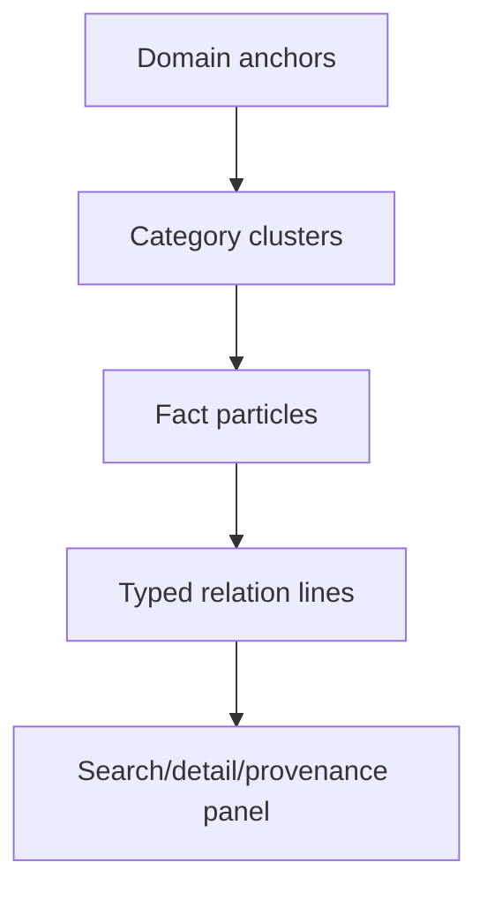

# Web UI와 3D Knowledge Galaxy

## 1. 실행 경계

`ui/server.cjs`는 기본 `127.0.0.1:3847`에 bind합니다. 외부 interface에 공개하지
않습니다. 모든 화면은 같은 local SQLite를 읽고, Facts mutation만 guarded HTTP POST를
통해 `fact-management` service에 전달합니다.

## 2. 화면 구조

```mermaid
flowchart LR
    Nav[Memex navigation] --> Conversations[/ Conversations]
    Nav --> Facts[/facts Facts]
    Nav --> Graph[/graph Galaxy]
    Nav --> Pipeline[/pipeline Health]
    Conversations --> CA[/api/projects, search, exchange]
    Facts --> FA[/api/facts, detail, provenance, mutate]
    Graph --> GA[/api/graph-data]
    Pipeline --> PA[/api/pipeline-status]
```

## 3. Knowledge Galaxy 데이터

Galaxy는 live `/api/graph-data`를 사용합니다. 기본은 `scope=global`이며 project/all은
명시합니다. `domains`, `cats`, `facts`, `rel` 배열을 client entry에서 검증합니다.



layout은 domain별 구형 cluster와 category/fact 분포를 만들고 relation type별 edge를
toggle합니다. node selection은 detail panel과 연결되고 relation을 따라 source/target으로
이동할 수 있습니다.

## 4. Empty와 오류 상태

신규 설치의 `{domains:[], cats:[], facts:[], rel:[]}`은 오류가 아닙니다. 이 경우
Three.js scene/layout/label 계산을 시작하지 않고 다음 행동이 있는 empty state를
표시합니다.

```text
아직 표시할 active fact가 없습니다.
memex sync/backfill 상태를 Pipeline에서 확인하세요.
```

반대로 필수 배열 누락, 잘못된 타입, dangling relation은 error state입니다. empty와
malformed를 같은 빈 화면으로 처리하지 않습니다.

## 5. 성능 메커니즘

- compositor-friendly labels
- node point-size cap
- device-pixel-ratio/eco mode
- bounded relation animation
- API payload/parse와 browser first-interactive를 분리 측정

현재 benchmark fixture는 50 facts/49 relations의 populated graph를 실제 Chrome CDP로
관측합니다. 더 큰 실제 corpus의 UX는 fixture 규모와 구분해 보고해야 합니다.

## 6. Facts mutation 보안

`/api/facts-mutate`는 POST-only, JSON content type, same-origin, body size limit,
action schema, UUID/confirmation gate를 검사합니다. HTML은 사용자 text를 escape하며
CLI와 동일한 transaction service를 사용합니다.

## 7. 수동 QA 체크리스트

1. empty DB에서 네 route가 crash 없이 열린다.
2. populated DB에서 project/search/exchange/fact/provenance가 연결된다.
3. graph scope global/project/all이 서로 다른 결과를 보인다.
4. relation type toggle과 node/detail 이동이 동작한다.
5. keyboard로 nav/search/fact action에 접근할 수 있다.
6. malicious fact text가 HTML/JS로 실행되지 않는다.
7. non-POST, wrong origin/content type, oversized mutation이 거부된다.
8. 종료 후 browser/server/listener/temp profile이 남지 않는다.
